<link rel="stylesheet" href="imagens/style.css">

<h2 id="inicio">Construções Geométricas</h2>

Este site contém os procedimentos para construções geométricas usadas na disciplina de Desenho Geométrico

A apostila está disponível no link: <a href="http://www.exatas.ufpr.br/portal/degraf_paulo/wp-content/uploads/sites/4/2014/09/apos_dg.pdf" target="_blank">apostila de Desenho Geométrico</a>

  
1.1. Circunferência e Mediatriz

  
Material da página 1 até a página 11.

	

		<iframe width="95%" src="https://www.youtube.com/embed/1_cC5J2Xwcw" frameborder="0" allow="accelerometer; clipboard-write; encrypted-media; gyroscope; picture-in-picture" allowfullscreen></iframe>
	

   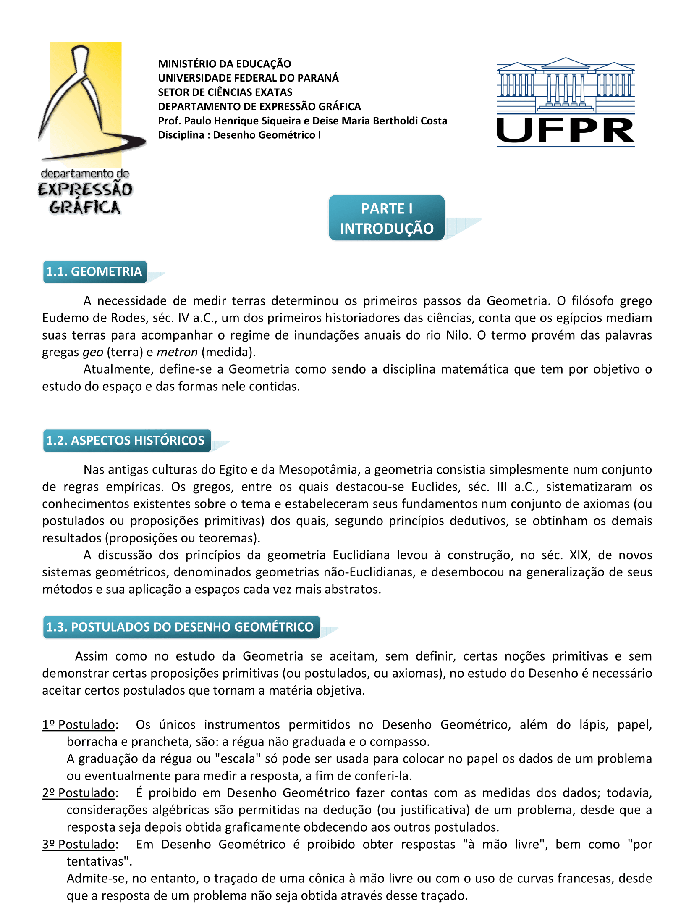
   
<a href="#parte1" class="topo">voltar ao topo</a>

   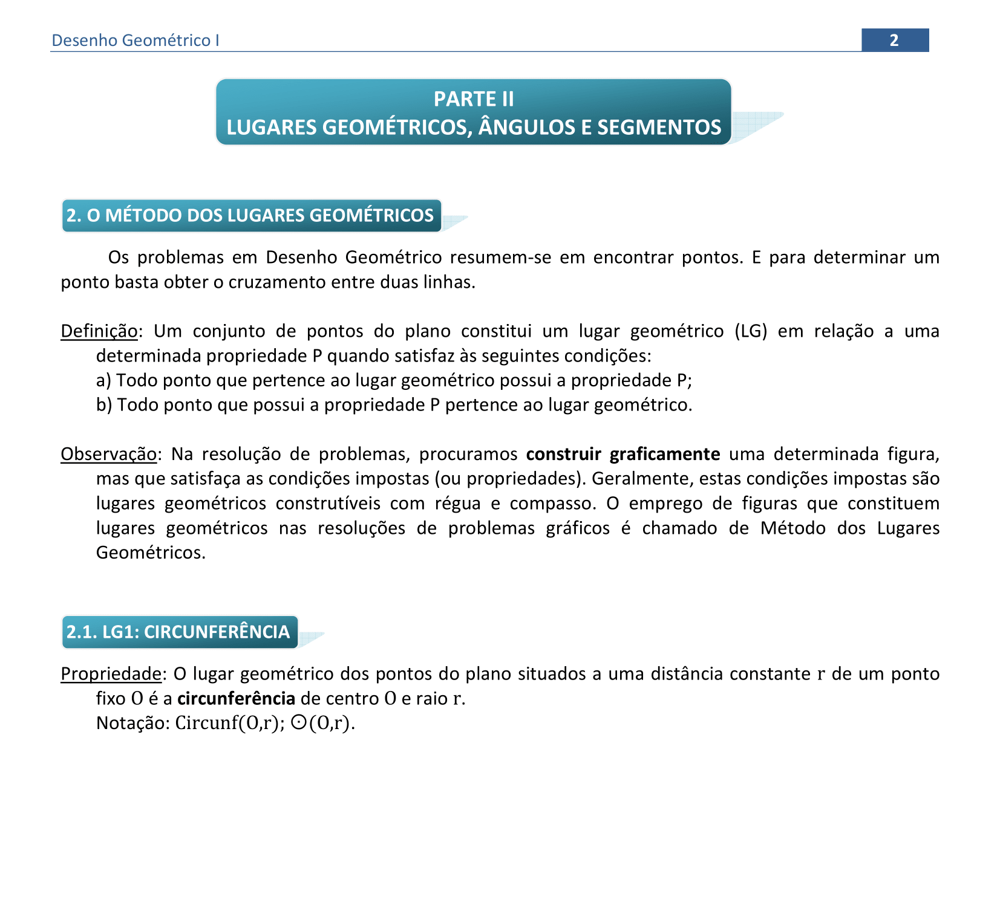
   

&#x1f4cf; &#x1f4d0; Construção

	
Utilizaremos o compasso para construir a primeira circunferência. Lembre-se sempre de deixá-lo com o grafite apontado para desenhar com maior precisão.

	  <ul class="slider">
		  <li>
			   <input type="radio" id="001" name="sl" checked>
			   <label for="001"></label>
			   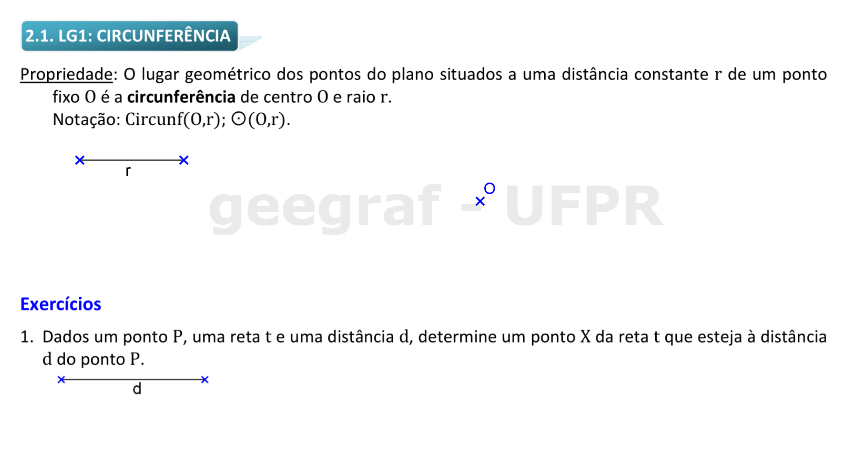
			   <figcaption>Considerado um ponto <b>O</b> e a medida <b>r</b>, vamos construir a circunferência de centro em <b>O</b> e raio <b>r</b>.</figcaption>
		   </li>
		   <li>
			   <input type="radio" id="002" name="sl">
			   <label for="002"></label>
			   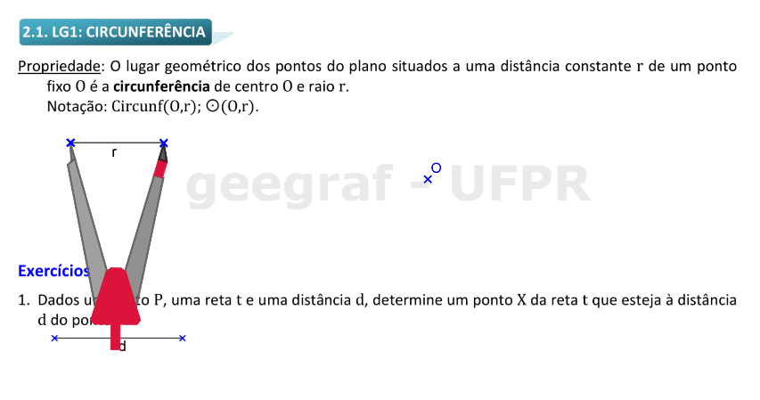
			   <figcaption>Usando o compasso, colocamos a ponta seca em uma extremidade e o grafite na outra extremidade de <b>r</b>. Desta forma, "pegamos" a medida <b>r</b> e...</figcaption>
		   </li>
		   <li>
			   <input type="radio" id="003" name="sl">
			   <label for="003"></label>
			   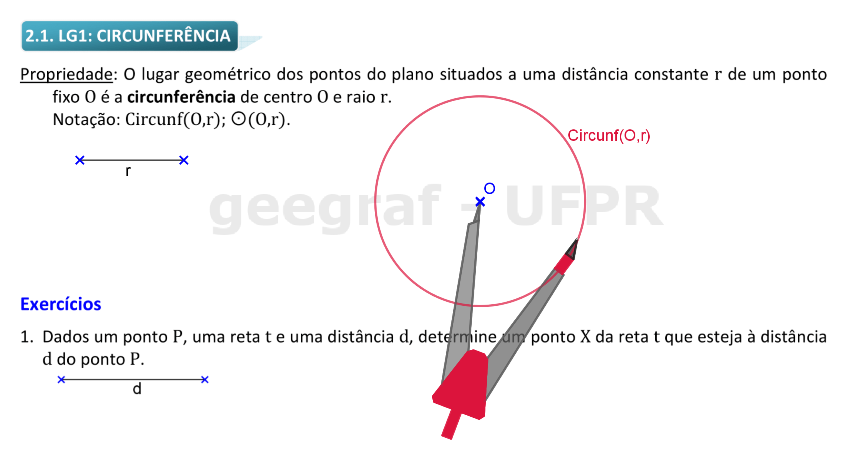
			   <figcaption>... com a ponta seca em <b>O</b>, construímos a circunferência com raio <b>r</b>.</figcaption>
		   </li>
		   <li>
			   <input type="radio" id="004" name="sl">
			   <label for="004"></label>
			   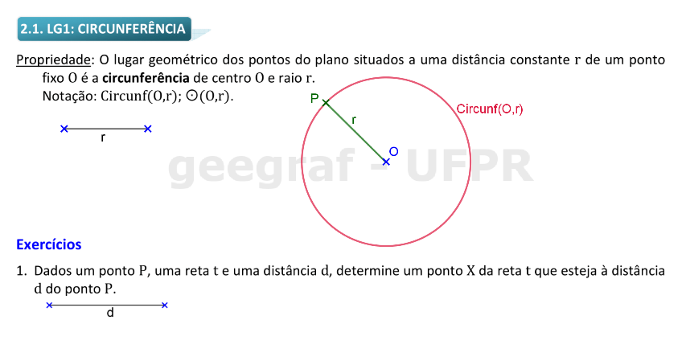
			   <figcaption>Qualquer ponto <b>P</b> pertencente à <b>Circunf(O,r)</b> tem a distância fixa <b>r</b> até o ponto fixo <b>O</b>.</figcaption>
		   </li>
		</ul>
		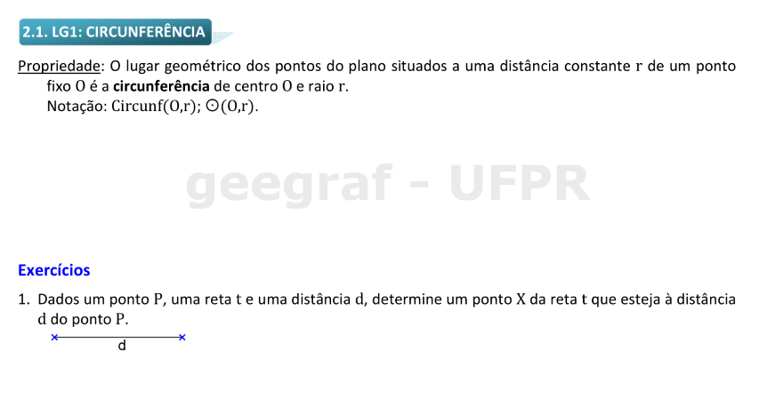
  

  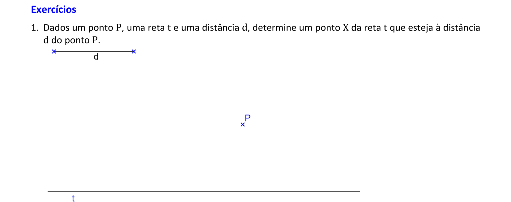
  

&#x1f4cf; &#x1f4d0; Resolução

	
Utilizaremos o conceito de lugar geométrico para fazer esta construção. Usaremos o compasso como instrumento auxiliar.

	  <ul class="slider">
		  <li>
			   <input type="radio" id="005" name="sl" checked>
			   <label for="005"></label>
			   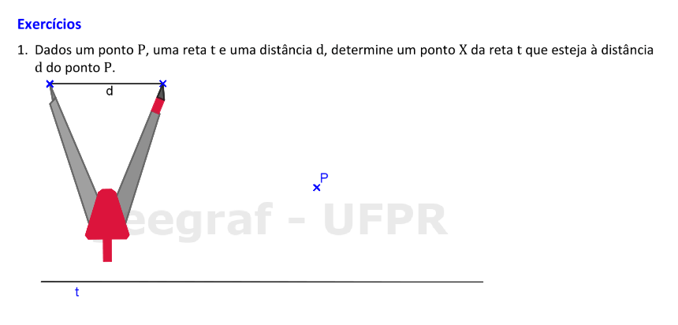
			   <figcaption>Como a distância de <b>P</b> até <b>X</b> é igual a <b>d</b>, vamos construir a circunferência de centro em <b>P</b> e raio <b>d</b>. Logo, podemos usar o compasso com a ponta seca em uma extremidade de <b>d</b> e o grafite na outra extremidade para "pegarmos" a medida <b>d</b>.</figcaption>
		   </li>
		   <li>
			   <input type="radio" id="006" name="sl">
			   <label for="006"></label>
			   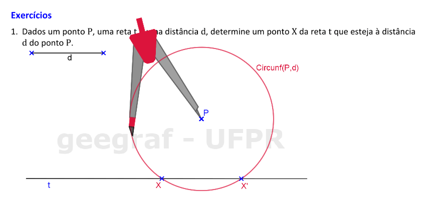
			   <figcaption>Com a ponta seca em <b>P</b>, construímos a <b>Circunf(P,d)</b>, que é o lugar geométrico de todos os pontos com distância <b>d</b> até o ponto <b>P</b>.</figcaption>
		   </li>
		   <li>
			   <input type="radio" id="007" name="sl">
			   <label for="007"></label>
			   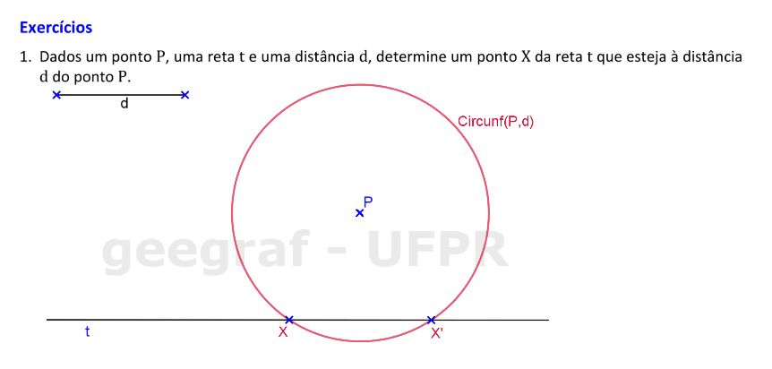
			   <figcaption>Como o ponto <b>X</b> está na reta <b>t</b>, teremos duas soluções para este problema, encontradas na interseção da <b>Circunf(P,d)</b> com a reta <b>t</b>. Se a <b>Circunf(P,d)</b> não intercectar a reta <b>t</b>, não temos solução. No caso em que a <b>Circunf(P,d)</b> for tangente à reta <b>t</b>, teremos apenas 1 solução.</figcaption>
		   </li>
		</ul>
		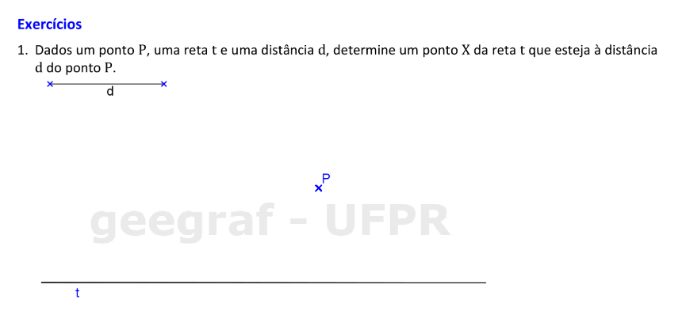
  

  
<a href="#parte1" class="topo">voltar ao topo</a>

  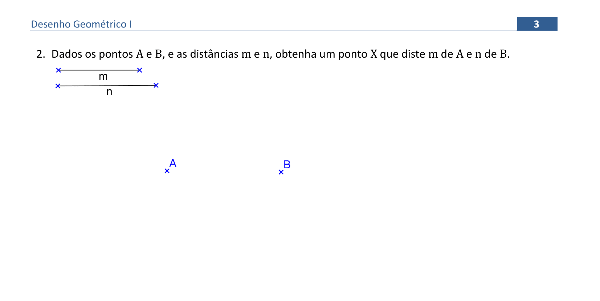
  

&#x1f4cf; &#x1f4d0; Resolução

	
Utilizaremos o conceito de lugar geométrico para resolver este problema. Usaremos o compasso como instrumento auxiliar.

	  <ul class="slider">
		  <li>
			   <input type="radio" id="008" name="sl" checked>
			   <label for="008"></label>
			   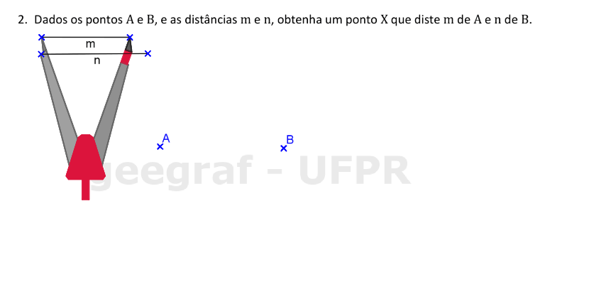
			   <figcaption>Como a distância de <b>X</b> até <b>A</b> é igual a <b>m</b>, vamos construir a circunferência de centro em <b>A</b> e raio <b>m</b>. Logo, podemos usar o compasso com a ponta seca em uma extremidade de <b>m</b> e o grafite na outra extremidade para "pegarmos" a medida <b>m</b>.</figcaption>
		   </li>
		   <li>
			   <input type="radio" id="009" name="sl">
			   <label for="009"></label>
			   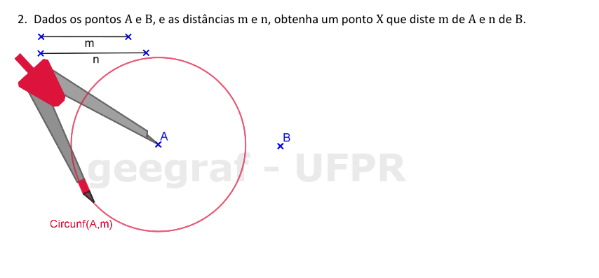
			   <figcaption>Com a ponta seca em <b>A</b>, construímos a <b>Circunf(A,m)</b>, que é o lugar geométrico de todos os pontos com distância <b>m</b> até o ponto <b>A</b>.</figcaption>
		   </li>
		   <li>
			   <input type="radio" id="010" name="sl">
			   <label for="010"></label>
			   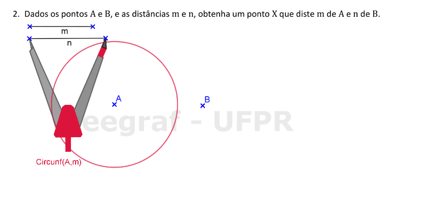
			   <figcaption>Usando o mesmo raciocínio, "pegamos" a distância <b>n</b> com o compasso...</figcaption>
		   </li>
		   <li>
			   <input type="radio" id="011" name="sl">
			   <label for="011"></label>
			   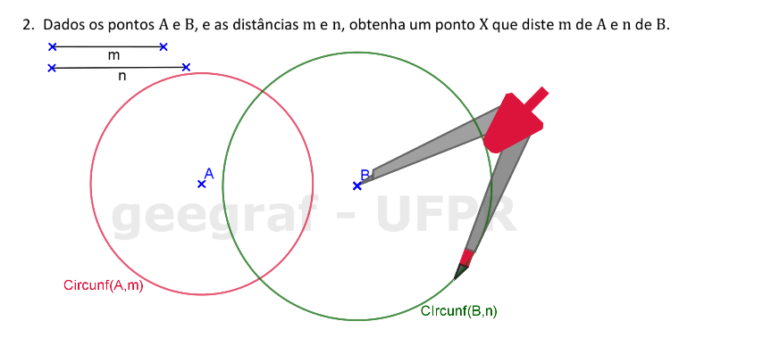
			   <figcaption>... e construímos a <b>Circunf(B,n)</b>, que é o lugar geométrico dos pontos com distância <b>n</b> até o ponto <b>B</b>.</figcaption>
		   </li>
		   <li>
			   <input type="radio" id="012" name="sl">
			   <label for="012"></label>
			   
			   <figcaption>Temos duas soluções, encontradas nas interseções das circunferências construídas. Se as circunferências ficarem tangentes, teremos apenas 1 solução. E no caso em que as circunferências não se cortam, não teremos solução neste problema.</figcaption>
		   </li>
		</ul>
		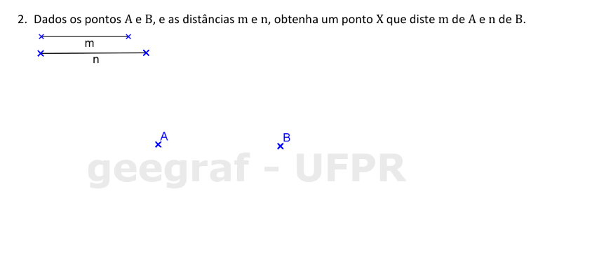
  

  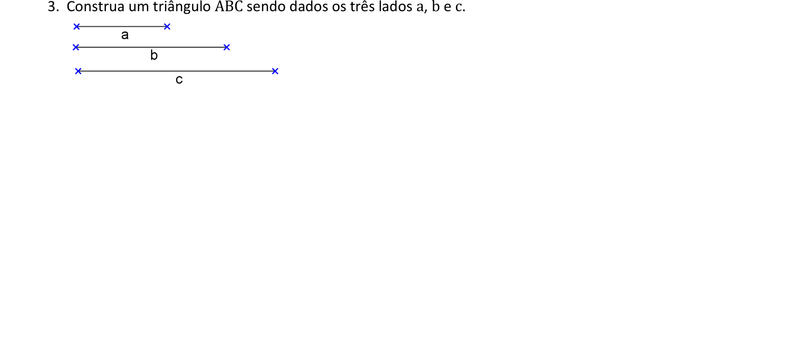
  

&#x1f4cf; &#x1f4d0; Resolução

	
Utilizaremos o conceito de lugar geométrico para fazer a construção deste triângulo. Usaremos a régua e o compasso como instrumentos auxiliares.

	  <ul class="slider">
		  <li>
			   <input type="radio" id="013" name="sl" checked>
			   <label for="013"></label>
			   
			   <figcaption>Vamos imaginar o triângulo <b>ABC</b> construído.</figcaption>
		   </li>
		   <li>
			   <input type="radio" id="014" name="sl">
			   <label for="014"></label>
			   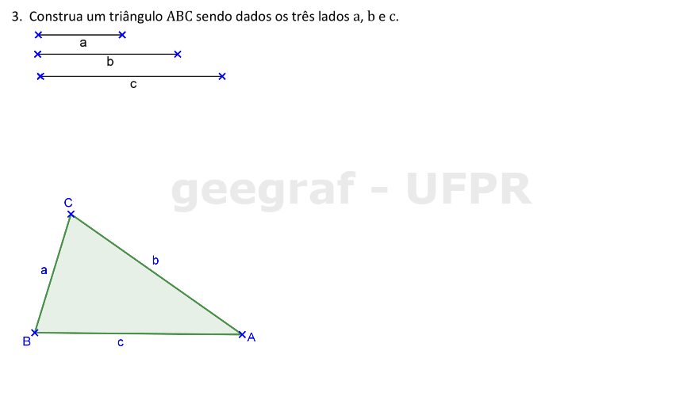
			   <figcaption>Por convenção, vamos nomear os lados opostos aos vértices com as mesmas letras, porém, minúsculas. Por exemplo, o lado <b>BC</b>, oposto ao vértice <b>A</b>, terá o nome <b>a</b>.</figcaption>
		   </li>
		   <li>
			   <input type="radio" id="015" name="sl">
			   <label for="015"></label>
			   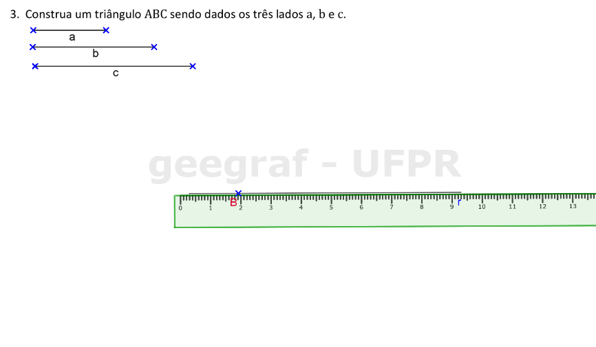
			   <figcaption>Vamos começar construindo uma reta qualquer <b>r</b>, e escolhendo um ponto <b>B</b> sobre esta reta.</figcaption>
		   </li>
		   <li>
			   <input type="radio" id="016" name="sl">
			   <label for="016"></label>
			   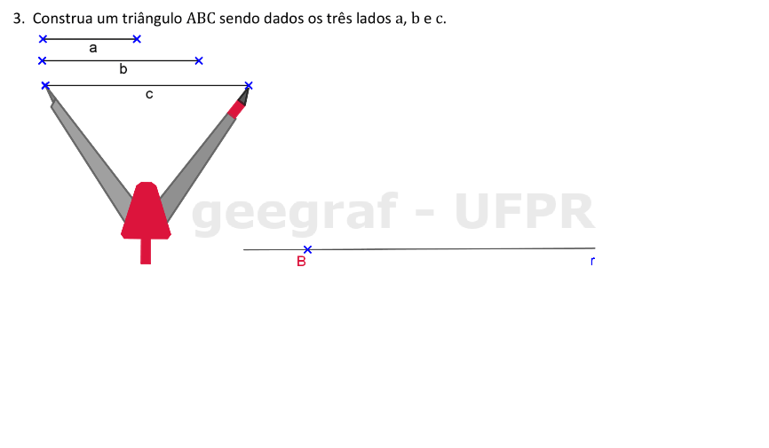
			   <figcaption>Usando o compasso, vamos "pegar" a medida de um dos lados com extreminade <b>B</b>: neste caso, o lado <b>c</b>.</figcaption>
		   </li>
		   <li>
			   <input type="radio" id="017" name="sl">
			   <label for="017"></label>
			   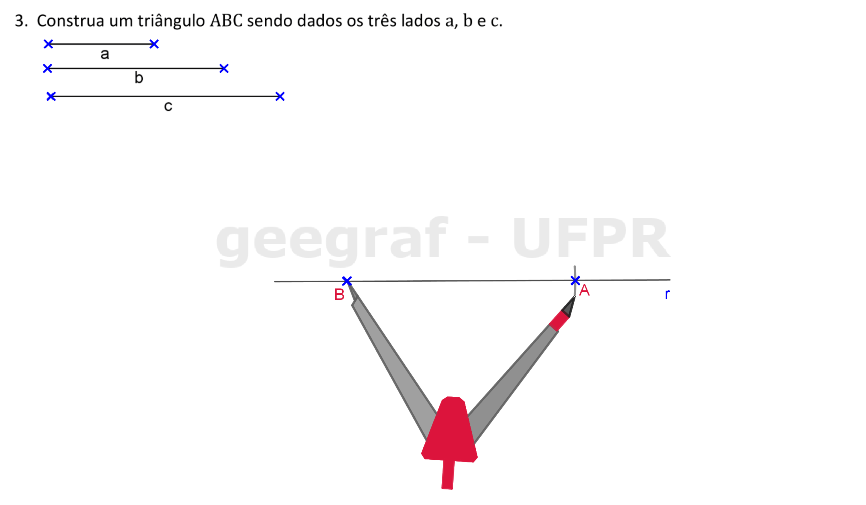
			   <figcaption>Com centro em <b>B</b>, desenhamos um pequeno arco que serve apenas para transferir a medida <b>c</b> para a reta <b>r</b>. Logo, encontramos o vértice <b>A</b> do triângulo.</figcaption>
		   </li>
		   <li>
			   <input type="radio" id="018" name="sl">
			   <label for="018"></label>
			   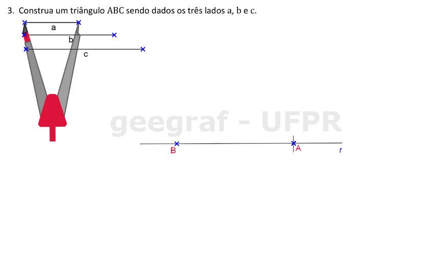
			   <figcaption>Agora podemos "pegar" as outra medidas dos lados com o compasso. Primeiro, vamos "pegar" o lado <b>a</b>...</figcaption>
		   </li>
		   <li>
			   <input type="radio" id="019" name="sl">
			   <label for="019"></label>
			   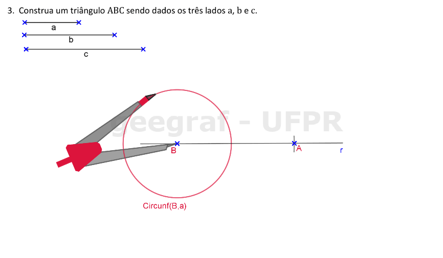
			   <figcaption>... e construir a <b>Circunf(B,a)</b>, pois a medida <b>a</b> está no lado oposto do vértice <b>A</b>.</figcaption>
		   </li>
		   <li>
			   <input type="radio" id="020" name="sl">
			   <label for="020"></label>
			   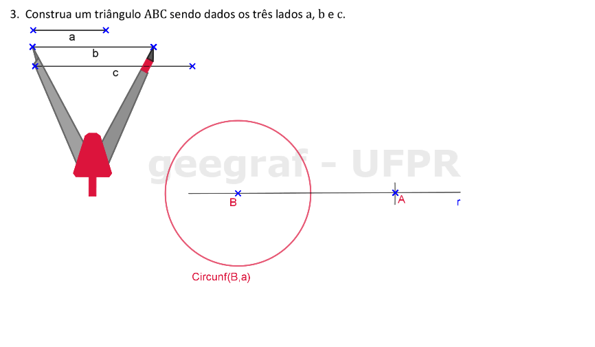
			   <figcaption>Por último, "pegamos" com o compasso a medida do lado que falta: <b>b</b>.</figcaption>
		   </li>
		   <li>
			   <input type="radio" id="021" name="sl">
			   <label for="021"></label>
			   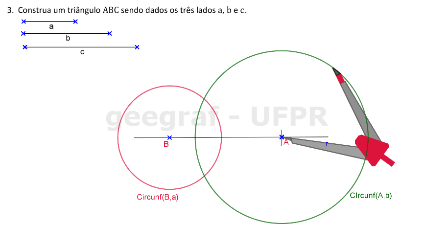
			   <figcaption>Assim, podemos construir a <b>Circunf(A,b)</b>.</figcaption>
		   </li>
		   <li>
			   <input type="radio" id="022" name="sl">
			   <label for="022"></label>
			   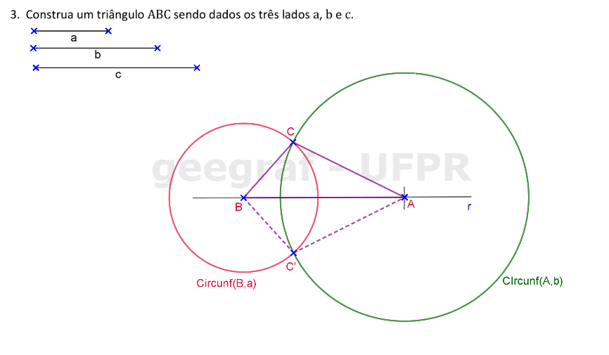
			   <figcaption>Nas interseções das circunferências construídas, podemos escolher o vértice <b>C</b> e "passar a limpo" o triângulo <b>ABC</b> unindo as extremidades <b>A</b> com <b>C</b> e <b>B</b> com <b>C</b>. O triângulo <b>ABC'</b> pode ser desenhado com linha tracejada.</figcaption>
		   </li>
		</ul>
		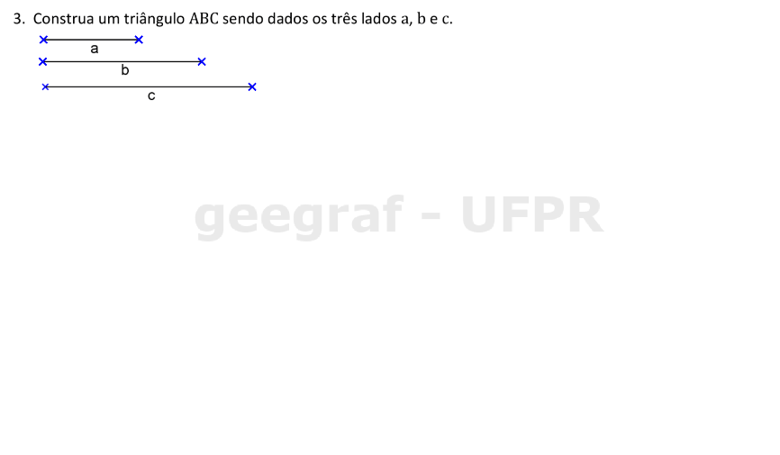
  

  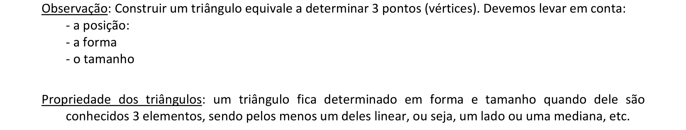
  
<a href="#parte1" class="topo">voltar ao topo</a>

  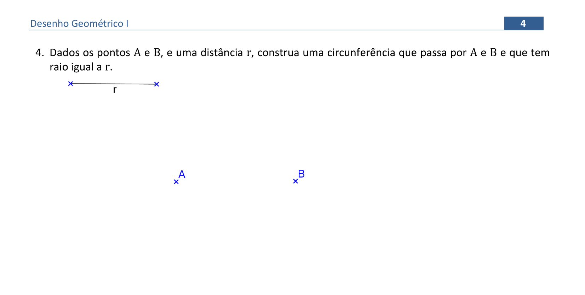
  

&#x1f4cf; &#x1f4d0; Resolução

	
Utilizaremos o conceito de lugar geométrico para fazer esta construção. O compasso será usado como instrumento auxiliar.

	  <ul class="slider">
		  <li>
			   <input type="radio" id="023" name="sl" checked>
			   <label for="023"></label>
			   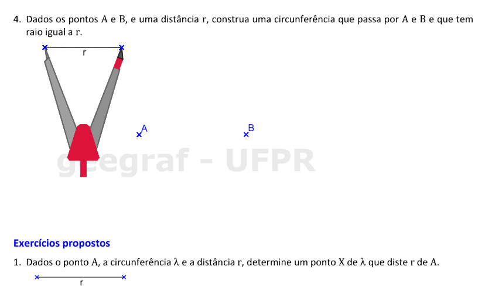
			   <figcaption>Como a circunferência procurada passar pelos pontos <b>A</b> e <b>B</b>, as distâncias entre o centro <b>O</b> e os pontos <b>A</b> e <b>B</b> medem o raio <b>r</b>. Logo, podemos "pegar" a medida <b>r</b> com o compasso...</figcaption>
		   </li>
		   <li>
			   <input type="radio" id="024" name="sl">
			   <label for="024"></label>
			   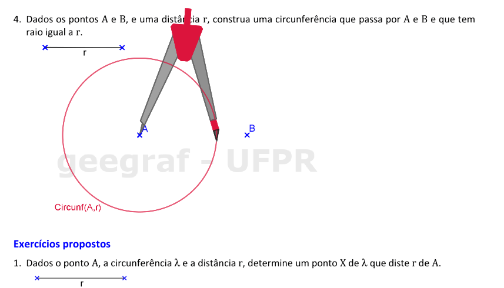
			   <figcaption>... e construir a <b>Circunf(A,r)</b>, que é o primeiro lugar geométrico do centro <b>O</b>.</figcaption>
		   </li>
		   <li>
			   <input type="radio" id="026" name="sl">
			   <label for="026"></label>
			   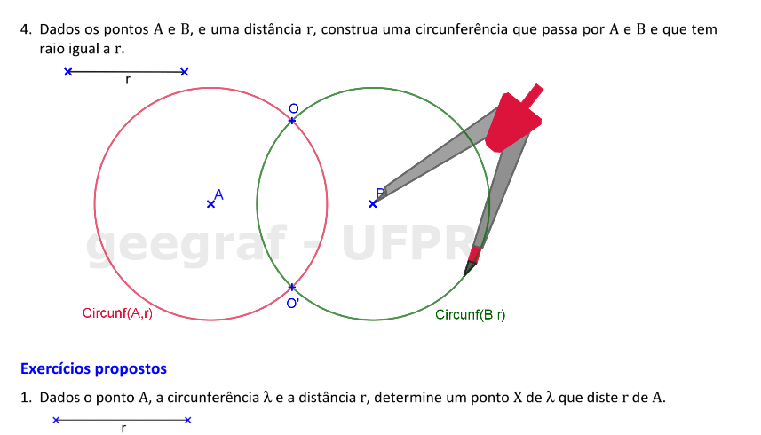
			   <figcaption>Com o mesmo raio, construímos a <b>Circunf(B,r)</b>, que é o segundo lugar geométrico de <b>O</b>. Teremos duas soluções: <b>O</b> e <b>O'</b>. Se as circunferências ficarem tangentes, temos apenas 1 solução; e no caso em que as circunferências não se intercectam, não temos solução.</figcaption>
		   </li>
		   <li>
			   <input type="radio" id="027" name="sl">
			   <label for="027"></label>
			   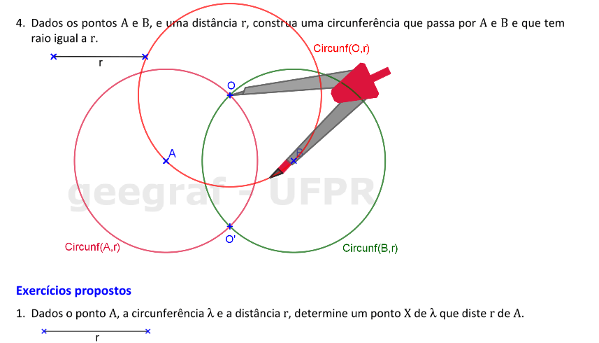
			   <figcaption>Com a ponta seca em <b>O</b>, construímos a <b>Circunf(O,r)</b>, que passa por <b>A</b> e <b>B</b>.</figcaption>
		   </li>
		   <li>
			   <input type="radio" id="028" name="sl">
			   <label for="028"></label>
			   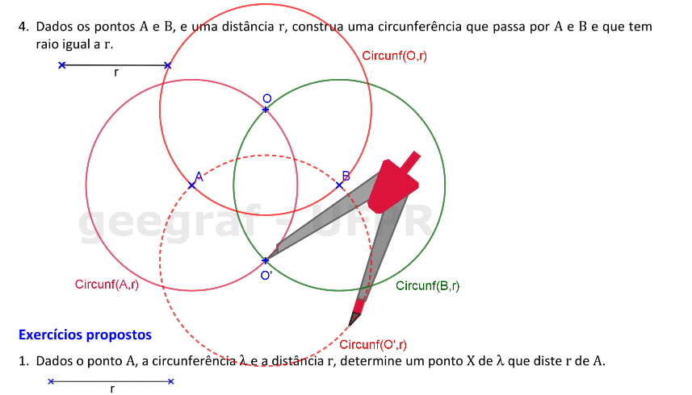
			   <figcaption>E com a ponta seca em <b>O'</b>, desenhamos a <b>Circunf(O',r)</b>, que passa por <b>A</b> e <b>B</b>.</figcaption>
		   </li>
		   <li>
			   <input type="radio" id="029" name="sl">
			   <label for="029"></label>
			   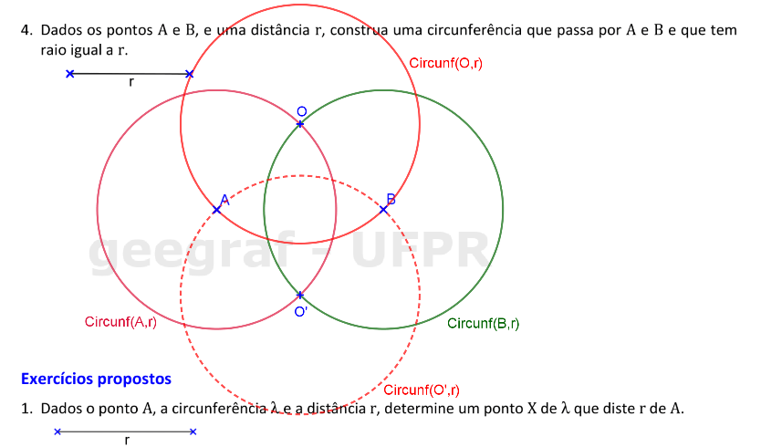
			   <figcaption>Escolhemos uma solução para ficar com linha contínua e a outra com linha tracejada.</figcaption>
		   </li>
		</ul>
		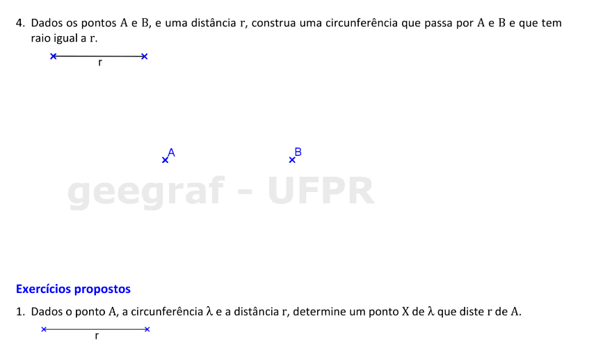
  

  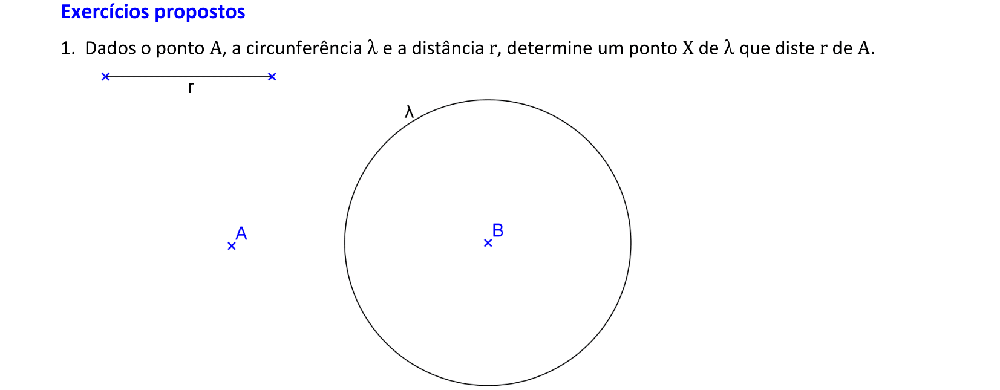
  

&#x1f4cf; &#x1f4d0; Solução

	
Usando o conceito do lugar geométrico circunferência, você consegue resolver este exercício proposto.

	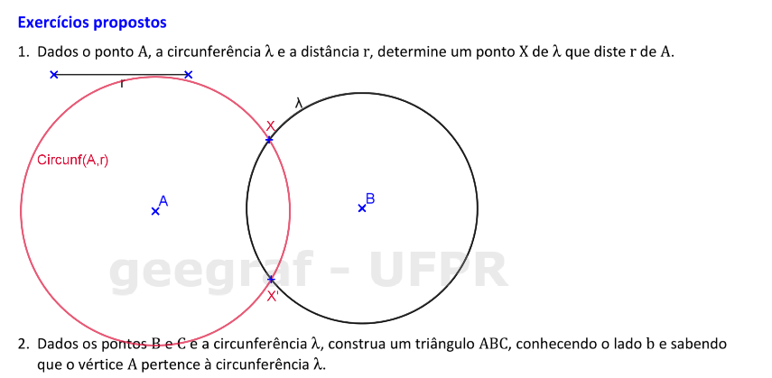
	<figcaption>Encontramos duas soluções na resolução deste problema.</figcaption>
  

  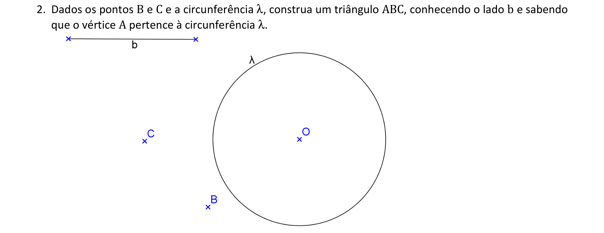
  

&#x1f4cf; &#x1f4d0; Solução

	
Use o conceito do lugar geométrico circunferência para resolver este exercício.

	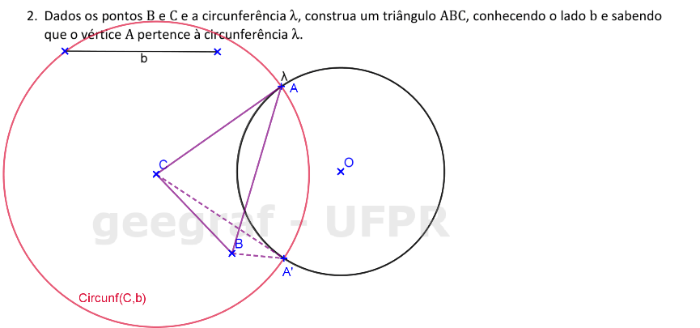
	<figcaption>Encontramos duas soluções na resolução deste problema: os triângulos <b>ABC</b> e <b>A'BC</b>.</figcaption>
  

  
<a href="#parte1" class="topo">voltar ao topo</a>

  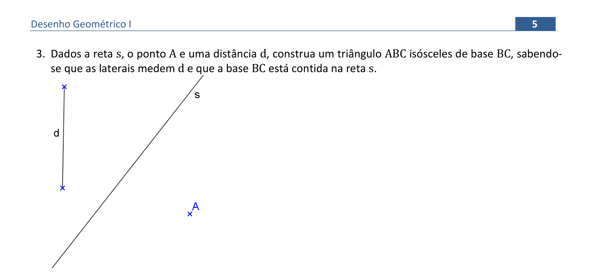
  

&#x1f4cf; &#x1f4d0; Solução

	
Usando o conceito do lugar geométrico circunferência, você consegue resolver este exercício.

	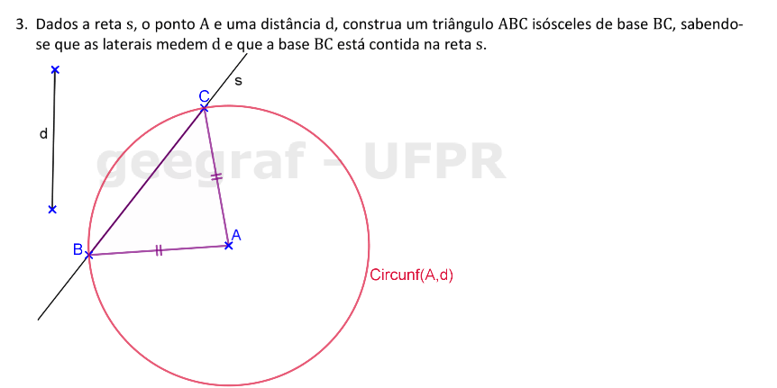
	<figcaption>Como as laterais do triângulo isósceles medem <b>d</b>, usamos uma circunferência para encontrar os vértices <b>B</b> e <b>C</b>.</figcaption>
  

  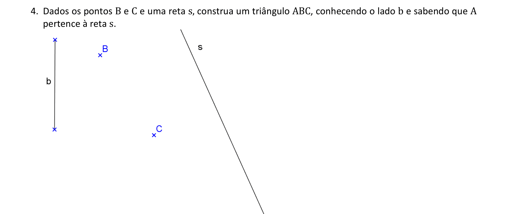
  

&#x1f4cf; &#x1f4d0; Solução

	
Use o conceito do lugar geométrico circunferência para resolver este exercício.

	
	<figcaption>Lembrando que o lado <b>b</b> é o lado <b>AC</b> do triângulo, usamos a circunferência com centro em <b>C</b> e raio <b>b</b>.</figcaption>
  

  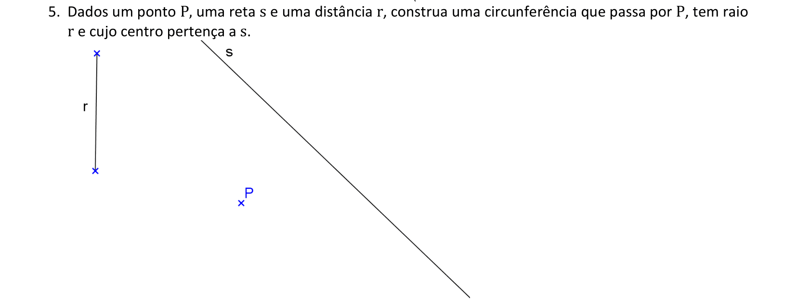
  
&#x1f4cf; &#x1f4d0; Atividade 1.1

  
<a href="#parte1" class="topo">voltar ao topo</a>

  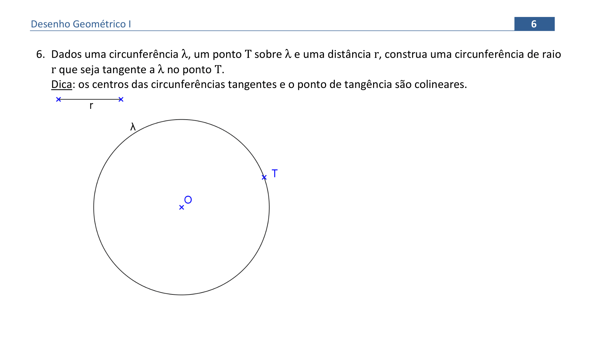
  

&#x1f4cf; &#x1f4d0; Resolução

	
Utilizaremos o conceito de lugar geométrico para fazer esta construção. Usaremos a régua e o compasso como instrumentos auxiliares.

	  <ul class="slider">
		  <li>
			   <input type="radio" id="030" name="sl" checked>
			   <label for="030"></label>
			   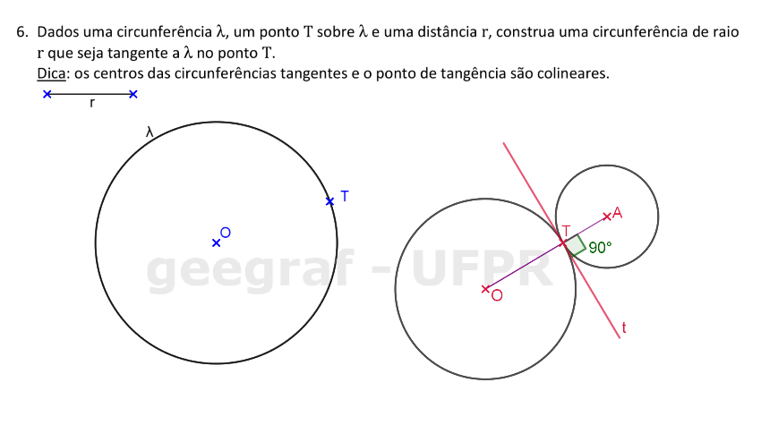
			   <figcaption>Lembrando da propriedade: se duas circunferências são tangentes em um ponto <b>T</b>, elas admitem a reta tangente <b>t</b> comum; como a reta tangente forma <b>90&deg;</b> com o raio em <b>T</b>, os raios <b>OT</b> e <b>AT</b> formam <b>180&deg;</b>, ou seja, <b>O</b>, <b>T</b> e <b>A</b> serão colineares.</figcaption>
		   </li>
		   <li>
			   <input type="radio" id="031" name="sl">
			   <label for="031"></label>
			   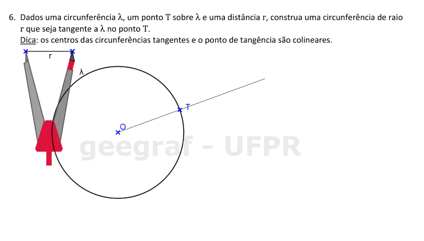
			   <figcaption>Usando a régua ou um dos esquadros, podemos prolongar o segmento <b>OT</b> e usar o compasso para "pegar" a medida <b>r</b>.</figcaption>
		   </li>
		   <li>
			   <input type="radio" id="032" name="sl">
			   <label for="032"></label>
			   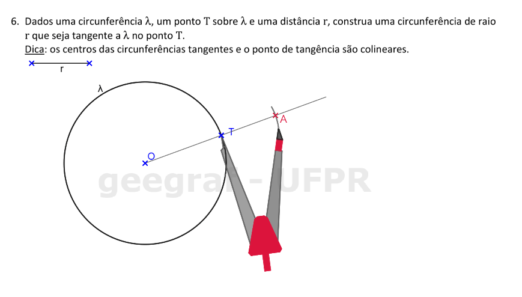
			   <figcaption>Com o centro em <b>T</b>, construímos um arco para marcar o centro <b>A</b> na reta <b>OT</b>.</figcaption>
		   </li>
		   <li>
			   <input type="radio" id="033" name="sl">
			   <label for="033"></label>
			   
			   <figcaption>Teremos uma solução interna à circunferência <b>&lambda;</b>; logo, podemos marcar também o ponto <b>A'</b> sobre o raio <b>OT</b>.</figcaption>
		   </li>
		   <li>
			   <input type="radio" id="034" name="sl">
			   <label for="034"></label>
			   
			   <figcaption>Com centro em <b>A</b>, construímos a <b>Circunf(A,r)</b>, que é a primeira solução.</figcaption>
		   </li>
		   <li>
			   <input type="radio" id="035" name="sl">
			   <label for="035"></label>
			   
			   <figcaption>E com centro em <b>A'</b>, construímos a <b>Circunf(A',r)</b>, que é a segunda solução.</figcaption>
		   </li>
		   <li>
			   <input type="radio" id="036" name="sl">
			   <label for="036"></label>
			   
			   <figcaption>Estas são as duas soluções do problema proposto.</figcaption>
		   </li>
		</ul>
		
  

  
  

&#x1f4dd; Propriedades

	
Neste segundo lugar geométrico, usamos a régua e o compasso como instrumentos auxiliares para sua construção.

	  <ul class="slider">
		  <li>
			   <input type="radio" id="037" name="sl" checked>
			   <label for="037"></label>
			   
			   <figcaption>Para encontrar a mediatriz de <b>AB</b>, construímos os arcos de circunferências de centros <b>A</b> e <b>B</b>, com a mesma medida dos raios. Esta medida precisa ser maior do que a metade de <b>AB</b>. As interseções destes arcos definem a reta <b>XX'</b> que é a mediatriz de <b>AB</b>. Usamos a notação <b>medAB</b>.</figcaption>
		   </li>
		   <li>
			   <input type="radio" id="038" name="sl">
			   <label for="038"></label>
			   
			   <figcaption>Como os raios são iguais à uma medida <b>d</b>, temos a formação do <b>&#9651;AXB</b> isósceles de base <b>d</b>.</figcaption>
		   </li>
		   <li>
			   <input type="radio" id="039" name="sl">
			   <label for="039"></label>
			   
			   <figcaption>Obtemos assim o ponto médio <b>M</b> de <b>AB</b>, e os <b>&#9651;AMX</b> e <b>&#9651;BMX</b> congruentes.</figcaption>
		   </li>
		   <li>
			   <input type="radio" id="040" name="sl">
			   <label for="040"></label>
			   
			   <figcaption>Logo, temos que <b>&angsph;AMX = 90&deg;</b>. Portanto, a mediatriz passa pelo ponto médio e forma <b>90&deg;</b> com este segmento.</figcaption>
		   </li>
		</ul>
		
  

  
<a href="#parte1" class="topo">voltar ao topo</a>

  
  

&#x1f4cf; &#x1f4d0; Resolução

	
Utilizaremos a régua e o compasso como instrumentos auxiliares para sua construção da mediatriz.

	  <ul class="slider">
		  <li>
			   <input type="radio" id="041" name="sl" checked>
			   <label for="041"></label>
			   
			   <figcaption>Vamos construir um arco de circunferência com centro em <b>A</b> e a medida do raio maior do que a metade de <b>AB</b>.</figcaption>
		   </li>
		   <li>
			   <input type="radio" id="042" name="sl">
			   <label for="042"></label>
			   
			   <figcaption>Com a mesma medida do raio do arco anterior, construímos o arco com centro em <b>B</b>.</figcaption>
		   </li>
		   <li>
			   <input type="radio" id="043" name="sl">
			   <label for="043"></label>
			   
			   <figcaption>Usando a régua ou um dos esquadros, construímos a reta que passa pelos pontos de interseção dos arcos construídos <b>P</b> e <b>P'</b>. Esta é a mediatriz de AB, denotada por <b>medAB</b></figcaption>
		   </li>
		   <li>
			   <input type="radio" id="044" name="sl">
			   <label for="044"></label>
			   
			   <figcaption>Quando o segmento <b>AB</b> estiver próximo da margem da folha, podemos construir um dos arcos, com centro em <b>A</b> e raio maior do que a metade de <b>AB</b>.</figcaption>
		   </li>
		   <li>
			   <input type="radio" id="045" name="sl">
			   <label for="045"></label>
			   
			   <figcaption>Com a mesma medida do raio usado em <b>A</b>, construímos o arco com centro em <b>B</b>. O ponto de interseção <b>Q</b> pertence à mediatriz procurada. Porém, precisamos de mais um ponto para determinar a mediatriz.</figcaption>
		   </li>
		   <li>
			   <input type="radio" id="046" name="sl">
			   <label for="046"></label>
			   
			   <figcaption>Logo, podemos construir dois outros arcos, usando uma outra medida.</figcaption>
		   </li>
		   <li>
			   <input type="radio" id="047" name="sl">
			   <label for="047"></label>
			   
			   <figcaption>Usando a mesma medida, construímos o arco com centro em <b>B</b>.</figcaption>
		   </li>
		   <li>
			   <input type="radio" id="048" name="sl">
			   <label for="048"></label>
			   
			   <figcaption>A mediatriz pode ser construída com a régua ou um esquadro, unindo os pontos de interseção do arcos <b>Q</b> e <b>Q'</b>.</figcaption>
		   </li>
		   <li>
			   <input type="radio" id="049" name="sl">
			   <label for="049"></label>
			   
			   <figcaption>A mediatriz de <b>AB</b> está construída com o segmento próximo da margem da folha.</figcaption>
		   </li>
		</ul>
		
  

  
  

&#x1f4cf; &#x1f4d0; Solução

	
Constuindo a mediatriz de <b>AB</b>, determinamos o ponto médio deste segmento.

	
	<figcaption>Utilize os mesmos passos usados na construção anterior.</figcaption>
  

  
  

&#x1f4cf; &#x1f4d0; Resolução

	
Usaremos a régua e o compasso como instrumentos auxiliares nesta construção.

	  <ul class="slider">
		  <li>
			   <input type="radio" id="051" name="sl" checked>
			   <label for="051"></label>
			   
			   <figcaption>Como o triângulo é isósceles de base <b>BC</b>, o vértice <b>A</b> é equidistante dos vértices <b>B</b> e <b>C</b>: logo, <b>A</b> pertence à mediatriz de <b>BC</b>. Com uma medida maior do que a metade de <b>BC</b>, construímos um arco com centro em <b>C</b>...</figcaption>
		   </li>
		   <li>
			   <input type="radio" id="052" name="sl">
			   <label for="052"></label>
			   
			   <figcaption>... e outro com mesmo raio e centro em <b>B</b>. As interseções definem os pontos <b>P</b> e <b>P'</b>.</figcaption>
		   </li>
		   <li>
			   <input type="radio" id="053" name="sl">
			   <label for="053"></label>
			   
			   <figcaption>Usando a régua ou um dos esquadros, construa a mediatriz de <b>BC</b> unindo os pontos <b>P</b> e <b>P'</b>.</figcaption>
		   </li>
		   <li>
			   <input type="radio" id="054" name="sl">
			   <label for="054"></label>
			   
			   <figcaption>Como o vértice <b>A</b> pertence à circunferência <b>&lambda;</b>, as interseções de <b>&lambda;</b> com a <b>medBC</b> definem os vértices do triângulo isósceles. Teremos 2 soluções para este problema, pois a mediatriz intercecta a circunferência em 2 pontos.</figcaption>
		   </li>
		   <li>
			   <input type="radio" id="055" name="sl">
			   <label for="055"></label>
			   
			   <figcaption>Escolha uma solução para construir o triângulo com linha contínua e o outro com linha tracejada.</figcaption>
		   </li>
		</ul>
		
  

  
<a href="#parte1" class="topo">voltar ao topo</a>

  
  

&#x1f4cf; &#x1f4d0; Resolução

	
Vamos usar a régua e o compasso como instrumentos auxiliares para resolver este problema.

	  <ul class="slider">
		  <li>
			   <input type="radio" id="056" name="sl" checked>
			   <label for="056"></label>
			   
			   <figcaption>Temos os três pontos pertencentes à circunferência de centro <b>O</b>.</figcaption>
		   </li>
		   <li>
			   <input type="radio" id="057" name="sl">
			   <label for="057"></label>
			   
			   <figcaption>As distâncias entre os pontos dados e o centro é a mesma: o raio <b>r</b> da circunferência. Logo, podemos construir duas mediatrizes para encontrar o centro.</figcaption>
		   </li>
		   <li>
			   <input type="radio" id="058" name="sl">
			   <label for="058"></label>
			   
			   <figcaption>Com o centro em <b>A</b>, construiremos um arco com medida maior do que <b>AC</b> para encontrar a <b>medAC</b>.</figcaption>
		   </li>
		   <li>
			   <input type="radio" id="059" name="sl">
			   <label for="059"></label>
			   
			   <figcaption>Com o centro em <b>C</b>, construimos um arco com mesmo raio do primeiro, encontrando as interseções <b>P</b> e <b>P'</b>.</figcaption>
		   </li>
		   <li>
			   <input type="radio" id="060" name="sl">
			   <label for="060"></label>
			   
			   <figcaption>Usando a régua ou um dos esquadros, construímos a mediatriz de <b>AC</b>, que é o primeiro lugar geométrico do centro <b>O</b>.</figcaption>
		   </li>
		   <li>
			   <input type="radio" id="061" name="sl">
			   <label for="061"></label>
			   
			   <figcaption>Usando a construção similar, construímos a <b>medAB</b>, que é o segundo lugar geométrico de <b>O</b>.</figcaption>
		   </li>
		   <li>
			   <input type="radio" id="062" name="sl">
			   <label for="062"></label>
			   
			   <figcaption>Na interseção das duas mediatrizes, temos o centro da circunferência que passa pelos 3 pontos. Não precisamos construir a mediatriz do terceiro segmento, <b>BC</b>, pois basta a interseção de duas retas para determinar o ponto <b>O</b>. Com centro em <b>O</b>, podemos abrir o compasso até qualquer um dos três pontos...</figcaption>
		   </li>
		   <li>
			   <input type="radio" id="063" name="sl">
			   <label for="063"></label>
			   
			   <figcaption>... e construir a circunferência que passa pelos 3 pontos.</figcaption>
		   </li>
		   <li>
			   <input type="radio" id="064" name="sl">
			   <label for="064"></label>
			   
			   <figcaption>Esta é a única solução deste problema.</figcaption>
		   </li>
		</ul>
		
  

  
  

&#x1f4cf; &#x1f4d0; Resolução

	
Vamos usar a régua, o compasso e os esquadros como instrumentos auxiliares para resolver este problema. Vamos começar usando a régua e o compasso.

	  <ul class="slider">
		  <li>
			   <input type="radio" id="065" name="sl" checked>
			   <label for="065"></label>
			   
			   <figcaption>Vamos usar o fato do que a mediatriz de um segmento é perpendicular ao segmento. Construa então um arco de circunferência de centro <b>P</b> e raio de medida qualquer, determinando o ponto <b>A</b> sobre a reta <b>r</b>, no lado direito.</figcaption>
		   </li>
		   <li>
			   <input type="radio" id="066" name="sl">
			   <label for="066"></label>
			   
			   <figcaption>Com a mesma medida do raio do arco usado para encontrar <b>A</b>, encontre do lado esquerdo do ponto <b>P</b> o ponto <b>B</b>.</figcaption>
		   </li>
		   <li>
			   <input type="radio" id="067" name="sl">
			   <label for="067"></label>
			   
			   <figcaption>É como se <b>P</b> fosse o ponto médio de <b>AB</b>. Então vamos encontrar a <b>medAB</b>: com centro em <b>A</b>, construa um arco com raio de medida maior do que <b>AP</b> e...</figcaption>
		   </li>
		   <li>
			   <input type="radio" id="068" name="sl">
			   <label for="068"></label>
			   
			   <figcaption>... com centro em <b>B</b>, construa um arco com mesmo raio. A interseção destes arcos é o ponto <b>C</b>, que pertence à <b>medAB</b>.</figcaption>
		   </li>
		   <li>
			   <input type="radio" id="069" name="sl">
			   <label for="069"></label>
			   
			   <figcaption>Logo, podemos construir com a régua ou um dos esquadros a reta <b>PC</b>.</figcaption>
		   </li>
		   <li>
			   <input type="radio" id="070" name="sl">
			   <label for="070"></label>
			   
			   <figcaption>Esta reta é perpendicular à reta <b>r</b>, pois é a <b>medAB</b>. Agora determine um ponto <b>P'</b> sobre a reta <b>r</b> para construirmos a perpendicular a esta reta que passa por <b>P'</b> com os esquadros.</figcaption>
		   </li>
		   <li>
			   <input type="radio" id="071" name="sl">
			   <label for="071"></label>
			   
			   <figcaption>Neste exemplo, vamos usar o esquadro de 45 alinhando um cateto com a reta. Coloque na hipotenusa deste esquadro o outro esquadro ou a régua como apoio.</figcaption>
		   </li>
		   <li>
			   <input type="radio" id="072" name="sl">
			   <label for="072"></label>
			   
			   <figcaption>Deixando fixo o esquadro de 60, deslize o esquadro de 45 até chegar em <b>P'</b>. Use o outro cateto do esquadro de 45 para construir a reta perpendicular.</figcaption>
		   </li>
		   <li>
			   <input type="radio" id="073" name="sl">
			   <label for="073"></label>
			   
			   <figcaption>Esta é a solução do problema com o uso de esquadros. Você pode usar o esquadro de 60 alinhado e o outro fixo. O importante é lembrar de apoiar sempre a hipotenusa deste esquadro que irá deslizar com o outro esquadro.</figcaption>
		   </li>
		</ul>
		
  

  
  

&#x1f4cf; &#x1f4d0; Resolução

	
Vamos usar a régua, o compasso e os esquadros como instrumentos auxiliares para resolver este problema. Vamos começar usando a régua e o compasso.

	  <ul class="slider">
		  <li>
			   <input type="radio" id="074" name="sl" checked>
			   <label for="074"></label>
			   
			   <figcaption>Neste item, vamos novamente usar o fato do que a mediatriz de um segmento é perpendicular ao segmento. Construa então um arco de circunferência com raio de medida qualquer, que intercepte a reta <b>r</b> nos pontos <b>A</b> e <b>B</b>.</figcaption>
		   </li>
		   <li>
			   <input type="radio" id="075" name="sl">
			   <label for="075"></label>
			   
			   <figcaption>É como se <b>P</b> fosse um ponto qualquer da <b>medAB</b>. Então vamos encontrar a <b>medAB</b>: com centro em <b>B</b>, construa um arco com raio de medida maior do que a metade de <b>AB</b> e...</figcaption>
		   </li>
		   <li>
			   <input type="radio" id="076" name="sl">
			   <label for="076"></label>
			   
			   <figcaption>... com centro em <b>A</b>, construa um arco com mesmo raio. A interseção destes arcos é o ponto <b>C</b>, que pertence à <b>medAB</b>.</figcaption>
		   </li>
		   <li>
			   <input type="radio" id="077" name="sl">
			   <label for="077"></label>
			   
			   <figcaption>Logo, podemos construir com a régua ou um dos esquadros a reta <b>PC</b>.</figcaption>
		   </li>
		   <li>
			   <input type="radio" id="078" name="sl">
			   <label for="078"></label>
			   
			   <figcaption>Esta reta é perpendicular à reta <b>r</b>, pois é a <b>medAB</b>. Agora determine um ponto <b>P'</b> não pertencente à reta <b>r</b> para construirmos a perpendicular a esta reta que passa por <b>P'</b> com os esquadros.</figcaption>
		   </li>
		   <li>
			   <input type="radio" id="079" name="sl">
			   <label for="079"></label>
			   
			   <figcaption>Neste exemplo, vamos usar o esquadro de 60 alinhando o cateto maior com a reta. Coloque na hipotenusa deste esquadro o outro esquadro ou a régua como apoio.</figcaption>
		   </li>
		   <li>
			   <input type="radio" id="080" name="sl">
			   <label for="080"></label>
			   
			   <figcaption>Deixando fixo o esquadro de 45, deslize o esquadro de 60 até chegar em <b>P'</b>. Use o outro cateto do esquadro de 60 para construir a reta perpendicular.</figcaption>
		   </li>
		   <li>
			   <input type="radio" id="081" name="sl">
			   <label for="081"></label>
			   
			   <figcaption>Esta é a solução do problema com o uso de esquadros. Você pode usar o esquadro de 45 alinhado e o outro fixo. O importante é lembrar de apoiar sempre a hipotenusa deste esquadro que irá deslizar com o outro esquadro.</figcaption>
		   </li>
		</ul>
		
  

  
<a href="#parte1" class="topo">voltar ao topo</a>

  
  

&#x1f4cf; &#x1f4d0; Solução

	
Constuindo a mediatriz de <b>AB</b>, determinamos o ponto médio <b>M</b>deste segmento.

	
	<figcaption>Usando as mediatrizes das metades do segmento <b>AB</b>, dividimos este segmento em 4 partes iguais.</figcaption>
  

  
  

&#x1f4cf; &#x1f4d0; Solução

	
Como <b>P</b> é esquidistante de <b>B</b> e de <b>C</b>, pertence à <b>medBC</b>.

	
	<figcaption></figcaption>
  

  
  

&#x1f4cf; &#x1f4d0; Solução

	
Como <b>X</b> é esquidistante de <b>A</b> e de <b>C</b>, pertence à <b>medAC</b>.

	
	<figcaption>Como a distância de <b>X</b> até <b>B</b> é igual a <b>r</b>, pertence à <b>Circunf(B,r)</b>.</figcaption>
  

  
<a href="#parte1" class="topo">voltar ao topo</a>

  
  

&#x1f4cf; &#x1f4d0; Solução

	
Como <b>X</b> é esquidistante de <b>A</b> e de <b>B</b>, pertence à <b>medAB</b>.

	
	<figcaption>Como <b>X</b> é esquidistante de <b>C</b> e de <b>D</b>, pertence à <b>medCD</b>.</figcaption>
  

  
  

&#x1f4cf; &#x1f4d0; Solução

	
Neste caso, o centro será o ponto médio do diâmetro <b>AB</b>.

	
	<figcaption></figcaption>
  

  
  

&#x1f4cf; &#x1f4d0; Solução

	
Como a circunferência procurada passa por <b>P</b> e <b>Q</b>, seu centro pertence à <b>medPQ</b>.

	
	<figcaption>Depois de achar o centro <b>O</b>, o raio será <b>OP = OQ</b>.</figcaption>
  

  
<a href="#parte1" class="topo">voltar ao topo</a>

  
  

&#x1f4cf; &#x1f4d0; Resolução

	
Vamos usar a régua e o compasso como instrumentos auxiliares para resolver este problema.

	  <ul class="slider">
		  <li>
			   <input type="radio" id="082" name="sl" checked>
			   <label for="082"></label>
			   
			   <figcaption>Podemos definir dois pontos sobre a circunferência. Se construirmos a mediatriz deste segmento, o centro estará contido nesta reta. Logo, defina o arco com centro em <b>A</b> e um raio com medida maior do que a metade de <b>AB</b>.</figcaption>
		   </li>
		   <li>
			   <input type="radio" id="083" name="sl">
			   <label for="083"></label>
			   
			   <figcaption>Com centro em <b>B</b>, construa o arco com mesma medida do raio usado em <b>A</b>. As interseções definem a  <b>medAB</b>, que contém o centro da circunferência.</figcaption>
		   </li>
		   <li>
			   <input type="radio" id="084" name="sl">
			   <label for="084"></label>
			   
			   <figcaption>Podemos escolher outro ponto da circunferência: <b>C</b>.</figcaption>
		   </li>
		   <li>
			   <input type="radio" id="085" name="sl">
			   <label for="085"></label>
			   
			   <figcaption>Construindo a mediatriz de <b>medBC</b>, temos que a interseção da <b>medAB</b> com a <b>medBC</b> será o ponto equidistante de <b>A</b>, <b>B</b> e <b>C</b>. Logo, este ponto é o centro da circunferência.</figcaption>
		   </li>
		</ul>
		
  

  
  

&#x1f4cf; &#x1f4d0; Resolução

	
Vamos usar os esquadros e o compasso como instrumentos auxiliares para resolver este problema. Como a reta <b>t</b> é tangente à circunferência de centro <b>O</b>, o raio <b>OT</b> será perpendicular a <b>t</b>.

	  <ul class="slider">
		  <li>
			   <input type="radio" id="086" name="sl" checked>
			   <label for="086"></label>
			   
			   <figcaption>Podemos construir a reta perpendicular a <b>t</b> que passa por <b>O</b> com régua e compasso ou com os esquadros. Neste exemplo, vamos usar os esquadros: alinhe um cateto do esquadro de 45 com a reta <b>t</b>, e a hipotenusa deste esquadro fica apoiada com a régua ou com outro esquadro.</figcaption>
		   </li>
		   <li>
			   <input type="radio" id="087" name="sl">
			   <label for="087"></label>
			   
			   <figcaption>Deixando fixo o esquadro de 60, deslize o esquadro de 45 até chegar em <b>O</b>. Construa a reta perpendicular usando o cateto do esquadro de 45.</figcaption>
		   </li>
		   <li>
			   <input type="radio" id="088" name="sl">
			   <label for="088"></label>
			   
			   <figcaption>O raio da circunferência procurada será <b>OT</b>. Com centro em <b>O</b> e raio <b>OT</b>, construímos a solução deste problema.</figcaption>
		   </li>
		   <li>
			   <input type="radio" id="089" name="sl">
			   <label for="089"></label>
			   
			   <figcaption>Se você preferir, pode fazer a construção da reta perpendicular a <b>t</b> que passa por <b>O</b> usando régua e compasso.</figcaption>
		   </li>
		</ul>
		
  

  
  
&#x1f4cf; &#x1f4d0; Atividade 1.2

  
<a href="#parte1" class="topo">voltar ao topo</a>

  
1.2. Retas paralelas e bissetriz

  
Material da página 12 até a página 20.

  
  

&#x1f4cf; &#x1f4d0; Construção

	
Agora vamos estudar o terceiro lugar geométrico: retas paralelas. Vamos ver algumas propriedades.

	  <ul class="slider">
		  <li>
			   <input type="radio" id="090" name="sl" checked>
			   <label for="090"></label>
			   
			   <figcaption>Fixando a reta <b>r</b>, as retas paralelas <b>s1</b> e <b>s2</b> formam o conjunto de pontos com distância <b>d</b> até a reta <b>r</b>.</figcaption>
		   </li>
		   <li>
			   <input type="radio" id="091" name="sl">
			   <label for="091"></label>
			   
			   <figcaption>Para medir a distância de um ponto <b>P</b> qualquer, pertencente a <b>s1</b>, até a reta <b>r</b> basta construir a reta perpendicular a <b>r</b> que passa por <b>P</b>.</figcaption>
		   </li>
		</ul>
		
  

  
  

&#x1f4cf; &#x1f4d0; Resolução

	
Utilizaremos a régua e o compasso para resolver os dois primeiros casos nesta construção.

	  <ul class="slider">
		  <li>
			   <input type="radio" id="092" name="sl" checked>
			   <label for="092"></label>
			   
			   <figcaption>Vamos usar a ideia de mediatriz para a primeira construção. Primeiro, vamos construir a reta perpendicular a <b>t</b> que passa por <b>P</b>. Com centro em <b>P</b>, construa o arco que intercecta <b>t</b> nos pontos <b>A</b> e <b>B</b>.</figcaption>
		   </li>
		   <li>
			   <input type="radio" id="093" name="sl">
			   <label for="093"></label>
			   
			   <figcaption>Com centro em <b>B</b>, construa um arco com medida do raio maior do que a metade de <b>AB</b>.</figcaption>
		   </li>
		   <li>
			   <input type="radio" id="094" name="sl">
			   <label for="094"></label>
			   
			   <figcaption>Com centro em <b>A</b>, construa o arco com mesmo raio usado em <b>B</b>. A interseção é o ponto <b>C</b> que define a reta <b>PC &perp; r</b>.</figcaption>
		   </li>
		   <li>
			   <input type="radio" id="095" name="sl">
			   <label for="095"></label>
			   
			   <figcaption>Agora vamos construir a reta perpendicular à reta <b>PC</b> que passa por <b>P</b>. Com centro em <b>P</b>, defina um arco qualquer que intercepte <b>PC</b> em <b>D</b>.</figcaption>
		   </li>
		   <li>
			   <input type="radio" id="096" name="sl">
			   <label for="096"></label>
			   
			   <figcaption>Encontre o ponto <b>E</b>, tal que <b>PE = PD</b>.</figcaption>
		   </li>
		   <li>
			   <input type="radio" id="097" name="sl">
			   <label for="097"></label>
			   
			   <figcaption>Agora vamos construir a mediatriz de <b>ED</b>. Com centro em <b>D</b>, construa um arco com raio maior do que <b>PD</b>...</figcaption>
		   </li>
		   <li>
			   <input type="radio" id="098" name="sl">
			   <label for="098"></label>
			   
			   <figcaption>... e use o mesmo raio para construir o arco com centro em <b>E</b>. Desta forma, encontramos o ponto <b>F</b>.</figcaption>
		   </li>
		   <li>
			   <input type="radio" id="099" name="sl">
			   <label for="099"></label>
			   
			   <figcaption>A reta <b>PF &perp; PD</b> é paralela à reta <b>t</b>, pois os ângulos alternos internos são iguais a <b>90&deg;</b>.</figcaption>
		   </li>
		   <li>
			   <input type="radio" id="100" name="sl">
			   <label for="100"></label>
			   
			   <figcaption>Agora vamos construi a reta paralela a <b>t</b> que passa por <b>P</b> usando outro raciocínio. Construa um arco de circunferência de raio qualquer <b>PQ</b>, onde <b>Q &isin; t</b>.</figcaption>
		   </li>
		   <li>
			   <input type="radio" id="101" name="sl">
			   <label for="101"></label>
			   
			   <figcaption>Com a mesma medida do raio, encontre o ponto <b>R &isin; t</b>, ou seja, <b>QR = PQ</b>.</figcaption>
		   </li>
		   <li>
			   <input type="radio" id="102" name="sl">
			   <label for="102"></label>
			   
			   <figcaption>Com centro em <b>R</b>, determine o arco com mesmo raio que usamos para achar <b>Q</b> e <b>R</b>.</figcaption>
		   </li>
		   <li>
			   <input type="radio" id="103" name="sl">
			   <label for="103"></label>
			   
			   <figcaption>Na interseção do terceiro arco que construímos com o arco de centro <b>P</b>, encontramos o ponto <b>S</b>, tal que <b>PS // t</b>.</figcaption>
		   </li>
		   <li>
			   <input type="radio" id="104" name="sl">
			   <label for="104"></label>
			   
			   <figcaption>De fato, <b>PS // t</b> pois construímos um losango <b>PQRS</b>, e os lados opostos de um losango são paralelos.</figcaption>
		   </li>
		</ul>
		
  

  
  

&#x1f4cf; &#x1f4d0; Resolução

	
Utilizaremos a régua e o compasso para resolver o terceiro caso desta construção, e o par de esquadros no quarto caso.

	  <ul class="slider">
		  <li>
			   <input type="radio" id="105" name="sl" checked>
			   <label for="105"></label>
			   
			   <figcaption>Vamos usar outro raciocínio para construir a reta paralela a <b>t</b> que passa por <b>P</b>. Determine um ponto <b>A</b> sobre a reta, de tal forma que <b>A</b> não esteja na direção da reta perpendicular a <b>t</b> que passa por <b>P</b>.</figcaption>
		   </li>
		   <li>
			   <input type="radio" id="106" name="sl">
			   <label for="106"></label>
			   
			   <figcaption>Com centro em <b>A</b>, construa um arco com medida do raio igual a <b>AP</b>.</figcaption>
		   </li>
		   <li>
			   <input type="radio" id="107" name="sl">
			   <label for="107"></label>
			   
			   <figcaption>Este arco deve formar uma semi-circunferência, intercectando <b>t</b> em <b>B</b> e <b>C</b>.</figcaption>
		   </li>
		   <li>
			   <input type="radio" id="108" name="sl">
			   <label for="108"></label>
			   
			   <figcaption>Com o compasso, "pegue" a medida <b>BP</b> e...</figcaption>
		   </li>
		   <li>
			   <input type="radio" id="109" name="sl">
			   <label for="109"></label>
			   
			   <figcaption>... construa o arco com raio <b>BP</b> e centro em <b>C</b>, determinando <b>D</b> na semi-circunferência.</figcaption>
		   </li>
		   <li>
			   <input type="radio" id="110" name="sl">
			   <label for="110"></label>
			   
			   <figcaption>A reta <b>PD</b> será paralela a <b>t</b>.</figcaption>
		   </li>
		   <li>
			   <input type="radio" id="111" name="sl">
			   <label for="111"></label>
			   
			   <figcaption>De fato, esta construção dá certo pois construímos um trapézio iscósceles; as retas <b>PD</b> e <b>t</b> formam as bases do trapézio, que são paralelas.</figcaption>
		   </li>
		   <li>
			   <input type="radio" id="112" name="sl">
			   <label for="112"></label>
			   
			   <figcaption>Agora, com o uso dos esquadros, podemos alinhar com a reta <b>t</b> a hipotenusa de um dos esquadros: neste exemplo, alinhamos a hipotenusa do esquadro de 45. Coloque o outro esquadro ou a régua como apoio em um dos catetos do esquadro de 45.</figcaption>
		   </li>
		   <li>
			   <input type="radio" id="113" name="sl">
			   <label for="113"></label>
			   
			   <figcaption>Deixando fixo o esquadro de 60, deslize o esquadro de 45 até chegar no ponto <b>P</b>.</figcaption>
		   </li>
		   <li>
			   <input type="radio" id="114" name="sl">
			   <label for="114"></label>
			   
			   <figcaption>Desta forma temos a reta <b>p // t</b> construída com esquadros.</figcaption>
		   </li>
		</ul>
		
  

  
  

&#x1f4cf; &#x1f4d0; Resolução

	
Podemos utilizar a régua e o compasso ou o par de esquadros para resolver este exercício. Vamos usar os esquadros para construção e a régua para marcamos a medida de 2cm.

	  <ul class="slider">
		  <li>
			   <input type="radio" id="115" name="sl" checked>
			   <label for="115"></label>
			   
			   <figcaption>Defina um ponto <b>A &isin; t</b>. Para definir o LG de todos os pontos com distância 2cm até a reta <b>t</b>, vamos construir uma reta perpendicular a <b>t</b> passando por <b>A</b>. Alinhando um cateto do esquadro de 45 e apoiando a hipotenusa com o outro esquadro...</figcaption>
		   </li>
		   <li>
			   <input type="radio" id="116" name="sl">
			   <label for="116"></label>
			   
			   <figcaption>... deixamos fixo o esquadro de 60 e deslizamos o esquadro de 45 até chegar em <b>A</b>. Desta forma, temos a reta <b>a &perp; t</b>.</figcaption>
		   </li>
		   <li>
			   <input type="radio" id="117" name="sl">
			   <label for="117"></label>
			   
			   <figcaption>Podemos usar a régua para medir a distância de 2cm nos dois semi-planos definidos pela reta <b>t</b>, definindo os pontos <b>B</b> e <b>C</b> pertencentes à reta <b>a</b>.</figcaption>
		   </li>
		   <li>
			   <input type="radio" id="118" name="sl">
			   <label for="118"></label>
			   
			   <figcaption>Agora podemos construir as retas paralelas à reta <b>t</b> que passam por <b>B</b> e <b>C</b>. Alinhando a hipotenusa de um dos esquadros com a reta <b>t</b>, e deixando o outro esquadro como apoio... </figcaption>
		   </li>
		   <li>
			   <input type="radio" id="119" name="sl">
			   <label for="119"></label>
			   
			   <figcaption>... deslizamos o esquadro de 60 até chegam em <b>C</b>, deixando fixo o esquadro de 45.</figcaption>
		   </li>
		   <li>
			   <input type="radio" id="120" name="sl">
			   <label for="120"></label>
			   
			   <figcaption>Aproveitando o alinhamento, podemos deslizar o esquadro de 60 até chegar em <b>B</b>. Logo, construímos as retas <b>p1</b>...</figcaption>
		   </li>
		   <li>
			   <input type="radio" id="121" name="sl">
			   <label for="121"></label>
			   
			   <figcaption>... e <b>p2</b>, que definem o lugar geométrico dos pontos com distância 2cm à reta <b>t</b>.</figcaption>
		   </li>
		</ul>
		
  

  
<a href="#parte2" class="topo">voltar ao topo</a>

  
  

&#x1f4cf; &#x1f4d0; Resolução

	
Utilizaremos os esquadros e o compasso para resolver este exercício. Lembrando que para construir uma circunferência tangente a uma reta, o raio deve ser perpendicular à reta no ponto de tangência.

	  <ul class="slider">
		  <li>
			   <input type="radio" id="122" name="sl" checked>
			   <label for="122"></label>
			   
			   <figcaption>Primeiro vamos construir a reta paralela ao segmento <b>AB</b>, com distância <b>r</b>. Podemos construir a reta perpendicular a <b>AB</b> que passa pelo ponto <b>A</b> com os esquadros. Alinhando um cateto do esquadro de 45, e apoiando a hipotenusa no outro esquadro...</figcaption>
		   </li>
		   <li>
			   <input type="radio" id="123" name="sl">
			   <label for="123"></label>
			   
			   <figcaption>... deslizamos o esquadro de 45 até chegar no ponto <b>A</b>, deixando fixo o outro esquadro.</figcaption>
		   </li>
		   <li>
			   <input type="radio" id="124" name="sl">
			   <label for="124"></label>
			   
			   <figcaption>Usando o compasso, "pegamos" a medida do raio <b>r</b>...</figcaption>
		   </li>
		   <li>
			   <input type="radio" id="125" name="sl">
			   <label for="125"></label>
			   
			   <figcaption>... e marcamos a partir do ponto <b>A</b> na reta perpendicular que construímos: logo, temos que <b>AD &perp; AB</b>.</figcaption>
		   </li>
		   <li>
			   <input type="radio" id="126" name="sl">
			   <label for="126"></label>
			   
			   <figcaption>Podemos alinhar a hipotenusa do esquadro de 45 com <b>AB</b>, deixando o outro esquadro apoiado em um cateto do esquadro de 45.</figcaption>
		   </li>
		   <li>
			   <input type="radio" id="127" name="sl">
			   <label for="127"></label>
			   
			   <figcaption>Deslizando o esquadro de 45 até chegar em <b>D</b>, deixando fixo o outro esquadro, construímos a reta <b>s // AB</b> com distância <b>r</b>.</figcaption>
		   </li>
		   <li>
			   <input type="radio" id="128" name="sl">
			   <label for="128"></label>
			   
			   <figcaption>Agora podemos construir a reta perpendicular ao segmento <b>BC</b> que passa pelo ponto <b>C</b>. Podemos alinhar um cateto do esquadro de 60 com <b>BC</b>, deixando o outro esquadro apoiado na hipotenusa do esquadro de 60.</figcaption>
		   </li>
		   <li>
			   <input type="radio" id="129" name="sl">
			   <label for="129"></label>
			   
			   <figcaption>Deixando fixo o esquadro de 45, deslizamos o esquadro de 60 até chegar em <b>C</b>.</figcaption>
		   </li>
		   <li>
			   <input type="radio" id="130" name="sl">
			   <label for="130"></label>
			   
			   <figcaption>Com o compasso, "pegamos" a distância <b>r</b>...</figcaption>
		   </li>
		   <li>
			   <input type="radio" id="131" name="sl">
			   <label for="131"></label>
			   
			   <figcaption>... e marcamos esta distância a partir de <b>C</b>, encontrando <b>CE &perp; BC</b>.</figcaption>
		   </li>
		   <li>
			   <input type="radio" id="132" name="sl">
			   <label for="132"></label>
			   
			   <figcaption>Agora podemos alinhar a hipotenusa do esquadro de 45 com <b>BC</b>, deixando um cateto apoiado com o outro esquadro...</figcaption>
		   </li>
		   <li>
			   <input type="radio" id="133" name="sl">
			   <label for="133"></label>
			   
			   <figcaption>... e deixamos fixo o esquadro de 60 para deslizar o esquadro de 45 até chegar em <b>E</b>. Logo, temos a reta <b>t // BC</b> com distância <b>r</b>.</figcaption>
		   </li>
		   <li>
			   <input type="radio" id="134" name="sl">
			   <label for="134"></label>
			   
			   <figcaption>A interseção entre <b>s</b> e <b>t</b> é o centro da circunferência tangente aos segmentos <b>AB</b> e <b>BC</b> com raio <b>r</b>.</figcaption>
		   </li>
		</ul>
		
  

  
  

&#x1f4cf; &#x1f4d0; Resolução

	
No exercício anterior, construímos as retas perpendiculares e paralelas com os esquadros. Neste exercício, vamos utilizar a régua e o compasso.

	  <ul class="slider">
		  <li>
			   <input type="radio" id="135" name="sl" checked>
			   <label for="135"></label>
			   
			   <figcaption>Como vamos construir uma circunferência tangente à reta <b>t</b>, dado o raio <b>r</b>, construiremos a reta perpendicular a <b>t</b> por um ponto qualquer <b>B &isin; t</b>. Com centro em <b>B</b>, defina um raio qualquer para marcar o ponto <b>C &isin; t</b>.</figcaption>
		   </li>
		   <li>
			   <input type="radio" id="136" name="sl">
			   <label for="136"></label>
			   
			   <figcaption>Usando o mesmo raio <b>BC</b>, encontre o ponto <b>D &isin; t</b>.</figcaption>
		   </li>
		   <li>
			   <input type="radio" id="137" name="sl">
			   <label for="137"></label>
			   
			   <figcaption>Construindo a mediatriz de <b>CD</b>, teremos a reta perpendicular a <b>t</b> que passa por <b>B</b>. Com centro em <b>D</b>, defina um arco com raio maior do que <b>BC</b>...</figcaption>
		   </li>
		   <li>
			   <input type="radio" id="138" name="sl">
			   <label for="138"></label>
			   
			   <figcaption>... e com centro em <b>C</b> e mesmo raio, encontramos o ponto <b>E</b> tal que <b>s &equiv; BE &perp; t &equiv; BC</b>.</figcaption>
		   </li>
		   <li>
			   <input type="radio" id="139" name="sl">
			   <label for="139"></label>
			   
			   <figcaption>Com o compasso, "pegue" a medida <b>r</b>...</figcaption>
		   </li>
		   <li>
			   <input type="radio" id="140" name="sl">
			   <label for="140"></label>
			   
			   <figcaption>... e marque esta distância <b>r</b> a partir de <b>B</b> na reta <b>s</b>. Assim, encontramos o ponto <b>F</b>. Neste ponto, podemos construir a reta paralela a <b>t</b> com distância <b>r</b>. Já vimos 3 construções diferentes para usar de retas paralelas. Neste exemplo, vamos fazer esta reta paralela usando a construção do losango.</figcaption>
		   </li>
		   <li>
			   <input type="radio" id="141" name="sl">
			   <label for="141"></label>
			   
			   <figcaption>Com centro em <b>F</b>, construímos um arco de medida qualquer que intercepte <b>t</b> em <b>G</b>.</figcaption>
		   </li>
		   <li>
			   <input type="radio" id="142" name="sl">
			   <label for="142"></label>
			   
			   <figcaption>Com a mesma medida <b>FG</b>, encontramos <b>H &isin; t</b> e <b>GH = FG</b>.</figcaption>
		   </li>
		   <li>
			   <input type="radio" id="143" name="sl">
			   <label for="143"></label>
			   
			   <figcaption>Com a mesma medida, construimos o arco com centro em <b>H</b>, intercectando o primeiro arco que construimos com centro em <b>F</b> no ponto <b>I</b>. A reta <b>FI</b> é paralela à reta <b>t</b></figcaption>
		   </li>
		   <li>
			   <input type="radio" id="144" name="sl">
			   <label for="144"></label>
			   
			   <figcaption>Agora podemos "pegar" a medida do raio <b>r</b> para definir a distância do centro da circunferência procurada com o ponto <b>A</b>.</figcaption>
		   </li>
		   <li>
			   <input type="radio" id="145" name="sl">
			   <label for="145"></label>
			   
			   <figcaption>Este é o segundo lugar geométrico do centro da circunferência tangente: uma circunferência com centro em A e raio <b>r</b>. Esta circunferência intercecta a reta <b>u // t</b> nos pontos <b>O</b> e <b>O'</b>.</figcaption>
		   </li>
		   <li>
			   <input type="radio" id="146" name="sl">
			   <label for="146"></label>
			   
			   <figcaption>Construimos uma solução com linha contínua e outra com linha tracejada.</figcaption>
		   </li>
		   <li>
			   <input type="radio" id="147" name="sl">
			   <label for="147"></label>
			   
			   <figcaption>Neste exemplo, temos 2 soluções. Caso a <b>Circunf(A,r)</b> não intercepte a reta <b>u // t</b>, não temos solução. E caso a <b>Circunf(A,r) </b> seja tangente à reta <b>u // t</b>, temos apenas 1 solução.</figcaption>
		   </li>
		</ul>
		
  

  
  

&#x1f4cf; &#x1f4d0; Resolução

	
Neste exercício, vamos utilizar o par de esquadros e o compasso.

	  <ul class="slider">
		  <li>
			   <input type="radio" id="148" name="sl" checked>
			   <label for="148"></label>
			   
			   <figcaption>Vamos construir uma reta perpendicular a um dos segmentos, escolhendo um ponto <b>A</b> pertencente ao primeiro segmento. Com um cateto alinhado com o segmento e o esquadro de 60 apoiado na hipotenusa...<b>t</b></figcaption>
		   </li>
		   <li>
			   <input type="radio" id="149" name="sl">
			   <label for="149"></label>
			   
			   <figcaption>... deslizamos o esquadro de 45 até chegar em <b>A</b>, deixando o esquadro de 60 fixo. Logo, temos a perpendicular ao segmento que passa por <b>A</b>.</figcaption>
		   </li>
		   <li>
			   <input type="radio" id="150" name="sl">
			   <label for="150"></label>
			   
			   <figcaption>Agora "pegamos" a medida do raio <b>d</b> com o compasso...</figcaption>
		   </li>
		   <li>
			   <input type="radio" id="151" name="sl">
			   <label for="151"></label>
			   
			   <figcaption>... e com centro em <b>A</b>, construímos o arco com raio <b>d</b>, definindo o segmento <b>AB</b>.</figcaption>
		   </li>
		   <li>
			   <input type="radio" id="152" name="sl">
			   <label for="152"></label>
			   
			   <figcaption>Agora podemos construir a reta paralela ao segmento que passa por <b>B</b>. Alinhando a hipotenusa do esquadro de 60 no segmento, e deixando um cateto apoiado com o outro esquadro...</figcaption>
		   </li>
		   <li>
			   <input type="radio" id="153" name="sl">
			   <label for="153"></label>
			   
			   <figcaption>... deslizamos o esquadro de 60 até chegar em <b>B</b> com o esquadro de 45 fixo.</figcaption>
		   </li>
		   <li>
			   <input type="radio" id="154" name="sl">
			   <label for="154"></label>
			   
			   <figcaption>Podemos fazer a mesma construção no outro segmento, com um ponto <b>C</b> em qualquer posição deste segundo segmento.</figcaption>
		   </li>
		   <li>
			   <input type="radio" id="155" name="sl">
			   <label for="155"></label>
			   
			   <figcaption>Alinhando um cateto do esquadro de 45 e deslizando até chegar em <b>C</b>, temos a reta perpendicular construída.</figcaption>
		   </li>
		   <li>
			   <input type="radio" id="156" name="sl">
			   <label for="156"></label>
			   
			   <figcaption>Podemos "pegar" a medida do raio <b>d</b> com o compasso...</figcaption>
		   </li>
		   <li>
			   <input type="radio" id="157" name="sl">
			   <label for="157"></label>
			   
			   <figcaption>... e marcá-la na perpendicular a partir do ponto <b>C</b>, encontrando o ponto <b>D</b>.</figcaption>
		   </li>
		   <li>
			   <input type="radio" id="158" name="sl">
			   <label for="158"></label>
			   
			   <figcaption>Alinhamos a hipotenusa do esquadro de 60 com o segmento...</figcaption>
		   </li>
		   <li>
			   <input type="radio" id="159" name="sl">
			   <label for="159"></label>
			   
			   <figcaption>... e deslizamos este esquadro até chegar em <b>D</b>, deixando o outro esquadro fixo.</figcaption>
		   </li>
		   <li>
			   <input type="radio" id="160" name="sl">
			   <label for="160"></label>
			   
			   <figcaption>A interseção das retas paralelas aos segmentos é o centro <b>O</b> da circunferência de raio <b>r</b>.</figcaption>
		   </li>
		</ul>
		
  

  
<a href="#parte2" class="topo">voltar ao topo</a>

  
  

&#x1f4cf; &#x1f4d0; Solução

	
Você pode fazer a construção da reta paralela com régua e compasso ou com esquadros.

	
	<figcaption>Como a circunferência deve passar por <b>A</b> e <b>B</b>, o centro estará na mediatriz de <b>AB</b>.</figcaption>
  

  
  

&#x1f4cf; &#x1f4d0; Solução

	
Você pode fazer a construção da reta paralela com régua e compasso ou com esquadros.

	
	<figcaption>Antes de construir a circunferência, lembre-se de determinar o raio <b>OT</b> por meio de uma perpendicular à reta <b>t</b>.</figcaption>
  

  
  
&#x1f4cf; &#x1f4d0; Atividade 1.3

  
<a href="#parte2" class="topo">voltar ao topo</a>

  
  

&#x1f4cf; &#x1f4d0; Solução

	
Você pode fazer as construções com régua e compasso ou com esquadros e o compasso.

	
	<figcaption>Para construir a reta paralela <b>s</b>, lembre-se de construir o segmento <b>CD &perp; r</b> para marcar o segmento <b>d</b>.</figcaption>
  

  
  

&#x1f4cf; &#x1f4d0; Resolução

	
Neste exercício, você pode usar a régua e o compasso para construir as retas perpendiculares e paralelas ou o par de esquadros com o compasso. Vamos ver como fica a construção com os esquadros e o compasso.

	  <ul class="slider">
		  <li>
			   <input type="radio" id="161" name="sl" checked>
			   <label for="161"></label>
			   
			   <figcaption>Podemos escolher um ponto qualquer <b>A &isin; b</b> para construir a reta perpendicular à reta <b>b</b>. Alinhando um cateto do esquadro de 45 com a reta <b>b</b>...</figcaption>
		   </li>
		   <li>
			   <input type="radio" id="162" name="sl">
			   <label for="162"></label>
			   
			   <figcaption>... deixando o outro esquadro fixo, deslizamos o esquadro de 45 até chegar em <b>A</b>.</figcaption>
		   </li>
		   <li>
			   <input type="radio" id="163" name="sl">
			   <label for="163"></label>
			   
			   <figcaption>Podemos usar o compasso para "pegar" a media <b>r</b>...</figcaption>
		   </li>
		   <li>
			   <input type="radio" id="164" name="sl">
			   <label for="164"></label>
			   
			   <figcaption>... e marcá-la na reta perpendicular à reta <b>b</b> a partir do ponto <b>A</b>, definindo o segmento <b>AB &perp; b</b>.</figcaption>
		   </li>
		   <li>
			   <input type="radio" id="165" name="sl">
			   <label for="165"></label>
			   
			   <figcaption>No prolongamento de <b>AB</b>, marcamos o raio <b>r</b> para encontrar a outra reta paralela à reta <b>b</b>, definindo <b>BC &perp; b</b></figcaption>
		   </li>
		   <li>
			   <input type="radio" id="166" name="sl">
			   <label for="166"></label>
			   
			   <figcaption>Alinhando a hipotenusa do esquadro de 45 com a reta <b>b</b>, deixando o esquadro de 60 como apoio fixo...</figcaption>
		   </li>
		   <li>
			   <input type="radio" id="167" name="sl">
			   <label for="167"></label>
			   
			   <figcaption>... deslizamos o esquadro de 45 até chegar em <b>B</b>, definindo a primeira paralela, e...</figcaption>
		   </li>
		   <li>
			   <input type="radio" id="168" name="sl">
			   <label for="168"></label>
			   
			   <figcaption>... deslizamos este esquadro até chegar em <b>C</b>, definindo a segunda paralela à reta <b>b</b>.</figcaption>
		   </li>
		   <li>
			   <input type="radio" id="169" name="sl">
			   <label for="169"></label>
			   
			   <figcaption>Como o centro da solução pertence à reta <b>a</b>, teremos 2 soluções: <b>O &equiv; s &cap; a</b> e <b>O' &equiv; t &cap; a</b>.Construímos estas circunferências com raios de medida <b>r</b>.</figcaption>
		   </li>
		</ul>
		
  

  
  

&#x1f4dd; Propriedades

	
Vamos ver algumas propriedades deste lugar geométrico.

	  <ul class="slider">
		  <li>
			   <input type="radio" id="171" name="sl" checked>
			   <label for="171"></label>
			   
			   <figcaption>Considere as bissetrizes <b>b1</b> e <b>b2</b> dos ângulos formados entre as retas <b>r</b> e <b>s</b>, com vértice <b>O</b>. Escolha um ponto <b>Q &isin; b2</b>. O ponto <b>P &isin; b1</b> é equidistante das retas <b>r</b> e <b>s</b>, ou seja, <b>PP' = PP''</b>.</figcaption>
		   </li>
		   <li>
			   <input type="radio" id="172" name="sl">
			   <label for="172"></label>
			   
			   <figcaption>Se construirmos o segmento <b>QQ'' &perp; s</b>...</figcaption>
		   </li>
		   <li>
			   <input type="radio" id="173" name="sl">
			   <label for="173"></label>
			   
			   <figcaption>... e <b>QQ' &perp; r</b>, teremos a mesma medida <b>QQ' = QQ''</b>. Esta é uma das propriedades da bissetriz: lugar geométrico dos pontos equidistantes de duas retas. </figcaption>
		   </li>
		   <li>
			   <input type="radio" id="174" name="sl">
			   <label for="174"></label>
			   
			   <figcaption>Temos o caso de congruência LLAr (lado, lado, ângulo reto): <b>&#9651;OPP' = &#9651;OPP''</b>, pois <b>OP</b> é lado comum, <b>PP' = PP''</b> e <b>&angsph;P' = &angsph;P'' = 90&deg;</b>. Logo, os ângulos <b>&angsph;POP'</b> e <b>&angsph;POP''</b> são iguais. O mesmo vale para a congruência de <b>&#9651;OQQ' = &#9651;OQQ''</b>.</figcaption>
		   </li>
		   <li>
			   <input type="radio" id="175" name="sl">
			   <label for="175"></label>
			   
			   <figcaption>Portanto, temos os ângulos <b>&alpha;</b> e <b>&beta;</b> que definem outra propriedade da bissetriz: ela divide os ângulos formados entre<b>r</b> e <b>s</b> ao meio.</figcaption>
		   </li>
		   <li>
			   <input type="radio" id="170" name="sl">
			   <label for="170"></label>
			   
			   <figcaption>O ângulo formado entre as bissetrizes <b>b1</b> e <b>b2</b> mede <b>&alpha; + &beta;</b>. Como <b>&alpha; + &alpha; + &beta; + &beta; = 180&deg;</b>, temos que <b>&alpha; + &beta; = 90&deg;</b>, ou seja, as bissetrizes dos ângulos suplementares são perpendiculares.</figcaption>
		   </li>
		</ul>
		
  

  
<a href="#parte2" class="topo">voltar ao topo</a>

  
  

&#x1f4cf; &#x1f4d0; Resolução

	
Utilizaremos a régua e o compasso para construir a bissetriz.

	  <ul class="slider">
		  <li>
			   <input type="radio" id="176" name="sl" checked>
			   <label for="176"></label>
			   
			   <figcaption>Com centro no vértice <b>A</b>, construímos um arco de circunferência de raio qualquer que intercepte os lados do ângulo nos pontos <b>D</b> e <b>E</b>.</figcaption>
		   </li>
		   <li>
			   <input type="radio" id="177" name="sl">
			   <label for="177"></label>
			   
			   <figcaption>Com centro em <b>D</b>, construímos um arco com raio de medida qualquer que seja maior do que a metade de <b>DE</b> (é a construção de um ponto da mediatriz de <b>DE</b>).</figcaption>
		   </li>
		   <li>
			   <input type="radio" id="178" name="sl">
			   <label for="178"></label>
			   
			   <figcaption>Com centro em <b>E</b>, construímos um arco com raio igual ao que fizemos no ponto <b>D</b>, encontrando o ponto <b>F</b>.</figcaption>
		   </li>
		   <li>
			   <input type="radio" id="179" name="sl">
			   <label for="179"></label>
			   
			   <figcaption>Usando a régua ou um dos esquadros, construímos a semi-reta <b>OF</b>.</figcaption>
		   </li>
		   <li>
			   <input type="radio" id="180" name="sl">
			   <label for="180"></label>
			   
			   <figcaption>Esta semi-reta é a bissetriz do ângulo <b>&angsph;A</b>.</figcaption>
		   </li>
		</ul>
		
  

  
  

&#x1f4cf; &#x1f4d0; Resolução

	
Vamos utilizar a régua, os esquadros e o compasso neste exercício. A ideia é não usar a interseção das retas para construir a bissetriz.

	  <ul class="slider">
		  <li>
			   <input type="radio" id="181" name="sl" checked>
			   <label for="181"></label>
			   
			   <figcaption>Vamos nomear as retas <b>r</b> e <b>s</b>. Neste primeiro exemplo, vamos usar a ideia de definir uma terceira reta <b>t</b>, concorrente com <b>r</b> e <b>s</b> nos pontos <b>A</b> e <b>B</b>.</figcaption>
		   </li>
		   <li>
			   <input type="radio" id="182" name="sl">
			   <label for="182"></label>
			   
			   <figcaption>No vértice <b>A</b>, podemos construir a bissetriz do <b>&angsph;DAE</b>: com centro em <b>A</b> e um arco com raio qualquer, encontre os pontos <b>D</b> e <b>E</b> sobre <b>t</b> e <b>r</b>.</figcaption>
		   </li>
		   <li>
			   <input type="radio" id="183" name="sl">
			   <label for="183"></label>
			   
			   <figcaption>Com centro em <b>D</b>, construa um arco com raio maior do que a metade de <b>DE</b>...</figcaption>
		   </li>
		   <li>
			   <input type="radio" id="184" name="sl">
			   <label for="184"></label>
			   
			   <figcaption>... e construa um arco de mesmo raio com centro em <b>E</b>, encontrando o ponto <b>F</b>. A semi-reta <b>OF</b> é a bissetriz do <b>&angsph;DAE</b>. Podemos construir a bissetriz do suplementar deste ângulo, ou podemos usar a propriedade de que as bissetrizes de ângulos suplementares são perpendiculares.</figcaption>
		   </li>
		   <li>
			   <input type="radio" id="185" name="sl">
			   <label for="185"></label>
			   
			   <figcaption>Usando a propriedade, podemos alinhar um cateto do esquadro de 45 com a bissetriz, deixando o outro esquadro como apoio fixo...</figcaption>
		   </li>
		   <li>
			   <input type="radio" id="186" name="sl">
			   <label for="186"></label>
			   
			   <figcaption>... e deslizamos o esquadro de 45 até chegar em <b>A</b>. Logo, temos a bissetriz do ângulo suplementar do <b>&angsph;DAE</b>.</figcaption>
		   </li>
		   <li>
			   <input type="radio" id="187" name="sl">
			   <label for="187"></label>
			   
			   <figcaption>No vértice <b>B</b>, podemos fazer a mesma construção: bissetriz do <b>&angsph;GBH</b> e a perpendicular à bissetriz. Todos os pontos das bissetrizes <b>biss(A)</b> são esquidistantes de <b>r</b> e <b>t</b>.</figcaption>
		   </li>
		   <li>
			   <input type="radio" id="188" name="sl">
			   <label for="188"></label>
			   
			   <figcaption>Todos os pontos das bissetrizes <b>biss(B)</b> são esquidistantes de <b>s</b> e <b>t</b>. Logo, nas interseções de <b>biss(A)</b> e <b>biss(B)</b>, temos os pontos equidistantes de <b>r</b> e <b>s</b>, ou seja, <b>J</b> e <b>K</b> definem a <b>biss(r,s)</b>. Agora vamos usar outro raciocínio: escolha um ponto <b>A &isin; r</b>.</figcaption>
		   </li>
		   <li>
			   <input type="radio" id="189" name="sl">
			   <label for="189"></label>
			   
			   <figcaption>Neste ponto <b>A</b>, construa a reta <b>t // s</b>. Use os esquadros ou a régua e compasso para fazer esta construção.</figcaption>
		   </li>
		   <li>
			   <input type="radio" id="190" name="sl">
			   <label for="190"></label>
			   
			   <figcaption>Agora vamos construir o triângulo isósceles de base <b>BC</b> e vértice <b>A</b>: com centro em <b>A</b>, construa um arco com raio qualquer que intercepte as retas <b>r</b> e <b>t</b>.</figcaption>
		   </li>
		   <li>
			   <input type="radio" id="191" name="sl">
			   <label for="191"></label>
			   
			   <figcaption>Prolongando-se o segmento <b>BC</b>, encontramos o ponto <b>D</b>. Se imaginarmos que o vértice do encontro de <b>r</b> e <b>s</b> é um ponto <b>V</b>, temos que os triângulos <b>&#9651;ABC</b> e <b>&#9651;VDB</b> serão semelhantes, pois a reta <b>r</b> é comum e as retas <b>t</b> e <b>s</b> são paralelas.</figcaption>
		   </li>
		   <li>
			   <input type="radio" id="192" name="sl">
			   <label for="192"></label>
			   
			   <figcaption>Logo, a mediatriz da base <b>BD</b> do <b>&#9651;VDB</b> será a bissetriz do ângulo formado entre <b>r</b> e <b>s</b>. Esta mediatriz será paralela à bissetriz do <b>&angsph;BAC</b>.</figcaption>
		   </li>
		</ul>
		
  

  
  

&#x1f4cf; &#x1f4d0; Resolução

	
Vamos usar a régua e o compasso neste exercício.

	  <ul class="slider">
		  <li>
			   <input type="radio" id="193" name="sl" checked>
			   <label for="193"></label>
			   
			   <figcaption>Considere uma reta <b>r</b> e um ponto qualquer <b>A &isin; r</b>.</figcaption>
		   </li>
		   <li>
			   <input type="radio" id="194" name="sl">
			   <label for="194"></label>
			   
			   <figcaption>Se construirmos o arco com centro em <b>A</b> e um raio qualquer, que intercepte <b>r</b> nos pontos <b>B</b> e <b>C</b>, estamos considerando o <b>&angsph;BAC = 180&deg;</b>.</figcaption>
		   </li>
		   <li>
			   <input type="radio" id="195" name="sl">
			   <label for="195"></label>
			   
			   <figcaption>Logo, podemos construir sua bissetriz (do mesmo jeito que fizemos com mediatriz): com centro em <b>B</b> e raio com medida maior do que <b>AB</b>, construimos um arco... </figcaption>
		   </li>
		   <li>
			   <input type="radio" id="196" name="sl">
			   <label for="196"></label>
			   
			   <figcaption>... e com centro em <b>C</b>, construimos um arco com raio de mesma medida, determinando o ponto <b>D</b>.</figcaption>
		   </li>
		   <li>
			   <input type="radio" id="197" name="sl">
			   <label for="197"></label>
			   
			   <figcaption>A semi-reta <b>AD</b> será a bissetriz de <b>180&deg;</b>.</figcaption>
		   </li>
		</ul>
		
  

  
  
<a href="#parte2" class="topo">voltar ao topo</a>

  
  

&#x1f4cf; &#x1f4d0; Resolução

	
Neste exercício, vamos utilizar a régua e o compasso. Vamos determinar o centro da circunferência inscrita, que fica tangente aos 3 lados do triângulo.

	  <ul class="slider">
		  <li>
			   <input type="radio" id="198" name="sl" checked>
			   <label for="198"></label>
			   
			   <figcaption>O incentro do triângulo está no encontro das 3 bissetrizes dos ângulos internos do triângulo. Como precisamos da interseção de 2 retas para determinar o ponto, vamos construir apenas 2 bissetrizes. Com centro em <b>A</b>, determine um arco com raio qualquer que intercepte os lados <b>AC</b> e <b>AB</b>.</figcaption>
		   </li>
		   <li>
			   <input type="radio" id="199" name="sl">
			   <label for="199"></label>
			   
			   <figcaption>Com centro em <b>D</b> e em <b>E</b>, construímos os arcos com mesma medida de raio, que seja maior do que a metade de <b>DE</b>.</figcaption>
		   </li>
		   <li>
			   <input type="radio" id="200" name="sl">
			   <label for="200"></label>
			   
			   <figcaption>A semi-reta <b>AF</b> é a bissetriz do <b>&angsph;A</b>, relativa ao lado <b>a</b>, que podemos nomear como <b>ba</b>.</figcaption>
		   </li>
		   <li>
			   <input type="radio" id="201" name="sl">
			   <label for="201"></label>
			   
			   <figcaption>Com centro em <b>B</b>, definimos um arco com raio de medida qualquer que intercepte os lados <b>AB</b> e <b>BC</b> do triângulo.</figcaption>
		   </li>
		   <li>
			   <input type="radio" id="202" name="sl">
			   <label for="202"></label>
			   
			   <figcaption>Com centros em <b>G</b> e em <b>H</b> e raios iguais a uma medida maior do que a metade de <b>GH</b>, definimos os arcos que se cortam em <b>J</b>.</figcaption>
		   </li>
		   <li>
			   <input type="radio" id="203" name="sl">
			   <label for="203"></label>
			   
			   <figcaption>A semi-reta <b>AJ</b> é a bissetriz do <b>&angsph;B</b>, relativa ao lado <b>b</b>, que podemos nomear como <b>bb</b>. A interseção das bissetrizes construídas é o incentro <b>I</b> do triângulo. Não é necessária a construção da bissetriz do <b>&angsph;C</b>.</figcaption>
		   </li>
		   <li>
			   <input type="radio" id="204" name="sl">
			   <label for="204"></label>
			   
			   <figcaption>Para determinarmos o raio da circunferência inscrita, podemos usar os esquadros, ou o compasso. Se construirmos um arco com centro em <b>I</b>, que intercepte um dos lados do triângulo nos pontos <b>K</b> e <b>L</b>...</figcaption>
		   </li>
		   <li>
			   <input type="radio" id="205" name="sl">
			   <label for="205"></label>
			   
			   <figcaption>... construímos a mediatriz de <b>KL</b> com arcos centrados em <b>K</b> e <b>L</b>, com mesmo raio, de medida maior do que a metade de <b>KL</b>.</figcaption>
		   </li>
		   <li>
			   <input type="radio" id="206" name="sl">
			   <label for="206"></label>
			   
			   <figcaption>Definimos então o segmento <b>IM &perp; BC</b>. A distância <b>ITa</b> é o raio da circunferência inscrita.</figcaption>
		   </li>
		   <li>
			   <input type="radio" id="207" name="sl">
			   <label for="207"></label>
			   
			   <figcaption>Esta é a solução do problema. Se você quiser, pode construir a reta perpendicular <b>IM</b> com os esquadros. Note que fizemos esta perpendicular ao lado <b>BC</b>, mas ela pode ser feita em qualquer um dos lados do triângulo.</figcaption>
		   </li>
		</ul>
		
  

  
  

&#x1f4cf; &#x1f4d0; Resolução

	
Vamos utilizar a régua, os esquadros e o compasso neste exercício. As retas perpendiculares podem ser construídas com os esquadros ou com a régua e o compasso.

	  <ul class="slider">
		  <li>
			   <input type="radio" id="208" name="sl" checked>
			   <label for="208"></label>
			   
			   <figcaption>O centro de uma circunferência ex-inscrita é determinado pelo encontro de duas bissetrizes dos ângulos externos do triângulo com a bissetriz de um ângulo interno. Vamos começar definindo as bissetrizes dos ângulos externos relativos aos lados <b>AB</b> e <b>BC</b>. Prolongue estes lados.</figcaption>
		   </li>
		   <li>
			   <input type="radio" id="209" name="sl">
			   <label for="209"></label>
			   
			   <figcaption>Construa a bissetriz do <b>&angsph;DAE</b>.</figcaption>
		   </li>
		   <li>
			   <input type="radio" id="210" name="sl">
			   <label for="210"></label>
			   
			   <figcaption>Vamos chamar esta bissetriz de <b>biss1</b>.</figcaption>
		   </li>
		   <li>
			   <input type="radio" id="211" name="sl">
			   <label for="211"></label>
			   
			   <figcaption>Agora vamos construir a bissetriz do <b>&angsph;GCH</b>.</figcaption>
		   </li>
		   <li>
			   <input type="radio" id="212" name="sl">
			   <label for="212"></label>
			   
			   <figcaption>A semi-reta <b>CJ</b> define esta bissetriz.</figcaption>
		   </li>
		   <li>
			   <input type="radio" id="213" name="sl">
			   <label for="213"></label>
			   
			   <figcaption>Vamos nomear esta semi-reta de <b>biss2</b>. O encontro destas bissetrizes é o primeiro ex-incentro, relativo ao lado <b>AC = b</b>, que nomeamos como <b>Ib</b>. Se construirmos a bissetriz do <b>&angsph;B</b>, ela passa pelo ex-incentro <b>Ib</b></figcaption>
		   </li>
		   <li>
			   <input type="radio" id="214" name="sl">
			   <label for="214"></label>
			   
			   <figcaption>Agora vamos encontrar o raio desta circunferência. No exercício anterior, vimos como encontrar o raio da circunferência inscrita com o compasso. Com os esquadros, temos que alinhar o cateto de um esquadro com um lado (por exemplo, <b>AB</b>), deixando o outro apoiado na hipotenusa e fixo...</figcaption>
		   </li>
		   <li>
			   <input type="radio" id="215" name="sl">
			   <label for="215"></label>
			   
			   <figcaption>E deslizamos o esquadro alinhado até chegar em <b>Ib</b>.</figcaption>
		   </li>
		   <li>
			   <input type="radio" id="216" name="sl">
			   <label for="216"></label>
			   
			   <figcaption>O raio da circunferência ex-inscrita mede <b>IbT1</b>.</figcaption>
		   </li>
		   <li>
			   <input type="radio" id="217" name="sl">
			   <label for="217"></label>
			   
			   <figcaption>Agora vamos prolongar os lados <b>AC</b> e <b>BC</b> para encontrar a outra circunferência ex-inscrita. Uma das bissetrizes não precisa ser construída (<b>biss3</b>), pois os ângulos com vértice em <b>A</b> têm mesma medida: são opostos pelo vértice. Logo, podemos apenas prolongar a <b>biss1</b>.</figcaption>
		   </li>
		   <li>
			   <input type="radio" id="218" name="sl">
			   <label for="218"></label>
			   
			   <figcaption>Construa a bissetriz do <b>&angsph;KBL</b>, que define a <b>biss4</b>. Logo, temos que <b>Ic &equiv; biss3 &cap; biss4</b>. Defina o raio <b>IcT2 &perp; AC</b>.</figcaption>
		   </li>
		   <li>
			   <input type="radio" id="219" name="sl">
			   <label for="219"></label>
			   
			   <figcaption>A última circunferência ex-inscrita é a mais fácil de fazer, pois as bissetrizes <b>biss5</b> e <b>biss6</b> são os prolongamentos de <b>biss4</b> e de <b>biss2</b>. Logo, temos o ex-incentro <b>Ia</b> e podemos construir a terceira circunferência ex-inscrita.</figcaption>
		   </li>
		   <li>
			   <input type="radio" id="220" name="sl">
			   <label for="220"></label>
			   
			   <figcaption>Construa <b>IaT3 &perp; AB</b> e construa a circunferência ex-inscrita relativa ao lado <b>a</b>.</figcaption>
		   </li>
		</ul>
		
  

  
  

&#x1f4cf; &#x1f4d0; Solução

	
Você pode fazer as construções com régua e compasso ou com esquadros e o compasso.

	
	<figcaption>Lembre-se de construir o segmento <b>r</b> perpendicular a um dos lados do triângulo.</figcaption>
  

  
  

&#x1f4cf; &#x1f4d0; Solução

	
Você pode fazer as construções com régua e compasso ou com esquadros e o compasso.

	
	<figcaption>Lembre-se de construir o segmento <b>r</b> perpendicular a um dos lados do triângulo. Este segmento tem medida aproximada de 1,4cm.</figcaption>
  

  
<a href="#parte2" class="topo">voltar ao topo</a>

  
  

&#x1f4cf; &#x1f4d0; Solução

	
Neste exercício, você pode usar a régua e o compasso como instrumentos auxiliares.

	
	<figcaption>Este exercício admite 4 soluções.</figcaption>
  

  
  
&#x1f4cf; &#x1f4d0; Atividade 1.4

  
  

&#x1f4cf; &#x1f4d0; Resolução

	
Você pode usar a régua e o compasso ou os esquadros e o compasso para resolver este exercício.

	  <ul class="slider">
		  <li>
			   <input type="radio" id="221" name="sl" checked>
			   <label for="221"></label>
			   
			   <figcaption>Considere os segmentos <b>s</b> e <b>t</b>. Vamos encontrar a bissetriz do ângulo formado entre <b>s</b> e <b>t</b> sem usar o vértice.</figcaption>
		   </li>
		   <li>
			   <input type="radio" id="222" name="sl">
			   <label for="222"></label>
			   
			   <figcaption>Construa a reta <b>u // s</b> que passa por <b>A</b>.</figcaption>
		   </li>
		   <li>
			   <input type="radio" id="223" name="sl">
			   <label for="223"></label>
			   
			   <figcaption>Defina o arco com centro em <b>A</b>, que intercecta <b>u</b> e <b>t</b> em <b>C</b> e <b>D</b>.</figcaption>
		   </li>
		   <li>
			   <input type="radio" id="224" name="sl">
			   <label for="224"></label>
			   
			   <figcaption>Prolongando o segmento <b>CD</b>, encontramos <b>E &isin; s</b>.</figcaption>
		   </li>
		   <li>
			   <input type="radio" id="225" name="sl">
			   <label for="225"></label>
			   
			   <figcaption>A bissetriz do ângulo formado entre <b>s</b> e <b>t</b> é a mediatriz de <b>DE</b>.</figcaption>
		   </li>
		   <li>
			   <input type="radio" id="226" name="sl">
			   <label for="226"></label>
			   
			   <figcaption>Com a circunferência de centro em <b>A</b> e raio <b>d</b>, encontramos o ponto <b>B &isin; biss(s,t)</b>. Note que usamos apenas uma das interseções: a que está proxima da reta <b>u</b>.</figcaption>
		   </li>
		   <li>
			   <input type="radio" id="227" name="sl">
			   <label for="227"></label>
			   
			   <figcaption>Agora você pode construir a circunferência com centro em <b>B</b> e raio <b>r</b>.</figcaption>
		   </li>
		</ul>
		
  

  
<a href="#parte2" class="topo">voltar ao topo</a>

  
  

&#x1f4cf; &#x1f4d0; Resolução

	
Neste exercício, vamos utilizar a régua e o compasso.

	  <ul class="slider">
		  <li>
			   <input type="radio" id="228" name="sl" checked>
			   <label for="228"></label>
			   
			   <figcaption>Para transportar o ângulo <b>&alpha;</b>, podemos construir um arco com centro no vértice do ângulo, com raio qualquer e que intercepte os lados nos pontos <b>B</b> e <b>C</b>.</figcaption>
		   </li>
		   <li>
			   <input type="radio" id="229" name="sl">
			   <label for="229"></label>
			   
			   <figcaption>Com a mesma medida, definimos o arco com centro no vértice onde queremos transportar o ângulo: <b>O</b>.</figcaption>
		   </li>
		   <li>
			   <input type="radio" id="230" name="sl">
			   <label for="230"></label>
			   
			   <figcaption>Com o compasso, "pegamos" a medida da abertura do ângulo <b>BC</b>...</figcaption>
		   </li>
		   <li>
			   <input type="radio" id="231" name="sl">
			   <label for="231"></label>
			   
			   <figcaption>... e construímos o arco com centro em <b>D</b> e raio <b>BC</b>. A semi-reta <b>OE</b> forma ângulo <b>&alpha;</b> com <b>OA</b>.</figcaption>
		   </li>
		   <li>
			   <input type="radio" id="232" name="sl">
			   <label for="232"></label>
			   
			   <figcaption>Note que esta construção funciona, pois construímos os triângulos congruentes.</figcaption>
		   </li>
		</ul>
		
  

  
  

&#x1f4cf; &#x1f4d0; Resolução

	
Vamos utilizar a régua, os esquadros e o compasso neste exercício. Vamos começar com a régua e o compasso.

	  <ul class="slider">
		  <li>
			   <input type="radio" id="233" name="sl" checked>
			   <label for="233"></label>
			   
			   <figcaption>Construa uma reta qualquer e defina um ponto <b>A</b> nesta reta. Relembrando a construção de perpendicular, construimos um arco com centro <b>A</b> e raio <b>AB</b> qualquer...</figcaption>
		   </li>
		   <li>
			   <input type="radio" id="234" name="sl">
			   <label for="234"></label>
			   
			   <figcaption>... definindo o ponto <b>C</b> sobre a reta, com mesmo raio.</figcaption>
		   </li>
		   <li>
			   <input type="radio" id="235" name="sl">
			   <label for="235"></label>
			   
			   <figcaption>Agora é só construir a mediatriz de <b>BC</b>, com centro em <b>C</b> e um raio maior do que <b>AB</b>...</figcaption>
		   </li>
		   <li>
			   <input type="radio" id="236" name="sl">
			   <label for="236"></label>
			   
			   <figcaption>... e centro em <b>B</b> com mesmo raio.</figcaption>
		   </li>
		   <li>
			   <input type="radio" id="237" name="sl">
			   <label for="237"></label>
			   
			   <figcaption>A semi-reta <b>AD</b> forma <b>90&deg;</b> com a reta. A construção com os esquadros já foi feita anteriormente, e você pode fazê-la como exercício. Agora vamos escolher um ponto <b>E</b> sobre a reta.</figcaption>
		   </li>
		   <li>
			   <input type="radio" id="238" name="sl">
			   <label for="238"></label>
			   
			   <figcaption>Com centro em <b>E</b>, defina um arco de circunferência com raio <b>EF</b> qualquer...</figcaption>
		   </li>
		   <li>
			   <input type="radio" id="239" name="sl">
			   <label for="239"></label>
			   
			   <figcaption>... e com centro em <b>F</b>, construa o arco com mesmo raio <b>EF</b>, encontrando a interseção <b>G</b>. Unindo <b>E</b> com <b>G</b>, temos a semi-reta que forma <b>60&deg;</b> com a reta.</figcaption>
		   </li>
		   <li>
			   <input type="radio" id="240" name="sl">
			   <label for="240"></label>
			   
			   <figcaption>Esta construção funciona, pois construímos um triângulo equilátero de lado <b>EF</b>. Agora vamos ver como construir o ângulo de <b>60&deg;</b> com os esquadros.</figcaption>
		   </li>
		   <li>
			   <input type="radio" id="241" name="sl">
			   <label for="241"></label>
			   
			   <figcaption>Escolha um ponto <b>H</b> sobre a reta, e alinhe a hipotenusa do esquadro de 60 com a reta, apoiando o cateto do ângulo de <b>30&deg;</b> com o outro esquadro fixo, ou seja, deixaremos livre o lado do esquadro de <b>60&deg;</b> para transferí-lo na reta.</figcaption>
		   </li>
		   <li>
			   <input type="radio" id="242" name="sl">
			   <label for="242"></label>
			   
			   <figcaption>Deslizando o esquadro de 60 até chegar em <b>H</b>, você consegue construir o ângulo de <b>60&deg;</b> com vértice <b>H</b>. Este ângulo ficou virado para a direita da folha.</figcaption>
		   </li>
		   <li>
			   <input type="radio" id="243" name="sl">
			   <label for="243"></label>
			   
			   <figcaption>Se você quiser o ângulo de <b>60&deg;</b> virado para a esquerda, basta mudar o lado de alinhamento do esquadro de 60. O importante é lembrar sempre de deisar o ângulo de <b>60&deg;</b> livre, sem apoio.</figcaption>
		   </li>
		   <li>
			   <input type="radio" id="244" name="sl">
			   <label for="244"></label>
			   
			   <figcaption>Deslizando o esquadro do outro lado, você consegue construir o ângulo de <b>60&deg;</b> do outro lado.</figcaption>
		   </li>
		   <li>
			   <input type="radio" id="245" name="sl">
			   <label for="245"></label>
			   
			   <figcaption>Assim ficam definidas as duas opções de construção de <b>60&deg;</b>: com o compasso e com os esquadros.</figcaption>
		   </li>
		</ul>
		
  

  
  

&#x1f4cf; &#x1f4d0; Resolução: 1&ordf; parte

	
Vamos utilizar a régua, os esquadros e o compasso neste exercício. Vamos começar com a régua e o compasso.

	  <ul class="slider">
		  <li>
			   <input type="radio" id="246" name="sl" checked>
			   <label for="246"></label>
			   
			   <figcaption>Começamos construindo o ângulo de <b>90&deg;</b>, como fizemos no exercício anterior. Podemos prolongar o arco com centro em <b>C</b> para fazer a bissetriz de <b>90&deg;</b>.</figcaption>
		   </li>
		   <li>
			   <input type="radio" id="247" name="sl">
			   <label for="247"></label>
			   
			   <figcaption>Com centro em <b>C</b>, construa o arco com raio maior do que a metade de <b>EC</b>...</figcaption>
		   </li>
		   <li>
			   <input type="radio" id="248" name="sl">
			   <label for="248"></label>
			   
			   <figcaption>... e use este mesmo raio para construir o arco com centro em <b>E</b>, encontrando o ponto <b>F</b> na interseção dos arcos.</figcaption>
		   </li>
		   <li>
			   <input type="radio" id="249" name="sl">
			   <label for="249"></label>
			   
			   <figcaption>A semi-reta <b>AF</b> forma <b>45&deg;</b> com a reta.</figcaption>
		   </li>
		   <li>
			   <input type="radio" id="250" name="sl">
			   <label for="250"></label>
			   
			   <figcaption>Ao construir a bissetriz dos <b>45&deg;</b>, temos o ângulo de <b>22,5&deg; = 22&deg;30'</b>.</figcaption>
		   </li>
		   <li>
			   <input type="radio" id="251" name="sl">
			   <label for="251"></label>
			   
			   <figcaption>E a bissetriz de <b>22,5&deg;</b> fornece o ângulo de <b>11,15&deg;</b>. Para construir o ângulo de <b>45&deg;</b> com os esquadros, alinhamos a hipotenusa do esquadro de 45 com a reta, e apoiamos um cateto com o outro esquadro que ficará fixo.</figcaption>
		   </li>
		   <li>
			   <input type="radio" id="252" name="sl">
			   <label for="252"></label>
			   
			   <figcaption>Ao deslizar o esquadro de 45 até chegar no ponto <b>K</b> pertencente à reta, construimos o ângulo de 45 virado à direita da folha.</figcaption>
		   </li>
		   <li>
			   <input type="radio" id="253" name="sl">
			   <label for="253"></label>
			   
			   <figcaption>Note que encontramos o ângulo de <b>135&deg;</b>, que é o suplementar de <b>45&deg;</b>. Se você quiser o ângulo de <b>45&deg;</b> virado à esquerda, basta mudar o lado do apoio do esquadro de 60...</figcaption>
		   </li>
		   <li>
			   <input type="radio" id="254" name="sl">
			   <label for="254"></label>
			   
			   <figcaption>... e deslizar o esquadro até chegar no ponto <b>K</b>.</figcaption>
		   </li>
		   <li>
			   <input type="radio" id="255" name="sl">
			   <label for="255"></label>
			   
			   <figcaption>Vamos desenhar outra reta no espaço abaixo para construir os outros ângulos.</figcaption>
		   </li>
		</ul>
		
  

  

&#x1f4cf; &#x1f4d0; Resolução: 2&ordf; parte

	
Vamos utilizar a régua, os esquadros e o compasso neste exercício. Vamos começar com a régua e o compasso.

	  <ul class="slider">
		  <li>
			   <input type="radio" id="256" name="sl" checked>
			   <label for="256"></label>
			   
			   <figcaption>Escolha um ponto <b>L</b> da reta, e construa um arco com raio qualquer, intercectando a reta em <b>M</b>.</figcaption>
		   </li>
		   <li>
			   <input type="radio" id="257" name="sl">
			   <label for="257"></label>
			   
			   <figcaption>Com mesmo raio, construa o arco com centro em <b>M</b>, definindo a semi-reta <b>LN</b> que forma <b>60&deg;</b> com a reta.</figcaption>
		   </li>
		   <li>
			   <input type="radio" id="258" name="sl">
			   <label for="258"></label>
			   
			   <figcaption>Construindo a bissetriz dos <b>60&deg;</b>, temos o ângulo de <b>30&deg;</b> construído com régua e compasso.</figcaption>
		   </li>
		   <li>
			   <input type="radio" id="259" name="sl">
			   <label for="259"></label>
			   
			   <figcaption>Com a bissetriz de <b>30&deg;</b>, temos o ângulo de <b>15&deg;</b>.</figcaption>
		   </li>
		   <li>
			   <input type="radio" id="260" name="sl">
			   <label for="260"></label>
			   
			   <figcaption>Quando construímos o ângulo de <b>60&deg;</b>, definimos o suplementar de <b>120&deg;</b>.</figcaption>
		   </li>
		   <li>
			   <input type="radio" id="261" name="sl">
			   <label for="261"></label>
			   
			   <figcaption>Também temos o ângulo de <b>150&deg;</b>, que é o suplementar de <b>30&deg;</b>.</figcaption>
		   </li>
		   <li>
			   <input type="radio" id="262" name="sl">
			   <label for="262"></label>
			   
			   <figcaption>Se construirmos a bissetriz do ângulo de <b>150&deg;</b>, temos o ângulo de <b>75&deg;</b> com régua e compasso.</figcaption>
		   </li>
		   <li>
			   <input type="radio" id="263" name="sl">
			   <label for="263"></label>
			   
			   <figcaption>Agora vamos construir alguns ângulos com os esquadros. Escolha um ponto <b>R</b> sobre a reta e alinhe o cateto de <b>30&deg;</b> com a reta. Coloque o cateto de <b>60&deg;</b> com o apoio fixo do esquadro de 45...</figcaption>
		   </li>
		   <li>
			   <input type="radio" id="264" name="sl">
			   <label for="264"></label>
			   
			   <figcaption>... e deslize o esquadro de 60 até chegar no ponto <b>R</b>. Assim, temos os ângulos de <b>30&deg;</b> e <b>150&deg;</b> construídos com os esquadros. Se você quiser o ângulo de <b>30&deg;</b> virado para o outro lado, basta inverter as posições dos esquadros, como fizemos anteriormente com os ângulos de <b>45&deg;</b> e <b>60&deg;</b>.</figcaption>
		   </li>
		   <li>
			   <input type="radio" id="265" name="sl">
			   <label for="265"></label>
			   
			   <figcaption>Escolha um ponto <b>S</b> sobre a reta, e apoie os esquadros assim: o de 45 com o cateto alinhado na reta, e o de 60 com o vértice de <b>30&deg;</b> junto com o vértice de <b>45&deg;</b>. Somando os ângulos, temos <b>75&deg;</b>, então deixaremos fixo o esquadro de <b>45&deg;</b>, deslizando o esquadro de 60...</figcaption>
		   </li>
		   <li>
			   <input type="radio" id="266" name="sl">
			   <label for="266"></label>
			   
			   <figcaption>... até chegar em <b>S</b>.</figcaption>
		   </li>
		   <li>
			   <input type="radio" id="267" name="sl">
			   <label for="267"></label>
			   
			   <figcaption>Desta maneira, temos a construção do ângulo de <b>75&deg;</b> com os esquadros. Conseguimos também o suplementar de <b>105&deg;</b> com esta construção. Então, ficam as opções para você construir nos próximos exercícios: com os esquadros ou com régua e compasso.</figcaption>
		   </li>
		</ul>
		
  

  
<a href="#parte2" class="topo">voltar ao topo</a>

  
  

&#x1f4cf; &#x1f4d0; Resolução

	
Neste exercício, vamos utilizar a régua e o compasso.

	  <ul class="slider">
		  <li>
			   <input type="radio" id="268" name="sl" checked>
			   <label for="268"></label>
			   
			   <figcaption>Como a semi-reta <b>OC</b> é bissetriz do <b>&angsph;AOB</b>, vamos transportar a medida do <b>&angsph;AOC</b> para o outro semi-plano definido por <b>OC</b>: construa um arco com raio qualquer, centrado em <b>O</b>.</figcaption>
		   </li>
		   <li>
			   <input type="radio" id="269" name="sl">
			   <label for="269"></label>
			   
			   <figcaption>Com o compasso, "pegue" a medida da abertura do ângulo <b>DE</b>...</figcaption>
		   </li>
		   <li>
			   <input type="radio" id="270" name="sl">
			   <label for="270"></label>
			   
			   <figcaption>... e construa o arco com centro em <b>E</b> e raio <b>DE</b>. Assim, encontramos o ponto <b>B</b> que define o ângulo procurado.</figcaption>
		   </li>
		   <li>
			   <input type="radio" id="271" name="sl">
			   <label for="271"></label>
			   
			   <figcaption>A semi-reta <b>OB</b> define o <b>&angsph;AOB</b>, com bissetriz <b>OC</b>.</figcaption>
		   </li>
		</ul>
		
  

  
  

&#x1f4cf; &#x1f4d0; Solução

	
Neste exercício, você pode usar a régua e o compasso como instrumentos auxiliares.

	
	<figcaption>Basta lembrar da construção que fizemos para transportar ângulos. Lembre-se que os arcos com centros nos vértices devem ter mesma medida de raio.</figcaption>
  

  
  
&#x1f4cf; &#x1f4d0; Atividade 1.5

  
  

&#x1f4cf; &#x1f4d0; Solução

	
Neste exercício, você pode usar a régua e o compasso como instrumentos auxiliares.

	
	<figcaption>Lembre-se da construção que fizemos para transportar ângulos.</figcaption>
  

  
<a href="#parte2" class="topo">voltar ao topo</a>

  
2.1. Arco capaz

  
Material da página 21 até a página 29.

  
  

&#x1f4dd; Propriedades

	
Vamos ver alguns elementos para o próximo Lugar geométrico.

	  <ul class="slider">
		  <li>
			   <input type="radio" id="272" name="sl" checked>
			   <label for="272"></label>
			   
			   <figcaption>Unindo dois pontos quaisquer <b>A</b> e <b>B</b> de uma circunferência, definimos uma <b>corda</b>.</figcaption>
		   </li>
		   <li>
			   <input type="radio" id="273" name="sl">
			   <label for="273"></label>
			   
			   <figcaption>Quando a corda contém o centro da circunferência, temos um <b>diâmetro</b>.</figcaption>
		   </li>
		</ul>
		
  

  
  
<a href="#parte3" class="topo">voltar ao topo</a>

  
  

&#x1f4dd; Demonstração

	
Vamos demonstrar a Propriedade 1. Vamos considerar os 3 casos possíveis: quando um lado do ângulo inscrito define um diâmetro; quando o centro está no interior do ângulo inscrito; e quando o centro está na região externa definida pelo ângulo inscrito.

	  <ul class="slider">
		  <li>
			   <input type="radio" id="274" name="sl" checked>
			   <label for="274"></label>
			   
			   <figcaption>Vamos considerar o vértice <b>P</b> e os lados <b>PA</b> e <b>PB</b>. No primeiro caso, o lado <b>PB</b> define um diâmetro da circunferência.</figcaption>
		   </li>
		   <li>
			   <input type="radio" id="275" name="sl">
			   <label for="275"></label>
			   
			   <figcaption>Temos que <b>OP = OA = r</b>, onde <b>r</b> é o raio da circunferência. Logo, o <b>&angsph;OAP = &alpha;</b>, pois o <b>&#9651;AOP</b> é isósceles de base <b>AP</b>.</figcaption>
		   </li>
		   <li>
			   <input type="radio" id="276" name="sl" checked>
			   <label for="276"></label>
			   
			   <figcaption>O <b>&angsph;AOB = &beta;</b> é o ângulo central correspondente de <b>&alpha;</b>. Temos que <b>&beta;</b> e <b>&delta;</b> são suplementares, ou seja, <b>&beta; + &delta; = 180&deg;</b>. Temos também que <b>2&alpha; + &delta; = 180&deg;</b>, pois são ângulos internos do <b>&#9651;AOP</b>.</figcaption>
		   </li>
		   <li>
			   <input type="radio" id="276a" name="sl" checked>
			   <label for="276a"></label>
			   
			   <figcaption>Logo, temos que <b>2&alpha; + &delta; = &beta; + &delta;</b>, ou seja, <b>2&alpha; = &beta;</b>. Portanto, <b>$\alpha = {\beta \over 2}$</b>.</figcaption>
		   </li>
		   <li>
			   <input type="radio" id="277" name="sl">
			   <label for="277"></label>
			   
			   <figcaption>No segundo caso, considere o diâmetro <b>PC</b>, que divide o ângulo <b>&alpha;</b> em <b>&alpha;1</b> e <b>&alpha;2</b>.</figcaption>
		   </li>
		   <li>
			   <input type="radio" id="278" name="sl" checked>
			   <label for="278"></label>
			   
			   <figcaption>Unindo os pontos <b>A</b> e <b>B</b> com o centro da circunferência, determinamos o ângulo central <b>&beta; = &angsph; AOB</b>.</figcaption>
		   </li>
		   <li>
			   <input type="radio" id="279" name="sl">
			   <label for="279"></label>
			   
			   <figcaption>O ângulo central está dividido nos ângulos centrais correspondentes de <b>&alpha;1</b> e <b>&alpha;2</b>, que são <b>&beta;1</b> e <b>&beta;2</b>.</figcaption>
		   </li>
		   <li>
			   <input type="radio" id="279a" name="sl">
			   <label for="279a"></label>
			   
			   <figcaption>De acordo com o caso anterior, temos que $\mathsf{\alpha_1 = {\beta_1 \over 2}}$ e $\mathsf{\alpha_2 = {\beta_2 \over 2}}$. Logo, $\mathsf{\alpha = \alpha_1 + \alpha_2 = {\beta_1 \over 2} + {\beta_2 \over 2} = { {\beta_1 + \beta_2} \over 2} = {\beta \over 2}}$.</figcaption>
		   </li>
		   <li>
			   <input type="radio" id="280" name="sl" checked>
			   <label for="280"></label>
			   
			   <figcaption>No terceiro caso, considere o diâmetro <b>PC</b>, que define o ângulo <b>&alpha;</b> como <b>&alpha;1 &minus; &alpha;2</b>.</figcaption>
		   </li>
		   <li>
			   <input type="radio" id="281" name="sl" checked>
			   <label for="281"></label>
			   
			   <figcaption>Unindo os pontos <b>A</b> e <b>B</b> com o centro da circunferência, determinamos o ângulo central <b>&beta; = &angsph; AOB</b>.</figcaption>
		   </li>
		   <li>
			   <input type="radio" id="282" name="sl">
			   <label for="282"></label>
			   
			   <figcaption>O ângulo central tem a seguinte relação com os ângulos centrais correspondentes de <b>&alpha;1</b> e <b>&alpha;2</b>: <b>&beta; = &beta;1 &minus; &beta;2</b>.</figcaption>
		   </li>
		   <li>
			   <input type="radio" id="282a" name="sl">
			   <label for="282a"></label>
			   
			   <figcaption>De acordo com o primeiro caso provado, temos que $\mathsf{\alpha_1 = {\beta_1 \over 2}}$ e $\mathsf{\alpha_2 = {\beta_2 \over 2}}$. Logo, $\mathsf{\alpha = \alpha_1 - \alpha_2 = {\beta_1 \over 2} - {\beta_2 \over 2} = { {\beta_1 - \beta_2} \over 2} = {\beta \over 2}}$. Portanto, a propriedade vale em todos os casos, ou seja, o ângulo inscrito sempre vale a metade da medida do ângulo central correspondente.</figcaption>
		   </li>
		</ul>
		
  

  
  

&#x1f4dd; Propriedades

	
Vamos ver alguns do ângulo de segmento.

	  <ul class="slider">
		  <li>
			   <input type="radio" id="283" name="sl" checked>
			   <label for="283"></label>
			   
			   <figcaption>Vamos definir as extremidades <b>A</b> e <b>B</b> da corda e a reta tangente <b>t</b> que passa por <b>A</b>.</figcaption>
		   </li>
		   <li>
			   <input type="radio" id="284" name="sl">
			   <label for="284"></label>
			   
			   <figcaption>Quando unimos <b>A</b> e <b>B</b> com o centro da circunferência, temos o ângulo central correspondente <b>&beta;</b> do ângulo de segmento.</figcaption>
		   </li>
		</ul>
		
  

  
  

&#x1f4dd; Demonstração

	
Vamos demonstrar a Propriedade 2, que relaciona o ângulo de segmento com o ângulo central correspondente.

	  <ul class="slider">
		  <li>
			   <input type="radio" id="285" name="sl" checked>
			   <label for="285"></label>
			   
			   <figcaption>Vamos considerar a reta tangente à circunferência <b>t</b> no ponto <b>A</b> e o raio com medida <b>r</b>. Logo, temos o <b>&#9651;AOB</b> isósceles de base <b>AB</b>.</figcaption>
		   </li>
		   <li>
			   <input type="radio" id="286" name="sl">
			   <label for="286"></label>
			   
			   <figcaption>Logo, temos os ângulos da base iguais a <b>&delta;</b>. Temos também que <b>&theta; + &delta; = 90&deg;</b>, pois a reta <b>t</b> é tangente e <b>2&delta; + &beta; = 180&deg;</b> pois são ângulos internos do <b>&#9651;AOB</b>.</figcaption>
		   </li>
		   <li>
			   <input type="radio" id="287" name="sl">
			   <label for="287"></label>
			   
			   <figcaption>Da relação de <b>&delta;</b> e <b>&theta;</b>, podemos concluir que <b>2&delta; + 2&theta; = 180&deg;</b>. Temos que <b>2&delta; + 2&theta; = 2&delta; + &beta;</b>, ou seja <b>2&theta; = &beta;</b>. Portanto, $\mathsf{\theta = {\beta \over 2} }$, que é a mesma relação que provamos entre o ângulo inscrito e o central correspondente. </figcaption>
		   </li>
		</ul>
		
  

  
<a href="#parte3" class="topo">voltar ao topo</a>

  
  

&#x1f4cf; &#x1f4d0; Resolução

	
Vamos usar os conceitos dos ângulos de segmento e inscrito para encontrar o centro da circunferência. Utilizaremos os esquadros e o compasso neste exercício.

	  <ul class="slider">
		  <li>
			   <input type="radio" id="288" name="sl" checked>
			   <label for="288"></label>
			   
			   <figcaption>Determine os vértices de um <b>&#9651;PAB</b> inscrito na circunferência.</figcaption>
		   </li>
		   <li>
			   <input type="radio" id="289" name="sl">
			   <label for="289"></label>
			   
			   <figcaption>Neste caso, <b>AB</b> será a corda do ângulo inscrito <b>&angsph;APB</b>. Vamos transportá-lo na extermidade <b>A</b> da corda. Com centro em <b>P</b> e um raio <b>PC</b> qualquer, determine o arco que intercecta <b>PB</b> em <b>D</b>.</figcaption>
		   </li>
		   <li>
			   <input type="radio" id="290" name="sl" checked>
			   <label for="290"></label>
			   
			   <figcaption>Com centro em <b>A</b>, determine o arco com mesmo raio <b>PC</b>, encontrando <b>E &isin; AB</b>.</figcaption>
		   </li>
		   <li>
			   <input type="radio" id="291" name="sl" checked>
			   <label for="291"></label>
			   
			   <figcaption>Com o compasso, "pegue" a medida <b>CD</b> e...</figcaption>
		   </li>
		   <li>
			   <input type="radio" id="292" name="sl">
			   <label for="292"></label>
			   
			   <figcaption>... com centro em <b>E</b>, determine o arco com raio <b>CD</b> para encontrar <b>F</b> na interseção com o outro arco que construímos centrado em <b>A</b>.</figcaption>
		   </li>
		   <li>
			   <input type="radio" id="293" name="sl" checked>
			   <label for="293"></label>
			   
			   <figcaption>Desta forma, conseguimos construir o ângulo de segmento com mesma medida do ângulo inscrito correspondente <b>&alpha;</b>. Portanto, a reta <b>t &equiv; AF</b> é tangente à circunferência no ponto <b>A</b>.</figcaption>
		   </li>
		   <li>
			   <input type="radio" id="294" name="sl">
			   <label for="294"></label>
			   
			   <figcaption>Vamos construir uma reta perpendicular a <b>t</b> passando por <b>A</b>, pois a reta tangente é perpendicular ao raio da circunferência em <b>A</b>. Alinhando um cateto do esquadro de 45 com <b>t</b>...</figcaption>
		   </li>
		   <li>
			   <input type="radio" id="295" name="sl">
			   <label for="295"></label>
			   
			   <figcaption>... deixamos fixo o esquadro de 60 e deslizamos o esquadro de 45 até chegar em <b>A</b>.</figcaption>
		   </li>
		   <li>
			   <input type="radio" id="296" name="sl" checked>
			   <label for="296"></label>
			   
			   <figcaption>Desta forma, temos definido o diâmetro <b>AG</b> da circunferência.</figcaption>
		   </li>
		   <li>
			   <input type="radio" id="297" name="sl" checked>
			   <label for="297"></label>
			   
			   <figcaption>Construindo a mediatriz de <b>AG</b>, temos o centro da circunferência <b>O</b>.</figcaption>
		   </li>
		</ul>
		
  

  
  

&#x1f4cf; &#x1f4d0; Solução

	
Utilizando as definições dos ângulos inscrito, central e de segmento, conseguimos deduzir os valores do ângulo <b>x</b> indicados.

	
	<figcaption>No item <b>a</b>, o ângulo <b>x</b> é inscrito. Logo, <b>x</b> mede a metade do central correspondente, indicado por <b>90&deg;</b>. Determine as justificativas das medidas dos outros itens.</figcaption>
  

  
  

&#x1f4cf; &#x1f4d0; Solução

	
Utilizando as definições dos ângulos inscrito, central e de segmento, conseguimos deduzir os valores do ângulo <b>x</b> indicados.

	
	<figcaption>No item <b>d</b>, o ângulo <b>x</b> é inscrito, e "enxerga" a mesma corda que o ângulo de <b>45&deg;</b> indicado. Logo, <b>x = 45&deg;</b>. Determine as justificativas das medidas dos outros itens.</figcaption>
  

  
  

&#x1f4cf; &#x1f4d0; Solução

	
Utilizando as definições dos ângulos inscrito, central e de segmento, conseguimos deduzir os valores do ângulo <b>x</b> indicados.

	
	<figcaption>No item <b>g</b>, o ângulo <b>x</b> é de segmento, correspondente ao ângulo central indicado de <b>120&deg;</b>. Logo, <b>x = 60&deg;</b>, metade da medida do ângulo central correspondente. Determine as justificativas das medidas dos outros itens.</figcaption>
  

  
<a href="#parte3" class="topo">voltar ao topo</a>

  
  

&#x1f4dd; Propriedades

	
Vamos ver algumas propriedades deste lugar geométrico.

	  <ul class="slider">
		  <li>
			   <input type="radio" id="298" name="sl" checked>
			   <label for="298"></label>
			   
			   <figcaption>Ao determinar um ponto <b>P</b> no arco capaz, unindo este ponto à extremidades da corda <b>AB</b>, temos sempre a mesma medida <b>&alpha;</b> do ângulo inscrito (que mede a metade da medida do ângulo central correspondente).</figcaption>
		   </li>
		   <li>
			   <input type="radio" id="299" name="sl">
			   <label for="299"></label>
			   
			   <figcaption>A mesma propriedade vale se escolhermos um ponto <b>Q</b> do arco simétrico em relação à corda <b>AB</b>.</figcaption>
		   </li>
		   <li>
			   <input type="radio" id="300" name="sl">
			   <label for="300"></label>
			   
			   <figcaption>Considere o ponto <b>Q'</b> no prolongamento de <b>BQ</b>, fora do arco capaz, que forma <b>&angsph; AQ'B = &alpha;'</b>. De acordo com o Teorema do Ângulo Externo, temos que <b>&alpha; > &alpha;'</b>, ou seja, <b>Q'</b> não possui a propriedade de "enxergar" o segmento <b>AB</b> segundo ângulo <b>&alpha;</b>.</figcaption>
		   </li>
		   <li>
			   <input type="radio" id="301" name="sl">
			   <label for="301"></label>
			   
			   <figcaption>Agora considere o ponto <b>Q'' &isin; BQ</b>, dentro da região formada pelo arco capaz, formando <b>&angsph; AQ''B = &alpha;''</b>. De acordo com o Teorema do Ângulo Externo, temos que <b>&alpha;'' > &alpha;</b>, ou seja, <b>Q''</b> não possui a propriedade de "enxergar" o segmento <b>AB</b> segundo ângulo <b>&alpha;</b>.</figcaption>
		   </li>
		</ul>
		
  

  
  

&#x1f4cf; &#x1f4d0; Resolução

	
Utilizaremos as propriedades dos ângulos inscrito, central e de segmento para construir o arco capaz.

	  <ul class="slider">
		  <li>
			   <input type="radio" id="302" name="sl" checked>
			   <label for="302"></label>
			   
			   <figcaption>Vamos transportar o ângulo <b>&alpha;</b> no segmento <b>AB</b>, com vértice <b>A</b>.</figcaption>
		   </li>
		   <li>
			   <input type="radio" id="303" name="sl">
			   <label for="303"></label>
			   
			   <figcaption>Desta forma, temos o ângulo de segmento <b>&alpha;</b>, que determina a reta tangente <b>t</b>.</figcaption>
		   </li>
		   <li>
			   <input type="radio" id="304" name="sl">
			   <label for="304"></label>
			   
			   <figcaption>Construa com régua e compasso ou com os esquadros a reta perpendicular a <b>t</b> que passa por <b>A</b>.</figcaption>
		   </li>
		   <li>
			   <input type="radio" id="305" name="sl">
			   <label for="305"></label>
			   
			   <figcaption>Construa a mediatriz de <b>AB</b>. A interseção da <b>medAB</b> com a reta perpendicular é o centro <b>O</b> de um dos arcos.</figcaption>
		   </li>
		   <li>
			   <input type="radio" id="306" name="sl" checked>
			   <label for="306"></label>
			   
			   <figcaption>Com o centro em <b>O</b> e raio <b>OA = OB</b>, construa o arco capaz de <b>&alpha;</b>.</figcaption>
		   </li>
		   <li>
			   <input type="radio" id="307" name="sl">
			   <label for="307"></label>
			   
			   <figcaption>O arco simétrico pode ser construído com centro em <b>A</b> ou <b>B</b>, e raio <b>OA</b>. Temos que <b>O' &isin; medAB</b>.</figcaption>
		   </li>
		   <li>
			   <input type="radio" id="308" name="sl">
			   <label for="308"></label>
			   
			   <figcaption>Com centro em <b>O'</b> e raio <b>O'A = O'B</b>, construa o arco simétrico.</figcaption>
		   </li>
		   <li>
			   <input type="radio" id="309" name="sl">
			   <label for="309"></label>
			   
			   <figcaption>Esta é a construção do arco capaz de um ângulo <b>&alpha;</b> segundo segmento <b>AB</b>.</figcaption>
		   </li>
		</ul>
		
  

  
<a href="#parte3" class="topo">voltar ao topo</a>

  
  

&#x1f4cf; &#x1f4d0; Resolução

	
Neste exercício, vamos construir os arcos capazes dos ângulos conhecendo os valores de suas medidas.

	  <ul class="slider">
		  <li>
			   <input type="radio" id="310" name="sl" checked>
			   <label for="310"></label>
			   
			   <figcaption>Vamos começar construindo o ângulo de segmento de <b>60&deg;</b> com vértice em <b>A</b>. Com centro em <b>A</b>, construa um arco que intercepte <b>AB</b> em <b>C</b>.</figcaption>
		   </li>
		   <li>
			   <input type="radio" id="311" name="sl">
			   <label for="311"></label>
			   
			   <figcaption>Com a mesma medida de raio, construa o arco com centro em <b>C</b>, encontrando o ponto <b>D</b> no arco que construimos no passo anterior. Assim, temos a reta tangente ao arco: <b>t</b>.</figcaption>
		   </li>
		   <li>
			   <input type="radio" id="312" name="sl">
			   <label for="312"></label>
			   
			   <figcaption>Com os esquadros ou a régua e o compasso, construa a reta perpendicular a <b>t</b> que passa por <b>A</b>.</figcaption>
		   </li>
		   <li>
			   <input type="radio" id="313" name="sl">
			   <label for="313"></label>
			   
			   <figcaption>O centro do arco capaz de <b>60&deg;</b> está na interseção da reta peropendicular a <b>t</b> com a mediatriz de <b>AB</b>.</figcaption>
		   </li>
		   <li>
			   <input type="radio" id="314" name="sl" checked>
			   <label for="314"></label>
			   
			   <figcaption>Com centro em <b>O</b> e raio <b>OA = OB</b>, construa o arco capaz de <b>60&deg;</b>.</figcaption>
		   </li>
		   <li>
			   <input type="radio" id="315" name="sl">
			   <label for="315"></label>
			   
			   <figcaption>Com centro em <b>A</b> ou <b>B</b>, construa o arco com raio <b>OA</b>. A interseção deste arco com a <b>medAB</b> é o centro do arco simétrico.</figcaption>
		   </li>
		   <li>
			   <input type="radio" id="316" name="sl">
			   <label for="316"></label>
			   
			   <figcaption>Pronto! Temos os 2 arcos que definem o arco capaz de <b>60&deg;</b> segundo o segmento <b>AB</b>.</figcaption>
		   </li>
		   <li>
			   <input type="radio" id="317" name="sl">
			   <label for="317"></label>
			   
			   <figcaption>Para construir o arco capaz de <b>120&deg;</b>, podemos construir o suplementar de <b>60&deg;</b> no prolongamento de <b>AB</b>.</figcaption>
		   </li>
		   <li>
			   <input type="radio" id="318" name="sl" checked>
			   <label for="318"></label>
			   
			   <figcaption>Logo, temos que o <b>&angsph;FAB = 120&deg;</b>. Podemos construir a reta perpendicular a <b>t</b> que passa por <b>A</b>.</figcaption>
		   </li>
		   <li>
			   <input type="radio" id="319" name="sl">
			   <label for="319"></label>
			   
			   <figcaption>O encontro da mediatriz de <b>AB</b> com a reta perpendicular que construímos é o centro do arco capaz.</figcaption>
		   </li>
		   <li>
			   <input type="radio" id="320" name="sl">
			   <label for="320"></label>
			   
			   <figcaption>Com o centro em <b>O</b> e raio <b>OA = OB</b>, construa o primeiro arco.</figcaption>
		   </li>
		   <li>
			   <input type="radio" id="321" name="sl">
			   <label for="321"></label>
			   
			   <figcaption>Construindo o arco com centro em <b>A</b> e raio <b>OA = OB</b>, econtramos o centro <b>O'</b> do segundo arco. Note que <b>O'</b> pertence ao arco capaz que acabamos de construir.</figcaption>
		   </li>
		   <li>
			   <input type="radio" id="322" name="sl">
			   <label for="322"></label>
			   
			   <figcaption>Com centro em <b>O'</b>, construimos o arco simétrico do primeiro. Os centros pertencem aos arcos simétricos, pois <b>&angsph;AOB =  &angsph;AO'B = 120&deg;</b>, que é a medida do ângulo inscrito que define este arco capaz.</figcaption>
		   </li>
		</ul>
		
  

  
  

&#x1f4cf; &#x1f4d0; Resolução

	
De forma genérica, vamos encontrar a relação existente entre os ângulos opostos <b>&alpha;</b> e <b>&beta;</b> que formam um quadrilátro inscrito em uma circunferência.

	  <ul class="slider">
		  <li>
			   <input type="radio" id="323" name="sl" checked>
			   <label for="323"></label>
			   
			   <figcaption>Considerando o ângulo inscrito <b>&alpha;</b>, o central correspondente será o ângulo <b>&delta;</b>. Sabemos que $\mathsf{\alpha = {\delta \over 2} }$.</figcaption>
		   </li>
		   <li>
			   <input type="radio" id="324" name="sl">
			   <label for="324"></label>
			   
			   <figcaption>O ângulo central correspondente de <b>&beta;</b> é o ângulo <b>&theta;</b>. Temos a relação $\mathsf{\beta = {\theta \over 2} }$. Como <b>&delta; + &theta; = 360&deg;</b>, temos que $\mathsf{\alpha + \beta = {\delta \over 2} + {\theta \over 2} = { {\delta + \theta} \over 2} = 180^o }$. Logo, <b>&alpha;</b> e <b>&beta;</b> são suplementares.</figcaption>
		   </li>
		</ul>
		
  

  
  

&#x1f4cf; &#x1f4d0; Resolução

	
Vamos encontrar a medida de um ângulo insrito em uma semi-circunferência. Note que o ângulo central correspondente vale 180&deg;

	  <ul class="slider">
		  <li>
			   <input type="radio" id="325" name="sl" checked>
			   <label for="325"></label>
			   
			   <figcaption>Como o ângulo central <b>&theta;</b> mede <b>180&deg;</b>, o ângulo inscrito correspondente vale a metade, ou seja, <b>&gamma; = 90&deg;</b>. Logo, a construção de um arco capaz de <b>90&deg;</b> é mais simples: o centro será o ponto médio do segmento.</figcaption>
		   </li>
		</ul>
		
  

  
<a href="#parte3" class="topo">voltar ao topo</a>

  
  

&#x1f4cf; &#x1f4d0; Resolução

	
Utilizaremos o conceito da construção de um arco capaz de <b>90&deg;</b> para resolver este exercício.

	  <ul class="slider">
		  <li>
			   <input type="radio" id="326" name="sl" checked>
			   <label for="326"></label>
			   
			   <figcaption>Escolha um ponto <b>O &notin; r</b>, que não esteja próximo da região onde construiremos a reta perpendicular à reta <b>r</b>.</figcaption>
		   </li>
		   <li>
			   <input type="radio" id="327" name="sl">
			   <label for="327"></label>
			   
			   <figcaption>Com centro em <b>O</b>, construa a circunferência com raio <b>OP</b>, encontrando o ponto <b>Q &equiv; r &cap; Circunf(O,OP)</b>.</figcaption>
		   </li>
		   <li>
			   <input type="radio" id="328" name="sl">
			   <label for="328"></label>
			   
			   <figcaption>Construa o diâmetro <b>QR</b>. Como uma semi-circunferência é o arco capaz de <b>90&deg;</b>...</figcaption>
		   </li>
		   <li>
			   <input type="radio" id="329" name="sl">
			   <label for="329"></label>
			   
			   <figcaption>... então a reta <b>PR</b> formará <b>90&deg;</b> com a reta <b>r</b>.</figcaption>
		   </li>
		</ul>
		
  

  
  

&#x1f4cf; &#x1f4d0; Resolução

	
Utilizaremos o conceito da construção de um arco capaz de <b>90&deg;</b> para resolver este exercício. O ponto de tangência "enxerga" o segmento <b>OP</b> segundo <b>90&deg;</b>.

	  <ul class="slider">
		  <li>
			   <input type="radio" id="330" name="sl" checked>
			   <label for="330"></label>
			   
			   <figcaption>Vamos construir o arco capaz de <b>90&deg;</b> segundo segmento <b>OP</b>. Construa a mediatriz de <b>PO</b>, encontrando o ponto <b>M</b> médio deste segmento.</figcaption>
		   </li>
		   <li>
			   <input type="radio" id="331" name="sl">
			   <label for="331"></label>
			   
			   <figcaption>Com centro em <b>M</b>, construa o par de arcos capazes de <b>90&deg;</b> com raio <b>MP = MO</b>.</figcaption>
		   </li>
		   <li>
			   <input type="radio" id="332" name="sl">
			   <label for="332"></label>
			   
			   <figcaption>As interseções destes arcos capazes com a circunferência <b>&lambda;</b> definem os pontos de tangência <b>T</b> e <b>T'</b>.</figcaption>
		   </li>
		   <li>
			   <input type="radio" id="333" name="sl">
			   <label for="333"></label>
			   
			   <figcaption>As retas <b>t &equiv; PT</b> e <b>t' &equiv; PT'</b> são as retas tangentes à circunferência <b>&lambda;</b>.</figcaption>
		   </li>
		   <li>
			   <input type="radio" id="334" name="sl">
			   <label for="334"></label>
			   
			   <figcaption>Se unirmos os pontos de tangência com o centro <b>O</b>, podemos verificar que <b>&angsph;PTO = &angsph;PT'O = 90&deg;</b>.</figcaption>
		   </li>
		</ul>
		
  

  
  

&#x1f4cf; &#x1f4d0; Resolução

	
Utilizaremos o conceito entre o ângulo central de <b>90&deg;</b>, e o inscrito correspondente que mede <b>45&deg;</b>.

	  <ul class="slider">
		  <li>
			   <input type="radio" id="335" name="sl" checked>
			   <label for="335"></label>
			   
			   <figcaption>Como o ponto <b>B</b> "enxerga" o segmento <b>AC</b> segundo <b>45&deg;</b>, vamos usar o arco capaz para resolver este exercício. Podemos construir o arco capaz de <b>45&deg;</b> de uma forma mais simples: primeiro construimos o arco capaz de <b>90&deg;</b>, cujo centro é o ponto médio de <b>AC</b>.</figcaption>
		   </li>
		   <li>
			   <input type="radio" id="336" name="sl">
			   <label for="336"></label>
			   
			   <figcaption>Com centro em <b>M</b>, construa o arco capaz de <b>90&deg;</b> com raio <b>MA = MC</b>. Não precisamos construir o arco da esquerda, pois não será usado no desenho da peça.</figcaption>
		   </li>
		   <li>
			   <input type="radio" id="337" name="sl">
			   <label for="337"></label>
			   
			   <figcaption>A interseção da mediatriz de <b>AC</b> com o arco capaz de <b>90&deg;</b> é o centro do arco capaz de <b>45&deg;</b>, pois o ângulo inscrito mede a metade do central correspondente.</figcaption>
		   </li>
		   <li>
			   <input type="radio" id="338" name="sl">
			   <label for="338"></label>
			   
			   <figcaption>O ponto <b>B</b> pode ser encontrado na interseção da <b>Circunf(A,AB)</b> com o arco capaz de <b>45&deg;</b>.</figcaption>
		   </li>
		   <li>
			   <input type="radio" id="339" name="sl">
			   <label for="339"></label>
			   
			   <figcaption>Para finalizar, construímos as retas perpendiculares a <b>AB</b> que passam por <b>A</b> e <b>B</b>.</figcaption>
		   </li>
		</ul>
		
  

  
<a href="#parte3" class="topo">voltar ao topo</a>

  
  

&#x1f4cf; &#x1f4d0; Solução

	
Exercício simples, de aplicação dos conceitos que envolvem arco capaz.

	
	<figcaption></figcaption>
  

  
  

&#x1f4cf; &#x1f4d0; Solução

	
Construindo os arcos capazes de <b>30&deg;</b> e de <b>45&deg;</b>, encontramos os arcos capazes dos ângulos suplementares.

	
	<figcaption>O mesmo vale se você construir os arcos capazes de <b>150&deg;</b> e de <b>135&deg;</b>.</figcaption>
  

  
<a href="#parte3" class="topo">voltar ao topo</a>

  
  

&#x1f4cf; &#x1f4d0; Solução

	
O vértice <b>C</b>, oposto de <b>AB</b>, enxerga o segmento segundo ângulo de <b>60&deg;</b>.

	
	<figcaption>A construção envolve o arco capaz de <b>60&deg;</b>.</figcaption>
  

  
  
&#x1f4cf; &#x1f4d0; Atividade 2.1

  
  

&#x1f4cf; &#x1f4d0; Solução

	
O vértice <b>C</b>, oposto de <b>AB</b>, enxerga o segmento segundo ângulo de <b>60&deg;</b>.

	
	<figcaption>A construção envolve o arco capaz de <b>60&deg;</b>.</figcaption>
  

  
<a href="#parte3" class="topo">voltar ao topo</a>

  
  

&#x1f4cf; &#x1f4d0; Solução

	
Como o ponto <b>X</b> é equidistante de <b>P</b> e <b>Q</b>, pertence à <b>medPQ</b>.

	
	<figcaption>A construção envolve o arco capaz de <b>30&deg;</b>.</figcaption>
  

  
  
&#x1f4cf; &#x1f4d0; Atividade 2.2

  
<a href="#parte3" class="topo">voltar ao topo</a>

  
2.2. Operações com segmentos

  
Material da página 30 até a página 48.

  
  

&#x1f4dd; Propriedades

	
Vamos verificar as propriedades do Teorema de Tales.

	  <ul class="slider">
		  <li>
			   <input type="radio" id="340" name="sl" checked>
			   <label for="340"></label>
			   
			   <figcaption>Considere as retas paralelas <b>a</b>, <b>b</b> e <b>c</b> que intercectam a reta <b>r</b> nos pontos <b>A</b>, <b>B</b> e <b>C</b>, respectivamente. </figcaption>
		   </li>
		   <li>
			   <input type="radio" id="341" name="sl">
			   <label for="341"></label>
			   
			   <figcaption>Considere a reta <b>s</b>, que intercecta o feixe de paralelas <b>a</b>, <b>b</b> e <b>c</b> nos pontos <b>A'</b>, <b>B'</b> e <b>C'</b>, respectivamente.</figcaption>
		   </li>
		   <li>
			   <input type="radio" id="342" name="sl">
			   <label for="342"></label>
			   
			   <figcaption>A razão entre os segmentos <b>AB</b> e <b>BC</b> da reta <b>r</b> e a razão entre os segmentos correspondentes <b>A'B'</b> e <b>B'C'</b> da reta <b>s</b> têm mesmo valor: $\mathsf{ {AB \over BC} = {A'B' \over B'C'} }$.</figcaption>
		   </li>
		   <li>
			   <input type="radio" id="343" name="sl">
			   <label for="343"></label>
			   
			   <figcaption>Utilizando a correspondência de outra maneira, temos a relação entre as razões entre os segmentos <b>AB</b> e <b>AC</b> e seus correspondentes: $\mathsf{ {AB \over AC} = {A'B' \over A'C'} }$.</figcaption>
		   </li>
		</ul>
		
  

  
  

&#x1f4cf; &#x1f4d0; Resolução

	
Utilizaremos a régua, o compasso e os esquadros para resolver este exercício.

	  <ul class="slider">
		  <li>
			   <input type="radio" id="344" name="sl" checked>
			   <label for="344"></label>
			   
			   <figcaption>Podemos construir o segmento <b>AB</b> com a medida de 11cm diretamente com a régua. Na extremidade <b>A</b>, podemos construir uma reta com inclinação qualquer. A reta suporte de <b>AB</b> e a reta qualquer formam o feixe de retas concorrentes.</figcaption>
		   </li>
		   <li>
			   <input type="radio" id="345" name="sl">
			   <label for="345"></label>
			   
			   <figcaption>Podemos construir um segmento com medida qualquer <b>A1</b> com o compasso, e repetí-la consecutivamente...</figcaption>
		   </li>
		   <li>
			   <input type="radio" id="346" name="sl">
			   <label for="346"></label>
			   
			   <figcaption>... encontrando os segmentos com mesma medida: <b>12 = 23 = ... = 67 = A1</b>. Outra maneira de encontrar estes pontos é marcando diretamente com a régua uma medida qualquer (por exemplo, 1cm) e repetindo-a até chegar na 7&ordf; unidade.</figcaption>
		   </li>
		   <li>
			   <input type="radio" id="347" name="sl">
			   <label for="347"></label>
			   
			   <figcaption>Unindo as extremidades <b>B</b> e <b>7</b>, podemos alinhar um dos esquadros para definir o feixe das 6 retas que dividem <b>AB</b> em 7 partes iguais.</figcaption>
		   </li>
		   <li>
			   <input type="radio" id="348" name="sl" checked>
			   <label for="348"></label>
			   
			   <figcaption>Deslizamos o esquadro no ponto <b>6</b> paralelamente ao segmento <b>B7</b>, depois no ponto <b>5</b>...</figcaption>
		   </li>
		   <li>
			   <input type="radio" id="349" name="sl">
			   <label for="349"></label>
			   
			   <figcaption>... até chegarmos no ponto <b>1</b>.</figcaption>
		   </li>
		   <li>
			   <input type="radio" id="350" name="sl">
			   <label for="350"></label>
			   
			   <figcaption>Logo, temos os segmentos <b>AA1 = A1A2 = ... = A6B</b>.</figcaption>
		   </li>
		   <li>
			   <input type="radio" id="351" name="sl">
			   <label for="351"></label>
			   
			   <figcaption>De acordo com o Teorema de Tales, temos que $\mathsf{ {AA_1 \over A1} = {AB \over A7} }$.</figcaption>
		   </li>
		   <li>
			   <input type="radio" id="352" name="sl">
			   <label for="352"></label>
			   
			   <figcaption>Ou seja, temos que $\mathsf{ {A1 \over A7} = {1 \over 7} = {AA_1 \over AB} }$.</figcaption>
		   </li>
		</ul>
		
  

  
  

&#x1f4cf; &#x1f4d0; Resolução

	
Utilizaremos a régua, o compasso e os esquadros para resolver este exercício.

	  <ul class="slider">
		  <li>
			   <input type="radio" id="353" name="sl" checked>
			   <label for="353"></label>
			   
			   <figcaption>Podemos construir o segmento <b>AB</b> com a medida de 12cm diretamente com a régua. Na extremidade <b>A</b>, podemos construir uma reta com inclinação qualquer. A reta suporte de <b>AB</b> e a reta qualquer formam o feixe de retas concorrentes. </figcaption>
		   </li>
		   <li>
			   <input type="radio" id="354" name="sl">
			   <label for="354"></label>
			   
			   <figcaption>Com o compasso, "pegue" a medida do segmento <b>m</b>...</figcaption>
		   </li>
		   <li>
			   <input type="radio" id="355" name="sl">
			   <label for="355"></label>
			   
			   <figcaption>... e marque esta medida a partir do ponto <b>A</b> na reta qualquer, encontrando o ponto <b>M</b>.</figcaption>
		   </li>
		   <li>
			   <input type="radio" id="356" name="sl">
			   <label for="356"></label>
			   
			   <figcaption>Faça o mesmo com o segmento <b>n</b>, marcando esta medida a partir da extremidade de <b>m</b>, ou seja, <b>MN = n</b>.</figcaption>
		   </li>
		   <li>
			   <input type="radio" id="357" name="sl" checked>
			   <label for="357"></label>
			   
			   <figcaption>Na sequência, marque a medida do último segmento, <b>p</b>, obtendo-se <b>NP = p</b>.</figcaption>
		   </li>
		   <li>
			   <input type="radio" id="358" name="sl">
			   <label for="358"></label>
			   
			   <figcaption>Agora podemos unir a extremidade <b>P</b> com <b>B</b> e construir as paralelas a <b>BP</b>...</figcaption>
		   </li>
		   <li>
			   <input type="radio" id="359" name="sl">
			   <label for="359"></label>
			   
			   <figcaption>... deslizando um esquadro até o ponto <b>N</b>, obtendo-se <b>N' &isin; AB</b>...</figcaption>
		   </li>
		   <li>
			   <input type="radio" id="360" name="sl">
			   <label for="360"></label>
			   
			   <figcaption>... e até o ponto <b>M</b>, definindo <b>M' &isin; AB</b>.</figcaption>
		   </li>
		   <li>
			   <input type="radio" id="361" name="sl">
			   <label for="361"></label>
			   
			   <figcaption>De acordo com o Teorema de Tales, os segmentos <b>m'</b>, <b>n'</b> e <b>p'</b> são proporcionais aos segmentos <b>m</b>, <b>n</b> e <b>p</b>, respectivamente.</figcaption>
		   </li>
		</ul>
		
  

  
<a href="#parte4" class="topo">voltar ao topo</a>

  
  

&#x1f4cf; &#x1f4d0; Resolução

	
Utilizaremos a régua e os esquadros para resolver este exercício.

	  <ul class="slider">
		  <li>
			   <input type="radio" id="362" name="sl" checked>
			   <label for="362"></label>
			   
			   <figcaption>Podemos construir o segmento <b>AB</b> com a medida de 13cm diretamente com a régua. Na extremidade <b>A</b>, podemos construir uma reta com inclinação qualquer. A reta suporte de <b>AB</b> e a reta qualquer formam o feixe de retas concorrentes.</figcaption>
		   </li>
		   <li>
			   <input type="radio" id="363" name="sl">
			   <label for="363"></label>
			   
			   <figcaption>Podemos construir o segmento <b>m</b> com o compasso, ou diretamente com a régua, marcando <b>m = 2cm</b> a partir de <b>A</b> na reta qualquer.</figcaption>
		   </li>
		   <li>
			   <input type="radio" id="364" name="sl">
			   <label for="364"></label>
			   
			   <figcaption>Na sequência, a partir de <b>C</b> marcamos <b>n = 4,2cm</b>.</figcaption>
		   </li>
		   <li>
			   <input type="radio" id="365" name="sl">
			   <label for="365"></label>
			   
			   <figcaption>E a partir de <b>D</b>, marcamos <b>p = 5,3cm</b>. Conseguimos marcar com a régua, pois sabemos as medidas. No exercício anterior, só tínhamos os segmentos. Se medíssemos estes segmentos com a régua, poderíamos cometer erros de arredondamento.</figcaption>
		   </li>
		   <li>
			   <input type="radio" id="366" name="sl" checked>
			   <label for="366"></label>
			   
			   <figcaption>Agora basta construir as retas paralelas a <b>EB</b> com os esquadros...</figcaption>
		   </li>
		   <li>
			   <input type="radio" id="367" name="sl">
			   <label for="367"></label>
			   
			   <figcaption>... obtendo-se os pontos <b>D' &isin; AB</b>...</figcaption>
		   </li>
		   <li>
			   <input type="radio" id="368" name="sl">
			   <label for="368"></label>
			   
			   <figcaption>... e <b>C' &isin; AB</b>. De acordo com o Teorema de Tales, o segmento <b>AB</b> está dividido em partes proporcionais aos números <b>m</b>, <b>n</b> e <b>p</b>.</figcaption>
		   </li>
		</ul>
		
  

  
  

&#x1f4cf; &#x1f4d0; Resolução

	
Utilizaremos a régua, o compasso e os esquadros para resolver este exercício.

	  <ul class="slider">
		  <li>
			   <input type="radio" id="369" name="sl" checked>
			   <label for="369"></label>
			   
			   <figcaption>Podemos construir o segmento <b>AB</b> com a medida de 15cm diretamente com a régua. Na extremidade <b>A</b>, podemos construir uma reta com inclinação qualquer. Vamos dividir o perímetro em partes proporcionais aos segmentos <b>q</b>, <b>r</b> e <b>s</b>, encontrando os lados <b>a</b>, <b>b</b> e <b>c</b>.</figcaption>
		   </li>
		   <li>
			   <input type="radio" id="370" name="sl">
			   <label for="370"></label>
			   
			   <figcaption>Podemos marcar com a régua, na reta qualquer e partir de <b>A</b> o segmento <b>q = 5cm</b>.</figcaption>
		   </li>
		   <li>
			   <input type="radio" id="371" name="sl">
			   <label for="371"></label>
			   
			   <figcaption>Na sequência, marcamos <b>r = 3,5cm</b>...</figcaption>
		   </li>
		   <li>
			   <input type="radio" id="372" name="sl">
			   <label for="372"></label>
			   
			   <figcaption>... e <b>s = 4cm</b>.</figcaption>
		   </li>
		   <li>
			   <input type="radio" id="373" name="sl" checked>
			   <label for="373"></label>
			   
			   <figcaption>Agora podemos construir as retas paralelas ao segmento que une a extremidade de <b>s</b> com <b>Q</b>.</figcaption>
		   </li>
		   <li>
			   <input type="radio" id="374" name="sl">
			   <label for="374"></label>
			   
			   <figcaption>Deslizamos um dos esquadros até chegar na extremidade de <b>r</b>...</figcaption>
		   </li>
		   <li>
			   <input type="radio" id="375" name="sl">
			   <label for="375"></label>
			   
			   <figcaption>... e depois na extremidade de <b>q</b>. Desta forma, temos os lados <b>a</b>, <b>b</b> e <b>c</b> sobre o perímetro que marcamos <b>PQ = 15cm</b>.</figcaption>
		   </li>
		   <li>
			   <input type="radio" id="376" name="sl">
			   <label for="376"></label>
			   
			   <figcaption>Podemos manter um dos lados e usar circunferências para encontrar o terceiro vértice do triângulo. Se mantivermos o lado <b>b = AC</b>, temos as relações dos segmentos: <b>AQ = c = AB</b> e <b>PC = a = BC</b>.</figcaption>
		   </li>
		   <li>
			   <input type="radio" id="377" name="sl">
			   <label for="377"></label>
			   
			   <figcaption>Construindo a Circunf(C,a), temos o primeiro lugar geométrico do ponto <b>B</b>.</figcaption>
		   </li>
		   <li>
			   <input type="radio" id="378" name="sl">
			   <label for="378"></label>
			   
			   <figcaption>O segundo lugar geométrico de <b>B</b> é a Circunf(A,c).</figcaption>
		   </li>
		   <li>
			   <input type="radio" id="379" name="sl">
			   <label for="379"></label>
			   
			   <figcaption>Logo, temos as duas soluções deste exercício: <b>&#9651;ABC</b> e <b>&#9651;AB'C</b>.</figcaption>
		   </li>
		</ul>
		
  

  
  

&#x1f4cf; &#x1f4d0; Resolução

	
Utilizaremos a régua, o compasso e os esquadros para resolver este exercício.

	  <ul class="slider">
		  <li>
			   <input type="radio" id="380" name="sl" checked>
			   <label for="380"></label>
			   
			   <figcaption>Vamos construir a divisão dos segmentos de uma só vez. Para funcionar esta "tática", construa uma reta qualquer, e determine um ponto  <b>A</b> que tenha a distância até a reta um pouco menor do que o menor dos segmentos que queremos dividir: ou seja, a distância de <b>A</b> até a reta será um pouco menor do que 3cm.</figcaption>
		   </li>
		   <li>
			   <input type="radio" id="381" name="sl">
			   <label for="381"></label>
			   
			   <figcaption>Agora construa a reta paralela à reta qualquer que construímos que passa por <b>A</b>.</figcaption>
		   </li>
		   <li>
			   <input type="radio" id="382" name="sl">
			   <label for="382"></label>
			   
			   <figcaption>Logo, temos 2 retas paralelas com distância menor do que 3cm.</figcaption>
		   </li>
		   <li>
			   <input type="radio" id="383" name="sl">
			   <label for="383"></label>
			   
			   <figcaption>Agora "pegue" a medida 3cm na régua, usando o compasso...</figcaption>
		   </li>
		   <li>
			   <input type="radio" id="384" name="sl" checked>
			   <label for="384"></label>
			   
			   <figcaption>... e construa a Circunf(A,a), encontrando o ponto <b>B</b> na primeira reta construída.</figcaption>
		   </li>
		   <li>
			   <input type="radio" id="385" name="sl">
			   <label for="385"></label>
			   
			   <figcaption>Podemos dividir este segmento <b>AB = a</b> usando como reta suporte uma das retas paralelas. Marque 5 unidades a partir de <b>A</b> ou de <b>B</b>...</figcaption>
		   </li>
		   <li>
			   <input type="radio" id="386" name="sl">
			   <label for="386"></label>
			   
			   <figcaption>... e construa as retas paralelas a <b>A5</b> ou <b>B5</b>, dividindo <b>AB</b> em 5 partes iguais.</figcaption>
		   </li>
		   <li>
			   <input type="radio" id="387" name="sl">
			   <label for="387"></label>
			   
			   <figcaption>Em cada ponto da divisão de <b>AB</b>, construa as retas paralelas às retas iniciais que construímos. Elas funcionam como um feixe para dividirmos os outros segmentos.</figcaption>
		   </li>
		   <li>
			   <input type="radio" id="388" name="sl">
			   <label for="388"></label>
			   
			   <figcaption>Agora basta escolher um ponto <b>C</b> em uma das retas paralelas iniciais que construímos, e construir a Circunf(C,b). Na outra paralela, temos o ponto <b>D</b> e o segmento já aparece dividido em 5 partes iguais.</figcaption>
		   </li>
		   <li>
			   <input type="radio" id="389" name="sl">
			   <label for="389"></label>
			   
			   <figcaption>Fazemos o mesmo com o ponto <b>E</b>, construindo a Circunf(E,c).</figcaption>
		   </li>
		   <li>
			   <input type="radio" id="390" name="sl">
			   <label for="390"></label>
			   
			   <figcaption>Fazemos o mesmo para dividir o segmento <b>d</b>, construindo a Circunf(G,d).</figcaption>
		   </li>
		   <li>
			   <input type="radio" id="391" name="sl">
			   <label for="391"></label>
			   
			   <figcaption>Fazemos o mesmo com o ponto <b>I</b>, construindo a Circunf(I,e).</figcaption>
		   </li>
		   <li>
			   <input type="radio" id="392" name="sl">
			   <label for="392"></label>
			   
			   <figcaption>E finalmente temos a Circunf(K,f), que divide o segmento <b>f</b>em 5 partes iguais. Esta construção é bem menos trabalhosa do que fazer a divisão separada de cada segmento em 5 partes iguais.</figcaption>
		   </li>
		</ul>
		
  

  
  
&#x1f4cf; &#x1f4d0; Atividade 2.3

  
<a href="#parte4" class="topo">voltar ao topo</a>

  
  

&#x1f4cf; &#x1f4d0; Solução

	
Neste exercício proposto, podemos aplicar do Teorema de Tales para encontrar o segmento <b>x</b>.

	
	<figcaption></figcaption>
  

  
  

&#x1f4dd; Propriedade

	
Vamos ver o conceito e as propriedades da Divisão Harmônica.

	  <ul class="slider">
		  <li>
			   <input type="radio" id="393" name="sl" checked>
			   <label for="393"></label>
			   
			   <figcaption>Considere o segmento <b>AB</b>. Vamos encontrar o 3&ordm; e o 4&ordm; harmônicos, ou simplesmente os conjugados harmônicos de <b>AB</b>.</figcaption>
		   </li>
		   <li>
			   <input type="radio" id="394" name="sl">
			   <label for="394"></label>
			   
			   <figcaption>O ponto interno <b>M</b>, tal que $\mathsf{ {AM \over BM} = -{p \over q} }$ é chamado de 3&ordm; conjugado harmônico. O sinal negativo apenas indica a direção oposta, considerando que os segmentos começam pelas extremidades de <b>AB</b>.</figcaption>
		   </li>
		   <li>
			   <input type="radio" id="395" name="sl">
			   <label for="395"></label>
			   
			   <figcaption>O ponto externo <b>N</b>, tal que $\mathsf{ {AN \over BN} = +{p \over q} }$ é chamado de 4&ordm; conjugado harmônico. O sinal positivo apenas indica a mesma direção, considerando que os segmentos começam pelas extremidades de <b>AB</b>.</figcaption>
		   </li>
		   <li>
			   <input type="radio" id="396" name="sl">
			   <label for="396"></label>
			   
			   <figcaption>Desta forma, temos os pontos <b>M</b> e <b>N</b> dividem harmonicamente o segmento <b>AB</b>. Vamos ver a seguir como é a construção da Divisão Harmônica de um segmento.</figcaption>
		   </li>
		</ul>
		
  

  
  

&#x1f4cf; &#x1f4d0; Resolução

	
Vamos utilizar a régua e os esquadros para fazer esta construção.

	  <ul class="slider">
		  <li>
			   <input type="radio" id="397" name="sl" checked>
			   <label for="397"></label>
			   
			   <figcaption>Construa o segmento <b>AB</b> = 7cm.</figcaption>
		   </li>
		   <li>
			   <input type="radio" id="398" name="sl">
			   <label for="398"></label>
			   
			   <figcaption>Com a extremidade em <b>A</b>, construa uma reta com inclinação qualquer e marque com a régua <b>A7</b> = 7cm, correspondente ao numerador da razão <b>k</b>.</figcaption>
		   </li>
		   <li>
			   <input type="radio" id="399" name="sl">
			   <label for="399"></label>
			   
			   <figcaption>Usando os esquadros, construa a reta paralela a <b>A7</b> que passa por <b>B</b>.</figcaption>
		   </li>
		   <li>
			   <input type="radio" id="400" name="sl">
			   <label for="400"></label>
			   
			   <figcaption>Construa os segmentos <b>B2</b> e <b>B2'</b> com medidas iguais a 2cm, correspondente ao denominador da razão <b>k</b>.</figcaption>
		   </li>
		   <li>
			   <input type="radio" id="401" name="sl">
			   <label for="401"></label>
			   
			   <figcaption>Unindo os pontos <b>2</b> e <b>7</b>, encontramos o 3&ordm; conjugado harmônico de <b>AB</b> na razão <b>k</b>. Temos que $\mathsf{ {AM \over BM} = -{7 \over 2} }$ por causa da semelhança dos triângulos <b>&#9651;AM7</b> e <b>&#9651;BM2</b>.</figcaption>
		   </li>
		   <li>
			   <input type="radio" id="402" name="sl">
			   <label for="402"></label>
			   
			   <figcaption>Unindo os pontos <b>2'</b> e <b>7</b>, encontramos o 4&ordm; conjugado harmônico de <b>AB</b> na razão <b>k</b>. Temos que $\mathsf{ {AN \over BN} = +{7 \over 2} }$ por causa da semelhança dos triângulos <b>&#9651;AN7</b> e <b>&#9651;BN2'</b>.</figcaption>
		   </li>
		</ul>
		
  

  
  

&#x1f4cf; &#x1f4d0; Resolução

	
Vamos utilizar a régua e os esquadros para fazer esta construção.

	  <ul class="slider">
		  <li>
			   <input type="radio" id="403" name="sl" checked>
			   <label for="403"></label>
			   
			   <figcaption>Construa o segmento <b>AB</b> = 7cm.</figcaption>
		   </li>
		   <li>
			   <input type="radio" id="404" name="sl">
			   <label for="404"></label>
			   
			   <figcaption>Com a extremidade em <b>A</b>, construa uma reta com inclinação qualquer e marque com a régua <b>A2</b> = 2cm, correspondente ao numerador da razão <b>k</b>.</figcaption>
		   </li>
		   <li>
			   <input type="radio" id="405" name="sl">
			   <label for="405"></label>
			   
			   <figcaption>Usando os esquadros, construa a reta paralela a <b>A2</b> que passa por <b>B</b>.</figcaption>
		   </li>
		   <li>
			   <input type="radio" id="406" name="sl">
			   <label for="406"></label>
			   
			   <figcaption>Construa os segmentos <b>B5</b> e <b>B5'</b> com medidas iguais a 5cm, correspondente ao denominador da razão <b>k</b>.</figcaption>
		   </li>
		   <li>
			   <input type="radio" id="407" name="sl">
			   <label for="407"></label>
			   
			   <figcaption>Unindo os pontos <b>2</b> e <b>5</b>, encontramos o 3&ordm; conjugado harmônico de <b>AB</b> na razão <b>k</b>. Temos que $\mathsf{ {AM \over BM} = -{2 \over 5} }$ por causa da semelhança dos triângulos <b>&#9651;AM2</b> e <b>&#9651;BM5</b>.</figcaption>
		   </li>
		   <li>
			   <input type="radio" id="408" name="sl">
			   <label for="408"></label>
			   
			   <figcaption>Unindo os pontos <b>2</b> e <b>5'</b>, encontramos o 4&ordm; conjugado harmônico de <b>AB</b> na razão <b>k</b>. Temos que $\mathsf{ {AN \over BN} = +{2 \over 5} }$ por causa da semelhança dos triângulos <b>&#9651;AN2</b> e <b>&#9651;BN5'</b>.</figcaption>
		   </li>
		</ul>
		
  

  
<a href="#parte4" class="topo">voltar ao topo</a>

  
  

&#x1f4cf; &#x1f4d0; Resolução

	
Vamos utilizar a régua e os esquadros para fazer esta construção. 

	  <ul class="slider">
		  <li>
			   <input type="radio" id="409" name="sl" checked>
			   <label for="409"></label>
			   
			   <figcaption>Construa o segmento <b>AB</b> = 7cm. Como os números 3 e 5 são "próximos", o ponto externo da razão harmônica ficará mais distante de <b>AB</b>. Por isso, construa o segmento <b>AB</b> próximo da margem esquerda ou direita da folha.</figcaption>
		   </li>
		   <li>
			   <input type="radio" id="410" name="sl">
			   <label for="410"></label>
			   
			   <figcaption>Com a extremidade em <b>A</b>, construa uma reta com inclinação qualquer e marque com a régua <b>A3</b> = <b>A3'</b> = 3cm, correspondentes ao numerador da razão <b>k</b>.</figcaption>
		   </li>
		   <li>
			   <input type="radio" id="411" name="sl">
			   <label for="411"></label>
			   
			   <figcaption>Usando os esquadros, construa a reta paralela a <b>A3</b> que passa por <b>B</b>.</figcaption>
		   </li>
		   <li>
			   <input type="radio" id="412" name="sl">
			   <label for="412"></label>
			   
			   <figcaption>Construa o segmento <b>B5</b> com medida igual a 5cm, correspondente ao denominador da razão <b>k</b>.</figcaption>
		   </li>
		   <li>
			   <input type="radio" id="413" name="sl">
			   <label for="413"></label>
			   
			   <figcaption>Unindo os pontos <b>3</b> e <b>5</b>, encontramos o 3&ordm; conjugado harmônico de <b>AB</b> na razão <b>k</b>.</figcaption>
		   </li>
		   <li>
			   <input type="radio" id="414" name="sl">
			   <label for="414"></label>
			   
			   <figcaption>Unindo os pontos <b>3'</b> e <b>5</b>, encontramos o 4&ordm; conjugado harmônico de <b>AB</b> na razão <b>k</b>.</figcaption>
		   </li>
		</ul>
		
  

  
  

&#x1f4cf; &#x1f4d0; Resolução

	
Vamos utilizar o compasso e os esquadros para fazer esta construção. 

	  <ul class="slider">
		  <li>
			   <input type="radio" id="415" name="sl" checked>
			   <label for="415"></label>
			   
			   <figcaption>Construa o segmento <b>AP</b> com medida <b>p</b> qualquer, com inclinação também qualquer. Vamos encontrar o segmento correspondente <b>q</b> que "gerou" o 3&ordm; harmônico <b>M</b>.</figcaption>
		   </li>
		   <li>
			   <input type="radio" id="416" name="sl">
			   <label for="416"></label>
			   
			   <figcaption>Construa com os esquadros a reta paralela a <b>AP</b> que passa por <b>B</b>.</figcaption>
		   </li>
		   <li>
			   <input type="radio" id="417" name="sl">
			   <label for="417"></label>
			   
			   <figcaption>Se unirmos <b>P</b> e <b>M</b>, encontramos o ponto <b>Q</b> na reta paralela que construímos. Este é o segmento correspondente <b>q</b>.</figcaption>
		   </li>
		   <li>
			   <input type="radio" id="418" name="sl">
			   <label for="418"></label>
			   
			   <figcaption>Usando o compasso, "pegue" a medida <b>BQ</b>...</figcaption>
		   </li>
		   <li>
			   <input type="radio" id="419" name="sl">
			   <label for="419"></label>
			   
			   <figcaption>E construa o segmento <b>BR = BQ</b>.</figcaption>
		   </li>
		   <li>
			   <input type="radio" id="420" name="sl">
			   <label for="420"></label>
			   
			   <figcaption>Unindo os pontos <b>P</b> e <b>R</b>, encontramos o 4&ordm; conjugado harmônico de <b>AB</b> na razão $\mathsf{ k = +{AP \over BQ} }$.</figcaption>
		   </li>
		</ul>
		
  

  
  

&#x1f4dd; Propriedade

	
Vamos ver qual é a propriedade deste lugar geométrico. Neste exemplo, a razão considerada é  $\mathsf{ k = {5 \over 3} }$

	  <ul class="slider">
		  <li>
			   <input type="radio" id="421" name="sl" checked>
			   <label for="421"></label>
			   
			   <figcaption>Se considerarmos o ponto <b>P</b> pertencente à Circunferência de Apolônio construída, a razão entre as medidas dos segmentos <b>AP</b> e <b>BP</b> será igual à razão da Divisão Harmônica $\mathsf{ k = {5 \over 3} }$.</figcaption>
		   </li>
		   <li>
			   <input type="radio" id="422" name="sl">
			   <label for="422"></label>
			   
			   <figcaption>O centro desta circunferência é encontrado com a mediatriz de <b>MN</b>.</figcaption>
		   </li>
		</ul>
		
  

  
<a href="#parte4" class="topo">voltar ao topo</a>

  
  

&#x1f4cf; &#x1f4d0; Resolução

	
Vamos utilizar a régua, o compasso e os esquadros para fazer esta construção. 

	  <ul class="slider">
		  <li>
			   <input type="radio" id="423" name="sl" checked>
			   <label for="423"></label>
			   
			   <figcaption>Vamos encontrar os conjugados harmônicos de <b>AB</b> na razão $\mathsf{ 5 \over 2 }$. Na extremidade <b>A</b>, construa o segmento <b>A5</b> = 5cm com inclinação qualquer.</figcaption>
		   </li>
		   <li>
			   <input type="radio" id="424" name="sl">
			   <label for="424"></label>
			   
			   <figcaption>Usando os esquadros, construa a reta paralela a <b>A5</b> que passa por <b>B</b>.</figcaption>
		   </li>
		   <li>
			   <input type="radio" id="425" name="sl">
			   <label for="425"></label>
			   
			   <figcaption>Construa os segmentos <b>B2</b> e <b>B2'</b> com medidas iguais a 2cm, correspondente ao denominador da razão.</figcaption>
		   </li>
		   <li>
			   <input type="radio" id="426" name="sl">
			   <label for="426"></label>
			   
			   <figcaption>Unindo os pontos <b>2</b> e <b>5</b>, encontramos o 3&ordm; conjugado harmônico de <b>AB</b>.</figcaption>
		   </li>
		   <li>
			   <input type="radio" id="427" name="sl">
			   <label for="427"></label>
			   
			   <figcaption>>Unindo os pontos <b>2'</b> e <b>5</b>, encontramos o 4&ordm; conjugado harmônico de <b>AB</b>.</figcaption>
		   </li>
		   <li>
			   <input type="radio" id="428" name="sl">
			   <label for="428"></label>
			   
			   <figcaption>Agora podemos construir a mediatriz de <b>MN</b>.</figcaption>
		   </li>
		   <li>
			   <input type="radio" id="429" name="sl">
			   <label for="429"></label>
			   
			   <figcaption>Com centro no ponto médio de <b>MN</b>, construa a circunferência de raio <b>OM = ON</b>.</figcaption>
		   </li>
		   <li>
			   <input type="radio" id="430" name="sl">
			   <label for="430"></label>
			   
			   <figcaption>A construção é similar para a razão $\mathsf{ 1 \over 4 }$.</figcaption>
		   </li>
		   <li>
			   <input type="radio" id="431" name="sl">
			   <label for="431"></label>
			   
			   <figcaption>Com centro no ponto médio de <b>MN</b>, construa a circunferência de raio <b>OM = ON</b>.</figcaption>
		   </li>
		</ul>
		
  

  
  

&#x1f4cf; &#x1f4d0; Resolução

	
Vamos utilizar a régua, o compasso e os esquadros para fazer esta construção. Como temos a medida do lado <b>a</b> e a razão dos outros lados, precisamos utilizar a Circunferência de Apolônio de <b>a</b> com a razão $\mathsf{ b \over c }$

	  <ul class="slider">
		  <li>
			   <input type="radio" id="432" name="sl" checked>
			   <label for="432"></label>
			   
			   <figcaption>Na extremidade <b>B</b>, construa o segmento <b>B5</b> = 5cm com inclinação qualquer, correspondente ao lado <b>c</b>.</figcaption>
		   </li>
		   <li>
			   <input type="radio" id="433" name="sl">
			   <label for="433"></label>
			   
			   <figcaption>Usando os esquadros, construa a reta paralela a <b>B5</b> que passa por <b>C</b>.</figcaption>
		   </li>
		   <li>
			   <input type="radio" id="434" name="sl">
			   <label for="434"></label>
			   
			   <figcaption>Construa os segmentos <b>C3</b> e <b>C3'</b> com medidas iguais a 3cm, correspondente ao lado <b>b</b>.</figcaption>
		   </li>
		   <li>
			   <input type="radio" id="435" name="sl">
			   <label for="435"></label>
			   
			   <figcaption>Unindo os pontos <b>3</b> e <b>5</b>, encontramos o 3&ordm; conjugado harmônico de <b>BC</b>.</figcaption>
		   </li>
		   <li>
			   <input type="radio" id="436" name="sl">
			   <label for="436"></label>
			   
			   <figcaption>>Unindo os pontos <b>3'</b> e <b>5</b>, encontramos o 4&ordm; conjugado harmônico de <b>BC</b>.</figcaption>
		   </li>
		   <li>
			   <input type="radio" id="437" name="sl">
			   <label for="437"></label>
			   
			   <figcaption>Agora podemos construir a mediatriz de <b>MN</b>.</figcaption>
		   </li>
		   <li>
			   <input type="radio" id="438" name="sl">
			   <label for="438"></label>
			   
			   <figcaption>Com centro no ponto médio de <b>MN</b>, construa a circunferência de raio <b>OM = ON</b>. A Circunferência de Apolônio é o primeiro lugar geométrico do vértice <b>A</b>.</figcaption>
		   </li>
		   <li>
			   <input type="radio" id="439" name="sl">
			   <label for="439"></label>
			   
			   <figcaption>Como temos a medida da altura <b>ha</b>, devemos construir a reta paralela a <b>BC</b> com distância <b>ha</b> = 4cm. Podemos usar a mediatriz para marcar esta distância, pois ela é perpendicular a <b>BC</b>: logo, encontramos os pontos <b>P</b> e <b>Q</b>.</figcaption>
		   </li>
		   <li>
			   <input type="radio" id="440" name="sl">
			   <label for="440"></label>
			   
			   <figcaption>Usando os esquadros, construa as retas paralelas a <b>BC</b> que passam por <b>P</b> e <b>Q</b>. Temos 4 soluções para este exercício.</figcaption>
		   </li>
		   <li>
			   <input type="radio" id="441" name="sl">
			   <label for="441"></label>
			   
			   <figcaption>Escolha uma das interseções para formar o <b>&#9651;ABC</b>.</figcaption>
		   </li>
		</ul>
		
  

  
  

&#x1f4cf; &#x1f4d0; Resolução

	
Vamos utilizar a régua, o compasso e os esquadros para fazer esta construção.

	  <ul class="slider">
		  <li>
			   <input type="radio" id="442" name="sl" checked>
			   <label for="442"></label>
			   
			   <figcaption>Construa o segmento <b>AB</b> = 3,5cm, e na extremidade <b>A</b>, construa o segmento <b>A5</b> = 5cm com inclinação qualquer, correspondente ao denominador da razão <b>&lambda;</b>.</figcaption>
		   </li>
		   <li>
			   <input type="radio" id="443" name="sl">
			   <label for="443"></label>
			   
			   <figcaption>Usando os esquadros, construa a reta paralela a <b>A5</b> que passa por <b>B</b>.</figcaption>
		   </li>
		   <li>
			   <input type="radio" id="444" name="sl">
			   <label for="444"></label>
			   
			   <figcaption>Construa os segmentos <b>B2</b> e <b>B2'</b> com medidas iguais a 2cm, correspondente ao numerador da razão <b>&lambda;</b>.</figcaption>
		   </li>
		   <li>
			   <input type="radio" id="445" name="sl">
			   <label for="445"></label>
			   
			   <figcaption>Unindo os pontos <b>2</b> e <b>5</b>, encontramos o 3&ordm; conjugado harmônico de <b>AB</b>.</figcaption>
		   </li>
		   <li>
			   <input type="radio" id="446" name="sl">
			   <label for="446"></label>
			   
			   <figcaption>>Unindo os pontos <b>2'</b> e <b>5</b>, encontramos o 4&ordm; conjugado harmônico de <b>AB</b>.</figcaption>
		   </li>
		   <li>
			   <input type="radio" id="447" name="sl">
			   <label for="447"></label>
			   
			   <figcaption>Agora podemos construir a mediatriz de <b>MN</b>.</figcaption>
		   </li>
		   <li>
			   <input type="radio" id="448" name="sl">
			   <label for="448"></label>
			   
			   <figcaption>Com centro no ponto médio de <b>MN</b>, construa a circunferência de raio <b>OM = ON</b>. A Circunferência de Apolônio é o primeiro lugar geométrico do ponto procurado <b>S</b>.</figcaption>
		   </li>
		   <li>
			   <input type="radio" id="449" name="sl">
			   <label for="449"></label>
			   
			   <figcaption>Como o ponto "enxerga" <b>AB</b> segundo ângulo de 45&deg;, vamos construir o arco capaz deste ângulo. Podemos construí-lo de maneira mais simples construindo primeiro o arco capaz de 90&deg;...</figcaption>
		   </li>
		   <li>
			   <input type="radio" id="450" name="sl">
			   <label for="450"></label>
			   
			   <figcaption>... e o centro do arco capaz de 45&deg; será a interseção do arco capaz de 90&deg; com a mediatriz de <b>AB</b>. O ponto <b>S</b> estará na interseção do arco capaz de 45&deg; com a Circunferência de Apolônio.</figcaption>
		   </li>
		</ul>
		
  

  
<a href="#parte4" class="topo">voltar ao topo</a>

  
  

&#x1f4cf; &#x1f4d0; Solução

	
Neste exercício proposto, utilizamos a Circunferência de Apolônio com a razão $\mathsf{ 2 \over 3 }$.

	
	<figcaption></figcaption>
  

  
  
&#x1f4cf; &#x1f4d0; Atividade 2.4

  
  

&#x1f4cf; &#x1f4d0; Solução

	
Neste exercício proposto, utilizamos a Circunferência de Apolônio com a razão $\mathsf{ 1 \over 3 }$.

	
	<figcaption></figcaption>
  

  
<a href="#parte4" class="topo">voltar ao topo</a>

  
  
Podemos escrever a relação de quarta proporcional de outras maneiras:
   $\mathsf{ {a \cdot x} = {b \cdot c} }$ ou $\mathsf{ {a \over c} = {b \over x} }$.

  
  

&#x1f4cf; &#x1f4d0; Resolução

	
Vamos utilizar a régua e os esquadros para fazer esta construção. Aplicaremos o teorema de Tales para encontrar o segmento <b>x</b>.

	  <ul class="slider">
		  <li>
			   <input type="radio" id="451" name="sl" checked>
			   <label for="451"></label>
			   
			   <figcaption>Vamos encontrar o segmento <b>x</b> tal que $\mathsf{ {a \over b} = {c \over x} }$. Podemos construir os segmentos <b>a</b> e <b>b</b>, que são o numerador e o denominador da primeira fração, em uma mesma reta. </figcaption>
		   </li>
		   <li>
			   <input type="radio" id="452" name="sl">
			   <label for="452"></label>
			   
			   <figcaption>Construindo uma reta com inclinação qualquer, que passa pela extremidade <b>A</b>, podemos construir o segmento correspondente ao numerador da outra fração: <b>c</b>. Usando os esquadros, determine a reta paralela a <b>BD</b> que passa pelo ponto <b>C</b>.</figcaption>
		   </li>
		   <li>
			   <input type="radio" id="453" name="sl">
			   <label for="453"></label>
			   
			   <figcaption>De acordo com o Teorema de Tales, os segmentos correspondentes são proporcionais, ou seja, $\mathsf{ {a \over b} = {c \over x} }$.</figcaption>
		   </li>
		</ul>
		
  

  
  

&#x1f4cf; &#x1f4d0; Solução

	
Neste exercício proposto, utilizamos o Teorema de Tales com as razões nas ordens especificadas em cada item.

	
	<figcaption></figcaption>
  

  
<a href="#parte4" class="topo">voltar ao topo</a>

  
  
Podemos escrever a relação de terceira proporcional de outras maneiras:
   $\mathsf{ {a \cdot x} = b^2 }$ ou $\mathsf{ b = \sqrt{a \cdot x} }$.

  
  

&#x1f4cf; &#x1f4d0; Resolução

	
Vamos utilizar a régua e os esquadros para fazer esta construção. Aplicaremos o teorema de Tales para encontrar o segmento <b>x</b>.

	  <ul class="slider">
		  <li>
			   <input type="radio" id="454" name="sl" checked>
			   <label for="454"></label>
			   
			   <figcaption>Vamos encontrar o segmento <b>x</b> tal que $\mathsf{ {a \over b} = {b \over x} }$. Podemos construir os segmentos <b>a</b> e <b>b</b>, que são o numerador e o denominador da primeira fração, em uma mesma reta. </figcaption>
		   </li>
		   <li>
			   <input type="radio" id="455" name="sl">
			   <label for="455"></label>
			   
			   <figcaption>Construindo uma reta com inclinação qualquer, que passa pela extremidade <b>A</b>, podemos construir o segmento correspondente ao numerador da outra fração: <b>b</b>. Usando os esquadros, determine a reta paralela a <b>BD</b> que passa pelo ponto <b>C</b>.</figcaption>
		   </li>
		   <li>
			   <input type="radio" id="456" name="sl">
			   <label for="456"></label>
			   
			   <figcaption>De acordo com o Teorema de Tales, os segmentos correspondentes são proporcionais, ou seja, $\mathsf{ {a \over b} = {b \over x} }$.</figcaption>
		   </li>
		</ul>
		
  

  
  

&#x1f4cf; &#x1f4d0; Solução

	
Neste exercício proposto, utilizamos o Teorema de Tales com as razões nas ordens especificadas em cada item.

	
	<figcaption></figcaption>
  

  
<a href="#parte4" class="topo">voltar ao topo</a>

  
  

&#x1f4cf; &#x1f4d0; Resolução

	
Vamos utilizar a régua, o compasso e os esquadros para fazer esta construção.

	  <ul class="slider">
		  <li>
			   <input type="radio" id="457" name="sl" checked>
			   <label for="457"></label>
			   
			   <figcaption>Vamos encontrar o inverso de <b>a</b>, que será o segmento <b>x</b> tal que $\mathsf{ x = {1 \over a} }$ ou $\mathsf{ {x \over 1} = {1 \over a} }$.</figcaption>
		   </li>
		   <li>
			   <input type="radio" id="458" name="sl">
			   <label for="458"></label>
			   
			   <figcaption>Usando a terceira proporcional, com segmento de 1cm, encontramos o inverso <b>x</b> de <b>a</b>.</figcaption>
		   </li>
		   <li>
			   <input type="radio" id="459" name="sl">
			   <label for="459"></label>
			   
			   <figcaption>Usando a terceira proporcional, com segmento de 1cm, encontramos o inverso <b>y</b> de <b>b</b>.</figcaption>
		   </li>
		   <li>
			   <input type="radio" id="460" name="sl" checked>
			   <label for="460"></label>
			   
			   <figcaption>Agora podemos dividir o segmento <b>AB</b> em partes proporcionais aos inversos. Construa o segmento <b>AB</b> e uma reta com inclinação qualquer que passa por <b>A</b>.</figcaption>
		   </li>
		   <li>
			   <input type="radio" id="461" name="sl">
			   <label for="461"></label>
			   
			   <figcaption>Construa nesta reta qualquer os segmentos <b>x</b> e <b>y</b> usando o compasso.</figcaption>
		   </li>
		   <li>
			   <input type="radio" id="462" name="sl">
			   <label for="462"></label>
			   
			   <figcaption>Com os esquadros, construa a reta paralela que define <b>AP &isin; AB</b>.</figcaption>
		   </li>
		</ul>
		
  

  
  

&#x1f4cf; &#x1f4d0; Solução

	
Neste exercício proposto, podemos reescrever as relações que definem os segmentos  <b>a</b> e  <b>b</b>.

	
	<figcaption>Estas relações são de uma quarta proporcional e uma terceira proporcional.</figcaption>
  

  
<a href="#parte4" class="topo">voltar ao topo</a>

  
  

&#x1f4cf; &#x1f4d0; Resolução

	
Vamos utilizar a régua, o compasso e os esquadros para fazer esta construção.

	  <ul class="slider">
		  <li>
			   <input type="radio" id="463" name="sl" checked>
			   <label for="463"></label>
			   
			   <figcaption>Vamos construir as projeções dos catetos sobre a hipotenusa. Começando com a projeção do cateto <b>c</b>, construimos o segmento <b>BHa = n</b>.</figcaption>
		   </li>
		   <li>
			   <input type="radio" id="464" name="sl">
			   <label for="464"></label>
			   
			   <figcaption>No prolongamento de <b>BHa</b>, construimos o segmento <b>HaC = m</b>, que é a projeção do cateto <b>b</b> sobre a hipotenusa.</figcaption>
		   </li>
		   <li>
			   <input type="radio" id="465" name="sl">
			   <label for="465"></label>
			   
			   <figcaption>Como o vértice <b>A</b> "enxerga" a hipotenusa segundo 90&deg;, vamos construir o arco capaz de 90&deg;. Construa a mediatriz de <b>BC</b>.</figcaption>
		   </li>
		   <li>
			   <input type="radio" id="466" name="sl" checked>
			   <label for="466"></label>
			   
			   <figcaption>Com centro no ponto médio <b>M</b> e raio <b>MB = MC</b>, construa o arco capaz de 90&deg;.</figcaption>
		   </li>
		   <li>
			   <input type="radio" id="467" name="sl">
			   <label for="467"></label>
			   
			   <figcaption>Usando os esquadros, construa a reta perpendicular a <b>BC</b> que passa pelo ponto <b>Ha</b>.</figcaption>
		   </li>
		   <li>
			   <input type="radio" id="468" name="sl">
			   <label for="468"></label>
			   
			   <figcaption>A interseção da reta perpendicular a <b>BC</b> com o arco capaz é o vértice <b>A</b>.</figcaption>
		   </li>
		</ul>
		
  

  
  

&#x1f4cf; &#x1f4d0; Resolução

	
Vamos utilizar a régua, o compasso e os esquadros para fazer esta construção.

	  <ul class="slider">
		  <li>
			   <input type="radio" id="469" name="sl" checked>
			   <label for="469"></label>
			   
			   <figcaption>Vamos construir a hipotenusa <b>BC</b>.</figcaption>
		   </li>
		   <li>
			   <input type="radio" id="470" name="sl">
			   <label for="470"></label>
			   
			   <figcaption>A projeção do cateto <b>b</b> sobre a hipotenusa é o segmento  <b>CHa = m</b>.</figcaption>
		   </li>
		   <li>
			   <input type="radio" id="471" name="sl">
			   <label for="471"></label>
			   
			   <figcaption>Como o vértice <b>A</b> "enxerga" a hipotenusa segundo 90&deg;, vamos construir o arco capaz de 90&deg;. Construa a mediatriz de <b>BC</b>.</figcaption>
		   </li>
		   <li>
			   <input type="radio" id="472" name="sl" checked>
			   <label for="472"></label>
			   
			   <figcaption>Com centro no ponto médio <b>M</b> e raio <b>MB = MC</b>, construa o arco capaz de 90&deg;.</figcaption>
		   </li>
		   <li>
			   <input type="radio" id="473" name="sl">
			   <label for="473"></label>
			   
			   <figcaption>Usando os esquadros, construa a reta perpendicular a <b>BC</b> que passa pelo ponto <b>Ha</b>.</figcaption>
		   </li>
		   <li>
			   <input type="radio" id="474" name="sl">
			   <label for="474"></label>
			   
			   <figcaption>A interseção da reta perpendicular a <b>BC</b> com o arco capaz é o vértice <b>A</b>.</figcaption>
		   </li>
		</ul>
		
  

  
  

&#x1f4dd; Propriedade

	
Vamos mostrar as relações entre as medidas das projeções dos catetos sobre a hipotenusa e a altura de um triângulo retângulo <b>&#9651;ABC</b>.

	  <ul class="slider">
		  <li>
			   <input type="radio" id="475" name="sl" checked>
			   <label for="475"></label>
			   
			   <figcaption>Vamos considerar a hipotenusa <b>BC = a</b> e o <b>&angsph;CHaA = 90&deg;</b>.</figcaption>
		   </li>
		   <li>
			   <input type="radio" id="476" name="sl">
			   <label for="476"></label>
			   
			   <figcaption>Considere o ângulo <b>&angsph;C = &gamma;</b>. Temos que os triângulos <b>&#9651;HaAC</b> e <b>&#9651;ABC</b> são semelhantes (ângulos correspondentes iguais). Logo, os lados correspondentes são proporcionais na mesma razão, ou seja,  $\mathsf{ {h \over c} = {b \over a} = {m \over b} }$. Da última igualdade, podemos concluir que $\mathsf{ b^2 = {a \cdot m} }$.</figcaption>
		   </li>
		   <li>
			   <input type="radio" id="477" name="sl">
			   <label for="477"></label>
			   
			   <figcaption>Considere o ângulo <b>&angsph;B = &beta;</b>. Temos que os triângulos <b>&#9651;HaBA</b> e <b>&#9651;ABC</b> são semelhantes (ângulos correspondentes iguais). Logo, os lados correspondentes são proporcionais na mesma razão, ou seja,  $\mathsf{ {h \over b} = {c \over a} = {n \over c} }$. Da última igualdade, podemos concluir que $\mathsf{ c^2 = {a \cdot n} }$.</figcaption>
		   </li>
		</ul>
		
  

  
<a href="#parte4" class="topo">voltar ao topo</a>

  
  

&#x1f4cf; &#x1f4d0; Resolução

	
Vamos utilizar a régua, o compasso e os esquadros para fazer esta construção.

	  <ul class="slider">
		  <li>
			   <input type="radio" id="479" name="sl" checked>
			   <label for="479"></label>
			   
			   <figcaption>No item 1.1, vamos usar o fato de que a altura é média geométrica entre as projeções dos catetos sobre a hipotenusa. Logo, os segmentos <b>p</b> e <b>q</b> são marcados como sendo as projeções dos catetos sobre a hipotenusa.</figcaption>
		   </li>
		   <li>
			   <input type="radio" id="480" name="sl">
			   <label for="480"></label>
			   
			   <figcaption>O segmento <b>AB</b> será a hipotenusa do triângulo retângulo que vamos construir. Construa a mediatriz de <b>AB</b>...</figcaption>
		   </li>
		   <li>
			   <input type="radio" id="481" name="sl">
			   <label for="481"></label>
			   
			   <figcaption>... e o arco capaz de 90&deg; segundo <b>AB</b>. No ponto <b>C</b>, construimos a reta perpendicular a <b>AB</b> com os esquadros.</figcaption>
		   </li>
		   <li>
			   <input type="radio" id="482" name="sl" checked>
			   <label for="482"></label>
			   
			   <figcaption>O segmento <b>CD</b> será a média geométrica entre <b>p</b> e <b>q</b>, segundo a propriedade que provamos na página anterior. Logo, $\mathsf{ x = \sqrt{p \cdot q} }$.</figcaption>
		   </li>
		   <li>
			   <input type="radio" id="483" name="sl">
			   <label for="483"></label>
			   
			   <figcaption>Como os segmentos do item 1.2 são maiores, podemos usar a relação de que um cateto é média geométrica entre a hipotenusa e sua projeção sobre a hipotenusa. Desta forma, construimos o segmento menor "por dentro" do segmento maior.</figcaption>
		   </li>
		   <li>
			   <input type="radio" id="484" name="sl">
			   <label for="484"></label>
			   
			   <figcaption>O segmento <b>p</b> será hipotenusa, e o segmento <b>q</b> será a projeção do cateto sobre a hipotenusa. Construa a mediatriz de <b>AB</b>.</figcaption>
		   </li>
		   <li>
			   <input type="radio" id="485" name="sl">
			   <label for="485"></label>
			   
			   <figcaption>Construa o arco capaz de 90&deg; e a reta perpendicular a <b>AB</b> que passa por <b>C</b>.</figcaption>
		   </li>
		   <li>
			   <input type="radio" id="486" name="sl">
			   <label for="486"></label>
			   
			   <figcaption>De acordo com a propriedade que provamos na página anterior, o cateto <b>BD</b> é a média geométrica entre <b>p</b> e <b>q</b>, ou seja, $\mathsf{ x = \sqrt{p \cdot q} }$.</figcaption>
		   </li>
		</ul>
		
  

  
  

&#x1f4cf; &#x1f4d0; Resolução

	
Vamos utilizar a régua, o compasso e os esquadros para fazer esta construção.

	  <ul class="slider">
		  <li>
			   <input type="radio" id="487" name="sl" checked>
			   <label for="487"></label>
			   
			   <figcaption>No item 2.1, vamos usar o fato de que a altura é média geométrica entre as projeções dos catetos sobre a hipotenusa. Logo, os segmentos <b>2p</b> e <b>p</b> são marcados como sendo as projeções dos catetos sobre a hipotenusa.</figcaption>
		   </li>
		   <li>
			   <input type="radio" id="488" name="sl">
			   <label for="488"></label>
			   
			   <figcaption>O segmento <b>2p + p</b> será a hipotenusa do triângulo retângulo que vamos construir. Construa a mediatriz deste segmento...</figcaption>
		   </li>
		   <li>
			   <input type="radio" id="489" name="sl">
			   <label for="489"></label>
			   
			   <figcaption>... e o arco capaz de 90&deg;. Construa a reta perpendicular ao segmento que passa pela extremidade que divide <b>2p</b> e <b>p</b>. A altura do triângulo retângulo é a média geométrica $\mathsf{ x = \sqrt{2p \cdot p} = p \sqrt{2} }$.</figcaption>
		   </li>
		   <li>
			   <input type="radio" id="490" name="sl" checked>
			   <label for="490"></label>
			   
			   <figcaption>No item 2.2, podemos usar a relação entre o cateto e sua projeção sobre a hipotenusa. Logo, construimos o segmento <b>3p</b>...</figcaption>
		   </li>
		   <li>
			   <input type="radio" id="491" name="sl">
			   <label for="491"></label>
			   
			   <figcaption>... e o segmento <b>p</b> "por dentro" de <b>3p</b>.</figcaption>
		   </li>
		   <li>
			   <input type="radio" id="492" name="sl">
			   <label for="492"></label>
			   
			   <figcaption>Construindo o arco capaz de 90&deg; e a reta perpendicular à hipotenusa que passa pela extremidade de <b>p</b>, temos que o cateto <b>y</b> será a média geométrica $\mathsf{ y = \sqrt{3p \cdot p} = p \sqrt{3} }$.</figcaption>
		   </li>
		   <li>
			   <input type="radio" id="493" name="sl">
			   <label for="493"></label>
			   
			   <figcaption>No item 2.3, usamos a relação entre o cateto e sua projeção sobre a hipotenusa.</figcaption>
		   </li>
		   <li>
			   <input type="radio" id="494" name="sl">
			   <label for="494"></label>
			   
			   <figcaption>Logo, construimos o segmento <b>p</b> "por dentro" do segmento <b>5p</b>.</figcaption>
		   </li>
		   <li>
			   <input type="radio" id="495" name="sl">
			   <label for="495"></label>
			   
			   <figcaption>Construindo o arco capaz de 90&deg; e a reta perpendicular à hipotenusa que passa pela extremidade de <b>p</b>, encontramos o cateto <b>z</b> que será a média geométrica  $\mathsf{ z = \sqrt{5p \cdot p} = p \sqrt{5} }$.</figcaption>
		   </li>
		   <li>
			   <input type="radio" id="496" name="sl">
			   <label for="496"></label>
			   
			   <figcaption>Se construirmos outro segmento <b>p</b> "por dentro" de <b>5p</b>, podemos encontrar a média geométrica entre <b>2p</b> e <b>5p</b>, que será o cateto $\mathsf{ t = \sqrt{2p \cdot 5p} = p \sqrt{10} }$.</figcaption>
		   </li>
		</ul>
		
  

  
  

&#x1f4cf; &#x1f4d0; Resolução

	
Vamos utilizar a régua, o compasso e os esquadros para fazer esta construção.

	  <ul class="slider">
		  <li>
			   <input type="radio" id="497" name="sl" checked>
			   <label for="497"></label>
			   
			   <figcaption>Construa o segmento <b>p</b> e uma reta com qualquer inclinação que passa por <b>A</b>. Vamos dividir este segmento em 5 partes iguais usando o Teorema de Tales.</figcaption>
		   </li>
		   <li>
			   <input type="radio" id="498" name="sl">
			   <label for="498"></label>
			   
			   <figcaption>Construimos na reta qualquer 5 segmentos consecutivos, com distâncias iguais entre si, começando pelo ponto <b>A</b>. Unimos o ponto <b>5</b> com o ponto <b>B</b>.</figcaption>
		   </li>
		   <li>
			   <input type="radio" id="499" name="sl">
			   <label for="499"></label>
			   
			   <figcaption>Usando os esquadros, construa as retas paralelas a <b>5B</b> que passam pelos pontos <b>4</b>, <b>3</b>, <b>2</b> e <b>1</b>.</figcaption>
		   </li>
		   <li>
			   <input type="radio" id="500" name="sl" checked>
			   <label for="500"></label>
			   
			   <figcaption>Vamos construir a média geométrica entre o segmento com $\mathsf{ 4 \over 5 }$ de <b>AB</b> e o próprio <b>AB</b>. Construa o arco capaz de 90&deg; em relação a <b>AB</b>.</figcaption>
		   </li>
		   <li>
			   <input type="radio" id="501" name="sl">
			   <label for="501"></label>
			   
			   <figcaption>No ponto <b>A4</b>, construa a reta perpendicular a <b>AB</b>.</figcaption>
		   </li>
		   <li>
			   <input type="radio" id="502" name="sl">
			   <label for="502"></label>
			   
			   <figcaption>A relação entre o segmento <b>z</b> e <b>p</b> é $\mathsf{ \frac{z}{\sqrt{4}}=\frac{p}{\sqrt{5}} }$ ou de outra forma, $\mathsf{z=\frac{p\sqrt{4}}{\sqrt{5}} }$, ou seja, $\mathsf{z=p\sqrt{\frac{4}{5}} }$. O cateto <b>AC4</b> é a média geométrica $\mathsf{z=\sqrt{\frac{4}{5}p.p} }$.</figcaption>
		   </li>
		   <li>
			   <input type="radio" id="503" name="sl">
			   <label for="503"></label>
			   
			   <figcaption>Analogamente, temos que o cateto <b>AC3</b> é a média geométrica $\mathsf{y=\sqrt{\frac{3}{5}p.p} }$.</figcaption>
		   </li>
		   <li>
			   <input type="radio" id="504" name="sl">
			   <label for="504"></label>
			   
			   <figcaption>Outro segmento que temos desta construção é o cateto <b>BC3</b> que é a média geométrica $\mathsf{x=\sqrt{\frac{2}{5}p.p} }$.</figcaption>
		   </li>
		   <li>
			   <input type="radio" id="505" name="sl">
			   <label for="505"></label>
			   
			   <figcaption>E o último segmento que temos desta construção é o cateto <b>BC4</b> que é a média geométrica $\mathsf{t=\sqrt{\frac{1}{5}p.p} }$.</figcaption>
		   </li>
		</ul>
		
  

  
<a href="#parte4" class="topo">voltar ao topo</a>

  
  

&#x1f4cf; &#x1f4d0; Solução

	
Neste exercício proposto, temos a aplicação do conceito de média geométrica.

	
	<figcaption>A construção pode ser feita marcando os segmentos como projeções dos catetos sobre a hipotenusa, conforme mostrado, ou então o segmento menor "por dentro" do maior.</figcaption>
  

  
  

&#x1f4cf; &#x1f4d0; Solução

	
Neste exercício proposto, temos a aplicação do conceito de média geométrica.

	
	<figcaption>A construção pode ser feita marcando os segmentos como projeções dos catetos sobre a hipotenusa, conforme mostrado, ou então o segmento <b>c</b> "por dentro" do segmento <b>a + b</b>.</figcaption>
  

  
  
&#x1f4cf; &#x1f4d0; Atividade 2.5

  
  

&#x1f4cf; &#x1f4d0; Solução

	
Neste exercício proposto, temos a aplicação do conceito de média geométrica além do Teorema de Tales.

	
	<figcaption>Este exercício é similar ao exercício mostrado na página anterior.</figcaption>
  

  
<a href="#parte4" class="topo">voltar ao topo</a>

  
  
De acordo com a propriedade provada na página 39, temos as relações <b>b&sup2; = a &middot; m </b> e <b>c&sup2; = a &middot; n </b>.
   Logo, <b>b&sup2; + c&sup2; = a &middot; m + a &middot; n = a &middot; (m + n) = a&sup2;</b>.

  
  

&#x1f4cf; &#x1f4d0; Resolução

	
Vamos utilizar a régua, o compasso e os esquadros para fazer esta construção.

	  <ul class="slider">
		  <li>
			   <input type="radio" id="506" name="sl" checked>
			   <label for="506"></label>
			   
			   <figcaption>Construa o segmento <b>p</b>. Vamos utilizar o teorema de Pitágoras para encontrar o segmento <b>x</b>.</figcaption>
		   </li>
		   <li>
			   <input type="radio" id="507" name="sl">
			   <label for="507"></label>
			   
			   <figcaption>Alinhando os esquadros com o segmento <b>p</b>, podemos construir a reta perpendicular a <b>p</b> que passa por uma extremidade deste segmento.</figcaption>
		   </li>
		   <li>
			   <input type="radio" id="508" name="sl">
			   <label for="508"></label>
			   
			   <figcaption>Na reta perpendicular, podemos construir o segmento <b>q</b>.</figcaption>
		   </li>
		   <li>
			   <input type="radio" id="510" name="sl" checked>
			   <label for="510"></label>
			   
			   <figcaption>De acordo com o teorema de Pitágoras, temos que $\mathsf{ x^2 = p^2 + q^2 }$, onde <b>x</b> é a hipotenusa do triângulo retângulo de catetos <b>p</b> e <b>q</b>.</figcaption>
		   </li>
		   <li>
			   <input type="radio" id="511" name="sl">
			   <label for="511"></label>
			   
			   <figcaption>No ponto item 2, podemos reescrever a equação como $\mathsf{ x^2 + q^2 = p^2 }$. Neste caso, a hipotenusa será o segmento <b>p</b>.</figcaption>
		   </li>
		   <li>
			   <input type="radio" id="512" name="sl">
			   <label for="512"></label>
			   
			   <figcaption>O vértice reto do triângulo retângulo que vamos construir "enxerga" a hipotenusa segundo ângulo de 90&deg;. Logo, vamos construir o arco capaz de 90&deg;.</figcaption>
		   </li>
		   <li>
			   <input type="radio" id="513" name="sl">
			   <label for="513"></label>
			   
			   <figcaption>Com o centro no ponto médio de <b>p</b>, construa a semi-circunferência.</figcaption>
		   </li>
		   <li>
			   <input type="radio" id="514" name="sl">
			   <label for="514"></label>
			   
			   <figcaption>Como temos a medida do cateto <b>q</b>, podemos construir a circunferência com centro em uma extremidade de <b>p</b>, com raio <b>q</b>.</figcaption>
		   </li>
		   <li>
			   <input type="radio" id="509" name="sl">
			   <label for="509"></label>
			   
			   <figcaption>Logo, o cateto <b>x</b> está construído.</figcaption>
		   </li>
		</ul>
		
  

  
  

&#x1f4cf; &#x1f4d0; Resolução

	
Vamos utilizar a régua, o compasso e os esquadros para fazer esta construção.

	  <ul class="slider">
		  <li>
			   <input type="radio" id="515" name="sl" checked>
			   <label for="515"></label>
			   
			   <figcaption>Podemos reescrever a equação como $\mathsf{ x^2 = (p^2 + q^2) - r^2 }$, onde $\mathsf{ y^2 = p^2 + q^2 }$. Logo, vamos construir o segmento <b>y</b>, que terá dois "papéis".</figcaption>
		   </li>
		   <li>
			   <input type="radio" id="516" name="sl">
			   <label for="516"></label>
			   
			   <figcaption>O segmento <b>y</b> será a hipotenusa do triângulo retângulo de catetos <b>p</b> e <b>q</b>, além de ser a hipotenusa do triângulo retângulo de catetos <b>x</b> e <b>r</b>.</figcaption>
		   </li>
		   <li>
			   <input type="radio" id="517" name="sl">
			   <label for="517"></label>
			   
			   <figcaption>Logo, vamos construir o arco capaz de 90&deg; segundo segmento <b>y</b>.</figcaption>
		   </li>
		   <li>
			   <input type="radio" id="518" name="sl" checked>
			   <label for="518"></label>
			   
			   <figcaption>Com centro em uma das extremidades de <b>y</b>, construimos a circunferência de raio <b>r</b>.</figcaption>
		   </li>
		   <li>
			   <input type="radio" id="519" name="sl">
			   <label for="519"></label>
			   
			   <figcaption>Logo, temos o cateto <b>x</b> com uma das extremidades no arco capaz.</figcaption>
		   </li>
		   <li>
			   <input type="radio" id="520" name="sl">
			   <label for="520"></label>
			   
			   <figcaption>No item 4, podemos reescrever a equação como $\mathsf{ x^2 = (p^2 + q^2) + r^2 }$, onde $\mathsf{ y^2 = p^2 + q^2 }$. Logo, vamos construir o segmento <b>y</b>, que terá dois "papéis": será hipotenusa do triângulo retângulo de catetos <b>p</b> e <b>q</b>...</figcaption>
		   </li>
		   <li>
			   <input type="radio" id="521" name="sl">
			   <label for="521"></label>
			   
			   <figcaption>... e será um cateto do triângulo retângulo de cateto <b>r</b> e hipotenusa <b>x</b>.</figcaption>
		   </li>
		</ul>
		
  

  
<a href="#parte4" class="topo">voltar ao topo</a>

  
  

&#x1f4cf; &#x1f4d0; Solução

	
Neste exercício proposto, temos a aplicação direta do Teorema de Pitágoras.

	
	<figcaption></figcaption>
  

  
  

&#x1f4cf; &#x1f4d0; Solução

	
Neste exercício proposto, temos aplicações do teorema de Pitágoras. São segmentos que podemos construir também com o conceito de média geométrica

	
	<figcaption>Nestes exercícios propostos, note que devemos reescrever as equações até determinar quais são os catetos e qual será a hipotenusa. Por exemplo, no item 2.4, procuramos o quadrado perfeito mais próximo do número 15 para reescrever a expressão $\mathsf{ x^2 = 15p^2 }$ como $\mathsf{ x^2 = (4p)^2 - p^2 }$, onde <b>4p</b> será hipotenusa e <b>p</b> um dos catetos.</figcaption>
  

  
  

&#x1f4cf; &#x1f4d0; Solução

	
Nestes exercícios propostos, temos aplicações do teorema de Pitágoras. São segmentos que podemos construir também com o conceito de média geométrica

	
	<figcaption>No exercício 3, a espiral pitagórica é feita com os os triângulos retângulos com um dos	catetos sempre igual a um segmento inicial <b>p</b>, obtendo-se na sequência: $\mathsf{ p \sqrt {2} }$, $\mathsf{ p \sqrt {3} }$, e a assim sucessivamente.</figcaption>
  

  
<a href="#parte4" class="topo">voltar ao topo</a>

  
  

&#x1f4cf; &#x1f4d0; Resolução

	
Vamos utilizar a régua, o compasso e os esquadros para fazer esta construção. Vamos encontrar os segmentos $\mathsf{ a \over 2 }$ e $\mathsf{ \frac{a \sqrt {5}}{2} }$.

	  <ul class="slider">
		  <li>
			   <input type="radio" id="522" name="sl" checked>
			   <label for="522"></label>
			   
			   <figcaption>Vamos encontrar o segmento $\mathsf{ a \over 2 }$ construindo a mediatriz de <b>AB</b>.</figcaption>
		   </li>
		   <li>
			   <input type="radio" id="523" name="sl">
			   <label for="523"></label>
			   
			   <figcaption>Vamos construir o triângulo retângulo de catetos <b>a = AB</b> e <b>BC = BM = AM</b>. Construa a reta perpendicular a <b>AB</b> que passa por <b>B</b>.</figcaption>
		   </li>
		   <li>
			   <input type="radio" id="524" name="sl">
			   <label for="524"></label>
			   
			   <figcaption>Com o compasso, "pegue" a medida <b>BM</b>...</figcaption>
		   </li>
		   <li>
			   <input type="radio" id="525" name="sl" checked>
			   <label for="525"></label>
			   
			   <figcaption>... e marque esta medida na reta perpendicular. Logo, $\mathsf{ BC = \frac{a}{2} }$. Usando o teorema de Pitágoras, temos que $\mathsf{ AC^2 = AB^2 + BC^2 }$, ou seja, $\mathsf{ AC^2 = a^2 + {(\frac{a}{2})^2} }$. Logo, temos que $\mathsf{ AC^2 = a^2 + \frac{a^2}{4} = \frac{5a^2}{4} }$. Portanto, $\mathsf{ AC = \frac{ a\sqrt{5} }{2} }$.</figcaption>
		   </li>
		   <li>
			   <input type="radio" id="526" name="sl">
			   <label for="526"></label>
			   
			   <figcaption>Com o compasso centrado em <b>C</b>, construa o arco com raio <b>AC</b> até intercectar o prolongamento de <b>BC</b>.</figcaption>
		   </li>
		   <li>
			   <input type="radio" id="527" name="sl">
			   <label for="527"></label>
			   
			   <figcaption>De acordo com a demonstração feita nesta página, o segmento <b>BD</b> é áureo de <b>AB</b>, pois $\mathsf{ BD = AC - BC = \frac{a\sqrt{5} }{2} - \frac{a}{2} }$.</figcaption>
		   </li>
		</ul>
		
  

  
<a href="#parte4" class="topo">voltar ao topo</a>

  
  

&#x1f4cf; &#x1f4d0; Resolução

	
Vamos utilizar a régua, o compasso e os esquadros para fazer esta construção. Vamos encontrar os segmentos $\mathsf{ a \over 2 }$ e $\mathsf{ \frac{a \sqrt {5}}{2} }$.

	  <ul class="slider">
		  <li>
			   <input type="radio" id="528" name="sl" checked>
			   <label for="528"></label>
			   
			   <figcaption>Vamos encontrar o segmento $\mathsf{ a \over 2 }$ construindo a mediatriz de <b>AP</b>.</figcaption>
		   </li>
		   <li>
			   <input type="radio" id="529" name="sl">
			   <label for="529"></label>
			   
			   <figcaption>Vamos construir o triângulo retângulo de catetos <b>a = AP</b> e <b>PC = PM = AM</b>. Construa a reta perpendicular a <b>AP</b> que passa por <b>P</b>.</figcaption>
		   </li>
		   <li>
			   <input type="radio" id="530" name="sl">
			   <label for="530"></label>
			   
			   <figcaption>Com o compasso, "pegue" a medida <b>PM</b>...</figcaption>
		   </li>
		   <li>
			   <input type="radio" id="531" name="sl" checked>
			   <label for="531"></label>
			   
			   <figcaption>... e marque esta medida na reta perpendicular. Logo, $\mathsf{ PC = \frac{a}{2} }$. Usando o teorema de Pitágoras, como fizemos na construção da página anterior, temos que $\mathsf{ AC = \frac{ a\sqrt{5} }{2} }$.</figcaption>
		   </li>
		   <li>
			   <input type="radio" id="532" name="sl">
			   <label for="532"></label>
			   
			   <figcaption>Com o compasso centrado em <b>C</b>, construa o arco com raio <b>PC</b> no prolongamento de <b>AC</b>.</figcaption>
		   </li>
		   <li>
			   <input type="radio" id="533" name="sl">
			   <label for="533"></label>
			   
			   <figcaption>De acordo com a demonstração feita nesta página, o segmento <b>AP</b> é áureo de <b>AD</b>, pois $\mathsf{ AD = AC + PC = \frac{a\sqrt{5} }{2} + \frac{a}{2} }$.</figcaption>
		   </li>
		   <li>
			   <input type="radio" id="534" name="sl">
			   <label for="534"></label>
			   
			   <figcaption>Podemos construir o arco com raio <b>AD</b> no prolongamento de <b>AP</b>, para encontrar o segmento <b>AB</b>.</figcaption>
		   </li>
		   <li>
			   <input type="radio" id="535" name="sl">
			   <label for="535"></label>
			   
			   <figcaption>Logo, temos o segmento <b>AB</b>, sabendo-se que <b>AP</b> é áureo de <b>AB</b>.</figcaption>
		   </li>
		</ul>
		
  

  
<a href="#parte4" class="topo">voltar ao topo</a>

  
  

&#x1f4cf; &#x1f4d0; Solução

	
Neste exercício proposto, temos a construção do segmento áureo de <b>AB</b>.

	
	<figcaption></figcaption>
  

  
  

&#x1f4cf; &#x1f4d0; Resolução

	
Vamos utilizar a régua, o compasso e os esquadros para fazer esta construção.

	  <ul class="slider">
		  <li>
			   <input type="radio" id="536" name="sl" checked>
			   <label for="536"></label>
			   
			   <figcaption>Vamos construir o segmento áureo de <b>AB</b>. Construa a mediatriz de <b>AB</b>.</figcaption>
		   </li>
		   <li>
			   <input type="radio" id="537" name="sl">
			   <label for="537"></label>
			   
			   <figcaption>Na reta perpendicular a <b>AB</b> que passa por <b>B</b>, encontre o ponto <b>N</b> tal que <b>BN = BM = AM</b>.</figcaption>
		   </li>
		   <li>
			   <input type="radio" id="538" name="sl">
			   <label for="538"></label>
			   
			   <figcaption>Construa o arco com centro em <b>N</b> e raio <b>AN</b>. O segmento <b>BC</b> é áureo de <b>AB</b>. Já temos 2 lados do retângulo áureo: <b>AB</b> e <b>BC</b>.</figcaption>
		   </li>
		   <li>
			   <input type="radio" id="539" name="sl" checked>
			   <label for="539"></label>
			   
			   <figcaption>Usando os esquadros, construa os lados <b>AD // BC</b> e <b>CD // AB</b>. Logo, temos o retângulo áureo <b>ABCD</b>: um lado é segmento áureo do outro.</figcaption>
		   </li>
		   <li>
			   <input type="radio" id="540" name="sl">
			   <label for="540"></label>
			   
			   <figcaption>Agora vamos construir a espiral áurea. Começando pelo vértice <b>B</b>, vamos construir um quadrado com lado <b>BE = BC</b> usando o compasso.</figcaption>
		   </li>
		   <li>
			   <input type="radio" id="541" name="sl">
			   <label for="541"></label>
			   
			   <figcaption>Com os esquadros, construa o segmento <b>EF // BC</b>.</figcaption>
		   </li>
		   <li>
			   <input type="radio" id="542" name="sl">
			   <label for="542"></label>
			   
			   <figcaption>Com centro em <b>E</b>, construa o arco que começa em <b>B</b> e vai até o ponto <b>F</b>. Este é o primeiro arco da espiral.</figcaption>
		   </li>
		   <li>
			   <input type="radio" id="543" name="sl">
			   <label for="543"></label>
			   
			   <figcaption>Para dar continuidade nos arcos, a próxima extremidade será com vértice em <b>D</b>. Vamos construir o quadrado com lado <b>DG = DF</b>.</figcaption>
		   </li>
		   <li>
			   <input type="radio" id="544" name="sl" checked>
			   <label for="544"></label>
			   
			   <figcaption>Com os esquadros, construa o segmento <b>HG // DF</b>.</figcaption>
		   </li>
		   <li>
			   <input type="radio" id="545" name="sl">
			   <label for="545"></label>
			   
			   <figcaption>Para dar continuidade na espiral o arco que construiremos terá centro em <b>H</b>, raio <b>HF</b>, começando em <b>F</b> e terminando em <b>G</b>. O próximo quadrado terá vertice em <b>A</b> e lado <b>AG</b>.</figcaption>
		   </li>
		   <li>
			   <input type="radio" id="546" name="sl">
			   <label for="546"></label>
			   
			   <figcaption>Analogamente ao que fizemos nos outros 2 arcos, construa o quadrado <b>AGJI</b>, com arco de centro em <b>J</b>, começando em <b>G</b> e terminando em <b>I</b>. O próximo quadrado terá lado <b>EI</b>.</figcaption>
		   </li>
		   <li>
			   <input type="radio" id="547" name="sl">
			   <label for="547"></label>
			   
			   <figcaption>Construa o quadrado <b>EIKL</b>, com arco de centro em <b>K</b>, começando em <b>I</b> e terminando em <b>L</b>. O próximo quadrado terá lado <b>HL</b>.</figcaption>
		   </li>
		   <li>
			   <input type="radio" id="548" name="sl">
			   <label for="548"></label>
			   
			   <figcaption>Construa o quadrado <b>HLPO</b>, com arco de centro em <b>P</b>, começando em <b>L</b> e terminando em <b>O</b>. O próximo quadrado terá lado <b>OJ</b>, e assim sucessivamente.</figcaption>
		   </li>
		</ul>
		
  

  
  

&#x1f4cf; &#x1f4d0; Solução

	
Neste exercício proposto, temos construções de segmentos áureos "em cascata".

	
	<figcaption>Na verdade, note que depois de construir o primeiro segmento áureo, <b>AP</b>, podemos "transportá-lo" para o segmento <b>AB</b>, encontrando o ponto <b>P</b>. Se construirmos o áureo de <b>AP</b>, temos a formação de triângulos semelhantes. O mesmo acontece com o áureo do áureo de <b>AP</b>. Construa as circunferências áureas com os raios encontrados em uma outra folha.</figcaption>
  

  
<a href="#parte4" class="topo">voltar ao topo</a>

  
  

&#x1f4dd; Demonstração

	
Vamos demonstrar esta propriedade com os 3 casos possíveis.

	  <ul class="slider">
		  <li>
			   <input type="radio" id="549" name="sl" checked>
			   <label for="549"></label>
			   
			   <figcaption>No primeiro caso, quando P é externo à circunferência, vamos determinar os segmentos <b>BC</b>, <b>AD</b> e <b>AC</b>. Como os pontos <b>B</b> e <b>D</b> "enxergam" o segmento <b>AC</b> no mesmo arco...</figcaption>
		   </li>
		   <li>
			   <input type="radio" id="550" name="sl">
			   <label for="550"></label>
			   
			   <figcaption>... temos que <b>&angsph;B = &angsph; D</b>, pois são ângulos inscritos relativos à mesma corda. Logo, temos que os triângulos <b>&#9651;PAD</b> e <b>&#9651;PCB</b> são semelhantes. Por isso, temos que $\mathsf{ \frac{PA}{PC}=\frac{PD}{PB} }$, ou seja, $\mathsf{ PA \cdot PB = PC \cdot PD }$.</figcaption>
		   </li>
		   <li>
			   <input type="radio" id="551" name="sl">
			   <label for="551"></label>
			   
			   <figcaption>No segundo caso, quando P é interno à circunferência, vamos determinar os segmentos <b>BC</b>, <b>AD</b> e <b>AC</b>. Como os pontos <b>B</b> e <b>D</b> "enxergam" o segmento <b>AC</b> no mesmo arco...</figcaption>
		   </li>
		   <li>
			   <input type="radio" id="552" name="sl" checked>
			   <label for="552"></label>
			   
			   <figcaption>... temos também a propriedade do arco capaz: <b>&angsph;B = &angsph; D</b>. Logo, temos que os triângulos <b>&#9651;PAD</b> e <b>&#9651;PCB</b> são semelhantes. Por isso, temos que $\mathsf{ \frac{PA}{PC}=\frac{PD}{PB} }$, ou seja, $\mathsf{ PA \cdot PB = PC \cdot PD }$.</figcaption>
		   </li>
		</ul>
		
  

  
  

&#x1f4dd; Demonstração

	
Agora vamos ver como fica a demonstração do terceiro caso possível: quando um dos segmentos é tangente à circunferência.

	  <ul class="slider">
		  <li>
			   <input type="radio" id="553" name="sl" checked>
			   <label for="553"></label>
			   
			   <figcaption>Vamos determinar os segmentos <b>AT</b> e <b>BT</b>. Neste caso, o <b>&angsph;B</b> é inscrito e o <b>&angsph;PTA</b> é de segmento, ambos da mesma corda <b>AT</b>.</figcaption>
		   </li>
		   <li>
			   <input type="radio" id="554" name="sl">
			   <label for="554"></label>
			   
			   <figcaption>Conforme já provamos, estes ângulos são iguais. Logo, os triângulos <b>&#9651;PTA</b> e <b>&#9651;PBT</b> são semelhantes. Por isso, temos que $\mathsf{ \frac{PA}{PT}=\frac{PT}{PB} }$, ou seja, $\mathsf{ PT^2  = PA \cdot PB }$.</figcaption>
		   </li>
		</ul>
		
  

  
  
<a href="#parte4" class="topo">voltar ao topo</a>

  
  

&#x1f4cf; &#x1f4d0; Resolução

	
Vamos utilizar os casos que demonstramos na página anterior.

	  <ul class="slider">
		  <li>
			   <input type="radio" id="555" name="sl" checked>
			   <label for="555"></label>
			   
			   <figcaption>Usando o segundo caso da propriedade de potência de ponto, temos que $\mathsf{ PA \cdot PC = PB \cdot PD }$, ou seja, $\mathsf{ x \cdot 2 = 5 \cdot 1 }$. Logo, $\mathsf{ x = \frac{5}{2} = 2,5 }$.</figcaption>
		   </li>
		   <li>
			   <input type="radio" id="556" name="sl">
			   <label for="556"></label>
			   
			   <figcaption>Usando o primeiro caso da propriedade de potência de ponto, temos que $\mathsf{ PA \cdot PB = x \cdot PC }$, ou seja, $\mathsf{ x \cdot 8 = 3 \cdot 6 }$. Logo, $\mathsf{ x = \frac{18}{8} = 2,25 }$.</figcaption>
		   </li>
		   <li>
			   <input type="radio" id="557" name="sl">
			   <label for="557"></label>
			   
			   <figcaption>Usando o terceiro caso da propriedade de potência de ponto, temos que $\mathsf{ x^2 = PA \cdot PB }$, ou seja, $\mathsf{ x^2 = 3 \cdot 8 }$. Logo, $\mathsf{ x = \sqrt{24} = 4,89 }$.</figcaption>
		   </li>
		</ul>
		
  

  
  

&#x1f4cf; &#x1f4d0; Resolução

	
Vamos utilizar o terceiro caso da propriedade de potência de ponto.

	  <ul class="slider">
		  <li>
			   <input type="radio" id="558" name="sl" checked>
			   <label for="558"></label>
			   
			   <figcaption>Ao determinar uma reta secante qualquer que passar pelo ponto <b>P</b>, temos a propriedade válida: $\mathsf{ PT^2 = PA \cdot PB }$, ou seja, $\mathsf{ PT = \sqrt{PA \cdot PB} }$. Logo, <b>PT</b> será a média geométrica entre <b>PA</b> e <b>PB</b>.</figcaption>
		   </li>
		   <li>
			   <input type="radio" id="559" name="sl">
			   <label for="559"></label>
			   
			   <figcaption>Construa a mediatriz de <b>PB</b>.</figcaption>
		   </li>
		   <li>
			   <input type="radio" id="560" name="sl">
			   <label for="560"></label>
			   
			   <figcaption>Construa também o segmento <b>AC &perp; PA</b> e o arco capaz de 90&deg;. O segmento <b>PC</b> será a média geométrica entre <b>PA</b> (projeção do cateto <b>PC</b>) e <b>PB</b> (hipotenusa).</figcaption>
		   </li>
		   <li>
			   <input type="radio" id="561" name="sl">
			   <label for="561"></label>
			   
			   <figcaption>Podemos "transferir" esta distância construindo o arco de circunferência com centro em <b>P</b> e raio <b>PC = PT</b>.</figcaption>
		   </li>
		   <li>
			   <input type="radio" id="562" name="sl">
			   <label for="562"></label>
			   
			   <figcaption>Nas interseções do arco com a circunferência dada, encontramos <b>T</b> e <b>T'</b>, que definem as tangentes <b>PT</b> e <b>PT'</b>.</figcaption>
		   </li>
		</ul>
		
  

  
<a href="#parte4" class="topo">voltar ao topo</a>

  
3. Triângulos e quadriláteros

  
Material da página 49 até a página 64.

  
  

&#x1f4cf; &#x1f4d0; Construção

	
Vamos construir as principais cevianas nos triângulos desta página. Para facilitar as construções, podemos utilizar os esquadros nas construções de retas perpendiculares.

	  <ul class="slider">
		  <li>
			   <input type="radio" id="563" name="sl" checked>
			   <label for="563"></label>
			   
			   <figcaption>Vamos nomear o triângulo como <b>&#9651;ABC</b>. Os nomes dos lados serão <b>a = BC</b>, <b>b = AC</b> e <b>c = AB</b>.</figcaption>
		   </li>
		   <li>
			   <input type="radio" id="564" name="sl">
			   <label for="564"></label>
			   
			   <figcaption>Construa as mediatrizes de dois lados. A mediatriz do terceiro lado passa pelo mesmo ponto de interseção <b>O</b>, chamado de circuncentro. O raio da circunferência circunscrita é a distância <b>R</b> do centro <b>O</b> até um dos vértices.</figcaption>
		   </li>
		   <li>
			   <input type="radio" id="565" name="sl">
			   <label for="565"></label>
			   
			   <figcaption>Com centro em <b>O</b> e raio <b>R = OA</b>, construa a circunferência circunscrita do triângulo.</figcaption>
		   </li>
		   <li>
			   <input type="radio" id="566" name="sl">
			   <label for="566"></label>
			   
			   <figcaption>Unindo os pontos médios dos lados com os vértices opostos, temos as medianas do triângulo. Note que são bem diferentes de mediatrizes: as medianas são segmentos que unem um vértice ao ponto médio do lado oposto; já as mediatrizes são as retas que dividem o segmento ao meio.</figcaption>
		   </li>
		   <li>
			   <input type="radio" id="567" name="sl">
			   <label for="567"></label>
			   
			   <figcaption>Os nomes das medianas são relativos aos lados opostos. Por exemplo, <b>BMb = mb</b> é a mediana relativa ao lado <b>b</b>. O encontro das medianas é o baricentro, representado por <b>G</b>. Se construirmos a reta paralela à mediana <b>mb</b> que passa por <b>Mb</b>, encontramos o ponto <b>M &isin; BC</b>.</figcaption>
		   </li>
		   <li>
			   <input type="radio" id="568" name="sl">
			   <label for="568"></label>
			   
			   <figcaption>De acordo com o teorema de Tales, temos que <b>AMb = MbC</b> implica que <b>MaM = MC</b>. Como <b>BMa = MaC</b>, temos a seguinte relação: $\mathsf{ \frac{BM_a}{MM_a} = \frac{BG}{GM_b} = \frac{2}{1} }$. Ou seja, o baricentro divide a mediana na razão <b> BG = </b> $\mathsf{ \frac{2}{3} m_b }$ e <b> GMb = </b> $\mathsf{ \frac{1}{3} m_b }$.</figcaption>
		   </li>
		   <li>
			   <input type="radio" id="569" name="sl">
			   <label for="569"></label>
			   
			   <figcaption>O mesmo vale para as outras medianas: <b>AG = </b> $\mathsf{ \frac{2}{3} m_a }$; <b> GMa = </b> $\mathsf{ \frac{1}{3} m_a }$; <b>CG = </b> $\mathsf{ \frac{2}{3} m_c }$; <b> GMc = </b> $\mathsf{ \frac{1}{3} m_c }$;.</figcaption>
		   </li>
		</ul>
		
  

  
  

&#x1f4cf; &#x1f4d0; Construção

	
Vamos construir outras duas cevianas nos triângulos desta página.

	  <ul class="slider">
		  <li>
			   <input type="radio" id="570" name="sl" checked>
			   <label for="570"></label>
			   
			   <figcaption>Construa as bissetrizes dos ângulos internos de dois vértices do triângulo. A terceira bissetriz passa pelo ponto de interseção <b>I</b>, chamado de incentro do triângulo.</figcaption>
		   </li>
		   <li>
			   <input type="radio" id="571" name="sl">
			   <label for="571"></label>
			   
			   <figcaption>Construa a reta perpendicular a um dos lados do triângulo passando pelo incentro. Assim, encontramos o raio da circunferência inscrita <b>r = ITb</b>.</figcaption>
		   </li>
		   <li>
			   <input type="radio" id="572" name="sl">
			   <label for="572"></label>
			   
			   <figcaption>Com centro em <b>I</b> e raio <b>r</b>, construa a circunferência inscrita do triângulo.</figcaption>
		   </li>
		   <li>
			   <input type="radio" id="573" name="sl">
			   <label for="573"></label>
			   
			   <figcaption>Os nomes das bissetrizes são relativos aos lados opostos. Por exemplo, <b>ABa = ba</b> é a bissetriz relativa ao lado <b>a</b>.</figcaption>
		   </li>
		   <li>
			   <input type="radio" id="574" name="sl">
			   <label for="574"></label>
			   
			   <figcaption>Construa as alturas relativas a dois lados do terceiro triângulo desta página. A terceira altura passa pelo mesmo ponto de interseção das outras. Este ponto é chamado de ortocentro do triângulo.</figcaption>
		   </li>
		   <li>
			   <input type="radio" id="575" name="sl">
			   <label for="575"></label>
			   
			   <figcaption>Se unirmos os pés das alturas, temos o <b>&#9651;HaHbHc</b>, chamado de triângulo órtico.</figcaption>
		   </li>
		   <li>
			   <input type="radio" id="576" name="sl">
			   <label for="576"></label>
			   
			   <figcaption>Os nomes das alturas são relativos aos lados opostos. Por exemplo, <b>CHc = hc</b> é a altura relativa ao lado <b>c</b>.</figcaption>
		   </li>
		</ul>
		
  

  
<a href="#parte5" class="topo">voltar ao topo</a>

  
  

&#x1f4cf; &#x1f4d0; Resolução

	
Utilizaremos a régua e o compasso como instrumentos auxiliares nestes primeiros exercícios.

	  <ul class="slider">
		  <li>
			   <input type="radio" id="577" name="sl" checked>
			   <label for="577"></label>
			   
			   <figcaption>Podemos começar com qualquer lado. Neste exemplo, começamos pelo lado <b>a = BC</b>.</figcaption>
		   </li>
		   <li>
			   <input type="radio" id="578" name="sl">
			   <label for="578"></label>
			   
			   <figcaption>Como temos a medida do lado <b>c</b>, construimos a Circunf(B,c), que é o primeiro lugar geométrico do vértice <b>A</b>.</figcaption>
		   </li>
		   <li>
			   <input type="radio" id="579" name="sl">
			   <label for="579"></label>
			   
			   <figcaption>Construindo a Circunf(C,b), temos o segundo lugar geométrico de <b>A</b>, e finalizamos o <b>&#9651;ABC</b>.</figcaption>
		   </li>
		   <li>
			   <input type="radio" id="580" name="sl">
			   <label for="580"></label>
			   
			   <figcaption>No exercício 2, podemos começar com o lado <b>a</b> ou com o lado <b>b</b>. Considerando o lado <b>a</b> construído...</figcaption>
		   </li>
		   <li>
			   <input type="radio" id="581" name="sl">
			   <label for="581"></label>
			   
			   <figcaption>... podemos construir o ângulo <b>B = 30&deg;</b>. Com centro em <b>B</b>, podemos construir um arco com raio qualquer.</figcaption>
		   </li>
		   <li>
			   <input type="radio" id="582" name="sl">
			   <label for="582"></label>
			   
			   <figcaption>Com o mesmo raio, construimos outro arco de circunferência. Logo, temos o ângulo de 60&deg; com vértice em <b>B</b>.</figcaption>
		   </li>
		   <li>
			   <input type="radio" id="583" name="sl">
			   <label for="583"></label>
			   
			   <figcaption>Agora podemos construir a bissetriz deste ângulo. Com centro em uma das interseções, construimos um arco...</figcaption>
		   </li>
		   <li>
			   <input type="radio" id="584" name="sl">
			   <label for="584"></label>
			   
			   <figcaption>... e com centro na outra interseção, construimos o arco com mesmo raio. Logo, temos o ângulo <b>B = 30&deg;</b>.</figcaption>
		   </li>
		   <li>
			   <input type="radio" id="585" name="sl">
			   <label for="585"></label>
			   
			   <figcaption>Agora podemos construir a Circunf(C,b), que será o segundo lugar geométrico de <b>A</b>. Escolha uma das interseções para construir o triângulo.</figcaption>
		   </li>
		   <li>
			   <input type="radio" id="586" name="sl">
			   <label for="586"></label>
			   
			   <figcaption>Pronto! O <b>&#9651;ABC</b> está construído. Poderíamos usar os esquadros para construir o ângulo de 30&deg;.</figcaption>
		   </li>
		</ul>
		
  

  
  

&#x1f4cf; &#x1f4d0; Resolução

	
Utilizaremos a régua, os esquadors e o compasso como instrumentos auxiliares nestes  exercícios.

	  <ul class="slider">
		  <li>
			   <input type="radio" id="587" name="sl" checked>
			   <label for="587"></label>
			   
			   <figcaption>Devemos sempre começar com uma medida linear. Neste caso, temos apenas o lado <b>a = BC</b>. Vamos usar os esquadros para construir o ângulo de 30&deg; em <b>B</b>.</figcaption>
		   </li>
		   <li>
			   <input type="radio" id="588" name="sl">
			   <label for="588"></label>
			   
			   <figcaption>Deslizando o esquadro com o vértice de 30&deg; alinhado com <b>BC</b>, temos o ângulo <b>B = 30&deg;</b>.</figcaption>
		   </li>
		   <li>
			   <input type="radio" id="589" name="sl">
			   <label for="589"></label>
			   
			   <figcaption>Alinhando o esquadro de 45 com o vértice de 30 do outro esquadro, temos um ângulo de 75&deg;.</figcaption>
		   </li>
		   <li>
			   <input type="radio" id="590" name="sl">
			   <label for="590"></label>
			   
			   <figcaption>Deslizando o esquadro de 30 até chegar em <b>C</b>, temos <b>C = 75&deg;</b>.</figcaption>
		   </li>
		   <li>
			   <input type="radio" id="591" name="sl">
			   <label for="591"></label>
			   
			   <figcaption>Pronto! Temos o <b>&#9651;ABC</b> construído. Você pode utilizar a régua e o compasso para construir estes ângulos.</figcaption>
		   </li>
		   <li>
			   <input type="radio" id="592" name="sl">
			   <label for="592"></label>
			   
			   <figcaption>No exercício 4, vamos construir o segmento <b>BC = a</b>. Como temos o ângulo oposto, vamos construir o arco capaz de 45&deg;.</figcaption>
		   </li>
		   <li>
			   <input type="radio" id="593" name="sl">
			   <label for="593"></label>
			   
			   <figcaption>Construa a mediatriz de <b>BC</b>.</figcaption>
		   </li>
		   <li>
			   <input type="radio" id="594" name="sl">
			   <label for="594"></label>
			   
			   <figcaption>Com centro em <b>Ma</b> e raio <b>BMa</b>, temos o arco capaz de 90&deg;. O centro do arco capaz de 45&deg; está na interseção da mediatriz com o arco capaz de 90&deg;.</figcaption>
		   </li>
		   <li>
			   <input type="radio" id="595" name="sl">
			   <label for="595"></label>
			   
			   <figcaption>Construa o arco capaz de 45&deg;, com centro em <b>O</b> e raio <b>OB = OC</b>. Temos que o <b>&angsph;OBC = 45&deg;</b>.</figcaption>
		   </li>
		   <li>
			   <input type="radio" id="596" name="sl">
			   <label for="596"></label>
			   
			   <figcaption>Construindo a bissetriz do <b>&angsph;OBC</b>, temos o ângulo <b>B</b> construído e o segundo lugar geométrico de <b>A</b>. Na interseção da reta que forma 22,5&deg; com <b>BC</b> com o arco capaz de 45&deg;, temos o <b>&#9651;ABC</b>.</figcaption>
		   </li>
		</ul>
		
  

  
<a href="#parte5" class="topo">voltar ao topo</a>

  
  

&#x1f4cf; &#x1f4d0; Solução

	
Este exercício é similar aos anteriores.

	
	<figcaption>Você pode começar com a construção do lado <b>a</b> ou do lado <b>b</b>.</figcaption>
  

  
  

&#x1f4cf; &#x1f4d0; Resolução

	
Utilizaremos a régua, os esquadors e o compasso como instrumentos auxiliares nestes  exercícios.

	  <ul class="slider">
		  <li>
			   <input type="radio" id="597" name="sl" checked>
			   <label for="597"></label>
			   
			   <figcaption>Começamos com o cateto <b>b = AC</b>. Com os esquadros ou régua e compasso, construa a reta perpendicular a <b>AC</b> que passa por <b>A</b>.</figcaption>
		   </li>
		   <li>
			   <input type="radio" id="598" name="sl">
			   <label for="598"></label>
			   
			   <figcaption>Vamos construir o arco capaz de 30&deg; em <b>AC</b>. Construa a mediatriz de <b>AC</b>.</figcaption>
		   </li>
		   <li>
			   <input type="radio" id="599" name="sl">
			   <label for="599"></label>
			   
			   <figcaption>Construa o ângulo de 30&deg; com vértice em <b>A</b> ou em <b>C</b>. Esta é a reta tangente ao arco capaz.</figcaption>
		   </li>
		   <li>
			   <input type="radio" id="600" name="sl">
			   <label for="600"></label>
			   
			   <figcaption>Construa a reta perpendicular à reta tangente pelo ponto <b>A</b>. O centro do arco capaz é a interseção da mediatriz com a reta perpendicular.</figcaption>
		   </li>
		   <li>
			   <input type="radio" id="601" name="sl">
			   <label for="601"></label>
			   
			   <figcaption>Com centro em <b>O</b> e raio <b>OA = OC</b>, construa o arco capaz de 30&deg;. A interseção deste arco com a reta perpendicular a <b>AC</b> que passa por <b>A</b> é o vértice <b>B</b>.</figcaption>
		   </li>
		   <li>
			   <input type="radio" id="602" name="sl">
			   <label for="602"></label>
			   
			   <figcaption>No exercício 7, construimos o arco capaz de 90&deg; em <b>BC</b> e a reta que forma 60&deg; com <b>BC</b>.</figcaption>
		   </li>
		</ul>
		
  

  
  

&#x1f4cf; &#x1f4d0; Resolução

	
Utilizaremos a régua, os esquadors e o compasso como instrumentos auxiliares nestes  exercícios.

	  <ul class="slider">
		  <li>
			   <input type="radio" id="603" name="sl" checked>
			   <label for="603"></label>
			   
			   <figcaption>Começamos com o cateto <b>c = AB</b>.</figcaption>
		   </li>
		   <li>
			   <input type="radio" id="604" name="sl">
			   <label for="604"></label>
			   
			   <figcaption>Com os esquadros ou régua e compasso, construa a reta perpendicular a <b>AB</b> que passa por <b>A</b>.</figcaption>
		   </li>
		   <li>
			   <input type="radio" id="605" name="sl">
			   <label for="605"></label>
			   
			   <figcaption>Podemos construir a Circunf(B,a), que é o segundo lugar geométrico do ponto <b>C</b>.</figcaption>
		   </li>
		   <li>
			   <input type="radio" id="606" name="sl">
			   <label for="606"></label>
			   
			   <figcaption>Começamos com o cateto <b>b = AC</b>.</figcaption>
		   </li>
		   <li>
			   <input type="radio" id="607" name="sl">
			   <label for="607"></label>
			   
			   <figcaption>Com os esquadros ou régua e compasso, construa a reta perpendicular a <b>AC</b> que passa por <b>A</b>.</figcaption>
		   </li>
		   <li>
			   <input type="radio" id="608" name="sl">
			   <label for="608"></label>
			   
			   <figcaption>Construa a Circunf(A,c), que é o segundo lugar geométrico do ponto <b>B</b>.</figcaption>
		   </li>
		</ul>
		
  

  
<a href="#parte5" class="topo">voltar ao topo</a>

  
  

&#x1f4cf; &#x1f4d0; Resolução

	
Utilizaremos a régua, os esquadors e o compasso como instrumentos auxiliares nestes  exercícios.

	  <ul class="slider">
		  <li>
			   <input type="radio" id="609" name="sl" checked>
			   <label for="609"></label>
			   
			   <figcaption>Podemos construir as projeções dos catetos <b>m</b> e <b>n</b> sobre a hipotenusa.</figcaption>
		   </li>
		   <li>
			   <input type="radio" id="610" name="sl">
			   <label for="610"></label>
			   
			   <figcaption>Como o vértice <b>A</b> tem ângulo reto, vamos construir o arco capaz de 90&deg;.</figcaption>
		   </li>
		   <li>
			   <input type="radio" id="611" name="sl">
			   <label for="611"></label>
			   
			   <figcaption>Construa a perpendicular a <b>BC</b> que passa por <b>Ha</b>.</figcaption>
		   </li>
		   <li>
			   <input type="radio" id="612" name="sl">
			   <label for="612"></label>
			   
			   <figcaption>Na interseção do arco capaz de 90&deg; com a perpendicular, temos o vértice <b>A</b>.</figcaption>
		   </li>
		   <li>
			   <input type="radio" id="613" name="sl">
			   <label for="613"></label>
			   
			   <figcaption>No exercício 11, podemos começar construindo a projeção do cateto <b>c</b> sobre a hipotenusa.</figcaption>
		   </li>
		   <li>
			   <input type="radio" id="614" name="sl">
			   <label for="614"></label>
			   
			   <figcaption>Construa a perpendicular a <b>BHa</b> pelo ponto <b>Ha</b>.</figcaption>
		   </li>
		   <li>
			   <input type="radio" id="615" name="sl">
			   <label for="615"></label>
			   
			   <figcaption>Construa a Circunf(B,c) para encontrar o vértice <b>A</b>.</figcaption>
		   </li>
		   <li>
			   <input type="radio" id="616" name="sl">
			   <label for="616"></label>
			   
			   <figcaption>Construa a perpendicular a <b>AB</b> que passa por <b>A</b>. No prolongamento de <b>BHa</b>, encontramos o vértice <b>C</b>.</figcaption>
		   </li>
		</ul>
		
  

  
  

&#x1f4cf; &#x1f4d0; Resolução

	
Utilizaremos a régua, os esquadors e o compasso como instrumentos auxiliares nestes  exercícios.

	  <ul class="slider">
		  <li>
			   <input type="radio" id="617" name="sl" checked>
			   <label for="617"></label>
			   
			   <figcaption>Vamos encontrar a projeção do cateto <b>c</b> sobre a hipotenusa. Construa a circunferência com centro  e diâmetro <b>m</b>.</figcaption>
		   </li>
		   <li>
			   <input type="radio" id="618" name="sl">
			   <label for="618"></label>
			   
			   <figcaption>No ponto <b>T</b>, construa a reta perpendicular ao raio <b>OT</b>. Esta é uma reta tangente à circunferência.</figcaption>
		   </li>
		   <li>
			   <input type="radio" id="619" name="sl">
			   <label for="619"></label>
			   
			   <figcaption>Com o compasso, construa o segmento <b>PT = c</b>.</figcaption>
		   </li>
		   <li>
			   <input type="radio" id="620" name="sl">
			   <label for="620"></label>
			   
			   <figcaption>Construa a reta que passa por <b>P</b> e <b>O</b>, intercectando a circunferência em <b>Q</b> e <b>R</b>. Por potência de ponto, temos que $\mathsf{ PT^2 = PQ \cdot PR }$, ou seja, $\mathsf{ c^2 = PT^2 = PQ \cdot (PQ + m) }$. </figcaption>
		   </li>
		   <li>
			   <input type="radio" id="620a" name="sl">
			   <label for="620a"></label>
			   
			   <figcaption>Das relações de média geométrica, temos que $\mathsf{ c^2 = n \cdot a }$, ou seja, $\mathsf{ c^2 = n \cdot (n + m) }$. Esta é a mesma relação encontrada por meio de potência de ponto. Logo, temos que <b>PQ = n</b>.</figcaption>
		   </li>
		   <li>
			   <input type="radio" id="621" name="sl">
			   <label for="621"></label>
			   
			   <figcaption>Podemos então construir a reta perpendicular a <b>PQ</b> que passa por <b>Q</b>, que será o pé da altura do triângulo retângulo.</figcaption>
		   </li>
		   <li>
			   <input type="radio" id="622" name="sl">
			   <label for="622"></label>
			   
			   <figcaption>Construa a Circunf(P,c), que intercecta a reta perpendicular em <b>A</b>.</figcaption>
		   </li>
		   <li>
			   <input type="radio" id="623" name="sl">
			   <label for="623"></label>
			   
			   <figcaption>Unindo o vértice <b>A</b> com <b>R</b>, temos o <b>&#9651;ABC</b> construído. Os vértices <b>B</b> e <b>C</b> coincidem com <b>P</b> e <b>R</b>.</figcaption>
		   </li>
		</ul>
		
  

  
  

&#x1f4cf; &#x1f4d0; Resolução

	
Utilizaremos a régua, os esquadors e o compasso como instrumentos auxiliares nestes  exercícios. Vamos utilizar a técnica de HOMOTETIA para resolver estes exercícios.

	  <ul class="slider">
		  <li>
			   <input type="radio" id="624" name="sl" checked>
			   <label for="624"></label>
			   
			   <figcaption>Nestes exercícios, não temos a medida de um dos lados. Então, vamos começar com um lado <b>B'C'</b> de medida qualquer.</figcaption>
		   </li>
		   <li>
			   <input type="radio" id="625" name="sl">
			   <label for="625"></label>
			   
			   <figcaption>Construa os ângulos de 60&deg; e 45&deg; nos vértices <b>B'</b> e <b>C'</b>.</figcaption>
		   </li>
		   <li>
			   <input type="radio" id="626" name="sl">
			   <label for="626"></label>
			   
			   <figcaption>Construa a altura do <b>&#9651;A'B'C'</b> relativa ao lado <b>a'</b>.</figcaption>
		   </li>
		   <li>
			   <input type="radio" id="627" name="sl">
			   <label for="627"></label>
			   
			   <figcaption>Se a medida <b>A'H'a</b> for igual à medida pedida de 5cm, o <b>&#9651;ABC</b> coincide com o <b>&#9651;A'B'C'</b>. Neste caso, a altura ficou menor: então, a partir de <b>A'</b> podemos marcar a medida <b>A'Ha = ha</b>.</figcaption>
		   </li>
		   <li>
			   <input type="radio" id="628" name="sl">
			   <label for="628"></label>
			   
			   <figcaption>Temos que <b>&#9651;ABC ~ &#9651;A'B'C'</b>. Logo, podemos construir a reta paralela a <b>B'C'</b> que passa por <b>Ha</b>.</figcaption>
		   </li>
		   <li>
			   <input type="radio" id="629" name="sl">
			   <label for="629"></label>
			   
			   <figcaption>As interseções da reta paralela com os prolongamentos dos lados <b>A'B'</b> e <b>A'C'</b> são os vértices <b>B</b> e <b>C</b>.</figcaption>
		   </li>
		   <li>
			   <input type="radio" id="630" name="sl">
			   <label for="630"></label>
			   
			   <figcaption>No exercício 14, vamos usar a mesma ideia. Primeiro, construimos o <b>&#9651;A'B'C'</b> com a medida <b>B'C'</b> qualquer e com as medidas indicadas dos ângulos.</figcaption>
		   </li>
		   <li>
			   <input type="radio" id="631" name="sl">
			   <label for="631"></label>
			   
			   <figcaption>Construa a mediatriz de <b>B'C'</b> e a mediana <b>m'a</b>. Neste exemplo, a mediana tem medida maior do que a pedida, de 4,5cm.</figcaption>
		   </li>
		   <li>
			   <input type="radio" id="632" name="sl">
			   <label for="632"></label>
			   
			   <figcaption>Logo, a partir de <b>A'</b> ou de <b>M'a</b>, construa o segmento <b>AMa = ma</b>.</figcaption>
		   </li>
		   <li>
			   <input type="radio" id="633" name="sl">
			   <label for="633"></label>
			   
			   <figcaption>Neste caso, encontramos a nova posição do vértice <b>A</b>. Construa as retas paralelas a <b>A'C'</b> e <b>B'A'</b> que passam por <b>A</b>, encontrando os vértices <b>B</b> e <b>C</b>.</figcaption>
		   </li>
		</ul>
		
  

  
  

&#x1f4cf; &#x1f4d0; Resolução

	
Utilizaremos a régua, os esquadors e o compasso como instrumentos auxiliares nestes  exercícios. Vamos utilizar a técnica de HOMOTETIA para resolver estes exercícios.

	  <ul class="slider">
		  <li>
			   <input type="radio" id="634" name="sl" checked>
			   <label for="634"></label>
			   
			   <figcaption>O exercício 15 é similar aos anteriores. Neste caso, o <b>&#9651;A'B'C'</b> ficou menor do que o <b>&#9651;ABC</b>.</figcaption>
		   </li>
		   <li>
			   <input type="radio" id="635" name="sl">
			   <label for="635"></label>
			   
			   <figcaption>No exercício 16, construa o triângulo auxiliar <b>&#9651;A'B'C'</b>.</figcaption>
		   </li>
		   <li>
			   <input type="radio" id="636" name="sl">
			   <label for="636"></label>
			   
			   <figcaption>Vamos encontrar o circuncentro deste triângulo. Construa a mediatriz de um dos lados.</figcaption>
		   </li>
		   <li>
			   <input type="radio" id="637" name="sl">
			   <label for="637"></label>
			   
			   <figcaption>A interseção de duas mediatrizes determina o circuncentro <b>O'</b> e o raio <b>O'B'</b>.</figcaption>
		   </li>
		   <li>
			   <input type="radio" id="638" name="sl">
			   <label for="638"></label>
			   
			   <figcaption>Considerando que o centro do <b>&#9651;ABC</b> coincide com <b>O'</b>, construa a Circunf(O,R).</figcaption>
		   </li>
		   <li>
			   <input type="radio" id="639" name="sl">
			   <label for="639"></label>
			   
			   <figcaption>Se prolongarmos os raios <b>OA'</b>, <b>OB'</b> e <b>OC'</b>, encontramos os vértices <b>A</b>, <b>B</b> e <b>C</b>.</figcaption>
		   </li>
		   <li>
			   <input type="radio" id="640" name="sl">
			   <label for="640"></label>
			   
			   <figcaption>Logo, temos o <b>&#9651;ABC ~&#9651;A'B'C'</b>.</figcaption>
		   </li>
		</ul>
		
  

  
<a href="#parte5" class="topo">voltar ao topo</a>

  
  

&#x1f4cf; &#x1f4d0; Solução

	
Este exercício é similar aos anteriores, com a construção feita por HOMOTETIA.

	
	<figcaption>Você pode começar com a construção do <b>&#9651;A'B'C'</b>. Encontre o incentro e a circunferência inscrita para ampliar ou reduzir o triângulo até encontrar o <b>&#9651;ABC</b>.</figcaption>
  

  
  

&#x1f4cf; &#x1f4d0; Resolução

	
Podemos usar a régua, os esquadors e o compasso como instrumentos auxiliares neste exercício.

	  <ul class="slider">
		  <li>
			   <input type="radio" id="641" name="sl" checked>
			   <label for="641"></label>
			   
			   <figcaption>Usando a fórmula da área de um triângulo, temos a relação mostrada entre lados e alturas correspondentes: são relações de inversos proporcionais.</figcaption>
		   </li>
		   <li>
			   <input type="radio" id="642" name="sl">
			   <label for="642"></label>
			   
			   <figcaption>Logo, podemos construir o inverso do segmento <b>ha</b>, como fizemos anteriormente usando Tales.</figcaption>
		   </li>
		   <li>
			   <input type="radio" id="643" name="sl">
			   <label for="643"></label>
			   
			   <figcaption>Fazemos o mesmo com os segmentos <b>hb</b> e <b>hc</b>. Estes segmentos inversos são proporcionais aos lados do <b>&#9651;ABC</b>.</figcaption>
		   </li>
		   <li>
			   <input type="radio" id="644" name="sl">
			   <label for="644"></label>
			   
			   <figcaption>Logo, podemos construir o <b>&#9651;A'B'C'</b> com lados iguais aos inversos correspondentes: <b>a'</b> tem lado inverso de <b>ha</b>, <b>b'</b> tem lado inverso de <b>hb</b> e <b>c'</b> tem lado inverso de <b>hc</b>.</figcaption>
		   </li>
		   <li>
			   <input type="radio" id="646" name="sl">
			   <label for="646"></label>
			   
			   <figcaption>Como fizemos no exercício 13, consideramos os vértices <b>A' &equiv; A</b> e prolongamos o segmento <b>AH'a</b> até que <b>AH'a = ha</b>. Construindo a reta paralela a <b>B'C'</b>, encontramos os vértices <b>B</b> e <b>C</b>.</figcaption>
		   </li>
		</ul>
		
  

  
  

&#x1f4cf; &#x1f4d0; Resolução

	
Utilizaremos a régua, os esquadors e o compasso como instrumentos auxiliares nestes  exercícios.

	  <ul class="slider">
		  <li>
			   <input type="radio" id="647" name="sl" checked>
			   <label for="647"></label>
			   
			   <figcaption>Construa o lado <b>a</b> e a reta perpendicular a este lado por um ponto qualquer: pode ser pelo vértice <b>B</b>.</figcaption>
		   </li>
		   <li>
			   <input type="radio" id="648" name="sl">
			   <label for="648"></label>
			   
			   <figcaption>Construa a reta paralela a <b>BC</b> com distância igual à altura <b>ha</b>.</figcaption>
		   </li>
		   <li>
			   <input type="radio" id="649" name="sl">
			   <label for="649"></label>
			   
			   <figcaption>Construa a Circunf(B,c). O vértice <b>A</b> está na interseção desta circunferência com a reta paralela.</figcaption>
		   </li>
		   <li>
			   <input type="radio" id="650" name="sl">
			   <label for="650"></label>
			   
			   <figcaption>Escolha uma das soluções.</figcaption>
		   </li>
		   <li>
			   <input type="radio" id="651" name="sl">
			   <label for="651"></label>
			   
			   <figcaption>O exercício 20 é similar ao exercício 19. O ângulo de 30&deg; pode ser construído com esquadros ou com régua e compasso.</figcaption>
		   </li>
		</ul>
		
  

  
<a href="#parte5" class="topo">voltar ao topo</a>

  
  

&#x1f4cf; &#x1f4d0; Resolução

	
Utilizaremos a régua, os esquadros e o compasso como instrumentos auxiliares nestes  exercícios.

	  <ul class="slider">
		  <li>
			   <input type="radio" id="652" name="sl" checked>
			   <label for="652"></label>
			   
			   <figcaption>No exercício 21, utilizamos os seguintes lugares geométricos: a reta que forma 45&deg; com <b>BC</b> e a Circunf(Ma,ma).</figcaption>
		   </li>
		   <li>
			   <input type="radio" id="653" name="sl">
			   <label for="653"></label>
			   
			   <figcaption>No exercício 22, começamos construindo o lado <b>AB = c</b>. O lugar geométrico para encontrarmos o pé da altura <b>Ha</b> é o arco capaz de 90&deg;.</figcaption>
		   </li>
		   <li>
			   <input type="radio" id="654" name="sl">
			   <label for="654"></label>
			   
			   <figcaption>Com o centro no ponto médio <b>Mc</b>, construa o arco capaz de 90&deg;.</figcaption>
		   </li>
		   <li>
			   <input type="radio" id="655" name="sl">
			   <label for="655"></label>
			   
			   <figcaption>Construa a Circunf(A,ha). A reta <b>BHa</b> é o primeiro lugar geométrico do vértice <b>C</b>.</figcaption>
		   </li>
		   <li>
			   <input type="radio" id="656" name="sl">
			   <label for="656"></label>
			   
			   <figcaption>Construa a Circunf(A,b). Na interseção desta circunferência com a reta <b>BHa</b>, temos o ponto <b>C</b>. Escolha uma das soluções.</figcaption>
		   </li>
		</ul>
		
  

  
  

&#x1f4cf; &#x1f4d0; Resolução

	
Utilizaremos a régua, os esquadros e o compasso como instrumentos auxiliares nestes  exercícios.

	  <ul class="slider">
		  <li>
			   <input type="radio" id="657" name="sl" checked>
			   <label for="657"></label>
			   
			   <figcaption>Como temos um lado e o ângulo oposto, podemos construir o arco capaz deste ãngulo relativo a este lado.</figcaption>
		   </li>
		   <li>
			   <input type="radio" id="658" name="sl">
			   <label for="658"></label>
			   
			   <figcaption>Com o centro no ponto <b>Ma</b>, construa o arco capaz de 90&deg;. O centro do arco capaz de 45&deg; está na interseção da mediatriz de <b>BC</b> com o arco capaz.</figcaption>
		   </li>
		   <li>
			   <input type="radio" id="659" name="sl">
			   <label for="659"></label>
			   
			   <figcaption>Com o centro em <b>O</b>, construa o arco capaz de 45&deg;.</figcaption>
		   </li>
		   <li>
			   <input type="radio" id="660" name="sl">
			   <label for="660"></label>
			   
			   <figcaption>Podemos aproveitar a mediatriz para construir o segmento para marcar a distância <b>ha</b> a partir de <b>Ma</b>.   </figcaption>
		   </li>
		   <li>
			   <input type="radio" id="661" name="sl">
			   <label for="661"></label>
			   
			   <figcaption>Construa a reta paralela ao lado <b>BC</b> com a distância <b>ha</b>. Na interseção desta paralela com o arco capaz de 45&deg;, temos o vértice <b>A</b>.</figcaption>
		   </li>
		   <li>
			   <input type="radio" id="662" name="sl">
			   <label for="662"></label>
			   
			   <figcaption>O exercício 24 é parecido com o 23, mas temos que encontrar o ponto <b>Hb</b> usando o arco capaz de 90&deg;.</figcaption>
		   </li>
		</ul>
		
  

  
  

&#x1f4cf; &#x1f4d0; Solução

	
Os exercícios 25 e 26 são parecidos com os anteriores. Note que no 25, usamos o arco capaz para encontrar tanto <b>Hb</b> quanto <b>Hc</b>.

	
	<figcaption></figcaption>
  

  
  

&#x1f4cf; &#x1f4d0; Resolução

	
Utilizaremos a régua, os esquadros e o compasso como instrumentos auxiliares nestes  exercícios.

	  <ul class="slider">
		  <li>
			   <input type="radio" id="663" name="sl" checked>
			   <label for="663"></label>
			   
			   <figcaption>No exercício 27, encontramos o pé da altura <b>Hb</b> com o arco capaz de 90&deg; e usamos a Circunf(Ma,ma).</figcaption>
		   </li>
		   <li>
			   <input type="radio" id="664" name="sl">
			   <label for="664"></label>
			   
			   <figcaption>No exercício 28, vamos imaginar a solução. Se unirmos os pontos médios dos lados, pelo teorema de Tales, estes segmentos terão medidas iguais à metade das medidas dos lados opostos correspondentes. Além disso, estes segmentos são paralelos aos lados correspontentes: <b>MbMc // BC</b> e <b>MbMa // AB</b>.</figcaption>
		   </li>
		   <li>
			   <input type="radio" id="665" name="sl">
			   <label for="665"></label>
			   
			   <figcaption>Começando pelo lado <b>BC</b>, vamos encontrar o ponto <b>Mb</b>. Encontre o ponto médio <b>Ma</b>.</figcaption>
		   </li>
		   <li>
			   <input type="radio" id="666" name="sl">
			   <label for="666"></label>
			   
			   <figcaption>Como vimos anteriormente, temos que $\mathsf{ M_bM_a = \frac{c}{2} }$ e $\mathsf{ BM_b = m_b }$. Construa as Circunf(B,mb) e Circunf(Ma,MaMb).</figcaption>
		   </li>
		   <li>
			   <input type="radio" id="667" name="sl">
			   <label for="667"></label>
			   
			   <figcaption>Construa a Circunf(Mb,CMb) para finalizar o <b>&#9651;ABC</b>.</figcaption>
		   </li>
		</ul>
		
  

  
<a href="#parte5" class="topo">voltar ao topo</a>

  
  

&#x1f4cf; &#x1f4d0; Resolução

	
Utilizaremos a régua, os esquadros e o compasso como instrumentos auxiliares neste exercício. Temos apenas as medidas das 3 medianas, então vamos construir um triângulo auxiliar.

	  <ul class="slider">
		  <li>
			   <input type="radio" id="668" name="sl" checked>
			   <label for="668"></label>
			   
			   <figcaption>Vamos construir o triângulo auxiliar com as medidas <b>G'Ma = GMa</b>. Logo, temos um paralelogramo <b>BGCG'</b>, pois as diagonais intercectam-se em seus pontos médios. Portanto, $\mathsf{ GG' = \frac{2}{3} m_a }$, $\mathsf{ BG = \frac{2}{3} m_b }$ e $\mathsf{ BG' = \frac{2}{3} m_c }$.</figcaption>
		   </li>
		   <li>
			   <input type="radio" id="669" name="sl">
			   <label for="669"></label>
			   
			   <figcaption>Vamos dividir as medianas em 3 partes iguais. Podemos fazer a construção parecida com a que fizemos anteriormente para dividir segmentos em 5 partes iguais. Construa duas retas paralelas, e a partir de um ponto <b>P</b>, construa com o compasso <b>PP' = ma</b>.</figcaption>
		   </li>
		   <li>
			   <input type="radio" id="670" name="sl">
			   <label for="670"></label>
			   
			   <figcaption>Usando o teorema de Tales, divida <b>ma</b> em 3 partes iguais.</figcaption>
		   </li>
		   <li>
			   <input type="radio" id="671" name="sl">
			   <label for="671"></label>
			   
			   <figcaption>Nos pontos de divisão, construa as retas paralelas às duas retas iniciais que construímos. A partir de um ponto <b>Q</b> da mesma reta que colocamos o ponto <b>P</b>, construa o segmento <b>QQ' = mb</b>.</figcaption>
		   </li>
		   <li>
			   <input type="radio" id="672" name="sl">
			   <label for="672"></label>
			   
			   <figcaption>Faça o mesmo com a terceira mediana: <b>RR' = mc</b>. Assim, temos as 3 medianas divididas em 3 partes iguais.</figcaption>
		   </li>
		   <li>
			   <input type="radio" id="673" name="sl" checked>
			   <label for="673"></label>
			   
			   <figcaption>Com o compasso, construa o segmento $\mathsf{ GG' = \frac{2}{3} m_a }$.</figcaption>
		   </li>
		   <li>
			   <input type="radio" id="674" name="sl">
			   <label for="674"></label>
			   
			   <figcaption>Construa as $\mathsf{ Circunf(G, \frac{2}{3} m_b) }$ e $\mathsf{ Circunf(G', \frac{2}{3} m_c) }$. Na interseção destas circunferências, encontramos o vértice <b>B</b>.</figcaption>
		   </li>
		   <li>
			   <input type="radio" id="675" name="sl">
			   <label for="675"></label>
			   
			   <figcaption>Construa no prolongamento de <b>GG'</b> a $\mathsf{ Circunf(G, \frac{2}{3} m_a) }$, encontrando o vértice <b>A</b>.</figcaption>
		   </li>
		   <li>
			   <input type="radio" id="676" name="sl">
			   <label for="676"></label>
			   
			   <figcaption>No prolongamento de <b>BG</b>, construa a $\mathsf{ Circunf(G, \frac{1}{3} m_b) }$, encontrando o ponto <b>Mb</b>.</figcaption>
		   </li>
		   <li>
			   <input type="radio" id="677" name="sl">
			   <label for="677"></label>
			   
			   <figcaption>Para finalizar, construa a Circunf(G,AMb), encontrando o vértice <b>C</b>.</figcaption>
		   </li>
		</ul>
		
  

  
  

&#x1f4cf; &#x1f4d0; Resolução

	
Utilizaremos a régua, os esquadros e o compasso como instrumentos auxiliares neste exercício.

	  <ul class="slider">
		  <li>
			   <input type="radio" id="678" name="sl" checked>
			   <label for="678"></label>
			   
			   <figcaption>Vamos construir a mediana na qual o vértice <b>A</b> "enxerga" segundo ângulo dado de 60&deg;.</figcaption>
		   </li>
		   <li>
			   <input type="radio" id="679" name="sl">
			   <label for="679"></label>
			   
			   <figcaption>Construa o ângulo de segmento de 60&deg; em <b>Mc</b>, obtendo-se a reta tangente ao arco capaz.</figcaption>
		   </li>
		   <li>
			   <input type="radio" id="680" name="sl">
			   <label for="680"></label>
			   
			   <figcaption>Construa a reta perpendicular à reta tangente que passa por <b>Mc</b>. Na interseção desta reta com a mediatriz de <b>CMc</b>, encontramos o centro do arco capaz de 60&deg;.</figcaption>
		   </li>
		   <li>
			   <input type="radio" id="681" name="sl">
			   <label for="681"></label>
			   
			   <figcaption>Construa o arco capaz.</figcaption>
		   </li>
		   <li>
			   <input type="radio" id="682" name="sl">
			   <label for="682"></label>
			   
			   <figcaption>Vamos encontrar o baricentro. Como as medianas têm mesmas medidas do exercício anterior, podemos usar a divisão que fizemos para construir a $\mathsf{ Circunf(M_c, \frac{1}{3} m_c) }$.</figcaption>
		   </li>
		   <li>
			   <input type="radio" id="683" name="sl" checked>
			   <label for="683"></label>
			   
			   <figcaption>A distância do baricentro ao vértice <b>A</b> é de $\mathsf{  \frac{2}{3} m_a }$. Logo, construa a $\mathsf{ Circunf(G, \frac{2}{3} m_a) }$. Onde esta circunferência intercectar o arco capaz, temos o vértice <b>A</b>.</figcaption>
		   </li>
		   <li>
			   <input type="radio" id="684" name="sl">
			   <label for="684"></label>
			   
			   <figcaption>No prolongamento de <b>AMc</b>, construa a $\mathsf{ Circunf(M_c, AM_c) }$, encontrando o vértice <b>B</b>.</figcaption>
		   </li>
		   <li>
			   <input type="radio" id="685" name="sl">
			   <label for="685"></label>
			   
			   <figcaption>Finalizamos a construção do <b>&#9651;ABC</b>.</figcaption>
		   </li>
		   <li>
			   <input type="radio" id="686" name="sl">
			   <label for="686"></label>
			   
			   <figcaption>No exercício 31, podemos construir uma reta qualquer e a altura perpendicular a esta reta, determinando o segmento <b>AHa</b>.</figcaption>
		   </li>
		   <li>
			   <input type="radio" id="687" name="sl">
			   <label for="687"></label>
			   
			   <figcaption>Construa a Circunf(A,ma). Logo, temos a reta suporte do lado <b>BC</b> determinada.</figcaption>
		   </li>
		   <li>
			   <input type="radio" id="688" name="sl">
			   <label for="688"></label>
			   
			   <figcaption>Como a mediatriz é perpendicular ao lado e passa pelo ponto médio, construa a reta perpendicular a <b>HaMa</b> pelo ponto <b>Ma</b>.</figcaption>
		   </li>
		   <li>
			   <input type="radio" id="689" name="sl">
			   <label for="689"></label>
			   
			   <figcaption>Como a circunferência circunscrita tem o centro na interseção das mediatrizes, construa a Circunf(A,R): na interseção desta circunferência com a mediatriz, encontramos o circuncentro.</figcaption>
		   </li>
		   <li>
			   <input type="radio" id="690" name="sl">
			   <label for="690"></label>
			   
			   <figcaption>Construa a Circunf(O,R), determinando os vértices <b>B</b> e <b>C</b> na reta suporte construída.</figcaption>
		   </li>
		</ul>
		
  

  
  

&#x1f4cf; &#x1f4d0; Resolução

	
Utilizaremos a régua, os esquadros e o compasso como instrumentos auxiliares neste exercício.

	  <ul class="slider">
		  <li>
			   <input type="radio" id="691" name="sl" checked>
			   <label for="691"></label>
			   
			   <figcaption>Começamos com o lado <b>b</b> e a reta perpendicular a <b>b</b> que passa pelo ponto <b>A</b>.</figcaption>
		   </li>
		   <li>
			   <input type="radio" id="692" name="sl">
			   <label for="692"></label>
			   
			   <figcaption>Construa a Circunf(A,r) e a reta paralela a <b>AC</b>. Este é o primeiro lugar geométrico do incentro do triângulo.</figcaption>
		   </li>
		   <li>
			   <input type="radio" id="693" name="sl">
			   <label for="693"></label>
			   
			   <figcaption>Construa a bissetriz do ângulo <b>Â</b>. Na interseção com a reta paralela, temos o incentro <b>I</b>.</figcaption>
		   </li>
		   <li>
			   <input type="radio" id="694" name="sl">
			   <label for="694"></label>
			   
			   <figcaption>Construa a circunferência inscrita. Para construir o lado <b>BC</b>, vamos encontrar o ponto de tangência usando o arco capaz de 90&deg; em <b>IC</b>.</figcaption>
		   </li>
		   <li>
			   <input type="radio" id="695" name="sl">
			   <label for="695"></label>
			   
			   <figcaption>Com centro no ponto médio de <b>IC</b>, construa o arco capaz de 90&deg;: na interseção com a circunferência inscrita, temos o ponto <b>T</b>.</figcaption>
		   </li>
		   <li>
			   <input type="radio" id="696" name="sl" checked>
			   <label for="696"></label>
			   
			   <figcaption>Unindo os pontos <b>C</b> e <b>T</b>, encontramos o vértice <b>B</b> na reta perpendicular a <b>AC</b> que passa por <b>A</b>.</figcaption>
		   </li>
		   <li>
			   <input type="radio" id="697" name="sl">
			   <label for="697"></label>
			   
			   <figcaption>No exercício 33, podemos usar a propriedade que usamos em exercícios anteriores: os segmentos que unem os pontos médios de dois lados são paralelos ao terceiro lado e têm a metade da medida do terceiro lado. Construa a reta paralela a <b>MbMc</b> que passa por <b>Ma</b>.</figcaption>
		   </li>
		   <li>
			   <input type="radio" id="698" name="sl">
			   <label for="698"></label>
			   
			   <figcaption>Construimos a Circunf(Ma,MbMc), determinando os vértices <b>B</b> e <b>C</b>.</figcaption>
		   </li>
		   <li>
			   <input type="radio" id="699" name="sl">
			   <label for="699"></label>
			   
			   <figcaption>Determine as retas <b>BMc</b> e <b>CMb</b>, encontrando o vértice <b>A</b>.</figcaption>
		   </li>
		</ul>
		
  

  
<a href="#parte5" class="topo">voltar ao topo</a>

  
  

&#x1f4cf; &#x1f4d0; Resolução

	
Utilizaremos a régua, os esquadros e o compasso como instrumentos auxiliares neste exercício.

	  <ul class="slider">
		  <li>
			   <input type="radio" id="700" name="sl" checked>
			   <label for="700"></label>
			   
			   <figcaption>Vamos imaginar o triângulo construído. Como temos a altura <b>Hb</b>, vamos imaginar que a soma dos lados <b>b + c</b> está construída a partir de <b>C</b>. Logo, teremos o <b>&#9651;ABD</b> isósceles de base <b>BD</b>, pois <b>BA = AD</b>. Para encontrar o vértice <b>A</b>, vamos construir a mediatriz de <b>BD</b>.</figcaption>
		   </li>
		   <li>
			   <input type="radio" id="701" name="sl">
			   <label for="701"></label>
			   
			   <figcaption>Vamos começar pelo lado <b>a = BC</b> e o arco capaz de 90&deg; para fixar o pé da altura <b>Hb</b>.</figcaption>
		   </li>
		   <li>
			   <input type="radio" id="702" name="sl">
			   <label for="702"></label>
			   
			   <figcaption>Construa a Circunf(B,hb), determinando o ponto <b>Hb</b> na interseção com o arco capaz de 90&deg;.</figcaption>
		   </li>
		   <li>
			   <input type="radio" id="703" name="sl">
			   <label for="703"></label>
			   
			   <figcaption>Unindo os pontos <b>Hb</b> e <b>C</b>, podemos construir a Circunf(C,b + c), encontrando o ponto <b>D</b>.</figcaption>
		   </li>
		   <li>
			   <input type="radio" id="704" name="sl">
			   <label for="704"></label>
			   
			   <figcaption>Agora podemos construir a mediatriz de <b>BD</b>.</figcaption>
		   </li>
		   <li>
			   <input type="radio" id="705" name="sl" checked>
			   <label for="705"></label>
			   
			   <figcaption>Na interseção da mediatriz de <b>BD</b> com a reta <b>CD</b>, temos o vértice <b>A</b>.</figcaption>
		   </li>
		</ul>
		
  

  
  

&#x1f4cf; &#x1f4d0; Solução

	
Este exercício é parecido com o anterior.

	
	<figcaption>Note que a soma <b>a + b</b> foi construída na reta suporte do ângulo dado de 60&deg;.</figcaption>
  

  
  

&#x1f4cf; &#x1f4d0; Resolução

	
Utilizaremos a régua, os esquadros e o compasso como instrumentos auxiliares neste exercício.

	  <ul class="slider">
		  <li>
			   <input type="radio" id="706" name="sl" checked>
			   <label for="706"></label>
			   
			   <figcaption>Vamos imaginar o triângulo construído. Como temos o ângulo <b>Â = 75&deg;</b>, vamos imaginar que a diferença dos lados <b>a &minus; c</b> está construída a partir de <b>A</b>. Logo, teremos o <b>&#9651;BCD</b> isósceles de base <b>CD</b>, pois <b>BC = BD</b>. Para encontrar o vértice <b>B</b>, vamos construir a mediatriz de <b>CD</b>.</figcaption>
		   </li>
		   <li>
			   <input type="radio" id="707" name="sl">
			   <label for="707"></label>
			   
			   <figcaption>Construa o segmento <b>AC = b</b>. Com os esquadros ou régua e compasso, faça a construção do ângulo de 75&deg;.</figcaption>
		   </li>
		   <li>
			   <input type="radio" id="708" name="sl">
			   <label for="708"></label>
			   
			   <figcaption>Na reta suporte do lado <b>AB</b>, construa a Circunf(A,a &minus; c), encontrando o ponto <b>D</b>.</figcaption>
		   </li>
		   <li>
			   <input type="radio" id="709" name="sl">
			   <label for="709"></label>
			   
			   <figcaption>Construa a mediatriz de <b>CD</b>.</figcaption>
		   </li>
		   <li>
			   <input type="radio" id="710" name="sl">
			   <label for="710"></label>
			   
			   <figcaption>O vértice <b>B</b> está na interseção da mediatriz com a reta <b>AD</b>.</figcaption>
		   </li>
		</ul>
		
  

  
<a href="#parte5" class="topo">voltar ao topo</a>

  
  

&#x1f4cf; &#x1f4d0; Solução

	
Este exercício é parecido com o anterior.

	
	<figcaption>Note que diferença <b>b &minus; c</b> foi construída na reta suporte do ângulo dado de 45&deg;.</figcaption>
  

  
  

&#x1f4cf; &#x1f4d0; Resolução

	
Utilizaremos a régua, os esquadros e o compasso como instrumentos auxiliares neste exercício.

	  <ul class="slider">
		  <li>
			   <input type="radio" id="711" name="sl" checked>
			   <label for="711"></label>
			   
			   <figcaption>Vamos imaginar o triângulo construído. Se marcarmos as medidas dos lados <b>AB</b> e <b>AC</b> nos prolongamentos de <b>BC</b>, temos os <b>&#9651;ABD</b> e <b>&#9651;ECA</b> que são isósceles de bases <b>AD</b> e <b>AE</b>.</figcaption>
		   </li>
		   <li>
			   <input type="radio" id="712" name="sl" checked>
			   <label for="712"></label>
			   
			   <figcaption>De acordo com o teorema do ângulo externo, temos que $\mathsf{ \alpha = \frac{B}{2} }$ e $\mathsf{ \beta = \frac{C}{2} }$. Portanto, podemos construir o <b>&#9651;ADE</b>.</figcaption>
		   </li>
		   <li>
			   <input type="radio" id="713" name="sl">
			   <label for="713"></label>
			   
			   <figcaption>Construa o segmento <b>DE = 2p</b>.</figcaption>
		   </li>
		   <li>
			   <input type="radio" id="714" name="sl">
			   <label for="714"></label>
			   
			   <figcaption>No vértice <b>D</b>, construa o ângulo de 75&deg;...</figcaption>
		   </li>
		   <li>
			   <input type="radio" id="715" name="sl">
			   <label for="715"></label>
			   
			   <figcaption>... e no vértice <b>E</b>, construa o ângulo de 45&deg;.</figcaption>
		   </li>
		   <li>
			   <input type="radio" id="716" name="sl">
			   <label for="716"></label>
			   
			   <figcaption>Construa a bissetriz do ângulo de 75&deg;...</figcaption>
		   </li>
		   <li>
			   <input type="radio" id="717" name="sl">
			   <label for="717"></label>
			   
			   <figcaption>... e a bissetriz do ângulo de 45&deg;, determinando o vértice <b>A</b>.</figcaption>
		   </li>
		   <li>
			   <input type="radio" id="718" name="sl">
			   <label for="718"></label>
			   
			   <figcaption>Agora basta construir a paralela a <b>s</b> que passa por <b>A</b>, encontrando <b>B</b>...</figcaption>
		   </li>
		   <li>
			   <input type="radio" id="719" name="sl">
			   <label for="719"></label>
			   
			   <figcaption>... e a paralela a <b>r</b> que passa por <b>A</b>, encontrando o vértice <b>C</b>.</figcaption>
		   </li>
		</ul>
		
  

  
  

&#x1f4dd; Propriedades

	
Vamos ver algumas definições e propriedades sobre os quadriláteros.

	  <ul class="slider">
		  <li>
			   <input type="radio" id="720" name="sl" checked>
			   <label for="720"></label>
			   
			   <figcaption>Construindo uma diagonal de um quadrilátero, temos 2 triângulos. Logo, a soma dos ângulos internos do quadrilátero será 360&deg;.</figcaption>
		   </li>
		   <li>
			   <input type="radio" id="721" name="sl">
			   <label for="721"></label>
			   
			   <figcaption>Quando os 4 vértices pertencem a uma circunferência, o quadrilátero é chamado de inscritível.</figcaption>
		   </li>
		   <li>
			   <input type="radio" id="722" name="sl">
			   <label for="722"></label>
			   
			   <figcaption>Provamos esta propriedades no conteúdo de arco capaz. Usamos os ângulos inscritos e centrais correspondentes, chegando à relação de que <b>&alpha; + &beta; = 180&deg;</b> e <b>&gamma; + &delta; = 180&deg;</b>.</figcaption>
		   </li>
		   <li>
			   <input type="radio" id="723" name="sl">
			   <label for="723"></label>
			   
			   <figcaption>Quando os lados do quadrilátero são tangentes a uma circunferência, ele é chamado de circunscritível.</figcaption>
		   </li>
		   <li>
			   <input type="radio" id="724" name="sl">
			   <label for="724"></label>
			   
			   <figcaption>De acordo com a propriedade de potência de ponto, temos que <b>AT1 = AT4</b>, <b>BT1 = BT2</b>, <b>CT2 = CT3</b> e <b>DT3 = DT4</b>. Substituindo estas medidas na soma de dois lados opostos, temos a relação de que as somas dos lados opostos de quadriláteros circunscritíveis são iguais.</figcaption>
		   </li>
		</ul>
		
  

  
<a href="#parte5" class="topo">voltar ao topo</a>

  
  

&#x1f4dd; Propriedades

	
Vamos ver algumas definições e propriedades sobre os quadriláteros notáveis. Começando pelos trapézios

	  <ul class="slider">
		  <li>
			   <input type="radio" id="725" name="sl" checked>
			   <label for="725"></label>
			   
			   <figcaption>As bases do trapézio são os segmentos <b>AB</b> e <b>CD</b>, e as laterais são <b>BC</b> e <b>AD</b>.</figcaption>
		   </li>
		   <li>
			   <input type="radio" id="726" name="sl">
			   <label for="726"></label>
			   
			   <figcaption>Somente no trapézio isósceles teremos os ângulos das bases iguais e as diagonais iguais. Neste trapézio, temos também uma circunferência circunscrita.</figcaption>
		   </li>
		</ul>
		
  

  
  

&#x1f4dd; Propriedades

	
Agora vamos ver as propriedades dos paralelogramos.

	  <ul class="slider">
		  <li>
			   <input type="radio" id="727" name="sl" checked>
			   <label for="727"></label>
			   
			   <figcaption>Em um paralelogramo, os ângulos opostos são iguais. Logo, não teremos a circunferência circunscrita. Como os lados opostos são iguais, também não conseguimos construir uma circunferência inscrita neste quadrilátero.</figcaption>
		   </li>
		   <li>
			   <input type="radio" id="728" name="sl">
			   <label for="728"></label>
			   
			   <figcaption>Todas as recíprocas das propriedades mostradas dos paralelogramos são verdadeiras.</figcaption>
		   </li>
		</ul>
		
  

  
<a href="#parte5" class="topo">voltar ao topo</a>

  
  

&#x1f4dd; Propriedades

	
Agora vamos ver as propriedades dos paralelogramos especiais: retângulo, losango e quadrado.

	  <ul class="slider">
		  <li>
			   <input type="radio" id="729" name="sl" checked>
			   <label for="729"></label>
			   
			   <figcaption>Vamos usar estas propriedades nas construções propostas a seguir.</figcaption>
		   </li>
		   <li>
			   <input type="radio" id="730" name="sl">
			   <label for="730"></label>
			   
			   <figcaption>Nos casos de retângulos e quadrados, a circunferência circunscrita tem centro na interseção das diagonais. O losango não tem esta circunferência. No caso do quadrado, podemos construir a circunferência inscrita, que terá o raio igual à metade da medida do lado.</figcaption>
		   </li>
		</ul>
		
  

  
  

&#x1f4cf; &#x1f4d0; Resolução

	
Utilizaremos a régua, os esquadros e o compasso como instrumentos auxiliares nestes exercícios.

	  <ul class="slider">
		  <li>
			   <input type="radio" id="731" name="sl" checked>
			   <label for="731"></label>
			   
			   <figcaption>Vamos construir o segmento <b>AB</b> e a reta perpendicular a este segmento que passa por <b>B</b>.</figcaption>
		   </li>
		   <li>
			   <input type="radio" id="732" name="sl">
			   <label for="732"></label>
			   
			   <figcaption>Construa a Circunf(A,AB), determinando o vértice <b>C</b> na reta perpendicular a <b>AB</b>.</figcaption>
		   </li>
		   <li>
			   <input type="radio" id="733" name="sl">
			   <label for="733"></label>
			   
			   <figcaption>Construa a reta: paralela a <b>AB</b> que passa por <b>C</b> e a paralela a <b>BC</b> que passa por <b>A</b>, encontrando o vértice <b>D</b>.</figcaption>
		   </li>
		   <li>
			   <input type="radio" id="734" name="sl">
			   <label for="734"></label>
			   
			   <figcaption>No exercício 2, construa a diagonal <b>BD</b>.</figcaption>
		   </li>
		   <li>
			   <input type="radio" id="735" name="sl">
			   <label for="735"></label>
			   
			   <figcaption>Construa o arco capaz de 90&deg; em <b>BD</b>, por os vértices <b>A</b> e <b>D</b> "enxergam" <b>BD</b> segundo 90&deg;.</figcaption>
		   </li>
		   <li>
			   <input type="radio" id="736" name="sl">
			   <label for="736"></label>
			   
			   <figcaption>Na interseção da mediatriz de <b>BD</b> com o arco capaz, temos os vértices <b>A</b> e <b>D</b>.</figcaption>
		   </li>
		</ul>
		
  

  
  

&#x1f4cf; &#x1f4d0; Resolução

	
Utilizaremos a régua, os esquadros e o compasso como instrumentos auxiliares nestes  exercícios.

	  <ul class="slider">
		  <li>
			   <input type="radio" id="737" name="sl" checked>
			   <label for="737"></label>
			   
			   <figcaption>Construa a Circunf(M,r) e um diâmetro <b>T1T2</b>.</figcaption>
		   </li>
		   <li>
			   <input type="radio" id="738" name="sl">
			   <label for="738"></label>
			   
			   <figcaption>Construa o diâmetro <b>T3T4 &perp; T1T2</b>.</figcaption>
		   </li>
		   <li>
			   <input type="radio" id="739" name="sl">
			   <label for="739"></label>
			   
			   <figcaption>Construa as retas <b>AT1 // T3T4</b> e <b>AT3 // T1T2</b>.</figcaption>
		   </li>
		   <li>
			   <input type="radio" id="740" name="sl">
			   <label for="740"></label>
			   
			   <figcaption>Construa a reta <b>BT4 // T1T2</b>.</figcaption>
		   </li>
		   <li>
			   <input type="radio" id="741" name="sl">
			   <label for="741"></label>
			   
			   <figcaption>E para finalizar o quadrado, construa a reta <b>DT2 // T3T4</b>.</figcaption>
		   </li>
		   <li>
			   <input type="radio" id="742" name="sl">
			   <label for="742"></label>
			   
			   <figcaption>No exercício 4, o diâmetro da circunferência circunscrita tem a medida das diagonais do quadrado. Basta construir os diâmetros perpendiculares para encontrar os vértices do quadrado.</figcaption>
		   </li>
		</ul>
		
  

  
<a href="#parte5" class="topo">voltar ao topo</a>

  
  

&#x1f4cf; &#x1f4d0; Resolução

	
Utilizaremos a régua, os esquadros e o compasso como instrumentos auxiliares neste exercício.

	  <ul class="slider">
		  <li>
			   <input type="radio" id="743" name="sl" checked>
			   <label for="743"></label>
			   
			   <figcaption>Vamos construir o lado <b>AB</b>, conhecendo-se o segmento áureo de <b>AB</b>. Construa o segmento <b>PQ = x</b> e sua mediatriz.</figcaption>
		   </li>
		   <li>
			   <input type="radio" id="744" name="sl">
			   <label for="744"></label>
			   
			   <figcaption>Construa a reta perpendicular a <b>PQ</b> em <b>Q</b> e a Circunferência com raio igual à metade de <b>x</b>.</figcaption>
		   </li>
		   <li>
			   <input type="radio" id="745" name="sl">
			   <label for="745"></label>
			   
			   <figcaption>No prolongamento de <b>PR</b>, construa o segmento <b>RS</b> com a metade da medida de <b>x</b>. O segmento <b>PS</b> tem a medida do lado <b>AB</b> procurado.</figcaption>
		   </li>
		   <li>
			   <input type="radio" id="746" name="sl">
			   <label for="746"></label>
			   
			   <figcaption>Você pode construir o quadrado usando a posição de <b>PS</b>, ou transportar a medida <b>AB = PS</b> ao lado, usando o compasso.</figcaption>
		   </li>
		   <li>
			   <input type="radio" id="747" name="sl">
			   <label for="747"></label>
			   
			   <figcaption>Construa a reta perpendicular ao lado <b>AB</b> que passa por <b>A</b> e marque nesta perpendicular o segmento <b>AD = AB</b>.</figcaption>
		   </li>
		   <li>
			   <input type="radio" id="748" name="sl">
			   <label for="748"></label>
			   
			   <figcaption>Construa a reta <b>CD // AB</b> e a reta <b>BC // AD</b>.</figcaption>
		   </li>
		</ul>
		
  

  
  

&#x1f4cf; &#x1f4d0; Solução

	
Estes exercícios são parecidos com os anteriores.

	
	<figcaption>Note que no exercício 7, temos a diagonal construída com a Circunf(A,d).</figcaption>
  

  
  

&#x1f4cf; &#x1f4d0; Resolução

	
Utilizaremos a régua, os esquadros e o compasso como instrumentos auxiliares nestes  exercícios.

	  <ul class="slider">
		  <li>
			   <input type="radio" id="749" name="sl" checked>
			   <label for="749"></label>
			   
			   <figcaption>Vamos construir a diagonal <b>AC = d</b> e sua mediatriz, encontrando o ponto <b>M</b>.</figcaption>
		   </li>
		   <li>
			   <input type="radio" id="750" name="sl">
			   <label for="750"></label>
			   
			   <figcaption>Construa a reta que forma 60&deg; com <b>AC</b> e passa por <b>M</b>.</figcaption>
		   </li>
		   <li>
			   <input type="radio" id="751" name="sl">
			   <label for="751"></label>
			   
			   <figcaption>Construa a Circunf(M,MC) para encontrar os vértices <b>B</b> e <b>C</b>.</figcaption>
		   </li>
		   <li>
			   <input type="radio" id="752" name="sl">
			   <label for="752"></label>
			   
			   <figcaption>Pronto! O retângulo está construído.</figcaption>
		   </li>
		   <li>
			   <input type="radio" id="753" name="sl">
			   <label for="753"></label>
			   
			   <figcaption>Vamos imaginar o retângulo do exercício 9 construído. Se marcarmos o lado <b>CD</b> no prolongamento de <b>AD</b>, temos que o segmento <b>CE</b> formará 45&deg; com <b>AE</b> e <b>AE = p</b>.</figcaption>
		   </li>
		   <li>
			   <input type="radio" id="754" name="sl">
			   <label for="754"></label>
			   
			   <figcaption>Construa o segmento <b>AE = p</b>.</figcaption>
		   </li>
		   <li>
			   <input type="radio" id="755" name="sl">
			   <label for="755"></label>
			   
			   <figcaption>Construa a reta que forma 45&deg; com <b>AE</b> a partir de <b>E</b>.</figcaption>
		   </li>
		   <li>
			   <input type="radio" id="756" name="sl">
			   <label for="756"></label>
			   
			   <figcaption>Construa a Circunf(A,d), encontrando o vértice <b>C</b> na reta que forma 45&deg; com <b>AE</b>.</figcaption>
		   </li>
		   <li>
			   <input type="radio" id="757" name="sl">
			   <label for="757"></label>
			   
			   <figcaption>Escolha uma das interseções e construa a reta perpendicular a <b>AD</b> que passa por <b>C</b>, encontrando o vértice <b>D</b>.</figcaption>
		   </li>
		   <li>
			   <input type="radio" id="758" name="sl">
			   <label for="758"></label>
			   
			   <figcaption>Construa as retas <b>BC // AD</b> e <b>AB // CD</b>, fechando o retângulo.</figcaption>
		   </li>
		</ul>
		
  

  
  

&#x1f4cf; &#x1f4d0; Resolução

	
Utilizaremos a régua, os esquadros e o compasso como instrumentos auxiliares nestes  exercícios.

	  <ul class="slider">
		  <li>
			   <input type="radio" id="759" name="sl" checked>
			   <label for="759"></label>
			   
			   <figcaption>O exercício 10 é parecido com o anterior. Note que neste caso a solução será um quadrado, caso particular de um retângulo.</figcaption>
		   </li>
		   <li>
			   <input type="radio" id="760" name="sl">
			   <label for="760"></label>
			   
			   <figcaption>No exercício 11, construa o semi-perímetro <b>AE = p</b>.</figcaption>
		   </li>
		   <li>
			   <input type="radio" id="761" name="sl">
			   <label for="761"></label>
			   
			   <figcaption>Vamos usar a construção de média geométrica. Como temos a medida <b>m</b>, construa a reta perpendicular a <b>AE</b> que passa por <b>A</b> e faça <b>AP = m</b>.</figcaption>
		   </li>
		   <li>
			   <input type="radio" id="762" name="sl">
			   <label for="762"></label>
			   
			   <figcaption>Construa o arco capaz de 90&deg; em <b>AE</b>.</figcaption>
		   </li>
		   <li>
			   <input type="radio" id="763" name="sl">
			   <label for="763"></label>
			   
			   <figcaption>Construa a reta <b>PQ // AE</b>.</figcaption>
		   </li>
		   <li>
			   <input type="radio" id="764" name="sl">
			   <label for="764"></label>
			   
			   <figcaption>Escolha uma das interseções, e faça <b>QD &perp; AE</b>. Esta é a construção que vimos de média geométrica. Logo, o ponto <b>D</b> será vertice do retângulo, determinando os lados <b>AD</b> e <b>DE</b>.</figcaption>
		   </li>
		   <li>
			   <input type="radio" id="765" name="sl">
			   <label for="765"></label>
			   
			   <figcaption>Construa a Circunf(D,DE) para determinar o vértice <b>C &isin; QD</b>.</figcaption>
		   </li>
		   <li>
			   <input type="radio" id="766" name="sl">
			   <label for="766"></label>
			   
			   <figcaption>Agora basta construir a reta <b>BC // AD</b> para finalizar o retângulo.</figcaption>
		   </li>
		</ul>
		
  

  
<a href="#parte5" class="topo">voltar ao topo</a>

  
  

&#x1f4cf; &#x1f4d0; Solução

	
Estes exercícios são parecidos com os anteriores.

	
	<figcaption>Agora temos os exercícios de losango. Note que precisamos construir os 4 lados com mesma medida. As diagonais do losango são perpendiculares.</figcaption>
  

  
  

&#x1f4cf; &#x1f4d0; Resolução

	
Utilizaremos a régua, os esquadros e o compasso como instrumentos auxiliares nestes  exercícios.

	  <ul class="slider">
		  <li>
			   <input type="radio" id="767" name="sl" checked>
			   <label for="767"></label>
			   
			   <figcaption>O exercício 14 é parecido com os anteriores.</figcaption>
		   </li>
		   <li>
			   <input type="radio" id="768" name="sl">
			   <label for="768"></label>
			   
			   <figcaption>Imagine que o losango do exercício 15 está resolvido. Se construirmos a metade da soma das diagonais, teremos <b>ME = BM</b> no prolongamento de <b>AM</b>. Como as diagonais são perpendiculares, temos que o <b>&angsph;MEB = 45&deg;</b>. Logo, podemos construir o <b>&#9651;AEB</b>.</figcaption>
		   </li>
		   <li>
			   <input type="radio" id="769" name="sl">
			   <label for="769"></label>
			   
			   <figcaption>Construa o segmento <b>AE</b> com medida igual à metade da soma das diagonais e a reta que forma 45&deg; com <b>AE</b> a partir de <b>E</b>.</figcaption>
		   </li>
		   <li>
			   <input type="radio" id="770" name="sl">
			   <label for="770"></label>
			   
			   <figcaption>Construa a Circunf(A,AB) para determinar o vertice <b>B</b> na reta <b>BE</b>.</figcaption>
		   </li>
		   <li>
			   <input type="radio" id="771" name="sl">
			   <label for="771"></label>
			   
			   <figcaption>Construa a reta <b>BD &perp; AE</b>. Como os lados do losango são iguais, a perpendicular intercecta a Circunf(A,AB) no vértice <b>D</b>.</figcaption>
		   </li>
		   <li>
			   <input type="radio" id="772" name="sl">
			   <label for="772"></label>
			   
			   <figcaption>Construa a Circunf(B,AB) para encontrar o vértice <b>C</b> no prolongamento de <b>AE</b>.</figcaption>
		   </li>
		   <li>
			   <input type="radio" id="773" name="sl">
			   <label for="773"></label>
			   
			   <figcaption>Pronto! O losango está construído.</figcaption>
		   </li>
		</ul>
		
  

  
  

&#x1f4cf; &#x1f4d0; Solução

	
Estes exercícios são parecidos com os anteriores.

	
	<figcaption>Agora temos os exercícios de paralelogramos. Note que precisamos construir os lados opostos iguais.</figcaption>
  

  
  

&#x1f4cf; &#x1f4d0; Solução

	
Estes exercícios são parecidos com os anteriores.

	
	<figcaption>Podemos usar a propriedade de que as diagonais dos paralelogramos intercectam-se em seus respectivos pontos médios.</figcaption>
  

  
<a href="#parte5" class="topo">voltar ao topo</a>

  
  

&#x1f4cf; &#x1f4d0; Resolução

	
Utilizaremos a régua, os esquadros e o compasso como instrumentos auxiliares nestes  exercícios.

	  <ul class="slider">
		  <li>
			   <input type="radio" id="774" name="sl" checked>
			   <label for="774"></label>
			   
			   <figcaption>Imaginando o paralelogramo pronto, temos que o segmento <b>BE = p</b> e pelo teorema do ângulo externo temos que o <b>&angsph;CED = 30&deg;</b>.</figcaption>
		   </li>
		   <li>
			   <input type="radio" id="775" name="sl">
			   <label for="775"></label>
			   
			   <figcaption>Construa o segmento <b>BE = p</b> e a reta que forma 45&deg; com <b>BE</b> e qua passa por <b>E</b>.</figcaption>
		   </li>
		   <li>
			   <input type="radio" id="776" name="sl">
			   <label for="776"></label>
			   
			   <figcaption>Construa a Circunf(B,BD) para encontrar na interseção com a reta <b>DE</b> o vértice <b>D</b>.</figcaption>
		   </li>
		   <li>
			   <input type="radio" id="777" name="sl">
			   <label for="777"></label>
			   
			   <figcaption>Escolha uma das interseções e construa a reta que forma 60&deg; com <b>BE</b> e passa por <b>D</b> ou que forma 30&deg; com <b>DE</b> e passa por <b>D</b>.</figcaption>
		   </li>
		   <li>
			   <input type="radio" id="778" name="sl">
			   <label for="778"></label>
			   
			   <figcaption>Construa as retas <b>AD // BC</b> e <b>AB // CD</b> para encontrar o vértice <b>A</b>.</figcaption>
		   </li>
		   <li>
			   <input type="radio" id="779" name="sl">
			   <label for="779"></label>
			   
			   <figcaption>O exercício 21 é parecido com os anteriores.</figcaption>
		   </li>
		</ul>
		
  

  
  

&#x1f4cf; &#x1f4d0; Resolução

	
Utilizaremos a régua, os esquadros e o compasso como instrumentos auxiliares nestes  exercícios.

	  <ul class="slider">
		  <li>
			   <input type="radio" id="780" name="sl" checked>
			   <label for="780"></label>
			   
			   <figcaption>Imaginando o trapézio construído, podemos construir um paralelogramo auxiliar da seguinte forma: como temos as medidas das bases, podemos construir a base menor por dentro da maior a partir de um dos vértices, ou seja, <b>AE = CD</b>. Logo, teremos que <b>CE = AD</b> e conseguiremos construir o <b>&#9651;BCE</b>.</figcaption>
		   </li>
		   <li>
			   <input type="radio" id="781" name="sl">
			   <label for="781"></label>
			   
			   <figcaption>Construa a base maior <b>AB</b> e o segmento <b>AE = CD</b>.</figcaption>
		   </li>
		   <li>
			   <input type="radio" id="782" name="sl">
			   <label for="782"></label>
			   
			   <figcaption>Construa a Circunf(B,BC) e a Circunf(E,AD). A interseção destas circunferências será o vértice <b>C</b>.</figcaption>
		   </li>
		   <li>
			   <input type="radio" id="783" name="sl">
			   <label for="783"></label>
			   
			   <figcaption>Agora basta construir <b>CD // AB</b> e <b>AD // CE</b>.</figcaption>
		   </li>
		   <li>
			   <input type="radio" id="784" name="sl">
			   <label for="784"></label>
			   
			   <figcaption>Imaginando que o trapézio do exercício 23 esteja construído, podemos usar a mesma ideia do exercício 22. Porém, como não temos as laterais, podemos construir a base menor no prolongamento da maior: <b>BE = CD</b>. Logo, podemos construir o <b>&#9651;AEC</b>.</figcaption>
		   </li>
		   <li>
			   <input type="radio" id="785" name="sl">
			   <label for="785"></label>
			   
			   <figcaption>Construa a base maior <b>AB</b> e o segmento <b>BE = CD</b>.</figcaption>
		   </li>
		   <li>
			   <input type="radio" id="786" name="sl">
			   <label for="786"></label>
			   
			   <figcaption>Construa a Circunf(A,AC) e a Circunf(E,BD). A interseção destas circunferências será o vértice <b>C</b>.</figcaption>
		   </li>
		   <li>
			   <input type="radio" id="787" name="sl">
			   <label for="787"></label>
			   
			   <figcaption>Construa a reta paralela a <b>CE</b> que passa por <b>B</b> e a reta paralela a <b>AB</b> que passa por <b>C</b>.</figcaption>
		   </li>
		   <li>
			   <input type="radio" id="788" name="sl">
			   <label for="788"></label>
			   
			   <figcaption>A interseção das paralelas determina o vértice <b>D</b>.</figcaption>
		   </li>
		</ul>
		
  

  
  

&#x1f4cf; &#x1f4d0; Resolução

	
Utilizaremos a régua, os esquadros e o compasso como instrumentos auxiliares nestes  exercícios.

	  <ul class="slider">
		  <li>
			   <input type="radio" id="789" name="sl" checked>
			   <label for="789"></label>
			   
			   <figcaption>O exercício 24 é parecido com os anteriores, porém, sem a necessidade de construir uma base sobre a outra.</figcaption>
		   </li>
		   <li>
			   <input type="radio" id="790" name="sl">
			   <label for="790"></label>
			   
			   <figcaption>Vamos imaginar o exercício 25 resolvido. Como temos a diagonal <b>AC</b> e o ângulo formado entre as diagonais, podemos construir o segmento <b>BE = CD</b> no prolongamento de <b>AB</b>. Logo, o vértice <b>C</b> "enxerga" <b>AE</b> segundo ângulo de 120&deg; e podemos construir o <b>&#9651;ACE</b>.</figcaption>
		   </li>
		   <li>
			   <input type="radio" id="791" name="sl">
			   <label for="791"></label>
			   
			   <figcaption>Construa a base maior <b>AB</b> e o segmento <b>BE = CD</b>.</figcaption>
		   </li>
		   <li>
			   <input type="radio" id="792" name="sl">
			   <label for="792"></label>
			   
			   <figcaption>Construa o ângulo de segmento de 120&deg; com vértice <b>A</b>. </figcaption>
		   </li>
		   <li>
			   <input type="radio" id="793" name="sl">
			   <label for="793"></label>
			   
			   <figcaption>A interseção da mediatriz de <b>AE</b> com a reta perpendicular à reta tangente do ângulo de 120&deg; é o centro do arco capaz.</figcaption>
		   </li>
		   <li>
			   <input type="radio" id="794" name="sl">
			   <label for="794"></label>
			   
			   <figcaption>Construa o arco capaz de 120&deg;.</figcaption>
		   </li>
		   <li>
			   <input type="radio" id="795" name="sl">
			   <label for="795"></label>
			   
			   <figcaption>Construa a Circunf(A,AC), encontrando o vértice <b>C</b> na interseção desta circunferência com o arco capaz.</figcaption>
		   </li>
		   <li>
			   <input type="radio" id="796" name="sl">
			   <label for="796"></label>
			   
			   <figcaption>Construa a reta paralela a <b>CE</b> que passa por <b>B</b> e a reta paralela a <b>AB</b> que passa por <b>C</b>.</figcaption>
		   </li>
		   <li>
			   <input type="radio" id="797" name="sl">
			   <label for="797"></label>
			   
			   <figcaption>A interseção das paralelas determina o vértice <b>D</b>.</figcaption>
		   </li>
		</ul>
		
  

  
<a href="#parte5" class="topo">voltar ao topo</a>

  
  

&#x1f4cf; &#x1f4d0; Solução

	
Use as propriedades de trapézio isósceles para resolver estes exercícios.

	
	<figcaption>A mediatriz das bases funciona como eixo de simetria nestes trapézios.</figcaption>
  

  
  

&#x1f4cf; &#x1f4d0; Resolução

	
Utilizaremos a régua, os esquadros e o compasso como instrumentos auxiliares neste exercício.

	  <ul class="slider">
		  <li>
			   <input type="radio" id="798" name="sl" checked>
			   <label for="798"></label>
			   
			   <figcaption>Construa a circunferência circunscrita e escolha uma posição para o vértice <b>A</b> nesta circunferência.</figcaption>
		   </li>
		   <li>
			   <input type="radio" id="799" name="sl">
			   <label for="799"></label>
			   
			   <figcaption>Construa a Circunf(A,AB), determinando o vértice <b>B</b>.</figcaption>
		   </li>
		   <li>
			   <input type="radio" id="800" name="sl">
			   <label for="800"></label>
			   
			   <figcaption>Construa a reta <b>OM &perp; AB</b>, que é a mediatriz das bases.</figcaption>
		   </li>
		   <li>
			   <input type="radio" id="801" name="sl">
			   <label for="801"></label>
			   
			   <figcaption>Construa a Circunf(M,CD/2), determinando os vértices auxiliares <b>C'</b> e <b>D'</b>.</figcaption>
		   </li>
		   <li>
			   <input type="radio" id="802" name="sl">
			   <label for="802"></label>
			   
			   <figcaption>Construa as retas <b>DD' // OM</b> e <b>CC' // OM</b>, encontrando os vértices <b>C</b> e <b>D</b> na circunferência circunscrita.</figcaption>
		   </li>
		   <li>
			   <input type="radio" id="803" name="sl">
			   <label for="803"></label>
			   
			   <figcaption>Escolha uma das soluções.</figcaption>
		   </li>
		</ul>
		
  

  
  

&#x1f4cf; &#x1f4d0; Solução

	
Use as propriedades de trapézio retângulo para resolver estes exercícios.

	
	<figcaption>Nestes exercícios, as construções começaram com a base maior.</figcaption>
  

  
  

&#x1f4cf; &#x1f4d0; Resolução

	
Utilizaremos a régua, os esquadros e o compasso como instrumentos auxiliares neste exercício.

	  <ul class="slider">
		  <li>
			   <input type="radio" id="804" name="sl" checked>
			   <label for="804"></label>
			   
			   <figcaption>Construa a base <b>AB</b> e a reta perpendicular a <b>AB</b> que passa por <b>A</b>.</figcaption>
		   </li>
		   <li>
			   <input type="radio" id="805" name="sl">
			   <label for="805"></label>
			   
			   <figcaption>Construa o segmento <b>AD = h</b>.</figcaption>
		   </li>
		   <li>
			   <input type="radio" id="806" name="sl">
			   <label for="806"></label>
			   
			   <figcaption>Construa o segmento <b>DE = s = BC + AD</b>.</figcaption>
		   </li>
		   <li>
			   <input type="radio" id="807" name="sl">
			   <label for="807"></label>
			   
			   <figcaption>Como vimos anteriormente nos triângulos, quando marcamos a soma de segmentos, temos um triângulo isósceles determinado. Logo, podemos construir a mediatriz de <b>BE</b> para encontrar o vértice <b>C</b></figcaption>
		   </li>
		   <li>
			   <input type="radio" id="808" name="sl">
			   <label for="808"></label>
			   
			   <figcaption>Pronto! O trapézio retângulo está construído.</figcaption>
		   </li>
		</ul>
		
  

  
<a href="#parte5" class="topo">voltar ao topo</a>

  
  
&#x1f4cf; &#x1f4d0; Atividade 3.1

  
<a href="#parte5" class="topo">voltar ao topo</a>

  
4. Tangência e concordância

  
Material da página 65 até a página 78.

  
  
<a href="#parte6" class="topo">voltar ao topo</a>

  
  

&#x1f4cf; &#x1f4d0; Resolução

	
Utilizaremos a régua, os esquadros e o compasso como instrumentos auxiliares neste exercício.

	  <ul class="slider">
		  <li>
			   <input type="radio" id="809" name="sl" checked>
			   <label for="809"></label>
			   
			   <figcaption>Utilizando o centro, podemos construir o raio <b>CT</b>, e a reta tangente será a reta <b>t &perp; CT</b> que passa pelo ponto <b>T</b>.</figcaption>
		   </li>
		   <li>
			   <input type="radio" id="810a" name="sl">
			   <label for="810a"></label>
			   
			   <figcaption>Sem utilizar o centro, podemos construir um segmento <b>AB</b>, tal que <b>TA = TB</b>.</figcaption>
		   </li>
		   <li>
			   <input type="radio" id="810" name="sl">
			   <label for="810"></label>
			   
			   <figcaption>Temos então o <b>&#9651;TAB</b> isósceles de base <b>AB</b>.</figcaption>
		   </li>
		   <li>
			   <input type="radio" id="811" name="sl">
			   <label for="811"></label>
			   
			   <figcaption>A reta <b>AB</b> será paralela à reta tangente. Construa a reta <b>t // AB</b> com os esquadros ou com régua e compasso.</figcaption>
		   </li>
		</ul>
		
  

  
  

&#x1f4cf; &#x1f4d0; Resolução

	
Utilizaremos a régua, os esquadros e o compasso como instrumentos auxiliares neste exercício.

	  <ul class="slider">
		  <li>
			   <input type="radio" id="812" name="sl" checked>
			   <label for="812"></label>
			   
			   <figcaption>Utilizando o centro, podemos construir a reta <b>r &perp; s</b> que passa pelo ponto <b>C</b>.</figcaption>
		   </li>
		   <li>
			   <input type="radio" id="813" name="sl">
			   <label for="813"></label>
			   
			   <figcaption>Os pontos de tangência <b>T</b> e <b>T'</b> são determinados pela interseção da reta <b>r</b> com a circunferência. Construa as retas <b>t</b> e <b>t'</b> paralelas à reta <b>s</b> que passam pelos pontos <b>T</b> e <b>T'</b>.</figcaption>
		   </li>
		   <li>
			   <input type="radio" id="814" name="sl">
			   <label for="814"></label>
			   
			   <figcaption>Sem utilizar o centro, podemos construir uma reta paralela à reta <b>s</b>, que determina os pontos <b>A</b> e <b>B</b>.</figcaption>
		   </li>
		   <li>
			   <input type="radio" id="815" name="sl">
			   <label for="815"></label>
			   
			   <figcaption>Construa a mediatriz de <b>AB</b>.</figcaption>
		   </li>
		   <li>
			   <input type="radio" id="816" name="sl">
			   <label for="816"></label>
			   
			   <figcaption>Os pontos de tangência <b>T</b> e <b>T'</b> estão na interseção da mediatriz de <b>AB</b> com a circunferência. Construa as retas <b>t</b> e <b>t'</b> paralelas à reta <b>s</b> que passam por <b>T</b> e <b>T'</b>.</figcaption>
		   </li>
		</ul>
		
  

  
  

&#x1f4cf; &#x1f4d0; Resolução

	
Utilizaremos a régua, os esquadros e o compasso como instrumentos auxiliares neste exercício.

	  <ul class="slider">
		  <li>
			   <input type="radio" id="817" name="sl" checked>
			   <label for="817"></label>
			   
			   <figcaption>Vamos começar transportando o ângulo <b>&alpha;</b>. Construa um arco com centro no vértice do ângulo...</figcaption>
		   </li>
		   <li>
			   <input type="radio" id="818" name="sl">
			   <label for="818"></label>
			   
			   <figcaption>Escolha um ponto <b>A &isin; s</b> e faça a construção do ângulo <b>&alpha;</b> com vértice <b>A</b>. Podemos escolher uma das retas <b>r</b> ou <b>r'</b> para construir as retas tangentes.</figcaption>
		   </li>
		   <li>
			   <input type="radio" id="819" name="sl">
			   <label for="819"></label>
			   
			   <figcaption>Construa a reta perpendicular a <b>r</b> que passa por <b>C</b>.</figcaption>
		   </li>
		   <li>
			   <input type="radio" id="820" name="sl">
			   <label for="820"></label>
			   
			   <figcaption>Na interseção da reta perpendicular com a circunferência, encontramos os pontos de tangência <b>T</b> e <b>T'</b>. Construa as retas paralelas a <b>r</b> que passam por <b>T</b> e <b>T'</b>.</figcaption>
		   </li>
		</ul>
		
  

  
  

&#x1f4cf; &#x1f4d0; Resolução

	
Utilizaremos a régua, os esquadros e o compasso como instrumentos auxiliares neste exercício.

	  <ul class="slider">
		  <li>
			   <input type="radio" id="821" name="sl" checked>
			   <label for="821"></label>
			   
			   <figcaption>Vamos construir o arco capaz de 90&deg; em <b>PC</b>, pois o ponto de tangência "enxerga" <b>PC</b> segundo ângulo reto.</figcaption>
		   </li>
		   <li>
			   <input type="radio" id="822" name="sl">
			   <label for="822"></label>
			   
			   <figcaption>Com centro no ponto médio <b>M</b>, construa a circunferência com raio <b>MC = MP</b>.</figcaption>
		   </li>
		   <li>
			   <input type="radio" id="823" name="sl">
			   <label for="823"></label>
			   
			   <figcaption>Na interseção do arco capaz de 90&deg; com a circunferência, temos os pontos de tangência. Determine as retas <b>PT</b> e <b>PT'</b>.</figcaption>
		   </li>
		</ul>
		
  

  
<a href="#parte6" class="topo">voltar ao topo</a>

  
  

&#x1f4cf; &#x1f4d0; Resolução

	
Utilizaremos a régua, os esquadros e o compasso como instrumentos auxiliares neste exercício.

	  <ul class="slider">
		  <li>
			   <input type="radio" id="824" name="sl" checked>
			   <label for="824"></label>
			   
			   <figcaption>Vamos imaginar uma reta tangente exterior às circunferências <b>&alpha;</b> e <b>&beta;</b>. Se reduzirmos os raios das circunferências até <b>&beta;</b> tornar-se um ponto, a circunferência <b>&alpha;</b> será contraída, ou seja, torna-se uma circunferência com raio <b>a &minus; b</b>.</figcaption>
		   </li>
		   <li>
			   <input type="radio" id="824a" name="sl" checked>
			   <label for="824a"></label>
			   
			   <figcaption>Logo, podemos construir a reta <b>t1</b> tangente a <b>&alpha;'</b> que passa por <b>B</b>; depois, basta construir a reta <b>t</b> paralela a <b>t1</b>.</figcaption>
		   </li>
		   <li>
			   <input type="radio" id="825" name="sl">
			   <label for="825"></label>
			   
			   <figcaption>Vamos começar "pegando" com o compasso a medida <b>b</b>...</figcaption>
		   </li>
		   <li>
			   <input type="radio" id="826" name="sl">
			   <label for="826"></label>
			   
			   <figcaption>... e construindo o segmento com medida <b>b</b> a partir de uma extremidade de um raio da circunferência <b>&alpha;</b>. Logo, podemos construir <b>&alpha;'(A,a &minus; b)</b>.</figcaption>
		   </li>
		   <li>
			   <input type="radio" id="827" name="sl">
			   <label for="827"></label>
			   
			   <figcaption>Construa a mediatriz de <b>AB</b>.</figcaption>
		   </li>
		   <li>
			   <input type="radio" id="828" name="sl">
			   <label for="828"></label>
			   
			   <figcaption>O arco capaz de 90&deg; determina os pontos <b>T1</b> e <b>T'1</b> e as retas tangentes a <b>&alpha;'</b> que passam por <b>B</b>.</figcaption>
		   </li>
		   <li>
			   <input type="radio" id="829" name="sl">
			   <label for="829"></label>
			   
			   <figcaption>Para encontrar os pontos de tangência <b>T</b> e <b>T'</b>, basta prolongar os segmentos <b>AT1</b> e <b>AT'1</b>.</figcaption>
		   </li>
		   <li>
			   <input type="radio" id="830" name="sl">
			   <label for="830"></label>
			   
			   <figcaption>Construa as retas <b>t // t1</b> e <b>t' // t'1</b> que passam pelos pontos <b>T1</b> e <b>T'1</b>.</figcaption>
		   </li>
		</ul>
		
  

  
  

&#x1f4cf; &#x1f4d0; Resolução

	
Utilizaremos a régua, os esquadros e o compasso como instrumentos auxiliares neste exercício.

	  <ul class="slider">
		  <li>
			   <input type="radio" id="831" name="sl" checked>
			   <label for="831"></label>
			   
			   <figcaption>Vamos imaginar uma reta tangente interior às circunferências <b>&alpha;</b> e <b>&beta;</b>. Se aumentaros o raio da circunferência <b>&alpha;</b> e diminuirmos o raio de <b>&beta;</b> até tornar-se um ponto, a circunferência <b>&alpha;</b> será dilatada, ou seja, torna-se uma circunferência com raio <b>a + b</b>.</figcaption>
		   </li>
		   <li>
			   <input type="radio" id="832" name="sl" checked>
			   <label for="832"></label>
			   
			   <figcaption>Logo, podemos construir a reta <b>t1</b> tangente a <b>&alpha;'</b> que passa por <b>B</b>; depois, basta construir a reta <b>t</b> paralela a <b>t1</b>.</figcaption>
		   </li>
		   <li>
			   <input type="radio" id="833" name="sl">
			   <label for="833"></label>
			   
			   <figcaption>Vamos começar "pegando" com o compasso a medida <b>b</b>...</figcaption>
		   </li>
		   <li>
			   <input type="radio" id="834" name="sl">
			   <label for="834"></label>
			   
			   <figcaption>... e construindo o segmento com medida <b>b</b> a partir de uma extremidade de um raio da circunferência <b>&alpha;</b>. Logo, podemos construir <b>&alpha;'(A,a + b)</b>.</figcaption>
		   </li>
		   <li>
			   <input type="radio" id="835" name="sl">
			   <label for="835"></label>
			   
			   <figcaption>Construa a mediatriz de <b>AB</b>.</figcaption>
		   </li>
		   <li>
			   <input type="radio" id="836" name="sl">
			   <label for="836"></label>
			   
			   <figcaption>O arco capaz de 90&deg; determina os pontos <b>T1</b> e <b>T'1</b> e as retas tangentes a <b>&alpha;'</b> que passam por <b>B</b>.</figcaption>
		   </li>
		   <li>
			   <input type="radio" id="837" name="sl">
			   <label for="837"></label>
			   
			   <figcaption>Para encontrar os pontos de tangência <b>T</b> e <b>T'</b>, basta determinar os segmentos <b>AT1</b> e <b>AT'1</b>.</figcaption>
		   </li>
		   <li>
			   <input type="radio" id="838" name="sl">
			   <label for="838"></label>
			   
			   <figcaption>Construa as retas <b>t // t1</b> e <b>t' // t'1</b> que passam pelos pontos <b>T1</b> e <b>T'1</b>.</figcaption>
		   </li>
		</ul>
		
  

  
  

&#x1f4cf; &#x1f4d0; Solução

	
Para construir as tangentes exteriores, basta determinar as retas paralelas a <b>AB</b> com distância igual ao raio <b>a = b</b>.

	
	<figcaption>As tangentes interiores passam pelo ponto médio de <b>AB</b>. Os pontos <b>T</b> e <b>T'</b> são encontrados com o arco capaz de 90&deg; em <b>AM</b>.</figcaption>
  

  
  

&#x1f4cf; &#x1f4d0; Resolução

	
Utilizaremos a régua, os esquadros e o compasso como instrumentos auxiliares neste exercício.

	  <ul class="slider">
		  <li>
			   <input type="radio" id="839" name="sl" checked>
			   <label for="839"></label>
			   
			   <figcaption>Vamos imaginar uma reta tangente exterior às circunferências <b>&alpha;</b> e <b>&beta;</b>. Os raios <b>AT1</b> e <b>AT2</b> são paralelos e determinam os <b>&#9651;AT1H ~ &#9651;BT2H</b>. O ponto <b>H</b> é chamado de centro de semelhança ou de homotetia.</figcaption>
		   </li>
		   <li>
			   <input type="radio" id="840" name="sl">
			   <label for="840"></label>
			   
			   <figcaption>Vamos encontrar o centro de homotetia. Prolongue o segmento <b>AB</b>.</figcaption>
		   </li>
		   <li>
			   <input type="radio" id="841" name="sl">
			   <label for="841"></label>
			   
			   <figcaption>Determine os raios paralelos <b>a</b> e <b>b</b>, ambos no mesmo semi-plano definido pela reta <b>AB</b>.</figcaption>
		   </li>
		   <li>
			   <input type="radio" id="842" name="sl">
			   <label for="842"></label>
			   
			   <figcaption>Unindo as extremidades dos raios paralelos, encontramos o centro de homotetia <b>H</b>.</figcaption>
		   </li>
		   <li>
			   <input type="radio" id="843" name="sl">
			   <label for="843"></label>
			   
			   <figcaption>Agora basta construir o arco capaz de 90&deg; em <b>AH</b> ou <b>BH</b>. </figcaption>
		   </li>
		   <li>
			   <input type="radio" id="844" name="sl">
			   <label for="844"></label>
			   
			   <figcaption>Unindo os pontos de tangência <b>T</b> e <b>T'</b> com o centro de homotetia <b>H</b>, encontramos as retas tangentes às circunferências <b>&alpha;</b> e <b>&beta;</b>.</figcaption>
		   </li>
		</ul>
		
  

  
<a href="#parte6" class="topo">voltar ao topo</a>

  
  

&#x1f4cf; &#x1f4d0; Resolução

	
Utilizaremos a régua, os esquadros e o compasso como instrumentos auxiliares neste exercício.

	  <ul class="slider">
		  <li>
			   <input type="radio" id="845" name="sl" checked>
			   <label for="845"></label>
			   
			   <figcaption>Vamos imaginar uma reta tangente interior às circunferências <b>&alpha;</b> e <b>&beta;</b>. Os raios <b>AT1</b> e <b>AT2</b> são paralelos e determinam os <b>&#9651;AT1I ~ &#9651;BT2I</b>. O ponto <b>I</b> é chamado de centro de semelhança ou de homotetia.</figcaption>
		   </li>
		   <li>
			   <input type="radio" id="846" name="sl">
			   <label for="846"></label>
			   
			   <figcaption>Vamos encontrar o centro de homotetia. Construa o segmento <b>AB</b>.</figcaption>
		   </li>
		   <li>
			   <input type="radio" id="847" name="sl">
			   <label for="847"></label>
			   
			   <figcaption>Determine os raios paralelos <b>a</b> e <b>b</b>, um em cada  semi-plano definido pela reta <b>AB</b>.</figcaption>
		   </li>
		   <li>
			   <input type="radio" id="848" name="sl">
			   <label for="848"></label>
			   
			   <figcaption>Unindo as extremidades dos raios paralelos, encontramos o centro de homotetia <b>I</b>.</figcaption>
		   </li>
		   <li>
			   <input type="radio" id="849" name="sl">
			   <label for="849"></label>
			   
			   <figcaption>Agora basta construir o arco capaz de 90&deg; em <b>AI</b> ou <b>BI</b>. </figcaption>
		   </li>
		   <li>
			   <input type="radio" id="850" name="sl">
			   <label for="850"></label>
			   
			   <figcaption>Unindo os pontos de tangência <b>T</b> e <b>T'</b> com o centro de homotetia <b>I</b>, encontramos as retas tangentes às circunferências <b>&alpha;</b> e <b>&beta;</b>.</figcaption>
		   </li>
		</ul>
		
  

  
  

&#x1f4cf; &#x1f4d0; Solução

	
Neste exercício, temos a aplicação da propriedade que o raio é perpendicular à reta tangente no ponto de tangência.

	
	<figcaption></figcaption>
  

  
  

&#x1f4cf; &#x1f4d0; Solução

	
Neste exercício, temos a aplicação da propriedade que os centros e o ponto de tangência de duas circunferências tangentes estão alinhados.

	
	<figcaption></figcaption>
  

  
  

&#x1f4cf; &#x1f4d0; Solução

	
Lembre-se de construir a reta perpendicular a <b>t</b> pelo ponto <b>T</b> neste exercício.

	
	<figcaption></figcaption>
  

  
<a href="#parte6" class="topo">voltar ao topo</a>

  
  

&#x1f4cf; &#x1f4d0; Solução

	
Neste exercício, prolongue o segmento <b>CT</b> para encontrar o centro da solução externa.

	
	<figcaption>O centro da solução interna pertence ao segmento <b>CT</b></figcaption>
  

  
  
&#x1f4cf; &#x1f4d0; Atividade 4.1

  
  
&#x1f4cf; &#x1f4d0; Atividade 4.2

  
<a href="#parte6" class="topo">voltar ao topo</a>

  
  
&#x1f4cf; &#x1f4d0; Atividade 4.3

  
  

&#x1f4cf; &#x1f4d0; Resolução

	
Utilizaremos a régua, os esquadros e o compasso como instrumentos auxiliares neste exercício.

	  <ul class="slider">
		  <li>
			   <input type="radio" id="851" name="sl" checked>
			   <label for="851"></label>
			   
			   <figcaption>Vamos prolongar o segmento <b>CT</b>, pois o centro da circunferência tangente está alinhado com <b>C</b> e <b>T</b>.</figcaption>
		   </li>
		   <li>
			   <input type="radio" id="852" name="sl">
			   <label for="852"></label>
			   
			   <figcaption>Como a circunferência passa pelo ponto <b>P</b>, o centro pertence à mediatriz de <b>TP</b>.</figcaption>
		   </li>
		   <li>
			   <input type="radio" id="853" name="sl">
			   <label for="853"></label>
			   
			   <figcaption>Com centro em <b>O</b> e raio <b>OT = OP</b>, construa a circunferência tangente à Circunf(C,m).</figcaption>
		   </li>
		</ul>
		
  

  
  

&#x1f4cf; &#x1f4d0; Resolução

	
Utilizaremos a régua, os esquadros e o compasso como instrumentos auxiliares neste exercício.

	  <ul class="slider">
		  <li>
			   <input type="radio" id="854" name="sl" checked>
			   <label for="854"></label>
			   
			   <figcaption>Construa a reta perpendicular a <b>t</b> pelo ponto <b>T</b>.</figcaption>
		   </li>
		   <li>
			   <input type="radio" id="855" name="sl">
			   <label for="855"></label>
			   
			   <figcaption>Como a circunferência passa pelo ponto <b>P</b>, o centro pertence à mediatriz de <b>TP</b>.</figcaption>
		   </li>
		   <li>
			   <input type="radio" id="856" name="sl">
			   <label for="856"></label>
			   
			   <figcaption>Com centro em <b>O</b> e raio <b>OT = OP</b>, construa a circunferência tangente à reta <b>t</b>.</figcaption>
		   </li>
		</ul>
		
  

  
  

&#x1f4cf; &#x1f4d0; Resolução

	
Utilizaremos a régua, os esquadros e o compasso como instrumentos auxiliares neste exercício.

	  <ul class="slider">
		  <li>
			   <input type="radio" id="857" name="sl" checked>
			   <label for="857"></label>
			   
			   <figcaption>Construa a reta perpendicular a <b>s</b> pelo ponto <b>T</b>, encontrando o ponto <b>P &isin; r</b>.</figcaption>
		   </li>
		   <li>
			   <input type="radio" id="858" name="sl">
			   <label for="858"></label>
			   
			   <figcaption>Como <b>r // s</b>, <b>P</b> também será ponto de tangência. Logo, o centro da circunferência pertence à mediatriz de <b>TP</b>.</figcaption>
		   </li>
		   <li>
			   <input type="radio" id="859" name="sl">
			   <label for="859"></label>
			   
			   <figcaption>Construa a Circunf(O,OP).</figcaption>
		   </li>
		   <li>
			   <input type="radio" id="860" name="sl" checked>
			   <label for="860"></label>
			   
			   <figcaption>No item 14.2, construa a reta perpendicular a <b>s</b> pelo ponto <b>T</b>.</figcaption>
		   </li>
		   <li>
			   <input type="radio" id="861" name="sl">
			   <label for="861"></label>
			   
			   <figcaption>Como a circunferência é tangente a <b>r</b> e <b>s</b>, seu centro pertence à bissetriz do ângulo formado entre estas retas. Escolha um dos ângulos para construir a bissetriz.</figcaption>
		   </li>
		   <li>
			   <input type="radio" id="862" name="sl">
			   <label for="862"></label>
			   
			   <figcaption>Construa a perpendicular à bissetriz construída.</figcaption>
		   </li>
		   <li>
			   <input type="radio" id="863" name="sl">
			   <label for="863"></label>
			   
			   <figcaption>As interseções das bissetrizes com a reta perpendicular a <b>s</b> determinam os centros <b>O</b> e <b>O'</b>. Construa as circunferências com raios <b>OT</b> e <b>OT'</b>.</figcaption>
		   </li>
		</ul>
		
  

  
<a href="#parte6" class="topo">voltar ao topo</a>

  
  

&#x1f4cf; &#x1f4d0; Resolução

	
Utilizaremos a régua e o compasso como instrumentos auxiliares neste exercício.

	  <ul class="slider">
		  <li>
			   <input type="radio" id="864" name="sl" checked>
			   <label for="864"></label>
			   
			   <figcaption>Escolha um ponto <b>A</b> qualquer da circunferência, e "pegue" com o compasso a medida do raio <b>r</b>.</figcaption>
		   </li>
		   <li>
			   <input type="radio" id="865" name="sl">
			   <label for="865"></label>
			   
			   <figcaption>No prolongamento de <b>CA</b>, construa o segmento <b>AB = r</b>.</figcaption>
		   </li>
		   <li>
			   <input type="radio" id="866" name="sl">
			   <label for="866"></label>
			   
			   <figcaption>Como a circunferência é tangente à Circunf(C,m), o centro da circunferência tangente pertence à Circunf(C,m + r).</figcaption>
		   </li>
		   <li>
			   <input type="radio" id="867" name="sl" checked>
			   <label for="867"></label>
			   
			   <figcaption>Como a circunferência tangente passa pelo ponto <b>P</b>, o seu centro pertence à Circunf(P,r).</figcaption>
		   </li>
		   <li>
			   <input type="radio" id="868" name="sl">
			   <label for="868"></label>
			   
			   <figcaption>Construa as circunferências com centros e <b>O</b> e <b>O'</b> e raios iguais a <b>r</b>.</figcaption>
		   </li>
		</ul>
		
  

  
  

&#x1f4cf; &#x1f4d0; Resolução

	
Utilizaremos a régua, os esquadros e o compasso como instrumentos auxiliares neste exercício.

	  <ul class="slider">
		  <li>
			   <input type="radio" id="869" name="sl" checked>
			   <label for="869"></label>
			   
			   <figcaption>Escolha um ponto <b>A</b> qualquer da reta <b>s</b>, e construa a reta perpendicular a <b>s</b>. "Pegue" com o compasso a medida do raio <b>r</b>.</figcaption>
		   </li>
		   <li>
			   <input type="radio" id="870" name="sl">
			   <label for="870"></label>
			   
			   <figcaption>Na reta perpendicular a <b>s</b>, construa o segmento <b>AB = r</b>.</figcaption>
		   </li>
		   <li>
			   <input type="radio" id="871" name="sl">
			   <label for="871"></label>
			   
			   <figcaption>Construa a reta paralela a <b>s</b> que passa por <b>B</b>, lugar geométrico do centro da circunferência tangente a <b>s</b>.</figcaption>
		   </li>
		   <li>
			   <input type="radio" id="872" name="sl" checked>
			   <label for="872"></label>
			   
			   <figcaption>Como a circunferência tangente passa pelo ponto <b>P</b>, o seu centro pertence à Circunf(P,r).</figcaption>
		   </li>
		   <li>
			   <input type="radio" id="873" name="sl">
			   <label for="873"></label>
			   
			   <figcaption>Construa as circunferências com centros em <b>O</b> e <b>O'</b> e raios iguais a <b>r</b>.</figcaption>
			</li>
		</ul>
		
  

  
  

&#x1f4cf; &#x1f4d0; Solução

	
Este exercício é parecido com os anteriores.

	
	<figcaption>Construa as retas <b>s1 // s</b> e <b>s2 // s</b> com distância <b>r</b>. Os centros das circunferências tangentes pertencem às bissetrizes dos ângulos formados entre <b>s</b> e <b>t</b>.</figcaption>
  

  
  

&#x1f4cf; &#x1f4d0; Resolução

	
Utilizaremos a régua, os esquadros e o compasso como instrumentos auxiliares neste exercício.

	  <ul class="slider">
		  <li>
			   <input type="radio" id="874" name="sl" checked>
			   <label for="874"></label>
			   
			   <figcaption>Escolha um ponto <b>A</b> qualquer da reta <b>t</b>, e construa a reta perpendicular a <b>t</b>. "Pegue" com o compasso a medida do raio <b>r</b>.</figcaption>
		   </li>
		   <li>
			   <input type="radio" id="875" name="sl">
			   <label for="875"></label>
			   
			   <figcaption>Na reta perpendicular a <b>t</b>, construa o segmento <b>AB = r</b>.</figcaption>
		   </li>
		   <li>
			   <input type="radio" id="876" name="sl">
			   <label for="876"></label>
			   
			   <figcaption>Construa a reta <b>s // t</b> que passa por <b>B</b>, lugar geométrico do centro da circunferência tangente a <b>t</b>.</figcaption>
		   </li>
		   <li>
			   <input type="radio" id="877" name="sl" checked>
			   <label for="877"></label>
			   
			   <figcaption>Como a circunferência é tangente à Circunf(C,m), o seu centro pertence à Circunf(C,m + r). Construa um raio <b>CD</b> qualquer.</figcaption>
		   </li>
		   <li>
			   <input type="radio" id="878" name="sl">
			   <label for="878"></label>
			   
			   <figcaption>No prolongamento de <b>CD</b>, construa o segmento <b>DE = r</b>.</figcaption>
		   </li>
		   <li>
			   <input type="radio" id="879" name="sl" checked>
			   <label for="879"></label>
			   
			   <figcaption>Construa a Circunf(C,m + r).</figcaption>
		   </li>
		   <li>
			   <input type="radio" id="880" name="sl">
			   <label for="880"></label>
			   
			   <figcaption>Construa as circunferências com centros em <b>O</b> e <b>O'</b> e raios iguais a <b>r</b>.</figcaption>
		   </li>
		</ul>
		
  

  
<a href="#parte6" class="topo">voltar ao topo</a>

  
  

&#x1f4cf; &#x1f4d0; Resolução

	
Utilizaremos a régua e o compasso como instrumentos auxiliares neste exercício.

	  <ul class="slider">
		  <li>
			   <input type="radio" id="881" name="sl" checked>
			   <label for="881"></label>
			   
			   <figcaption>Escolha um ponto <b>A</b> qualquer da Circunf(A,m), e construa o segmento <b>AB = r</b> no prolongamento de <b>CA</b>.</figcaption>
		   </li>
		   <li>
			   <input type="radio" id="882" name="sl">
			   <label for="882"></label>
			   
			   <figcaption>Escolha um ponto <b>E</b> qualquer da Circunf(D,n), e construa o segmento <b>EF = r</b> no prolongamento de <b>DE</b>.</figcaption>
		   </li>
		   <li>
			   <input type="radio" id="883" name="sl">
			   <label for="883"></label>
			   
			   <figcaption>Como a circunferência é tangente à Circunf(C,m), o seu centro pertence à Circunf(C,m + r).</figcaption>
		   </li>
		   <li>
			   <input type="radio" id="884" name="sl" checked>
			   <label for="884"></label>
			   
			   <figcaption>Como a circunferência é tangente à Circunf(D,n), o seu centro pertence à Circunf(D,n + r).</figcaption>
		   </li>
		   <li>
			   <input type="radio" id="885" name="sl">
			   <label for="885"></label>
			   
			   <figcaption>Os centros estão na interseção da Circunf(C,m + r) com a Circunf(D,n + r). Construa as circunferências com centros em <b>O</b> e <b>O'</b> e raios iguais a <b>r</b>.</figcaption>
		   </li>
		</ul>
		
  

  
  
&#x1f4cf; &#x1f4d0; Atividade 4.4

  
  
&#x1f4cf; &#x1f4d0; Atividade 4.5

  
<a href="#parte6" class="topo">voltar ao topo</a>

  
  
&#x1f4cf; &#x1f4d0; Atividade 4.6

  
  

&#x1f4cf; &#x1f4d0; Resolução 20.4: 1&ordf; parte

	
Utilizaremos a régua, os esquadros e o compasso como instrumentos auxiliares neste exercício.

	  <ul class="slider">
		   <li>
			   <input type="radio" id="886" name="sl">
			   <label for="886"></label>
			   
			   <figcaption>Começamos construindo o segmento <b>AB</b> e as Circunf(A,2) e Circunf(B,2).</figcaption>
		   </li>
		   <li>
			   <input type="radio" id="887" name="sl">
			   <label for="887"></label>
			   
			   <figcaption>Aplicando o exercício 19, construimos as Circunf(A,5) e Circunf(B,5) para encontrar o centro da circunferência tangente com raio 3cm.</figcaption>
		   </li>
		   <li>
			   <input type="radio" id="888" name="sl" checked>
			   <label for="888"></label>
			   
			   <figcaption>Construa o arco com raio 3cm.</figcaption>
		   </li>
		   <li>
			   <input type="radio" id="889" name="sl">
			   <label for="889"></label>
			   
			   <figcaption>Construa o raio que forma 75&deg; no vértice <b>A</b>. No prolongamento deste raio, construa o segmento <b>AC</b> com 6,4cm.</figcaption>
		   </li>
		   <li>
			   <input type="radio" id="890" name="sl">
			   <label for="890"></label>
			   
			   <figcaption>Construa o arco tangente à Circunf(A,2), determinando <b>CT // AB</b>.</figcaption>
		   </li>
		   <li>
			   <input type="radio" id="891" name="sl">
			   <label for="891"></label>
			   
			   <figcaption>Para encontrar o ponto <b>D</b>, construa a mediatriz de <b>CT</b>.</figcaption>
		   </li>
		   <li>
			   <input type="radio" id="892" name="sl" checked>
			   <label for="892"></label>
			   
			   <figcaption>Construa o <b>&angsph;TDT' = 75&deg;</b>, determinando mais um arco do contorno da maçã.</figcaption>
		   </li>
		   <li>
			   <input type="radio" id="893" name="sl">
			   <label for="893"></label>
			   
			   <figcaption>Para encontrar o ponto <b>E</b>, construa a mediatriz de <b>DT'</b>.</figcaption>
		   </li>
		   <li>
			   <input type="radio" id="894" name="sl" checked>
			   <label for="894"></label>
			   
			   <figcaption>Para encontrar o ponto <b>G</b>, construa as Circunf(D,4.6) e Circunf(E,5.3).</figcaption>
		   </li>
		</ul>
		
  

  

&#x1f4cf; &#x1f4d0; Resolução 20.4: 2&ordf; parte

	
Utilizaremos a régua, os esquadros e o compasso como instrumentos auxiliares neste exercício.

	  <ul class="slider">
		   <li>
			   <input type="radio" id="895" name="sl">
			   <label for="895"></label>
			   
			   <figcaption>Vamos aplicar o exercício 19 para encontrar o ponto <b>F</b>. Determine um ponto <b>E' &isin; Circunf(E,ED)</b>, e marque no prolongamento do raio <b>EE'</b> o segmento <b>E'F'</b> com medida 2,4cm.</figcaption>
		   </li>
		   <li>
			   <input type="radio" id="896" name="sl">
			   <label for="896"></label>
			   
			   <figcaption>Construa as Circunf(G,6) e Circunf(E,EF'), determinando o ponto <b>F</b>.</figcaption>
		   </li>
		   <li>
			   <input type="radio" id="897" name="sl" checked>
			   <label for="897"></label>
			   
			   <figcaption>Logo, determinamos os pontos de tangência nas Circunf(E,ED) e Circunf(G,GL). Construa mais dois arcos do contorno da maçã.</figcaption>
		   </li>
		   <li>
			   <input type="radio" id="898" name="sl">
			   <label for="898"></label>
			   
			   <figcaption>Construa o segmento <b>CH = AB</b> e a Circunf(H,3), determinando mais um arco do contorno da maçã, com centro em <b>G</b>.</figcaption>
		   </li>
		   <li>
			   <input type="radio" id="899" name="sl">
			   <label for="899"></label>
			   
			   <figcaption>No prolongamento do segmento <b>DB</b>, encontramos um ponto de tangência na Circunf(B,2), determinando mais um arco do contorno da maçã.</figcaption>
		   </li>
		   <li>
			   <input type="radio" id="900" name="sl">
			   <label for="900"></label>
			   
			   <figcaption>O arco com centro em <b>D</b> e raio até o ponto de tangência da Circunf(B,2) determina mais uma parte do contorno, que vai até a Circunf(H,3).</figcaption>
		   </li>
		   <li>
			   <input type="radio" id="901" name="sl" checked>
			   <label for="901"></label>
			   
			   <figcaption>Construa o arco do contorno com centro em <b>H</b> e a reta que forma 45&deg; com <b>CH</b> e passa por <b>H</b>. O ponto de interseção desta reta com a Circunf(H,3) é o ponto <b>P</b>.</figcaption>
		   </li>
		   <li>
			   <input type="radio" id="902" name="sl">
			   <label for="902"></label>
			   
			   <figcaption>Construa a Circunf(N,3), sabendo-se que o ponto <b>N</b> pertence à reta que acabamos de construir.</figcaption>
		   </li>
		   <li>
			   <input type="radio" id="903" name="sl" checked>
			   <label for="903"></label>
			   
			   <figcaption>Construa <b>MN = 4cm</b> e a Circunf(M,3).</figcaption>
		   </li>
		   <li>
			   <input type="radio" id="904" name="sl" checked>
			   <label for="904"></label>
			   
			   <figcaption>Para finalizar, determine os arcos de centros em <b>M</b> e <b>N</b> para fazer a folha da maçã.</figcaption>
		   </li>
		</ul>
		
  

  &#x1f4cf; &#x1f4d0; Atividade 4.7

  
  
&#x1f4cf; &#x1f4d0; Atividade 4.8

  
<a href="#parte6" class="topo">voltar ao topo</a>

  
  

&#x1f4cf; &#x1f4d0; Solução

	
Neste exercício usamos as bissetrizes dos ângulos formados entre as retas.

	
	<figcaption>Você pode construir apenas uma bissetriz <b>b1</b>: a bissetriz <b>b2 &perp; b1</b>. Como as retas <b>r</b> e <b>s</b> são paralelas, temos que <b>b3// b1</b> e <b>b4 // b2</b>.</figcaption>
  

  
  

&#x1f4cf; &#x1f4d0; Resolução

	
Utilizaremos a régua, os esquadros e o compasso como instrumentos auxiliares neste exercício.

	  <ul class="slider">
		  <li>
			   <input type="radio" id="905" name="sl" checked>
			   <label for="905"></label>
			   
			   <figcaption>Como a circunferência é tangente à reta <b>t</b> em <b>T</b>, construa a reta perpendicular a reta <b>t</b> pelo ponto <b>T</b>.</figcaption>
		   </li>
		   <li>
			   <input type="radio" id="906" name="sl">
			   <label for="906"></label>
			   
			   <figcaption>Construa a reta <b>AB &perp; t</b> que passa pelo centro <b>C</b>.</figcaption>
		   </li>
		   <li>
			   <input type="radio" id="907" name="sl">
			   <label for="907"></label>
			   
			   <figcaption>No prolongamento do segmento <b>TA</b>, encontramos o ponto de tangência <b>T1</b> da circunferência.</figcaption>
		   </li>
		   <li>
			   <input type="radio" id="908" name="sl" checked>
			   <label for="908"></label>
			   
			   <figcaption>Unindo os pontos <b>C</b> e <b>T1</b>, encontramos o centro <b>O1</b> na reta perpendicular que construímos. Esta construção usa o fato de que <b>&#9651;O1TT1 ~ &#9651;CAT1</b>.</figcaption>
		   </li>
		   <li>
			   <input type="radio" id="909" name="sl">
			   <label for="909"></label>
			   
			   <figcaption>Usando o mesmo raciocínio, unimos os pontos <b>B</b> e <b>T</b>, determinando o ponto de tangência <b>T2</b> na circunferência.</figcaption>
		   </li>
		   <li>
			   <input type="radio" id="910" name="sl">
			   <label for="910"></label>
			   
			   <figcaption>Unindo os pontos <b>C</b> e <b>T2</b>, encontramos o centro <b>O2</b> na reta perpendicular que construímos. Esta construção usa a propriedade que <b>&#9651;O2TT2 ~ &#9651;CBT2</b>.</figcaption>
		   </li>
		</ul>
		
  

  
  

&#x1f4cf; &#x1f4d0; Resolução

	
Utilizaremos a régua, os esquadros e o compasso como instrumentos auxiliares neste exercício.

	  <ul class="slider">
		  <li>
			   <input type="radio" id="911" name="sl" checked>
			   <label for="911"></label>
			   
			   <figcaption>Vamos usar propriedades parecidas com as que usamos no exercício anterior. Construa a reta <b>AB &perp; t</b> que passa pelo centro <b>C</b>.</figcaption>
		   </li>
		   <li>
			   <input type="radio" id="912" name="sl">
			   <label for="912"></label>
			   
			   <figcaption>No prolongamento do segmento <b>TA</b>, encontramos o ponto de tangência <b>T1</b> da reta <b>t</b>. Construa a reta perpendicular a <b>t</b> que passa por <b>T1</b>.</figcaption>
		   </li>
		   <li>
			   <input type="radio" id="913" name="sl">
			   <label for="913"></label>
			   
			   <figcaption>Unindo os pontos <b>C</b> e <b>T</b>, encontramos o centro <b>O1</b> na reta perpendicular que construímos. Esta construção usa o fato de que <b>&#9651;O1TT1 ~ &#9651;CTA</b></figcaption>
		   </li>
		   <li>
			   <input type="radio" id="914" name="sl" checked>
			   <label for="914"></label>
			   
			   <figcaption>Usando o mesmo raciocínio, unimos os pontos <b>B</b> e <b>T</b>, determinando o ponto de tangência <b>T2</b> na reta <b>t</b>. </figcaption>
		   </li>
		   <li>
			   <input type="radio" id="915" name="sl">
			   <label for="915"></label>
			   
			   <figcaption>Construa a reta perpendicular a <b>t</b> que passa por <b>T2</b>.</figcaption>
		   </li>
		   <li>
			   <input type="radio" id="916" name="sl">
			   <label for="916"></label>
			   
			   <figcaption>Unindo os pontos <b>C</b> e <b>T</b>, encontramos o centro <b>O2</b> na reta perpendicular que construímos. Esta construção usa a propriedade que <b>&#9651;O2TT2 ~ &#9651;CTB</b>.</figcaption>
		   </li>
		</ul>
		
  

  
<a href="#parte6" class="topo">voltar ao topo</a>

  
  

&#x1f4cf; &#x1f4d0; Resolução

	
Utilizaremos a régua, os esquadros e o compasso como instrumentos auxiliares neste exercício.

	  <ul class="slider">
		  <li>
			   <input type="radio" id="917" name="sl" checked>
			   <label for="917"></label>
			   
			   <figcaption>Vamos usar propriedades parecidas com as que usamos nos exercícios anteriores. Construa a reta <b>t &perp; CT</b>. Logo, podemos construir a circunferência tangente à Circunf(D,n) e tangente à reta <b>t</b> em <b>T</b>.</figcaption>
		   </li>
		   <li>
			   <input type="radio" id="918" name="sl">
			   <label for="918"></label>
			   
			   <figcaption>Construa a reta <b>AB &perp; t</b>.</figcaption>
		   </li>
		   <li>
			   <input type="radio" id="919" name="sl">
			   <label for="919"></label>
			   
			   <figcaption>No prolongamento de <b>TA</b>, encontramos o ponto de tangência <b>T1</b> da Circunf(D,n).</figcaption>
		   </li>
		   <li>
			   <input type="radio" id="920" name="sl" checked>
			   <label for="920"></label>
			   
			   <figcaption>Unindo os pontos <b>D</b> e <b>T1</b>, encontramos o centro <b>O1</b> na reta <b>CT</b>.</figcaption>
		   </li>
		   <li>
			   <input type="radio" id="921" name="sl">
			   <label for="921"></label>
			   
			   <figcaption>Unindo os pontos <b>B</b> e <b>T2</b>, encontramos o ponto de tangência <b>T2</b> da Circunf(D,n).</figcaption>
		   </li>
		   <li>
			   <input type="radio" id="922" name="sl">
			   <label for="922"></label>
			   
			   <figcaption>Unindo os pontos <b>D</b> e <b>T2</b>, encontramos o centro <b>O2</b> na reta <b>CT</b>.</figcaption>
		   </li>
		</ul>
		
  

  
  

&#x1f4cf; &#x1f4d0; Solução

	
Neste exercício usamos as propriedades dos exercícios 1 e 2.

	
	<figcaption>Começamos construindo um dos segmentos com 5cm. Note que os centros dos arcos devem estar na reta perpendicular aos segmentos de 5cm.</figcaption>
  

  
  

&#x1f4cf; &#x1f4d0; Solução

	
Neste exercício usamos as propriedades dos exercícios 1, 2 e 22.

	
	<figcaption>De acordo com a propriedade usada no exercício 22, o centro <b>O</b> está na interseção dos segmentos <b>PQ</b> e <b>OT</b>.</figcaption>
  

  
<a href="#parte6" class="topo">voltar ao topo</a>

  
  
  
  
<a href="#parte6" class="topo">voltar ao topo</a>

  
  
  
  
<a href="#parte6" class="topo">voltar ao topo</a>

  
  
  
  
<a href="#parte6" class="topo">voltar ao topo</a>

  
5. Polígonos regulares

  
Material da página 79 até a página 89.

  
  
<a href="#parte7" class="topo">voltar ao topo</a>

  
  
<a href="#parte7" class="topo">voltar ao topo</a>

  
  
<a href="#parte7" class="topo">voltar ao topo</a>

  
  
<a href="#parte7" class="topo">voltar ao topo</a>

  
  
<a href="#parte7" class="topo">voltar ao topo</a>

  
  
<a href="#parte7" class="topo">voltar ao topo</a>

  
  
<a href="#parte7" class="topo">voltar ao topo</a>

  
  
<a href="#parte7" class="topo">voltar ao topo</a>

  
  
<a href="#parte7" class="topo">voltar ao topo</a>

  
  
<a href="#parte7" class="topo">voltar ao topo</a>

  
  
<a href="#parte7" class="topo">voltar ao topo</a>

  
6.1. Retificação de circunferência

  
Material da página 89 até a página 93.

  
  
<a href="#parte8" class="topo">voltar ao topo</a>

  
  
<a href="#parte8" class="topo">voltar ao topo</a>

  
  
<a href="#parte8" class="topo">voltar ao topo</a>

  
  
<a href="#parte8" class="topo">voltar ao topo</a>

  
  
<a href="#parte8" class="topo">voltar ao topo</a>

  
6.2. Equivalência de áreas

  
Material da página 94 até a página 103.

  
  
<a href="#parte9" class="topo">voltar ao topo</a>

  
  
<a href="#parte9" class="topo">voltar ao topo</a>

  
  
<a href="#parte9" class="topo">voltar ao topo</a>

  
  
<a href="#parte9" class="topo">voltar ao topo</a>

  
  
<a href="#parte9" class="topo">voltar ao topo</a>

  
  
<a href="#parte9" class="topo">voltar ao topo</a>

  
  
<a href="#parte9" class="topo">voltar ao topo</a>

  
  
<a href="#parte9" class="topo">voltar ao topo</a>

  
  
<a href="#parte9" class="topo">voltar ao topo</a>

  
  
<a href="#parte9" class="topo">voltar ao topo</a>

<h4>página desenvolvida por:</h4> 

Paulo Henrique Siqueira
  

<b>contato:</b> paulohscwb@gmail.com 

<h4>O desenvolvimento deste material de construções geométricas faz parte do Grupo de Estudos em Expressão Gráfica (GEEGRAF) da Universidade Federal do Paraná (UFPR)</h4>  

 Desenho Geométrico de <a xmlns:cc="http://creativecommons.org/ns#" href="https://paulohscwb.github.io/desenho-geometrico/" property="cc:attributionName" rel="cc:attributionURL">Paulo Henrique Siqueira</a> está licenciado com uma Licença <a rel="license" href="http://creativecommons.org/licenses/by-nc/4.0/">Creative Commons - Atribuição-NãoComercial 4.0 Internacional</a>.

<h4>Como citar este trabalho:</h4> 

Siqueira, P.H., "Desenho Geométrico". Disponível em: <https://paulohscwb.github.io/desenho-geometrico/>, Setembro de 2020.

<h4>Referências:</h4>
<ol>
	<li></li>
	<li></li>
	<li></li>
<ol>