<head>
  <link rel="stylesheet" href="imagens/style.css">
  
</head>

<h2 id="inicio">Construções Geométricas</h2>

Este site contém os procedimentos para construções geométricas usadas na disciplina de Desenho Geométrico

A apostila está disponível no link: <a href="http://www.exatas.ufpr.br/portal/degraf_paulo/wp-content/uploads/sites/4/2014/09/apos_dg.pdf" target="_blank">apostila de Desenho Geométrico</a>

  
Circunferência e Mediatriz: pág. 1-11

   
   
<a href="#parte1" class="topo">voltar ao topo</a>

   
   

&#x1f4cf; &#x1f4d0; Construção

	
Utilizaremos o compasso para construir a primeira circunferência. Lembre-se sempre de deixá-lo com o grafite apontado para desenhar com maior precisão.

	  <ul class="slider">
		  <li>
			   <input type="radio" id="001" name="sl" checked>
			   <label for="001"></label>
			   
			   <figcaption>Considerado um ponto <b>O</b> e a medida <b>r</b>, vamos construir a circunferência de centro em <b>O</b> e raio <b>r</b>.</figcaption>
		   </li>
		   <li>
			   <input type="radio" id="002" name="sl">
			   <label for="002"></label>
			   
			   <figcaption>Usando o compasso, colocamos a ponta seca em uma extremidade e o grafite na outra extremidade de <b>r</b>. Desta forma, "pegamos" a medida <b>r</b> e...</figcaption>
		   </li>
		   <li>
			   <input type="radio" id="003" name="sl">
			   <label for="003"></label>
			   
			   <figcaption>... com a ponta seca em <b>O</b>, construímos a circunferência com raio <b>r</b>.</figcaption>
		   </li>
		   <li>
			   <input type="radio" id="004" name="sl">
			   <label for="004"></label>
			   
			   <figcaption>Qualquer ponto <b>P</b> pertencente à <b>Circunf(O,r)</b> tem a distância fixa <b>r</b> até o ponto fixo <b>O</b>.</figcaption>
		   </li>
		</ul>
		
  

  
  

&#x1f4cf; &#x1f4d0; Resolução

	
Utilizaremos o conceito de lugar geométrico para fazer esta construção. Usaremos o compasso como instrumento auxiliar.

	  <ul class="slider">
		  <li>
			   <input type="radio" id="005" name="sl" checked>
			   <label for="005"></label>
			   
			   <figcaption>Como a distância de <b>P</b> até <b>X</b> é igual a <b>d</b>, vamos construir a circunferência de centro em <b>P</b> e raio <b>d</b>. Logo, podemos usar o compasso com a ponta seca em uma extremidade de <b>d</b> e o grafite na outra extremidade para "pegarmos" a medida <b>d</b>.</figcaption>
		   </li>
		   <li>
			   <input type="radio" id="006" name="sl">
			   <label for="006"></label>
			   
			   <figcaption>Com a ponta seca em <b>P</b>, construímos a <b>Circunf(P,d)</b>, que é o lugar geométrico de todos os pontos com distância <b>d</b> até o ponto <b>P</b>.</figcaption>
		   </li>
		   <li>
			   <input type="radio" id="007" name="sl">
			   <label for="007"></label>
			   
			   <figcaption>Como o ponto <b>X</b> está na reta <b>t</b>, teremos duas soluções para este problema, encontradas na interseção da <b>Circunf(P,d)</b> com a reta <b>t</b>. Se a <b>Circunf(P,d)</b> não interceptar a reta <b>t</b>, não temos solução. No caso em que a <b>Circunf(P,d)</b> for tangente à reta <b>t</b>, teremos apenas 1 solução.</figcaption>
		   </li>
		</ul>
		
  

  
<a href="#parte1" class="topo">voltar ao topo</a>

  
  

&#x1f4cf; &#x1f4d0; Resolução

	
Utilizaremos o conceito de lugar geométrico para resolver este problema. Usaremos o compasso como instrumento auxiliar.

	  <ul class="slider">
		  <li>
			   <input type="radio" id="008" name="sl" checked>
			   <label for="008"></label>
			   
			   <figcaption>Como a distância de <b>X</b> até <b>A</b> é igual a <b>m</b>, vamos construir a circunferência de centro em <b>A</b> e raio <b>m</b>. Logo, podemos usar o compasso com a ponta seca em uma extremidade de <b>m</b> e o grafite na outra extremidade para "pegarmos" a medida <b>m</b>.</figcaption>
		   </li>
		   <li>
			   <input type="radio" id="009" name="sl">
			   <label for="009"></label>
			   
			   <figcaption>Com a ponta seca em <b>A</b>, construímos a <b>Circunf(A,m)</b>, que é o lugar geométrico de todos os pontos com distância <b>m</b> até o ponto <b>A</b>.</figcaption>
		   </li>
		   <li>
			   <input type="radio" id="010" name="sl">
			   <label for="010"></label>
			   
			   <figcaption>Usando o mesmo raciocínio, "pegamos" a distância <b>n</b> com o compasso...</figcaption>
		   </li>
		   <li>
			   <input type="radio" id="011" name="sl">
			   <label for="011"></label>
			   
			   <figcaption>... e construímos a <b>Circunf(B,n)</b>, que é o lugar geométrico dos pontos com distância <b>n</b> até o ponto <b>B</b>.</figcaption>
		   </li>
		   <li>
			   <input type="radio" id="012" name="sl">
			   <label for="012"></label>
			   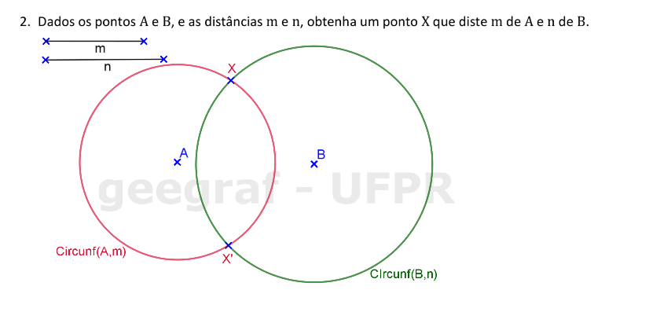
			   <figcaption>Temos duas soluções, encontradas nas interseções das circunferências construídas. Se as circunferências ficarem tangentes, teremos apenas 1 solução. E no caso em que as circunferências não se cortam, não teremos solução neste problema.</figcaption>
		   </li>
		</ul>
		
  

  
  

&#x1f4cf; &#x1f4d0; Resolução

	
Utilizaremos o conceito de lugar geométrico para fazer a construção deste triângulo. Usaremos a régua e o compasso como instrumentos auxiliares.

	  <ul class="slider">
		  <li>
			   <input type="radio" id="013" name="sl" checked>
			   <label for="013"></label>
			   
			   <figcaption>Vamos imaginar o triângulo <b>ABC</b> construído.</figcaption>
		   </li>
		   <li>
			   <input type="radio" id="014" name="sl">
			   <label for="014"></label>
			   
			   <figcaption>Por convenção, vamos nomear os lados opostos aos vértices com as mesmas letras, porém, minúsculas. Por exemplo, o lado <b>BC</b>, oposto ao vértice <b>A</b>, terá o nome <b>a</b>.</figcaption>
		   </li>
		   <li>
			   <input type="radio" id="015" name="sl">
			   <label for="015"></label>
			   
			   <figcaption>Vamos começar construindo uma reta qualquer <b>r</b>, e escolhendo um ponto <b>B</b> sobre esta reta.</figcaption>
		   </li>
		   <li>
			   <input type="radio" id="016" name="sl">
			   <label for="016"></label>
			   
			   <figcaption>Usando o compasso, vamos "pegar" a medida de um dos lados com extreminade <b>B</b>: neste caso, o lado <b>c</b>.</figcaption>
		   </li>
		   <li>
			   <input type="radio" id="017" name="sl">
			   <label for="017"></label>
			   
			   <figcaption>Com centro em <b>B</b>, desenhamos um pequeno arco que serve apenas para transferir a medida <b>c</b> para a reta <b>r</b>. Logo, encontramos o vértice <b>A</b> do triângulo.</figcaption>
		   </li>
		   <li>
			   <input type="radio" id="018" name="sl">
			   <label for="018"></label>
			   
			   <figcaption>Agora podemos "pegar" as outra medidas dos lados com o compasso. Primeiro, vamos "pegar" o lado <b>a</b>...</figcaption>
		   </li>
		   <li>
			   <input type="radio" id="019" name="sl">
			   <label for="019"></label>
			   
			   <figcaption>... e construir a <b>Circunf(B,a)</b>, pois a medida <b>a</b> está no lado oposto do vértice <b>A</b>.</figcaption>
		   </li>
		   <li>
			   <input type="radio" id="020" name="sl">
			   <label for="020"></label>
			   
			   <figcaption>Por último, "pegamos" com o compasso a medida do lado que falta: <b>b</b>.</figcaption>
		   </li>
		   <li>
			   <input type="radio" id="021" name="sl">
			   <label for="021"></label>
			   
			   <figcaption>Assim, podemos construir a <b>Circunf(A,b)</b>.</figcaption>
		   </li>
		   <li>
			   <input type="radio" id="022" name="sl">
			   <label for="022"></label>
			   
			   <figcaption>Nas interseções das circunferências construídas, podemos escolher o vértice <b>C</b> e "passar a limpo" o triângulo <b>ABC</b> unindo as extremidades <b>A</b> com <b>C</b> e <b>B</b> com <b>C</b>. O triângulo <b>ABC'</b> pode ser desenhado com linha tracejada.</figcaption>
		   </li>
		</ul>
		
  

  
  
<a href="#parte1" class="topo">voltar ao topo</a>

  
  

&#x1f4cf; &#x1f4d0; Resolução

	
Utilizaremos o conceito de lugar geométrico para fazer esta construção. O compasso será usado como instrumento auxiliar.

	  <ul class="slider">
		  <li>
			   <input type="radio" id="023" name="sl" checked>
			   <label for="023"></label>
			   
			   <figcaption>Como a circunferência procurada passar pelos pontos <b>A</b> e <b>B</b>, as distâncias entre o centro <b>O</b> e os pontos <b>A</b> e <b>B</b> medem o raio <b>r</b>. Logo, podemos "pegar" a medida <b>r</b> com o compasso...</figcaption>
		   </li>
		   <li>
			   <input type="radio" id="024" name="sl">
			   <label for="024"></label>
			   
			   <figcaption>... e construir a <b>Circunf(A,r)</b>, que é o primeiro lugar geométrico do centro <b>O</b>.</figcaption>
		   </li>
		   <li>
			   <input type="radio" id="026" name="sl">
			   <label for="026"></label>
			   
			   <figcaption>Com o mesmo raio, construímos a <b>Circunf(B,r)</b>, que é o segundo lugar geométrico de <b>O</b>. Teremos duas soluções: <b>O</b> e <b>O'</b>. Se as circunferências ficarem tangentes, temos apenas 1 solução; e no caso em que as circunferências não se interceptam, não temos solução.</figcaption>
		   </li>
		   <li>
			   <input type="radio" id="027" name="sl">
			   <label for="027"></label>
			   
			   <figcaption>Com a ponta seca em <b>O</b>, construímos a <b>Circunf(O,r)</b>, que passa por <b>A</b> e <b>B</b>.</figcaption>
		   </li>
		   <li>
			   <input type="radio" id="028" name="sl">
			   <label for="028"></label>
			   
			   <figcaption>E com a ponta seca em <b>O'</b>, desenhamos a <b>Circunf(O',r)</b>, que passa por <b>A</b> e <b>B</b>.</figcaption>
		   </li>
		   <li>
			   <input type="radio" id="029" name="sl">
			   <label for="029"></label>
			   
			   <figcaption>Escolhemos uma solução para ficar com linha contínua e a outra com linha tracejada.</figcaption>
		   </li>
		</ul>
		
  

  
  

&#x1f4cf; &#x1f4d0; Solução

	
Usando o conceito do lugar geométrico circunferência, você consegue resolver este exercício proposto.

	
	<figcaption>Encontramos duas soluções na resolução deste problema.</figcaption>
  

  
  

&#x1f4cf; &#x1f4d0; Solução

	
Use o conceito do lugar geométrico circunferência para resolver este exercício.

	
	<figcaption>Encontramos duas soluções na resolução deste problema: os triângulos <b>ABC</b> e <b>A'BC</b>.</figcaption>
  

  
<a href="#parte1" class="topo">voltar ao topo</a>

  
  

&#x1f4cf; &#x1f4d0; Solução

	
Usando o conceito do lugar geométrico circunferência, você consegue resolver este exercício.

	
	<figcaption>Como as laterais do triângulo isósceles medem <b>d</b>, usamos uma circunferência para encontrar os vértices <b>B</b> e <b>C</b>.</figcaption>
  

  
  

&#x1f4cf; &#x1f4d0; Solução

	
Use o conceito do lugar geométrico circunferência para resolver este exercício.

	
	<figcaption>Lembrando que o lado <b>b</b> é o lado <b>AC</b> do triângulo, usamos a circunferência com centro em <b>C</b> e raio <b>b</b>.</figcaption>
  

  
  

&#x1f4cf; &#x1f4d0; Solução

	
Usando o conceito do lugar geométrico circunferência, você consegue resolver este exercício.

	
	<figcaption>Como a circunferência passa por <b>P</b>, construímos a circunferência de centro em <b>P</b> e raio <b>r</b> para encontrar o centro da solução.</figcaption>
  

  
<a href="#parte1" class="topo">voltar ao topo</a>

  
  

&#x1f4cf; &#x1f4d0; Resolução

	
Utilizaremos o conceito de lugar geométrico para fazer esta construção. Usaremos a régua e o compasso como instrumentos auxiliares.

	  <ul class="slider">
		  <li>
			   <input type="radio" id="030" name="sl" checked>
			   <label for="030"></label>
			   
			   <figcaption>Lembrando da propriedade: se duas circunferências são tangentes em um ponto <b>T</b>, elas admitem a reta tangente <b>t</b> comum; como a reta tangente forma 90&deg; com o raio em <b>T</b>, os raios <b>OT</b> e <b>AT</b> formam 180&deg;, ou seja, <b>O</b>, <b>T</b> e <b>A</b> serão colineares.</figcaption>
		   </li>
		   <li>
			   <input type="radio" id="031" name="sl">
			   <label for="031"></label>
			   
			   <figcaption>Usando a régua ou um dos esquadros, podemos prolongar o segmento <b>OT</b> e usar o compasso para "pegar" a medida <b>r</b>.</figcaption>
		   </li>
		   <li>
			   <input type="radio" id="032" name="sl">
			   <label for="032"></label>
			   
			   <figcaption>Com o centro em <b>T</b>, construímos um arco para marcar o centro <b>A</b> na reta <b>OT</b>.</figcaption>
		   </li>
		   <li>
			   <input type="radio" id="033" name="sl">
			   <label for="033"></label>
			   
			   <figcaption>Teremos uma solução interna à circunferência <b>&lambda;</b>; logo, podemos marcar também o ponto <b>A'</b> sobre o raio <b>OT</b>.</figcaption>
		   </li>
		   <li>
			   <input type="radio" id="034" name="sl">
			   <label for="034"></label>
			   
			   <figcaption>Com centro em <b>A</b>, construímos a <b>Circunf(A,r)</b>, que é a primeira solução.</figcaption>
		   </li>
		   <li>
			   <input type="radio" id="035" name="sl">
			   <label for="035"></label>
			   
			   <figcaption>E com centro em <b>A'</b>, construímos a <b>Circunf(A',r)</b>, que é a segunda solução.</figcaption>
		   </li>
		   <li>
			   <input type="radio" id="036" name="sl">
			   <label for="036"></label>
			   
			   <figcaption>Estas são as duas soluções do problema proposto.</figcaption>
		   </li>
		</ul>
		
  

  
  

&#x1f4cf; &#x1f4d0; Construção

	
Neste segundo lugar geométrico, usamos a régua e o compasso como instrumentos auxiliares para sua construção.

	  <ul class="slider">
		  <li>
			   <input type="radio" id="037" name="sl" checked>
			   <label for="037"></label>
			   
			   <figcaption>Para encontrar a mediatriz de <b>AB</b>, construímos os arcos de circunferências de centros <b>A</b> e <b>B</b>, com a mesma medida dos raios. Esta medida precisa ser maior do que a metade de <b>AB</b>. As interseções destes arcos definem a reta <b>XX'</b> que é a mediatriz de <b>AB</b>. Usamos a notação <b>medAB</b>.</figcaption>
		   </li>
		   <li>
			   <input type="radio" id="038" name="sl">
			   <label for="038"></label>
			   
			   <figcaption>Como os raios são iguais à uma medida <b>d</b>, temos a formação do <b>&#9651;AXB</b> isósceles de base <b>d</b>.</figcaption>
		   </li>
		   <li>
			   <input type="radio" id="039" name="sl">
			   <label for="039"></label>
			   
			   <figcaption>Obtemos assim o ponto médio <b>M</b> de <b>AB</b>, e os <b>&#9651;AMX</b> e <b>&#9651;BMX</b> congruentes.</figcaption>
		   </li>
		   <li>
			   <input type="radio" id="040" name="sl">
			   <label for="040"></label>
			   
			   <figcaption>Logo, temos que <b>&angsph;AMX</b> = 90&deg;. Portanto, a mediatriz passa pelo ponto médio e forma 90&deg; com este segmento.</figcaption>
		   </li>
		</ul>
		
  

  
<a href="#parte1" class="topo">voltar ao topo</a>

  
  

&#x1f4cf; &#x1f4d0; Resolução

	
Utilizaremos a régua e o compasso como instrumentos auxiliares para sua construção da mediatriz.

	  <ul class="slider">
		  <li>
			   <input type="radio" id="041" name="sl" checked>
			   <label for="041"></label>
			   
			   <figcaption>Vamos construir um arco de circunferência com centro em <b>A</b> e a medida do raio maior do que a metade de <b>AB</b>.</figcaption>
		   </li>
		   <li>
			   <input type="radio" id="042" name="sl">
			   <label for="042"></label>
			   
			   <figcaption>Com a mesma medida do raio do arco anterior, construímos o arco com centro em <b>B</b>.</figcaption>
		   </li>
		   <li>
			   <input type="radio" id="043" name="sl">
			   <label for="043"></label>
			   
			   <figcaption>Usando a régua ou um dos esquadros, construímos a reta que passa pelos pontos de interseção dos arcos construídos <b>P</b> e <b>P'</b>. Esta é a mediatriz de AB, denotada por <b>medAB</b></figcaption>
		   </li>
		   <li>
			   <input type="radio" id="044" name="sl">
			   <label for="044"></label>
			   
			   <figcaption>Quando o segmento <b>AB</b> estiver próximo da margem da folha, podemos construir um dos arcos, com centro em <b>A</b> e raio maior do que a metade de <b>AB</b>.</figcaption>
		   </li>
		   <li>
			   <input type="radio" id="045" name="sl">
			   <label for="045"></label>
			   
			   <figcaption>Com a mesma medida do raio usado em <b>A</b>, construímos o arco com centro em <b>B</b>. O ponto de interseção <b>Q</b> pertence à mediatriz procurada. Porém, precisamos de mais um ponto para determinar a mediatriz.</figcaption>
		   </li>
		   <li>
			   <input type="radio" id="046" name="sl">
			   <label for="046"></label>
			   
			   <figcaption>Logo, podemos construir dois outros arcos, usando uma outra medida.</figcaption>
		   </li>
		   <li>
			   <input type="radio" id="047" name="sl">
			   <label for="047"></label>
			   
			   <figcaption>Usando a mesma medida, construímos o arco com centro em <b>B</b>.</figcaption>
		   </li>
		   <li>
			   <input type="radio" id="048" name="sl">
			   <label for="048"></label>
			   
			   <figcaption>A mediatriz pode ser construída com a régua ou um esquadro, unindo os pontos de interseção do arcos <b>Q</b> e <b>Q'</b>.</figcaption>
		   </li>
		   <li>
			   <input type="radio" id="049" name="sl">
			   <label for="049"></label>
			   
			   <figcaption>A mediatriz de <b>AB</b> está construída com o segmento próximo da margem da folha.</figcaption>
		   </li>
		</ul>
		
  

  
  

&#x1f4cf; &#x1f4d0; Solução

	
Constuindo a mediatriz de <b>AB</b>, determinamos o ponto médio deste segmento.

	
	<figcaption>Utilize os mesmos passos usados na construção anterior.</figcaption>
  

  
  

&#x1f4cf; &#x1f4d0; Resolução

	
Usaremos a régua e o compasso como instrumentos auxiliares nesta construção.

	  <ul class="slider">
		  <li>
			   <input type="radio" id="051" name="sl" checked>
			   <label for="051"></label>
			   
			   <figcaption>Como o triângulo é isósceles de base <b>BC</b>, o vértice <b>A</b> é equidistante dos vértices <b>B</b> e <b>C</b>: logo, <b>A</b> pertence à mediatriz de <b>BC</b>. Com uma medida maior do que a metade de <b>BC</b>, construímos um arco com centro em <b>C</b>...</figcaption>
		   </li>
		   <li>
			   <input type="radio" id="052" name="sl">
			   <label for="052"></label>
			   
			   <figcaption>... e outro com mesmo raio e centro em <b>B</b>. As interseções definem os pontos <b>P</b> e <b>P'</b>.</figcaption>
		   </li>
		   <li>
			   <input type="radio" id="053" name="sl">
			   <label for="053"></label>
			   
			   <figcaption>Usando a régua ou um dos esquadros, construa a mediatriz de <b>BC</b> unindo os pontos <b>P</b> e <b>P'</b>.</figcaption>
		   </li>
		   <li>
			   <input type="radio" id="054" name="sl">
			   <label for="054"></label>
			   
			   <figcaption>Como o vértice <b>A</b> pertence à circunferência <b>&lambda;</b>, as interseções de <b>&lambda;</b> com a <b>medBC</b> definem os vértices do triângulo isósceles. Teremos 2 soluções para este problema, pois a mediatriz intercepta a circunferência em 2 pontos.</figcaption>
		   </li>
		   <li>
			   <input type="radio" id="055" name="sl">
			   <label for="055"></label>
			   
			   <figcaption>Escolha uma solução para construir o triângulo com linha contínua e o outro com linha tracejada.</figcaption>
		   </li>
		</ul>
		
  

  
<a href="#parte1" class="topo">voltar ao topo</a>

  
  

&#x1f4cf; &#x1f4d0; Resolução

	
Vamos usar a régua e o compasso como instrumentos auxiliares para resolver este problema.

	  <ul class="slider">
		  <li>
			   <input type="radio" id="056" name="sl" checked>
			   <label for="056"></label>
			   
			   <figcaption>Temos os três pontos pertencentes à circunferência de centro <b>O</b>.</figcaption>
		   </li>
		   <li>
			   <input type="radio" id="057" name="sl">
			   <label for="057"></label>
			   
			   <figcaption>As distâncias entre os pontos dados e o centro é a mesma: o raio <b>r</b> da circunferência. Logo, podemos construir duas mediatrizes para encontrar o centro.</figcaption>
		   </li>
		   <li>
			   <input type="radio" id="058" name="sl">
			   <label for="058"></label>
			   
			   <figcaption>Com o centro em <b>A</b>, construiremos um arco com medida maior do que <b>AC</b> para encontrar a <b>medAC</b>.</figcaption>
		   </li>
		   <li>
			   <input type="radio" id="059" name="sl">
			   <label for="059"></label>
			   
			   <figcaption>Com o centro em <b>C</b>, construimos um arco com mesmo raio do primeiro, encontrando as interseções <b>P</b> e <b>P'</b>.</figcaption>
		   </li>
		   <li>
			   <input type="radio" id="060" name="sl">
			   <label for="060"></label>
			   
			   <figcaption>Usando a régua ou um dos esquadros, construímos a mediatriz de <b>AC</b>, que é o primeiro lugar geométrico do centro <b>O</b>.</figcaption>
		   </li>
		   <li>
			   <input type="radio" id="061" name="sl">
			   <label for="061"></label>
			   
			   <figcaption>Usando a construção similar, construímos a <b>medAB</b>, que é o segundo lugar geométrico de <b>O</b>.</figcaption>
		   </li>
		   <li>
			   <input type="radio" id="062" name="sl">
			   <label for="062"></label>
			   
			   <figcaption>Na interseção das duas mediatrizes, temos o centro da circunferência que passa pelos 3 pontos. Não precisamos construir a mediatriz do terceiro segmento, <b>BC</b>, pois basta a interseção de duas retas para determinar o ponto <b>O</b>. Com centro em <b>O</b>, podemos abrir o compasso até qualquer um dos três pontos...</figcaption>
		   </li>
		   <li>
			   <input type="radio" id="063" name="sl">
			   <label for="063"></label>
			   
			   <figcaption>... e construir a circunferência que passa pelos 3 pontos.</figcaption>
		   </li>
		   <li>
			   <input type="radio" id="064" name="sl">
			   <label for="064"></label>
			   
			   <figcaption>Esta é a única solução deste problema.</figcaption>
		   </li>
		</ul>
		
  

  
  

&#x1f4cf; &#x1f4d0; Resolução

	
Vamos usar a régua, o compasso e os esquadros como instrumentos auxiliares para resolver este problema. Vamos começar usando a régua e o compasso.

	  <ul class="slider">
		  <li>
			   <input type="radio" id="065" name="sl" checked>
			   <label for="065"></label>
			   
			   <figcaption>Vamos usar o fato do que a mediatriz de um segmento é perpendicular ao segmento. Construa então um arco de circunferência de centro <b>P</b> e raio de medida qualquer, determinando o ponto <b>A</b> sobre a reta <b>r</b>, no lado direito.</figcaption>
		   </li>
		   <li>
			   <input type="radio" id="066" name="sl">
			   <label for="066"></label>
			   
			   <figcaption>Com a mesma medida do raio do arco usado para encontrar <b>A</b>, encontre do lado esquerdo do ponto <b>P</b> o ponto <b>B</b>.</figcaption>
		   </li>
		   <li>
			   <input type="radio" id="067" name="sl">
			   <label for="067"></label>
			   
			   <figcaption>É como se <b>P</b> fosse o ponto médio de <b>AB</b>. Então vamos encontrar a <b>medAB</b>: com centro em <b>A</b>, construa um arco com raio de medida maior do que <b>AP</b> e...</figcaption>
		   </li>
		   <li>
			   <input type="radio" id="068" name="sl">
			   <label for="068"></label>
			   
			   <figcaption>... com centro em <b>B</b>, construa um arco com mesmo raio. A interseção destes arcos é o ponto <b>C</b>, que pertence à <b>medAB</b>.</figcaption>
		   </li>
		   <li>
			   <input type="radio" id="069" name="sl">
			   <label for="069"></label>
			   
			   <figcaption>Logo, podemos construir com a régua ou um dos esquadros a reta <b>PC</b>.</figcaption>
		   </li>
		   <li>
			   <input type="radio" id="070" name="sl">
			   <label for="070"></label>
			   
			   <figcaption>Esta reta é perpendicular à reta <b>r</b>, pois é a <b>medAB</b>. Agora determine um ponto <b>P'</b> sobre a reta <b>r</b> para construirmos a perpendicular a esta reta que passa por <b>P'</b> com os esquadros.</figcaption>
		   </li>
		   <li>
			   <input type="radio" id="071" name="sl">
			   <label for="071"></label>
			   
			   <figcaption>Neste exemplo, vamos usar o esquadro de 45 alinhando um cateto com a reta. Coloque na hipotenusa deste esquadro o outro esquadro ou a régua como apoio.</figcaption>
		   </li>
		   <li>
			   <input type="radio" id="072" name="sl">
			   <label for="072"></label>
			   
			   <figcaption>Deixando fixo o esquadro de 60, deslize o esquadro de 45 até chegar em <b>P'</b>. Use o outro cateto do esquadro de 45 para construir a reta perpendicular.</figcaption>
		   </li>
		   <li>
			   <input type="radio" id="073" name="sl">
			   <label for="073"></label>
			   
			   <figcaption>Esta é a solução do problema com o uso de esquadros. Você pode usar o esquadro de 60 alinhado e o outro fixo. O importante é lembrar de apoiar sempre a hipotenusa deste esquadro que irá deslizar com o outro esquadro.</figcaption>
		   </li>
		</ul>
		
  

  
  

&#x1f4cf; &#x1f4d0; Resolução

	
Vamos usar a régua, o compasso e os esquadros como instrumentos auxiliares para resolver este problema. Vamos começar usando a régua e o compasso.

	  <ul class="slider">
		  <li>
			   <input type="radio" id="074" name="sl" checked>
			   <label for="074"></label>
			   
			   <figcaption>Neste item, vamos novamente usar o fato do que a mediatriz de um segmento é perpendicular ao segmento. Construa então um arco de circunferência com raio de medida qualquer, que intercepte a reta <b>r</b> nos pontos <b>A</b> e <b>B</b>.</figcaption>
		   </li>
		   <li>
			   <input type="radio" id="075" name="sl">
			   <label for="075"></label>
			   
			   <figcaption>É como se <b>P</b> fosse um ponto qualquer da <b>medAB</b>. Então vamos encontrar a <b>medAB</b>: com centro em <b>B</b>, construa um arco com raio de medida maior do que a metade de <b>AB</b> e...</figcaption>
		   </li>
		   <li>
			   <input type="radio" id="076" name="sl">
			   <label for="076"></label>
			   
			   <figcaption>... com centro em <b>A</b>, construa um arco com mesmo raio. A interseção destes arcos é o ponto <b>C</b>, que pertence à <b>medAB</b>.</figcaption>
		   </li>
		   <li>
			   <input type="radio" id="077" name="sl">
			   <label for="077"></label>
			   
			   <figcaption>Logo, podemos construir com a régua ou um dos esquadros a reta <b>PC</b>.</figcaption>
		   </li>
		   <li>
			   <input type="radio" id="078" name="sl">
			   <label for="078"></label>
			   
			   <figcaption>Esta reta é perpendicular à reta <b>r</b>, pois é a <b>medAB</b>. Agora determine um ponto <b>P'</b> não pertencente à reta <b>r</b> para construirmos a perpendicular a esta reta que passa por <b>P'</b> com os esquadros.</figcaption>
		   </li>
		   <li>
			   <input type="radio" id="079" name="sl">
			   <label for="079"></label>
			   
			   <figcaption>Neste exemplo, vamos usar o esquadro de 60 alinhando o cateto maior com a reta. Coloque na hipotenusa deste esquadro o outro esquadro ou a régua como apoio.</figcaption>
		   </li>
		   <li>
			   <input type="radio" id="080" name="sl">
			   <label for="080"></label>
			   
			   <figcaption>Deixando fixo o esquadro de 45, deslize o esquadro de 60 até chegar em <b>P'</b>. Use o outro cateto do esquadro de 60 para construir a reta perpendicular.</figcaption>
		   </li>
		   <li>
			   <input type="radio" id="081" name="sl">
			   <label for="081"></label>
			   
			   <figcaption>Esta é a solução do problema com o uso de esquadros. Você pode usar o esquadro de 45 alinhado e o outro fixo. O importante é lembrar de apoiar sempre a hipotenusa deste esquadro que irá deslizar com o outro esquadro.</figcaption>
		   </li>
		</ul>
		
  

  
<a href="#parte1" class="topo">voltar ao topo</a>

  
  

&#x1f4cf; &#x1f4d0; Solução

	
Constuindo a mediatriz de <b>AB</b>, determinamos o ponto médio <b>M</b>deste segmento.

	
	<figcaption>Usando as mediatrizes das metades do segmento <b>AB</b>, dividimos este segmento em 4 partes iguais.</figcaption>
  

  
  

&#x1f4cf; &#x1f4d0; Solução

	
Como <b>P</b> é esquidistante de <b>B</b> e de <b>C</b>, pertence à <b>medBC</b>.

	
	<figcaption></figcaption>
  

  
  

&#x1f4cf; &#x1f4d0; Solução

	
Como <b>X</b> é esquidistante de <b>A</b> e de <b>C</b>, pertence à <b>medAC</b>.

	
	<figcaption>Como a distância de <b>X</b> até <b>B</b> é igual a <b>r</b>, pertence à <b>Circunf(B,r)</b>.</figcaption>
  

  
<a href="#parte1" class="topo">voltar ao topo</a>

  
  

&#x1f4cf; &#x1f4d0; Solução

	
Como <b>X</b> é esquidistante de <b>A</b> e de <b>B</b>, pertence à <b>medAB</b>.

	
	<figcaption>Como <b>X</b> é esquidistante de <b>C</b> e de <b>D</b>, pertence à <b>medCD</b>.</figcaption>
  

  
  

&#x1f4cf; &#x1f4d0; Solução

	
Neste caso, o centro será o ponto médio do diâmetro <b>AB</b>.

	
	<figcaption></figcaption>
  

  
  

&#x1f4cf; &#x1f4d0; Solução

	
Como a circunferência procurada passa por <b>P</b> e <b>Q</b>, seu centro pertence à <b>medPQ</b>.

	
	<figcaption>Depois de achar o centro <b>O</b>, o raio será <b>OP = OQ</b>.</figcaption>
  

  
<a href="#parte1" class="topo">voltar ao topo</a>

  
  

&#x1f4cf; &#x1f4d0; Resolução

	
Vamos usar a régua e o compasso como instrumentos auxiliares para resolver este problema.

	  <ul class="slider">
		  <li>
			   <input type="radio" id="082" name="sl" checked>
			   <label for="082"></label>
			   
			   <figcaption>Podemos definir dois pontos sobre a circunferência. Se construirmos a mediatriz deste segmento, o centro estará contido nesta reta. Logo, defina o arco com centro em <b>A</b> e um raio com medida maior do que a metade de <b>AB</b>.</figcaption>
		   </li>
		   <li>
			   <input type="radio" id="083" name="sl">
			   <label for="083"></label>
			   
			   <figcaption>Com centro em <b>B</b>, construa o arco com mesma medida do raio usado em <b>A</b>. As interseções definem a  <b>medAB</b>, que contém o centro da circunferência.</figcaption>
		   </li>
		   <li>
			   <input type="radio" id="084" name="sl">
			   <label for="084"></label>
			   
			   <figcaption>Podemos escolher outro ponto da circunferência: <b>C</b>.</figcaption>
		   </li>
		   <li>
			   <input type="radio" id="085" name="sl">
			   <label for="085"></label>
			   
			   <figcaption>Construindo a mediatriz de <b>medBC</b>, temos que a interseção da <b>medAB</b> com a <b>medBC</b> será o ponto equidistante de <b>A</b>, <b>B</b> e <b>C</b>. Logo, este ponto é o centro da circunferência.</figcaption>
		   </li>
		</ul>
		
  

  
  

&#x1f4cf; &#x1f4d0; Resolução

	
Vamos usar os esquadros e o compasso como instrumentos auxiliares para resolver este problema. Como a reta <b>t</b> é tangente à circunferência de centro <b>O</b>, o raio <b>OT</b> será perpendicular a <b>t</b>.

	  <ul class="slider">
		  <li>
			   <input type="radio" id="086" name="sl" checked>
			   <label for="086"></label>
			   
			   <figcaption>Podemos construir a reta perpendicular a <b>t</b> que passa por <b>O</b> com régua e compasso ou com os esquadros. Neste exemplo, vamos usar os esquadros: alinhe um cateto do esquadro de 45 com a reta <b>t</b>, e a hipotenusa deste esquadro fica apoiada com a régua ou com outro esquadro.</figcaption>
		   </li>
		   <li>
			   <input type="radio" id="087" name="sl">
			   <label for="087"></label>
			   
			   <figcaption>Deixando fixo o esquadro de 60, deslize o esquadro de 45 até chegar em <b>O</b>. Construa a reta perpendicular usando o cateto do esquadro de 45.</figcaption>
		   </li>
		   <li>
			   <input type="radio" id="088" name="sl">
			   <label for="088"></label>
			   
			   <figcaption>O raio da circunferência procurada será <b>OT</b>. Com centro em <b>O</b> e raio <b>OT</b>, construímos a solução deste problema.</figcaption>
		   </li>
		   <li>
			   <input type="radio" id="089" name="sl">
			   <label for="089"></label>
			   
			   <figcaption>Se você preferir, pode fazer a construção da reta perpendicular a <b>t</b> que passa por <b>O</b> usando régua e compasso.</figcaption>
		   </li>
		</ul>
		
  

  
  

&#x1f4cf; &#x1f4d0; Solução

	
Problema similar ao anterior. Você pode construir a reta <b>t</b> perpendicular ao segmento <b>OT</b> usando régua e compasso, ou o par de esquadros.

	
	<figcaption></figcaption>
  

  
<a href="#parte1" class="topo">voltar ao topo</a>

  
Retas paralelas e bissetriz: pág. 12-20

  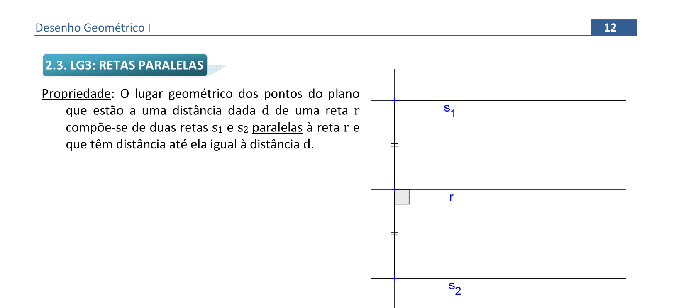
  

&#x1f4cf; &#x1f4d0; Construção

	
Agora vamos estudar o terceiro lugar geométrico: retas paralelas. Vamos ver algumas propriedades.

	  <ul class="slider">
		  <li>
			   <input type="radio" id="090" name="sl" checked>
			   <label for="090"></label>
			   
			   <figcaption>Fixando a reta <b>r</b>, as retas paralelas <b>s1</b> e <b>s2</b> formam o conjunto de pontos com distância <b>d</b> até a reta <b>r</b>.</figcaption>
		   </li>
		   <li>
			   <input type="radio" id="091" name="sl">
			   <label for="091"></label>
			   
			   <figcaption>Para medir a distância de um ponto <b>P</b> qualquer, pertencente a <b>s1</b>, até a reta <b>r</b> basta construir a reta perpendicular a <b>r</b> que passa por <b>P</b>.</figcaption>
		   </li>
		</ul>
		
  

  
  

&#x1f4cf; &#x1f4d0; Resolução

	
Utilizaremos a régua e o compasso para resolver os dois primeiros casos nesta construção.

	  <ul class="slider">
		  <li>
			   <input type="radio" id="092" name="sl" checked>
			   <label for="092"></label>
			   
			   <figcaption>Vamos usar a ideia de mediatriz para a primeira construção. Primeiro, vamos construir a reta perpendicular a <b>t</b> que passa por <b>P</b>. Com centro em <b>P</b>, construa o arco que intercepta <b>t</b> nos pontos <b>A</b> e <b>B</b>.</figcaption>
		   </li>
		   <li>
			   <input type="radio" id="093" name="sl">
			   <label for="093"></label>
			   
			   <figcaption>Com centro em <b>B</b>, construa um arco com medida do raio maior do que a metade de <b>AB</b>.</figcaption>
		   </li>
		   <li>
			   <input type="radio" id="094" name="sl">
			   <label for="094"></label>
			   
			   <figcaption>Com centro em <b>A</b>, construa o arco com mesmo raio usado em <b>B</b>. A interseção é o ponto <b>C</b> que define a reta <b>PC &perp; r</b>.</figcaption>
		   </li>
		   <li>
			   <input type="radio" id="095" name="sl">
			   <label for="095"></label>
			   
			   <figcaption>Agora vamos construir a reta perpendicular à reta <b>PC</b> que passa por <b>P</b>. Com centro em <b>P</b>, defina um arco qualquer que intercepte <b>PC</b> em <b>D</b>.</figcaption>
		   </li>
		   <li>
			   <input type="radio" id="096" name="sl">
			   <label for="096"></label>
			   
			   <figcaption>Encontre o ponto <b>E</b>, tal que <b>PE = PD</b>.</figcaption>
		   </li>
		   <li>
			   <input type="radio" id="097" name="sl">
			   <label for="097"></label>
			   
			   <figcaption>Agora vamos construir a mediatriz de <b>ED</b>. Com centro em <b>D</b>, construa um arco com raio maior do que <b>PD</b>...</figcaption>
		   </li>
		   <li>
			   <input type="radio" id="098" name="sl">
			   <label for="098"></label>
			   
			   <figcaption>... e use o mesmo raio para construir o arco com centro em <b>E</b>. Desta forma, encontramos o ponto <b>F</b>.</figcaption>
		   </li>
		   <li>
			   <input type="radio" id="099" name="sl">
			   <label for="099"></label>
			   
			   <figcaption>A reta <b>PF &perp; PD</b> é paralela à reta <b>t</b>, pois os ângulos alternos internos são iguais a 90 &deg;.</figcaption>
		   </li>
		   <li>
			   <input type="radio" id="100" name="sl">
			   <label for="100"></label>
			   
			   <figcaption>Agora vamos construi a reta paralela a <b>t</b> que passa por <b>P</b> usando outro raciocínio. Construa um arco de circunferência de raio qualquer <b>PQ</b>, onde <b>Q &isin; t</b>.</figcaption>
		   </li>
		   <li>
			   <input type="radio" id="101" name="sl">
			   <label for="101"></label>
			   
			   <figcaption>Com a mesma medida do raio, encontre o ponto <b>R &isin; t</b>, ou seja, <b>QR = PQ</b>.</figcaption>
		   </li>
		   <li>
			   <input type="radio" id="102" name="sl">
			   <label for="102"></label>
			   
			   <figcaption>Com centro em <b>R</b>, determine o arco com mesmo raio que usamos para achar <b>Q</b> e <b>R</b>.</figcaption>
		   </li>
		   <li>
			   <input type="radio" id="103" name="sl">
			   <label for="103"></label>
			   
			   <figcaption>Na interseção do terceiro arco que construímos com o arco de centro <b>P</b>, encontramos o ponto <b>S</b>, tal que <b>PS // t</b>.</figcaption>
		   </li>
		   <li>
			   <input type="radio" id="104" name="sl">
			   <label for="104"></label>
			   
			   <figcaption>De fato, <b>PS // t</b> pois construímos um losango <b>PQRS</b>, e os lados opostos de um losango são paralelos.</figcaption>
		   </li>
		</ul>
		
  

  
  

&#x1f4cf; &#x1f4d0; Resolução

	
Utilizaremos a régua e o compasso para resolver o terceiro caso desta construção, e o par de esquadros no quarto caso.

	  <ul class="slider">
		  <li>
			   <input type="radio" id="105" name="sl" checked>
			   <label for="105"></label>
			   
			   <figcaption>Vamos usar outro raciocínio para construir a reta paralela a <b>t</b> que passa por <b>P</b>. Determine um ponto <b>A</b> sobre a reta, de tal forma que <b>A</b> não esteja na direção da reta perpendicular a <b>t</b> que passa por <b>P</b>.</figcaption>
		   </li>
		   <li>
			   <input type="radio" id="106" name="sl">
			   <label for="106"></label>
			   
			   <figcaption>Com centro em <b>A</b>, construa um arco com medida do raio igual a <b>AP</b>.</figcaption>
		   </li>
		   <li>
			   <input type="radio" id="107" name="sl">
			   <label for="107"></label>
			   
			   <figcaption>Este arco deve formar uma semi-circunferência, interceptando <b>t</b> em <b>B</b> e <b>C</b>.</figcaption>
		   </li>
		   <li>
			   <input type="radio" id="108" name="sl">
			   <label for="108"></label>
			   
			   <figcaption>Com o compasso, "pegue" a medida <b>BP</b> e...</figcaption>
		   </li>
		   <li>
			   <input type="radio" id="109" name="sl">
			   <label for="109"></label>
			   
			   <figcaption>... construa o arco com raio <b>BP</b> e centro em <b>C</b>, determinando <b>D</b> na semi-circunferência.</figcaption>
		   </li>
		   <li>
			   <input type="radio" id="110" name="sl">
			   <label for="110"></label>
			   
			   <figcaption>A reta <b>PD</b> será paralela a <b>t</b>.</figcaption>
		   </li>
		   <li>
			   <input type="radio" id="111" name="sl">
			   <label for="111"></label>
			   
			   <figcaption>De fato, esta construção dá certo pois construímos um trapézio iscósceles; as retas <b>PD</b> e <b>t</b> formam as bases do trapézio, que são paralelas.</figcaption>
		   </li>
		   <li>
			   <input type="radio" id="112" name="sl">
			   <label for="112"></label>
			   
			   <figcaption>Agora, com o uso dos esquadros, podemos alinhar com a reta <b>t</b> a hipotenusa de um dos esquadros: neste exemplo, alinhamos a hipotenusa do esquadro de 45. Coloque o outro esquadro ou a régua como apoio em um dos catetos do esquadro de 45.</figcaption>
		   </li>
		   <li>
			   <input type="radio" id="113" name="sl">
			   <label for="113"></label>
			   
			   <figcaption>Deixando fixo o esquadro de 60, deslize o esquadro de 45 até chegar no ponto <b>P</b>.</figcaption>
		   </li>
		   <li>
			   <input type="radio" id="114" name="sl">
			   <label for="114"></label>
			   
			   <figcaption>Desta forma temos a reta <b>p // t</b> construída com esquadros.</figcaption>
		   </li>
		</ul>
		
  

  
  

&#x1f4cf; &#x1f4d0; Resolução

	
Podemos utilizar a régua e o compasso ou o par de esquadros para resolver este exercício. Vamos usar os esquadros para construção e a régua para marcamos a medida de 2cm.

	  <ul class="slider">
		  <li>
			   <input type="radio" id="115" name="sl" checked>
			   <label for="115"></label>
			   
			   <figcaption>Defina um ponto <b>A &isin; t</b>. Para definir o LG de todos os pontos com distância 2cm até a reta <b>t</b>, vamos construir uma reta perpendicular a <b>t</b> passando por <b>A</b>. Alinhando um cateto do esquadro de 45 e apoiando a hipotenusa com o outro esquadro...</figcaption>
		   </li>
		   <li>
			   <input type="radio" id="116" name="sl">
			   <label for="116"></label>
			   
			   <figcaption>... deixamos fixo o esquadro de 60 e deslizamos o esquadro de 45 até chegar em <b>A</b>. Desta forma, temos a reta <b>a &perp; t</b>.</figcaption>
		   </li>
		   <li>
			   <input type="radio" id="117" name="sl">
			   <label for="117"></label>
			   
			   <figcaption>Podemos usar a régua para medir a distância de 2cm nos dois semi-planos definidos pela reta <b>t</b>, definindo os pontos <b>B</b> e <b>C</b> pertencentes à reta <b>a</b>.</figcaption>
		   </li>
		   <li>
			   <input type="radio" id="118" name="sl">
			   <label for="118"></label>
			   
			   <figcaption>Agora podemos construir as retas paralelas à reta <b>t</b> que passam por <b>B</b> e <b>C</b>. Alinhando a hipotenusa de um dos esquadros com a reta <b>t</b>, e deixando o outro esquadro como apoio... </figcaption>
		   </li>
		   <li>
			   <input type="radio" id="119" name="sl">
			   <label for="119"></label>
			   
			   <figcaption>... deslizamos o esquadro de 60 até chegam em <b>C</b>, deixando fixo o esquadro de 45.</figcaption>
		   </li>
		   <li>
			   <input type="radio" id="120" name="sl">
			   <label for="120"></label>
			   
			   <figcaption>Aproveitando o alinhamento, podemos deslizar o esquadro de 60 até chegar em <b>B</b>. Logo, construímos as retas <b>p1</b>...</figcaption>
		   </li>
		   <li>
			   <input type="radio" id="121" name="sl">
			   <label for="121"></label>
			   
			   <figcaption>... e <b>p2</b>, que definem o lugar geométrico dos pontos com distância 2cm à reta <b>t</b>.</figcaption>
		   </li>
		</ul>
		
  

  
<a href="#parte2" class="topo">voltar ao topo</a>

  
  

&#x1f4cf; &#x1f4d0; Resolução

	
Utilizaremos os esquadros e o compasso para resolver este exercício. Lembrando que para construir uma circunferência tangente a uma reta, o raio deve ser perpendicular à reta no ponto de tangência.

	  <ul class="slider">
		  <li>
			   <input type="radio" id="122" name="sl" checked>
			   <label for="122"></label>
			   
			   <figcaption>Primeiro vamos construir a reta paralela ao segmento <b>AB</b>, com distância <b>r</b>. Podemos construir a reta perpendicular a <b>AB</b> que passa pelo ponto <b>A</b> com os esquadros. Alinhando um cateto do esquadro de 45, e apoiando a hipotenusa no outro esquadro...</figcaption>
		   </li>
		   <li>
			   <input type="radio" id="123" name="sl">
			   <label for="123"></label>
			   
			   <figcaption>... deslizamos o esquadro de 45 até chegar no ponto <b>A</b>, deixando fixo o outro esquadro.</figcaption>
		   </li>
		   <li>
			   <input type="radio" id="124" name="sl">
			   <label for="124"></label>
			   
			   <figcaption>Usando o compasso, "pegamos" a medida do raio <b>r</b>...</figcaption>
		   </li>
		   <li>
			   <input type="radio" id="125" name="sl">
			   <label for="125"></label>
			   
			   <figcaption>... e marcamos a partir do ponto <b>A</b> na reta perpendicular que construímos: logo, temos que <b>AD &perp; AB</b>.</figcaption>
		   </li>
		   <li>
			   <input type="radio" id="126" name="sl">
			   <label for="126"></label>
			   
			   <figcaption>Podemos alinhar a hipotenusa do esquadro de 45 com <b>AB</b>, deixando o outro esquadro apoiado em um cateto do esquadro de 45.</figcaption>
		   </li>
		   <li>
			   <input type="radio" id="127" name="sl">
			   <label for="127"></label>
			   
			   <figcaption>Deslizando o esquadro de 45 até chegar em <b>D</b>, deixando fixo o outro esquadro, construímos a reta <b>s // AB</b> com distância <b>r</b>.</figcaption>
		   </li>
		   <li>
			   <input type="radio" id="128" name="sl">
			   <label for="128"></label>
			   
			   <figcaption>Agora podemos construir a reta perpendicular ao segmento <b>BC</b> que passa pelo ponto <b>C</b>. Podemos alinhar um cateto do esquadro de 60 com <b>BC</b>, deixando o outro esquadro apoiado na hipotenusa do esquadro de 60.</figcaption>
		   </li>
		   <li>
			   <input type="radio" id="129" name="sl">
			   <label for="129"></label>
			   
			   <figcaption>Deixando fixo o esquadro de 45, deslizamos o esquadro de 60 até chegar em <b>C</b>.</figcaption>
		   </li>
		   <li>
			   <input type="radio" id="130" name="sl">
			   <label for="130"></label>
			   
			   <figcaption>Com o compasso, "pegamos" a distância <b>r</b>...</figcaption>
		   </li>
		   <li>
			   <input type="radio" id="131" name="sl">
			   <label for="131"></label>
			   
			   <figcaption>... e marcamos esta distância a partir de <b>C</b>, encontrando <b>CE &perp; BC</b>.</figcaption>
		   </li>
		   <li>
			   <input type="radio" id="132" name="sl">
			   <label for="132"></label>
			   
			   <figcaption>Agora podemos alinhar a hipotenusa do esquadro de 45 com <b>BC</b>, deixando um cateto apoiado com o outro esquadro...</figcaption>
		   </li>
		   <li>
			   <input type="radio" id="133" name="sl">
			   <label for="133"></label>
			   
			   <figcaption>... e deixamos fixo o esquadro de 60 para deslizar o esquadro de 45 até chegar em <b>E</b>. Logo, temos a reta <b>t // BC</b> com distância <b>r</b>.</figcaption>
		   </li>
		   <li>
			   <input type="radio" id="134" name="sl">
			   <label for="134"></label>
			   
			   <figcaption>A interseção entre <b>s</b> e <b>t</b> é o centro da circunferência tangente aos segmentos <b>AB</b> e <b>BC</b> com raio <b>r</b>.</figcaption>
		   </li>
		</ul>
		
  

  
  

&#x1f4cf; &#x1f4d0; Resolução

	
No exercício anterior, construímos as retas perpendiculares e paralelas com os esquadros. Neste exercício, vamos utilizar a régua e o compasso.

	  <ul class="slider">
		  <li>
			   <input type="radio" id="135" name="sl" checked>
			   <label for="135"></label>
			   
			   <figcaption>Como vamos construir uma circunferência tangente à reta <b>t</b>, dado o raio <b>r</b>, construiremos a reta perpendicular a <b>t</b> por um ponto qualquer <b>B &isin; t</b>. Com centro em <b>B</b>, defina um raio qualquer para marcar o ponto <b>C &isin; t</b>.</figcaption>
		   </li>
		   <li>
			   <input type="radio" id="136" name="sl">
			   <label for="136"></label>
			   
			   <figcaption>Usando o mesmo raio <b>BC</b>, encontre o ponto <b>D &isin; t</b>.</figcaption>
		   </li>
		   <li>
			   <input type="radio" id="137" name="sl">
			   <label for="137"></label>
			   
			   <figcaption>Construindo a mediatriz de <b>CD</b>, teremos a reta perpendicular a <b>t</b> que passa por <b>B</b>. Com centro em <b>D</b>, defina um arco com raio maior do que <b>BC</b>...</figcaption>
		   </li>
		   <li>
			   <input type="radio" id="138" name="sl">
			   <label for="138"></label>
			   
			   <figcaption>... e com centro em <b>C</b> e mesmo raio, encontramos o ponto <b>E</b> tal que <b>s &equiv; BE &perp; t &equiv; BC</b>.</figcaption>
		   </li>
		   <li>
			   <input type="radio" id="139" name="sl">
			   <label for="139"></label>
			   
			   <figcaption>Com o compasso, "pegue" a medida <b>r</b>...</figcaption>
		   </li>
		   <li>
			   <input type="radio" id="140" name="sl">
			   <label for="140"></label>
			   
			   <figcaption>... e marque esta distância <b>r</b> a partir de <b>B</b> na reta <b>s</b>. Assim, encontramos o ponto <b>F</b>. Neste ponto, podemos construir a reta paralela a <b>t</b> com distância <b>r</b>. Já vimos 3 construções diferentes para usar de retas paralelas. Neste exemplo, vamos fazer esta reta paralela usando a construção do losango.</figcaption>
		   </li>
		   <li>
			   <input type="radio" id="141" name="sl">
			   <label for="141"></label>
			   
			   <figcaption>Com centro em <b>F</b>, construímos um arco de medida qualquer que intercepte <b>t</b> em <b>G</b>.</figcaption>
		   </li>
		   <li>
			   <input type="radio" id="142" name="sl">
			   <label for="142"></label>
			   
			   <figcaption>Com a mesma medida <b>FG</b>, encontramos <b>H &isin; t</b> e <b>GH = FG</b>.</figcaption>
		   </li>
		   <li>
			   <input type="radio" id="143" name="sl">
			   <label for="143"></label>
			   
			   <figcaption>Com a mesma medida, construimos o arco com centro em <b>H</b>, interceptando o primeiro arco que construimos com centro em <b>F</b> no ponto <b>I</b>. A reta <b>FI</b> é paralela à reta <b>t</b></figcaption>
		   </li>
		   <li>
			   <input type="radio" id="144" name="sl">
			   <label for="144"></label>
			   
			   <figcaption>Agora podemos "pegar" a medida do raio <b>r</b> para definir a distância do centro da circunferência procurada com o ponto <b>A</b>.</figcaption>
		   </li>
		   <li>
			   <input type="radio" id="145" name="sl">
			   <label for="145"></label>
			   
			   <figcaption>Este é o segundo lugar geométrico do centro da circunferência tangente: uma circunferência com centro em A e raio <b>r</b>. Esta circunferência intercepta a reta <b>u // t</b> nos pontos <b>O</b> e <b>O'</b>.</figcaption>
		   </li>
		   <li>
			   <input type="radio" id="146" name="sl">
			   <label for="146"></label>
			   
			   <figcaption>Construimos uma solução com linha contínua e outra com linha tracejada.</figcaption>
		   </li>
		   <li>
			   <input type="radio" id="147" name="sl">
			   <label for="147"></label>
			   
			   <figcaption>Neste exemplo, temos 2 soluções. Caso a <b>Circunf(A,r)</b> não intercepte a reta <b>u // t</b>, não temos solução. E caso a <b>Circunf(A,r) </b> seja tangente à reta <b>u // t</b>, temos apenas 1 solução.</figcaption>
		   </li>
		</ul>
		
  

  
  

&#x1f4cf; &#x1f4d0; Resolução

	
Neste exercício, vamos utilizar o par de esquadros e o compasso.

	  <ul class="slider">
		  <li>
			   <input type="radio" id="148" name="sl" checked>
			   <label for="148"></label>
			   
			   <figcaption>Vamos construir uma reta perpendicular a um dos segmentos, escolhendo um ponto <b>A</b> pertencente ao primeiro segmento. Com um cateto alinhado com o segmento e o esquadro de 60 apoiado na hipotenusa...<b>t</b></figcaption>
		   </li>
		   <li>
			   <input type="radio" id="149" name="sl">
			   <label for="149"></label>
			   
			   <figcaption>... deslizamos o esquadro de 45 até chegar em <b>A</b>, deixando o esquadro de 60 fixo. Logo, temos a perpendicular ao segmento que passa por <b>A</b>.</figcaption>
		   </li>
		   <li>
			   <input type="radio" id="150" name="sl">
			   <label for="150"></label>
			   
			   <figcaption>Agora "pegamos" a medida do raio <b>d</b> com o compasso...</figcaption>
		   </li>
		   <li>
			   <input type="radio" id="151" name="sl">
			   <label for="151"></label>
			   
			   <figcaption>... e com centro em <b>A</b>, construímos o arco com raio <b>d</b>, definindo o segmento <b>AB</b>.</figcaption>
		   </li>
		   <li>
			   <input type="radio" id="152" name="sl">
			   <label for="152"></label>
			   
			   <figcaption>Agora podemos construir a reta paralela ao segmento que passa por <b>B</b>. Alinhando a hipotenusa do esquadro de 60 no segmento, e deixando um cateto apoiado com o outro esquadro...</figcaption>
		   </li>
		   <li>
			   <input type="radio" id="153" name="sl">
			   <label for="153"></label>
			   
			   <figcaption>... deslizamos o esquadro de 60 até chegar em <b>B</b> com o esquadro de 45 fixo.</figcaption>
		   </li>
		   <li>
			   <input type="radio" id="154" name="sl">
			   <label for="154"></label>
			   
			   <figcaption>Podemos fazer a mesma construção no outro segmento, com um ponto <b>C</b> em qualquer posição deste segundo segmento.</figcaption>
		   </li>
		   <li>
			   <input type="radio" id="155" name="sl">
			   <label for="155"></label>
			   
			   <figcaption>Alinhando um cateto do esquadro de 45 e deslizando até chegar em <b>C</b>, temos a reta perpendicular construída.</figcaption>
		   </li>
		   <li>
			   <input type="radio" id="156" name="sl">
			   <label for="156"></label>
			   
			   <figcaption>Podemos "pegar" a medida do raio <b>d</b> com o compasso...</figcaption>
		   </li>
		   <li>
			   <input type="radio" id="157" name="sl">
			   <label for="157"></label>
			   
			   <figcaption>... e marcá-la na perpendicular a partir do ponto <b>C</b>, encontrando o ponto <b>D</b>.</figcaption>
		   </li>
		   <li>
			   <input type="radio" id="158" name="sl">
			   <label for="158"></label>
			   
			   <figcaption>Alinhamos a hipotenusa do esquadro de 60 com o segmento...</figcaption>
		   </li>
		   <li>
			   <input type="radio" id="159" name="sl">
			   <label for="159"></label>
			   
			   <figcaption>... e deslizamos este esquadro até chegar em <b>D</b>, deixando o outro esquadro fixo.</figcaption>
		   </li>
		   <li>
			   <input type="radio" id="160" name="sl">
			   <label for="160"></label>
			   
			   <figcaption>A interseção das retas paralelas aos segmentos é o centro <b>O</b> da circunferência de raio <b>r</b>.</figcaption>
		   </li>
		</ul>
		
  

  
<a href="#parte2" class="topo">voltar ao topo</a>

  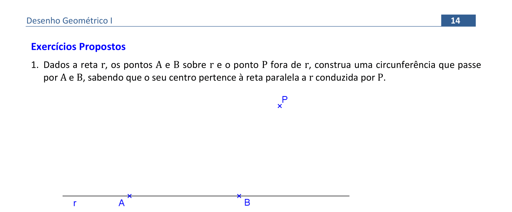
  

&#x1f4cf; &#x1f4d0; Solução

	
Você pode fazer a construção da reta paralela com régua e compasso ou com esquadros.

	
	<figcaption>Como a circunferência deve passar por <b>A</b> e <b>B</b>, o centro estará na mediatriz de <b>AB</b>.</figcaption>
  

  
  

&#x1f4cf; &#x1f4d0; Solução

	
Você pode fazer a construção da reta paralela com régua e compasso ou com esquadros.

	
	<figcaption>Antes de construir a circunferência, lembre-se de determinar o raio <b>OT</b> por meio de uma perpendicular à reta <b>t</b>.</figcaption>
  

  
  

&#x1f4cf; &#x1f4d0; Solução

	
Você pode fazer as construções com régua e compasso ou com esquadros e o compasso.

	
	<figcaption>Para construir a reta paralela <b>s</b>, lembre-se de construir o segmento <b>BC &perp; r</b> para marcar o segmento <b>n</b>.</figcaption>
  

  
<a href="#parte2" class="topo">voltar ao topo</a>

  
  

&#x1f4cf; &#x1f4d0; Solução

	
Você pode fazer as construções com régua e compasso ou com esquadros e o compasso.

	
	<figcaption>Para construir a reta paralela <b>s</b>, lembre-se de construir o segmento <b>CD &perp; r</b> para marcar o segmento <b>d</b>.</figcaption>
  

  
  

&#x1f4cf; &#x1f4d0; Resolução

	
Neste exercício, você pode usar a régua e o compasso para construir as retas perpendiculares e paralelas ou o par de esquadros com o compasso. Vamos ver como fica a construção com os esquadros e o compasso.

	  <ul class="slider">
		  <li>
			   <input type="radio" id="161" name="sl" checked>
			   <label for="161"></label>
			   
			   <figcaption>Podemos escolher um ponto qualquer <b>A &isin; b</b> para construir a reta perpendicular à reta <b>b</b>. Alinhando um cateto do esquadro de 45 com a reta <b>b</b>...</figcaption>
		   </li>
		   <li>
			   <input type="radio" id="162" name="sl">
			   <label for="162"></label>
			   
			   <figcaption>... deixando o outro esquadro fixo, deslizamos o esquadro de 45 até chegar em <b>A</b>.</figcaption>
		   </li>
		   <li>
			   <input type="radio" id="163" name="sl">
			   <label for="163"></label>
			   
			   <figcaption>Podemos usar o compasso para "pegar" a media <b>r</b>...</figcaption>
		   </li>
		   <li>
			   <input type="radio" id="164" name="sl">
			   <label for="164"></label>
			   
			   <figcaption>... e marcá-la na reta perpendicular à reta <b>b</b> a partir do ponto <b>A</b>, definindo o segmento <b>AB &perp; b</b>.</figcaption>
		   </li>
		   <li>
			   <input type="radio" id="165" name="sl">
			   <label for="165"></label>
			   
			   <figcaption>No prolongamento de <b>AB</b>, marcamos o raio <b>r</b> para encontrar a outra reta paralela à reta <b>b</b>, definindo <b>BC &perp; b</b></figcaption>
		   </li>
		   <li>
			   <input type="radio" id="166" name="sl">
			   <label for="166"></label>
			   
			   <figcaption>Alinhando a hipotenusa do esquadro de 45 com a reta <b>b</b>, deixando o esquadro de 60 como apoio fixo...</figcaption>
		   </li>
		   <li>
			   <input type="radio" id="167" name="sl">
			   <label for="167"></label>
			   
			   <figcaption>... deslizamos o esquadro de 45 até chegar em <b>B</b>, definindo a primeira paralela, e...</figcaption>
		   </li>
		   <li>
			   <input type="radio" id="168" name="sl">
			   <label for="168"></label>
			   
			   <figcaption>... deslizamos este esquadro até chegar em <b>C</b>, definindo a segunda paralela à reta <b>b</b>.</figcaption>
		   </li>
		   <li>
			   <input type="radio" id="169" name="sl">
			   <label for="169"></label>
			   
			   <figcaption>Como o centro da solução pertence à reta <b>a</b>, teremos 2 soluções: <b>O &equiv; s &cap; a</b> e <b>O' &equiv; t &cap; a</b>.Construímos estas circunferências com raios de medida <b>r</b>.</figcaption>
		   </li>
		</ul>
		
  

  
  

&#x1f4cf; &#x1f4d0; Construção

	
Vamos ver algumas propriedades deste lugar geométrico.

	  <ul class="slider">
		  <li>
			   <input type="radio" id="171" name="sl" checked>
			   <label for="171"></label>
			   
			   <figcaption>Considere as bissetrizes <b>b1</b> e <b>b2</b> dos ângulos formados entre as retas <b>r</b> e <b>s</b>, com vértice <b>O</b>. Escolha um ponto <b>Q &isin; b2</b>. O ponto <b>P &isin; b1</b> é equidistante das retas <b>r</b> e <b>s</b>, ou seja, <b>PP' = PP''</b>.</figcaption>
		   </li>
		   <li>
			   <input type="radio" id="172" name="sl">
			   <label for="172"></label>
			   
			   <figcaption>Se construirmos o segmento <b>QQ'' &perp; s</b>...</figcaption>
		   </li>
		   <li>
			   <input type="radio" id="173" name="sl">
			   <label for="173"></label>
			   
			   <figcaption>... e <b>QQ' &perp; r</b>, teremos a mesma medida <b>QQ' = QQ''</b>. Esta é uma das propriedades da bissetriz: lugar geométrico dos pontos equidistantes de duas retas. </figcaption>
		   </li>
		   <li>
			   <input type="radio" id="174" name="sl">
			   <label for="174"></label>
			   
			   <figcaption>Temos o caso de congruência LLAr (lado, lado, ângulo reto): <b>&#9651;OPP' = &#9651;OPP''</b>, pois <b>OP</b> é lado comum, <b>PP' = PP''</b> e <b>&angsph;P' = &angsph;P'' = 90&deg;</b>. Logo, os ângulos <b>&angsph;POP'</b> e <b>&angsph;POP''</b> são iguais. O mesmo vale para a congruência de <b>&#9651;OQQ' = &#9651;OQQ''</b>.</figcaption>
		   </li>
		   <li>
			   <input type="radio" id="175" name="sl">
			   <label for="175"></label>
			   
			   <figcaption>Portanto, temos os ângulos <b>&alpha;</b> e <b>&beta;</b> que definem outra propriedade da bissetriz: ela divide os ângulos formados entre<b>r</b> e <b>s</b> ao meio.</figcaption>
		   </li>
		   <li>
			   <input type="radio" id="170" name="sl">
			   <label for="170"></label>
			   
			   <figcaption>O ângulo formado entre as bissetrizes <b>b1</b> e <b>b2</b> mede <b>&alpha; + &beta;</b>. Como <b>&alpha; + &alpha; + &beta; + &beta; = 180&deg;</b>, temos que <b>&alpha; + &beta; = 90&deg;</b>, ou seja, as bissetrizes dos ângulos suplementares são perpendiculares.</figcaption>
		   </li>
		</ul>
		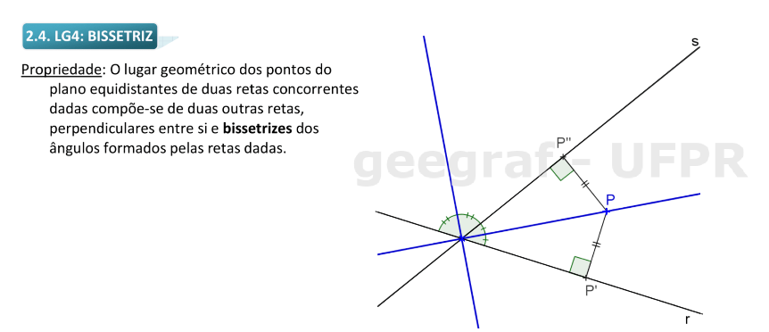
  

  
<a href="#parte2" class="topo">voltar ao topo</a>

  
  

&#x1f4cf; &#x1f4d0; Resolução

	
Utilizaremos a régua e o compasso para construir a bissetriz.

	  <ul class="slider">
		  <li>
			   <input type="radio" id="176" name="sl" checked>
			   <label for="176"></label>
			   
			   <figcaption>Com centro no vértice <b>A</b>, construímos um arco de circunferência de raio qualquer que intercepte os lados do ângulo nos pontos <b>D</b> e <b>E</b>.</figcaption>
		   </li>
		   <li>
			   <input type="radio" id="177" name="sl">
			   <label for="177"></label>
			   
			   <figcaption>Com centro em <b>D</b>, construímos um arco com raio de medida qualquer que seja maior do que a metade de <b>DE</b> (é a construção de um ponto da mediatriz de <b>DE</b>).</figcaption>
		   </li>
		   <li>
			   <input type="radio" id="178" name="sl">
			   <label for="178"></label>
			   
			   <figcaption>Com centro em <b>E</b>, construímos um arco com raio igual ao que fizemos no ponto <b>D</b>, encontrando o ponto <b>F</b>.</figcaption>
		   </li>
		   <li>
			   <input type="radio" id="179" name="sl">
			   <label for="179"></label>
			   
			   <figcaption>Usando a régua ou um dos esquadros, construímos a semi-reta <b>OF</b>.</figcaption>
		   </li>
		   <li>
			   <input type="radio" id="180" name="sl">
			   <label for="180"></label>
			   
			   <figcaption>Esta semi-reta é a bissetriz do ângulo <b>&angsph;A</b>.</figcaption>
		   </li>
		</ul>
		
  

  
  

&#x1f4cf; &#x1f4d0; Resolução

	
Vamos utilizar a régua, os esquadros e o compasso neste exercício. A ideia é não usar a interseção das retas para construir a bissetriz.

	  <ul class="slider">
		  <li>
			   <input type="radio" id="181" name="sl" checked>
			   <label for="181"></label>
			   
			   <figcaption>Vamos nomear as retas <b>r</b> e <b>s</b>. Neste primeiro exemplo, vamos usar a ideia de definir uma terceira reta <b>t</b>, concorrente com <b>r</b> e <b>s</b> nos pontos <b>A</b> e <b>B</b>.</figcaption>
		   </li>
		   <li>
			   <input type="radio" id="182" name="sl">
			   <label for="182"></label>
			   
			   <figcaption>No vértice <b>A</b>, podemos construir a bissetriz do <b>&angsph;DAE</b>: com centro em <b>A</b> e um arco com raio qualquer, encontre os pontos <b>D</b> e <b>E</b> sobre <b>t</b> e <b>r</b>.</figcaption>
		   </li>
		   <li>
			   <input type="radio" id="183" name="sl">
			   <label for="183"></label>
			   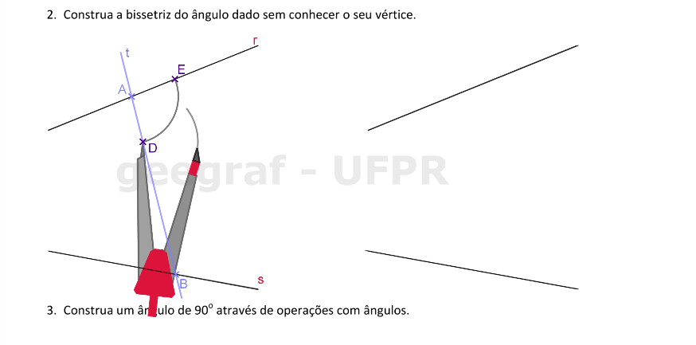
			   <figcaption>Com centro em <b>D</b>, construa um arco com raio maior do que a metade de <b>DE</b>...</figcaption>
		   </li>
		   <li>
			   <input type="radio" id="184" name="sl">
			   <label for="184"></label>
			   
			   <figcaption>... e construa um arco de mesmo raio com centro em <b>E</b>, encontrando o ponto <b>F</b>. A semi-reta <b>OF</b> é a bissetriz do <b>&angsph;DAE</b>. Podemos construir a bissetriz do suplementar deste ângulo, ou podemos usar a propriedade de que as bissetrizes de ângulos suplementares são perpendiculares.</figcaption>
		   </li>
		   <li>
			   <input type="radio" id="185" name="sl">
			   <label for="185"></label>
			   
			   <figcaption>Usando a propriedade, podemos alinhar um cateto do esquadro de 45 com a bissetriz, deixando o outro esquadro como apoio fixo...</figcaption>
		   </li>
		   <li>
			   <input type="radio" id="186" name="sl">
			   <label for="186"></label>
			   
			   <figcaption>... e deslizamos o esquadro de 45 até chegar em <b>A</b>. Logo, temos a bissetriz do ângulo suplementar do <b>&angsph;DAE</b>.</figcaption>
		   </li>
		   <li>
			   <input type="radio" id="187" name="sl">
			   <label for="187"></label>
			   
			   <figcaption>No vértice <b>B</b>, podemos fazer a mesma construção: bissetriz do <b>&angsph;GBH</b> e a perpendicular à bissetriz. Todos os pontos das bissetrizes <b>biss(A)</b> são esquidistantes de <b>r</b> e <b>t</b>.</figcaption>
		   </li>
		   <li>
			   <input type="radio" id="188" name="sl">
			   <label for="188"></label>
			   
			   <figcaption>Todos os pontos das bissetrizes <b>biss(B)</b> são esquidistantes de <b>s</b> e <b>t</b>. Logo, nas interseções de <b>biss(A)</b> e <b>biss(B)</b>, temos os pontos equidistantes de <b>r</b> e <b>s</b>, ou seja, <b>J</b> e <b>K</b> definem a <b>biss(r,s)</b>. Agora vamos usar outro raciocínio: escolha um ponto <b>A &isin; r</b>.</figcaption>
		   </li>
		   <li>
			   <input type="radio" id="189" name="sl">
			   <label for="189"></label>
			   
			   <figcaption>Neste ponto <b>A</b>, construa a reta <b>t // s</b>. Use os esquadros ou a régua e compasso para fazer esta construção.</figcaption>
		   </li>
		   <li>
			   <input type="radio" id="190" name="sl">
			   <label for="190"></label>
			   
			   <figcaption>Agora vamos construir o triângulo isósceles de base <b>BC</b> e vértice <b>A</b>: com centro em <b>A</b>, construa um arco com raio qualquer que intercepte as retas <b>r</b> e <b>t</b>.</figcaption>
		   </li>
		   <li>
			   <input type="radio" id="191" name="sl">
			   <label for="191"></label>
			   
			   <figcaption>Prolongando-se o segmento <b>BC</b>, encontramos o ponto <b>D</b>. Se imaginarmos que o vértice do encontro de <b>r</b> e <b>s</b> é um ponto <b>V</b>, temos que os triângulos <b>&#9651;ABC</b> e <b>&#9651;VDB</b> serão semelhantes, pois a reta <b>r</b> é comum e as retas <b>t</b> e <b>s</b> são paralelas.</figcaption>
		   </li>
		   <li>
			   <input type="radio" id="192" name="sl">
			   <label for="192"></label>
			   
			   <figcaption>Logo, a mediatriz da base <b>BD</b> do <b>&#9651;VDB</b> será a bissetriz do ângulo formado entre <b>r</b> e <b>s</b>. Esta mediatriz será paralela à bissetriz do <b>&angsph;BAC</b>.</figcaption>
		   </li>
		</ul>
		
  

  
  

&#x1f4cf; &#x1f4d0; Resolução

	
Vamos usar a régua e o compasso neste exercício.

	  <ul class="slider">
		  <li>
			   <input type="radio" id="193" name="sl" checked>
			   <label for="193"></label>
			   
			   <figcaption>Considere uma reta <b>r</b> e um ponto qualquer <b>A &isin; r</b>.</figcaption>
		   </li>
		   <li>
			   <input type="radio" id="194" name="sl">
			   <label for="194"></label>
			   
			   <figcaption>Se construirmos o arco com centro em <b>A</b> e um raio qualquer, que intercepte <b>r</b> nos pontos <b>B</b> e <b>C</b>, estamos considerando o <b>&angsph;BAC = 180&deg;</b>.</figcaption>
		   </li>
		   <li>
			   <input type="radio" id="195" name="sl">
			   <label for="195"></label>
			   
			   <figcaption>Logo, podemos construir sua bissetriz (do mesmo jeito que fizemos com mediatriz): com centro em <b>B</b> e raio com medida maior do que <b>AB</b>, construimos um arco... </figcaption>
		   </li>
		   <li>
			   <input type="radio" id="196" name="sl">
			   <label for="196"></label>
			   
			   <figcaption>... e com centro em <b>C</b>, construimos um arco com raio de mesma medida, determinando o ponto <b>D</b>.</figcaption>
		   </li>
		   <li>
			   <input type="radio" id="197" name="sl">
			   <label for="197"></label>
			   
			   <figcaption>A semi-reta <b>AD</b> será a bissetriz de 180&deg;.</figcaption>
		   </li>
		</ul>
		
  

  
  
<a href="#parte2" class="topo">voltar ao topo</a>

  
  

&#x1f4cf; &#x1f4d0; Resolução

	
Neste exercício, vamos utilizar a régua e o compasso. Vamos determinar o centro da circunferência inscrita, que fica tangente aos 3 lados do triângulo.

	  <ul class="slider">
		  <li>
			   <input type="radio" id="198" name="sl" checked>
			   <label for="198"></label>
			   
			   <figcaption>O incentro do triângulo está no encontro das 3 bissetrizes dos ângulos internos do triângulo. Como precisamos da interseção de 2 retas para determinar o ponto, vamos construir apenas 2 bissetrizes. Com centro em <b>A</b>, determine um arco com raio qualquer que intercepte os lados <b>AC</b> e <b>AB</b>.</figcaption>
		   </li>
		   <li>
			   <input type="radio" id="199" name="sl">
			   <label for="199"></label>
			   
			   <figcaption>Com centro em <b>D</b> e em <b>E</b>, construímos os arcos com mesma medida de raio, que seja maior do que a metade de <b>DE</b>.</figcaption>
		   </li>
		   <li>
			   <input type="radio" id="200" name="sl">
			   <label for="200"></label>
			   
			   <figcaption>A semi-reta <b>AF</b> é a bissetriz do <b>&angsph;A</b>, relativa ao lado <b>a</b>, que podemos nomear como <b>ba</b>.</figcaption>
		   </li>
		   <li>
			   <input type="radio" id="201" name="sl">
			   <label for="201"></label>
			   
			   <figcaption>Com centro em <b>B</b>, definimos um arco com raio de medida qualquer que intercepte os lados <b>AB</b> e <b>BC</b> do triângulo.</figcaption>
		   </li>
		   <li>
			   <input type="radio" id="202" name="sl">
			   <label for="202"></label>
			   
			   <figcaption>Com centros em <b>G</b> e em <b>H</b> e raios iguais a uma medida maior do que a metade de <b>GH</b>, definimos os arcos que se cortam em <b>J</b>.</figcaption>
		   </li>
		   <li>
			   <input type="radio" id="203" name="sl">
			   <label for="203"></label>
			   
			   <figcaption>A semi-reta <b>AJ</b> é a bissetriz do <b>&angsph;B</b>, relativa ao lado <b>b</b>, que podemos nomear como <b>bb</b>. A interseção das bissetrizes construídas é o incentro <b>I</b> do triângulo. Não é necessária a construção da bissetriz do <b>&angsph;C</b>.</figcaption>
		   </li>
		   <li>
			   <input type="radio" id="204" name="sl">
			   <label for="204"></label>
			   
			   <figcaption>Para determinarmos o raio da circunferência inscrita, podemos usar os esquadros, ou o compasso. Se construirmos um arco com centro em <b>I</b>, que intercepte um dos lados do triângulo nos pontos <b>K</b> e <b>L</b>...</figcaption>
		   </li>
		   <li>
			   <input type="radio" id="205" name="sl">
			   <label for="205"></label>
			   
			   <figcaption>... construímos a mediatriz de <b>KL</b> com arcos centrados em <b>K</b> e <b>L</b>, com mesmo raio, de medida maior do que a metade de <b>KL</b>.</figcaption>
		   </li>
		   <li>
			   <input type="radio" id="206" name="sl">
			   <label for="206"></label>
			   
			   <figcaption>Definimos então o segmento <b>IM &perp; BC</b>. A distância <b>ITa</b> é o raio da circunferência inscrita.</figcaption>
		   </li>
		   <li>
			   <input type="radio" id="207" name="sl">
			   <label for="207"></label>
			   
			   <figcaption>Esta é a solução do problema. Se você quiser, pode construir a reta perpendicular <b>IM</b> com os esquadros. Note que fizemos esta perpendicular ao lado <b>BC</b>, mas ela pode ser feita em qualquer um dos lados do triângulo.</figcaption>
		   </li>
		</ul>
		
  

  
  

&#x1f4cf; &#x1f4d0; Resolução

	
Vamos utilizar a régua, os esquadros e o compasso neste exercício. As retas perpendiculares podem ser construídas com os esquadros ou com a régua e o compasso.

	  <ul class="slider">
		  <li>
			   <input type="radio" id="208" name="sl" checked>
			   <label for="208"></label>
			   
			   <figcaption>O centro de uma circunferência ex-inscrita é determinado pelo encontro de duas bissetrizes dos ângulos externos do triângulo com a bissetriz de um ângulo interno. Vamos começar definindo as bissetrizes dos ângulos externos relativos aos lados <b>AB</b> e <b>BC</b>. Prolongue estes lados.</figcaption>
		   </li>
		   <li>
			   <input type="radio" id="209" name="sl">
			   <label for="209"></label>
			   
			   <figcaption>Construa a bissetriz do <b>&angsph;DAE</b>.</figcaption>
		   </li>
		   <li>
			   <input type="radio" id="210" name="sl">
			   <label for="210"></label>
			   
			   <figcaption>Vamos chamar esta bissetriz de <b>biss1</b>.</figcaption>
		   </li>
		   <li>
			   <input type="radio" id="211" name="sl">
			   <label for="211"></label>
			   
			   <figcaption>Agora vamos construir a bissetriz do <b>&angsph;GCH</b>.</figcaption>
		   </li>
		   <li>
			   <input type="radio" id="212" name="sl">
			   <label for="212"></label>
			   
			   <figcaption>A semi-reta <b>CJ</b> define esta bissetriz.</figcaption>
		   </li>
		   <li>
			   <input type="radio" id="213" name="sl">
			   <label for="213"></label>
			   
			   <figcaption>Vamos nomear esta semi-reta de <b>biss2</b>. O encontro destas bissetrizes é o primeiro ex-incentro, relativo ao lado <b>AC = b</b>, que nomeamos como <b>Ib</b>. Se construirmos a bissetriz do <b>&angsph;B</b>, ela passa pelo ex-incentro <b>Ib</b></figcaption>
		   </li>
		   <li>
			   <input type="radio" id="214" name="sl">
			   <label for="214"></label>
			   
			   <figcaption>Agora vamos encontrar o raio desta circunferência. No exercício anterior, vimos como encontrar o raio da circunferência inscrita com o compasso. Com os esquadros, temos que alinhar o cateto de um esquadro com um lado (por exemplo, <b>AB</b>), deixando o outro apoiado na hipotenusa e fixo...</figcaption>
		   </li>
		   <li>
			   <input type="radio" id="215" name="sl">
			   <label for="215"></label>
			   
			   <figcaption>E deslizamos o esquadro alinhado até chegar em <b>Ib</b>.</figcaption>
		   </li>
		   <li>
			   <input type="radio" id="216" name="sl">
			   <label for="216"></label>
			   
			   <figcaption>O raio da circunferência ex-inscrita mede <b>IbT1</b>.</figcaption>
		   </li>
		   <li>
			   <input type="radio" id="217" name="sl">
			   <label for="217"></label>
			   
			   <figcaption>Agora vamos prolongar os lados <b>AC</b> e <b>BC</b> para encontrar a outra circunferência ex-inscrita. Uma das bissetrizes não precisa ser construída (<b>biss3</b>), pois os ângulos com vértice em <b>A</b> têm mesma medida: são opostos pelo vértice. Logo, podemos apenas prolongar a <b>biss1</b>.</figcaption>
		   </li>
		   <li>
			   <input type="radio" id="218" name="sl">
			   <label for="218"></label>
			   
			   <figcaption>Construa a bissetriz do <b>&angsph;KBL</b>, que define a <b>biss4</b>. Logo, temos que <b>Ic &equiv; biss3 &cap; biss4</b>. Defina o raio <b>IcT2 &perp; AC</b>.</figcaption>
		   </li>
		   <li>
			   <input type="radio" id="219" name="sl">
			   <label for="219"></label>
			   
			   <figcaption>A última circunferência ex-inscrita é a mais fácil de fazer, pois as bissetrizes <b>biss5</b> e <b>biss6</b> são os prolongamentos de <b>biss4</b> e de <b>biss2</b>. Logo, temos o ex-incentro <b>Ia</b> e podemos construir a terceira circunferência ex-inscrita.</figcaption>
		   </li>
		   <li>
			   <input type="radio" id="220" name="sl">
			   <label for="220"></label>
			   
			   <figcaption>Construa <b>IaT3 &perp; AB</b> e construa a circunferência ex-inscrita relativa ao lado <b>a</b>.</figcaption>
		   </li>
		</ul>
		
  

  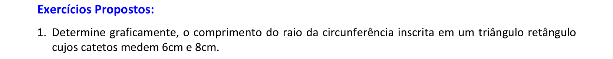
  

&#x1f4cf; &#x1f4d0; Solução

	
Você pode fazer as construções com régua e compasso ou com esquadros e o compasso.

	
	<figcaption>Lembre-se de construir o segmento <b>r</b> perpendicular a um dos lados do triângulo.</figcaption>
  

  
  

&#x1f4cf; &#x1f4d0; Solução

	
Você pode fazer as construções com régua e compasso ou com esquadros e o compasso.

	
	<figcaption>Lembre-se de construir o segmento <b>r</b> perpendicular a um dos lados do triângulo. Este segmento tem medida aproximada de 1,4cm.</figcaption>
  

  
<a href="#parte2" class="topo">voltar ao topo</a>

  
  

&#x1f4cf; &#x1f4d0; Solução

	
Neste exercício, você pode usar a régua e o compasso como instrumentos auxiliares.

	
	<figcaption>Este exercício admite 4 soluções.</figcaption>
  

  
  

&#x1f4cf; &#x1f4d0; Solução

	
Neste exercício, você pode usar a régua e o compasso como instrumentos auxiliares.

	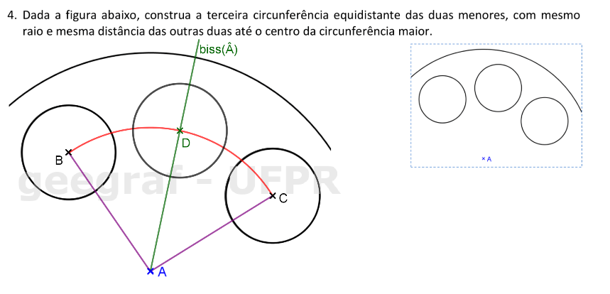
	<figcaption>Você pode construir a bissetriz do <b>&angsph;BAC</b> ou a mediatriz de <b>BC</b>.</figcaption>
  

  
  

&#x1f4cf; &#x1f4d0; Resolução

	
Você pode usar a régua e o compasso ou os esquadros e o compasso para resolver este exercício.

	  <ul class="slider">
		  <li>
			   <input type="radio" id="221" name="sl" checked>
			   <label for="221"></label>
			   
			   <figcaption>Considere os segmentos <b>s</b> e <b>t</b>. Vamos encontrar a bissetriz do ângulo formado entre <b>s</b> e <b>t</b> sem usar o vértice.</figcaption>
		   </li>
		   <li>
			   <input type="radio" id="222" name="sl">
			   <label for="222"></label>
			   
			   <figcaption>Construa a reta <b>u // s</b> que passa por <b>A</b>.</figcaption>
		   </li>
		   <li>
			   <input type="radio" id="223" name="sl">
			   <label for="223"></label>
			   
			   <figcaption>Defina o arco com centro em <b>A</b>, que intercepta <b>u</b> e <b>t</b> em <b>C</b> e <b>D</b>.</figcaption>
		   </li>
		   <li>
			   <input type="radio" id="224" name="sl">
			   <label for="224"></label>
			   
			   <figcaption>Prolongando o segmento <b>CD</b>, encontramos <b>E &isin; s</b>.</figcaption>
		   </li>
		   <li>
			   <input type="radio" id="225" name="sl">
			   <label for="225"></label>
			   
			   <figcaption>A bissetriz do ângulo formado entre <b>s</b> e <b>t</b> é a mediatriz de <b>DE</b>.</figcaption>
		   </li>
		   <li>
			   <input type="radio" id="226" name="sl">
			   <label for="226"></label>
			   
			   <figcaption>Com a circunferência de centro em <b>A</b> e raio <b>d</b>, encontramos o ponto <b>B &isin; biss(s,t)</b>. Note que usamos apenas uma das interseções: a que está proxima da reta <b>u</b>.</figcaption>
		   </li>
		   <li>
			   <input type="radio" id="227" name="sl">
			   <label for="227"></label>
			   
			   <figcaption>Agora você pode construir a circunferência com centro em <b>B</b> e raio <b>r</b>.</figcaption>
		   </li>
		</ul>
		
  

  
<a href="#parte2" class="topo">voltar ao topo</a>

  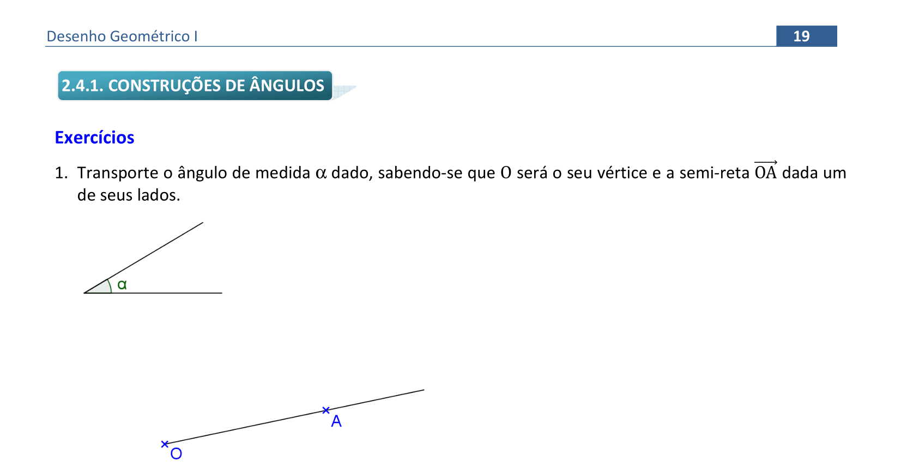
  

&#x1f4cf; &#x1f4d0; Resolução

	
Neste exercício, vamos utilizar a régua e o compasso.

	  <ul class="slider">
		  <li>
			   <input type="radio" id="228" name="sl" checked>
			   <label for="228"></label>
			   
			   <figcaption>Para transportar o ângulo <b>&alpha;</b>, podemos construir um arco com centro no vértice do ângulo, com raio qualquer e que intercepte os lados nos pontos <b>B</b> e <b>C</b>.</figcaption>
		   </li>
		   <li>
			   <input type="radio" id="229" name="sl">
			   <label for="229"></label>
			   
			   <figcaption>Com a mesma medida, definimos o arco com centro no vértice onde queremos transportar o ângulo: <b>O</b>.</figcaption>
		   </li>
		   <li>
			   <input type="radio" id="230" name="sl">
			   <label for="230"></label>
			   
			   <figcaption>Com o compasso, "pegamos" a medida da abertura do ângulo <b>BC</b>...</figcaption>
		   </li>
		   <li>
			   <input type="radio" id="231" name="sl">
			   <label for="231"></label>
			   
			   <figcaption>... e construímos o arco com centro em <b>D</b> e raio <b>BC</b>. A semi-reta <b>OE</b> forma ângulo <b>&alpha;</b> com <b>OA</b>.</figcaption>
		   </li>
		   <li>
			   <input type="radio" id="232" name="sl">
			   <label for="232"></label>
			   
			   <figcaption>Note que esta construção funciona, pois construímos os triângulos congruentes.</figcaption>
		   </li>
		</ul>
		
  

  
  

&#x1f4cf; &#x1f4d0; Resolução

	
Vamos utilizar a régua, os esquadros e o compasso neste exercício. Vamos começar com a régua e o compasso.

	  <ul class="slider">
		  <li>
			   <input type="radio" id="233" name="sl" checked>
			   <label for="233"></label>
			   
			   <figcaption>Construa uma reta qualquer e defina um ponto <b>A</b> nesta reta. Relembrando a construção de perpendicular, construimos um arco com centro <b>A</b> e raio <b>AB</b> qualquer...</figcaption>
		   </li>
		   <li>
			   <input type="radio" id="234" name="sl">
			   <label for="234"></label>
			   
			   <figcaption>... definindo o ponto <b>C</b> sobre a reta, com mesmo raio.</figcaption>
		   </li>
		   <li>
			   <input type="radio" id="235" name="sl">
			   <label for="235"></label>
			   
			   <figcaption>Agora é só construir a mediatriz de <b>BC</b>, com centro em <b>C</b> e um raio maior do que <b>AB</b>...</figcaption>
		   </li>
		   <li>
			   <input type="radio" id="236" name="sl">
			   <label for="236"></label>
			   
			   <figcaption>... e centro em <b>B</b> com mesmo raio.</figcaption>
		   </li>
		   <li>
			   <input type="radio" id="237" name="sl">
			   <label for="237"></label>
			   
			   <figcaption>A semi-reta <b>AD</b> forma 90&deg; com a reta. A construção com os esquadros já foi feita anteriormente, e você pode fazê-la como exercício. Agora vamos escolher um ponto <b>E</b> sobre a reta.</figcaption>
		   </li>
		   <li>
			   <input type="radio" id="238" name="sl">
			   <label for="238"></label>
			   
			   <figcaption>Com centro em <b>E</b>, defina um arco de circunferência com raio <b>EF</b> qualquer...</figcaption>
		   </li>
		   <li>
			   <input type="radio" id="239" name="sl">
			   <label for="239"></label>
			   
			   <figcaption>... e com centro em <b>F</b>, construa o arco com mesmo raio <b>EF</b>, encontrando a interseção <b>G</b>. Unindo <b>E</b> com <b>G</b>, temos a semi-reta que forma 60&deg; com a reta.</figcaption>
		   </li>
		   <li>
			   <input type="radio" id="240" name="sl">
			   <label for="240"></label>
			   
			   <figcaption>Esta construção funciona, pois construímos um triângulo equilátero de lado <b>EF</b>. Agora vamos ver como construir o ângulo de 60 &deg; com os esquadros.</figcaption>
		   </li>
		   <li>
			   <input type="radio" id="241" name="sl">
			   <label for="241"></label>
			   
			   <figcaption>Escolha um ponto <b>H</b> sobre a reta, e alinhe a hipotenusa do esquadro de 60 com a reta, apoiando o cateto do ângulo de 30&deg; com o outro esquadro fixo, ou seja, deixaremos livre o lado do esquadro de 60&deg; para transferí-lo na reta.</figcaption>
		   </li>
		   <li>
			   <input type="radio" id="242" name="sl">
			   <label for="242"></label>
			   
			   <figcaption>Deslizando o esquadro de 60 até chegar em <b>H</b>, você consegue construir o ângulo de 60&deg; com vértice <b>H</b>. Este ângulo ficou virado para a direita da folha.</figcaption>
		   </li>
		   <li>
			   <input type="radio" id="243" name="sl">
			   <label for="243"></label>
			   
			   <figcaption>Se você quiser o ângulo de 60&deg; virado para a esquerda, basta mudar o lado de alinhamento do esquadro de 60. O importante é lembrar sempre de deisar o ângulo de 60&deg; livre, sem apoio.</figcaption>
		   </li>
		   <li>
			   <input type="radio" id="244" name="sl">
			   <label for="244"></label>
			   
			   <figcaption>Deslizando o esquadro do outro lado, você consegue construir o ângulo de 60&deg; do outro lado.</figcaption>
		   </li>
		   <li>
			   <input type="radio" id="245" name="sl">
			   <label for="245"></label>
			   
			   <figcaption>Assim ficam definidas as duas opções de construção de 60&deg;: com o compasso e com os esquadros.</figcaption>
		   </li>
		</ul>
		
  

  
  

&#x1f4cf; &#x1f4d0; Resolução: 1&ordf; parte

	
Vamos utilizar a régua, os esquadros e o compasso neste exercício. Vamos começar com a régua e o compasso.

	  <ul class="slider">
		  <li>
			   <input type="radio" id="246" name="sl" checked>
			   <label for="246"></label>
			   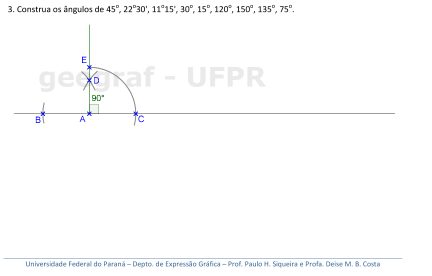
			   <figcaption>Começamos construindo o ângulo de 90&deg;, como fizemos no exercício anterior. Podemos prolongar o arco com centro em <b>C</b> para fazer a bissetriz de 90&deg;.</figcaption>
		   </li>
		   <li>
			   <input type="radio" id="247" name="sl">
			   <label for="247"></label>
			   
			   <figcaption>Com centro em <b>C</b>, construa o arco com raio maior do que a metade de <b>EC</b>...</figcaption>
		   </li>
		   <li>
			   <input type="radio" id="248" name="sl">
			   <label for="248"></label>
			   
			   <figcaption>... e use este mesmo raio para construir o arco com centro em <b>E</b>, encontrando o ponto <b>F</b> na interseção dos arcos.</figcaption>
		   </li>
		   <li>
			   <input type="radio" id="249" name="sl">
			   <label for="249"></label>
			   
			   <figcaption>A semi-reta <b>AF</b> forma 45&deg; com a reta.</figcaption>
		   </li>
		   <li>
			   <input type="radio" id="250" name="sl">
			   <label for="250"></label>
			   
			   <figcaption>Ao construir a bissetriz dos 45&deg;, temos o ângulo de 22,5&deg; = 22&deg;30'.</figcaption>
		   </li>
		   <li>
			   <input type="radio" id="251" name="sl">
			   <label for="251"></label>
			   
			   <figcaption>E a bissetriz de 22,5&deg; fornece o ângulo de 11,15&deg;. Para construir o ângulo de 45&deg; com os esquadros, alinhamos a hipotenusa do esquadro de 45 com a reta, e apoiamos um cateto com o outro esquadro que ficará fixo.</figcaption>
		   </li>
		   <li>
			   <input type="radio" id="252" name="sl">
			   <label for="252"></label>
			   
			   <figcaption>Ao deslizar o esquadro de 45 até chegar no ponto <b>K</b> pertencente à reta, construimos o ângulo de 45 virado à direita da folha.</figcaption>
		   </li>
		   <li>
			   <input type="radio" id="253" name="sl">
			   <label for="253"></label>
			   
			   <figcaption>Note que encontramos o ângulo de 135&deg;, que é o suplementar de 45&deg;. Se você quiser o ângulo de 45&deg; virado à esquerda, basta mudar o lado do apoio do esquadro de 60...</figcaption>
		   </li>
		   <li>
			   <input type="radio" id="254" name="sl">
			   <label for="254"></label>
			   
			   <figcaption>... e deslizar o esquadro até chegar no ponto <b>K</b>.</figcaption>
		   </li>
		   <li>
			   <input type="radio" id="255" name="sl">
			   <label for="255"></label>
			   
			   <figcaption>Vamos desenhar outra reta no espaço abaixo para construir os outros ângulos.</figcaption>
		   </li>
		</ul>
		
  

  

&#x1f4cf; &#x1f4d0; Resolução: 2&ordf; parte

	
Vamos utilizar a régua, os esquadros e o compasso neste exercício. Vamos começar com a régua e o compasso.

	  <ul class="slider">
		  <li>
			   <input type="radio" id="256" name="sl" checked>
			   <label for="256"></label>
			   
			   <figcaption>Escolha um ponto <b>L</b> da reta, e construa um arco com raio qualquer, interceptando a reta em <b>M</b>.</figcaption>
		   </li>
		   <li>
			   <input type="radio" id="257" name="sl">
			   <label for="257"></label>
			   
			   <figcaption>Com mesmo raio, construa o arco com centro em <b>M</b>, definindo a semi-reta <b>LN</b> que forma 60&deg; com a reta.</figcaption>
		   </li>
		   <li>
			   <input type="radio" id="258" name="sl">
			   <label for="258"></label>
			   
			   <figcaption>Construindo a bissetriz dos 60&deg;, temos o ângulo de 30&deg; construído com régua e compasso.</figcaption>
		   </li>
		   <li>
			   <input type="radio" id="259" name="sl">
			   <label for="259"></label>
			   
			   <figcaption>Com a bissetriz de 30&deg;, temos o ângulo de 15&deg;.</figcaption>
		   </li>
		   <li>
			   <input type="radio" id="260" name="sl">
			   <label for="260"></label>
			   
			   <figcaption>Quando construímos o ângulo de 60&deg;, definimos o suplementar de 120&deg;.</figcaption>
		   </li>
		   <li>
			   <input type="radio" id="261" name="sl">
			   <label for="261"></label>
			   
			   <figcaption>Também temos o ângulo de 150&deg;, que é o suplementar de 30&deg;.</figcaption>
		   </li>
		   <li>
			   <input type="radio" id="262" name="sl">
			   <label for="262"></label>
			   
			   <figcaption>Se construirmos a bissetriz do ângulo de 150&deg;, temos o ângulo de 75&deg; com régua e compasso.</figcaption>
		   </li>
		   <li>
			   <input type="radio" id="263" name="sl">
			   <label for="263"></label>
			   
			   <figcaption>Agora vamos construir alguns ângulos com os esquadros. Escolha um ponto <b>R</b> sobre a reta e alinhe o cateto de 30&deg; com a reta. Coloque o cateto de 60&deg; com o apoio fixo do esquadro de 45...</figcaption>
		   </li>
		   <li>
			   <input type="radio" id="264" name="sl">
			   <label for="264"></label>
			   
			   <figcaption>... e deslize o esquadro de 60 até chegar no ponto <b>R</b>. Assim, temos os ângulos de 30&deg; e 150&deg; construídos com os esquadros. Se você quiser o ângulo de 30&deg; virado para o outro lado, basta inverter as posições dos esquadros, como fizemos anteriormente com os ângulos de 45&deg; e 60&deg;.</figcaption>
		   </li>
		   <li>
			   <input type="radio" id="265" name="sl">
			   <label for="265"></label>
			   
			   <figcaption>Escolha um ponto <b>S</b> sobre a reta, e apoie os esquadros assim: o de 45 com o cateto alinhado na reta, e o de 60 com o vértice de 30&deg; junto com o vértice de 45&deg;. Somando os ângulos, temos 75&deg;, então deixaremos fixo o esquadro de 45&deg;, deslizando o esquadro de 60...</figcaption>
		   </li>
		   <li>
			   <input type="radio" id="266" name="sl">
			   <label for="266"></label>
			   
			   <figcaption>... até chegar em <b>S</b>.</figcaption>
		   </li>
		   <li>
			   <input type="radio" id="267" name="sl">
			   <label for="267"></label>
			   
			   <figcaption>Desta maneira, temos a construção do ângulo de 75&deg; com os esquadros. Conseguimos também o suplementar de 105&deg; com esta construção. Então, ficam as opções para você construir nos próximos exercícios: com os esquadros ou com régua e compasso.</figcaption>
		   </li>
		</ul>
		
  

  
<a href="#parte2" class="topo">voltar ao topo</a>

  
  

&#x1f4cf; &#x1f4d0; Resolução

	
Neste exercício, vamos utilizar a régua e o compasso.

	  <ul class="slider">
		  <li>
			   <input type="radio" id="268" name="sl" checked>
			   <label for="268"></label>
			   
			   <figcaption>Como a semi-reta <b>OC</b> é bissetriz do <b>&angsph;AOB</b>, vamos transportar a medida do <b>&angsph;AOC</b> para o outro semi-plano definido por <b>OC</b>: construa um arco com raio qualquer, centrado em <b>O</b>.</figcaption>
		   </li>
		   <li>
			   <input type="radio" id="269" name="sl">
			   <label for="269"></label>
			   
			   <figcaption>Com o compasso, "pegue" a medida da abertura do ângulo <b>DE</b>...</figcaption>
		   </li>
		   <li>
			   <input type="radio" id="270" name="sl">
			   <label for="270"></label>
			   
			   <figcaption>... e construa o arco com centro em <b>E</b> e raio <b>DE</b>. Assim, encontramos o ponto <b>B</b> que define o ângulo procurado.</figcaption>
		   </li>
		   <li>
			   <input type="radio" id="271" name="sl">
			   <label for="271"></label>
			   
			   <figcaption>A semi-reta <b>OB</b> define o <b>&angsph;AOB</b>, com bissetriz <b>OC</b>.</figcaption>
		   </li>
		</ul>
		
  

  
  

&#x1f4cf; &#x1f4d0; Solução

	
Neste exercício, você pode usar a régua e o compasso como instrumentos auxiliares.

	
	<figcaption>Basta lembrar da construção que fizemos para transportar ângulos. Lembre-se que os arcos com centros nos vértices devem ter mesma medida de raio.</figcaption>
  

  
  

&#x1f4cf; &#x1f4d0; Solução

	
Neste exercício, você pode usar a régua e o compasso como instrumentos auxiliares.

	
	<figcaption>Lembre-se da construção que fizemos para transportar ângulos.</figcaption>
  

  
  

&#x1f4cf; &#x1f4d0; Solução

	
Neste exercício, você pode usar a régua e o compasso como instrumentos auxiliares.

	
	<figcaption>Lembre-se da construção que fizemos para transportar ângulos.</figcaption>
  

  
<a href="#parte2" class="topo">voltar ao topo</a>

  
Arco capaz: pág. 21-29

  
  

&#x1f4cf; &#x1f4d0; Construção

	
Vamos ver alguns elementos para o próximo Lugar geométrico.

	  <ul class="slider">
		  <li>
			   <input type="radio" id="272" name="sl" checked>
			   <label for="272"></label>
			   
			   <figcaption>Unindo dois pontos quaisquer <b>A</b> e <b>B</b> de uma circunferência, definimos uma <b>corda</b>.</figcaption>
		   </li>
		   <li>
			   <input type="radio" id="273" name="sl">
			   <label for="273"></label>
			   
			   <figcaption>Quando a corda contém o centro da circunferência, temos um <b>diâmetro</b>.</figcaption>
		   </li>
		</ul>
		
  

  
  
<a href="#parte3" class="topo">voltar ao topo</a>

  
  

&#x1f4cf; &#x1f4d0; Demonstração

	
Vamos demonstrar a Propriedade 1. Vamos considerar os 3 casos possíveis: quando um lado do ângulo inscrito define um diâmetro; quando o centro está no interior do ângulo inscrito; e quando o centro está na região externa definida pelo ângulo inscrito.

	  <ul class="slider">
		  <li>
			   <input type="radio" id="274" name="sl" checked>
			   <label for="274"></label>
			   
			   <figcaption>Vamos considerar o vértice <b>P</b> e os lados <b>PA</b> e <b>PB</b>. No primeiro caso, o lado <b>PB</b> define um diâmetro da circunferência.</figcaption>
		   </li>
		   <li>
			   <input type="radio" id="275" name="sl">
			   <label for="275"></label>
			   
			   <figcaption>Temos que <b>OP = OA = r</b>, onde <b>r</b> é o raio da circunferência. Logo, o &angsph;<b>OAP = &alpha;</b>, pois o <b>&#9651;AOP</b> é isósceles de base <b>AP</b>.</figcaption>
		   </li>
		   <li>
			   <input type="radio" id="276" name="sl" checked>
			   <label for="276"></label>
			   
			   <figcaption>O &angsph;<b>AOB = &beta;</b> é o ângulo central correspondente de <b>&alpha;</b>. Temos que <b>&beta;</b> e <b>&delta;</b> são suplementares, ou seja, <b>&beta; + &delta; = 180&deg;</b>. Temos também que <b>2&alpha; + &delta; = 180&deg;</b>, pois são ângulos internos do <b>&#9651;AOP</b>.</figcaption>
		   </li>
		   <li>
			   <input type="radio" id="276a" name="sl" checked>
			   <label for="276a"></label>
			   
			   <figcaption>Logo, temos que <b>2&alpha; + &delta; = &beta; + &delta;</b>, ou seja, <b>2&alpha; = &beta;</b>. Portanto, <b>$\alpha = {\beta \over 2}$</b>.</figcaption>
		   </li>
		   <li>
			   <input type="radio" id="277" name="sl">
			   <label for="277"></label>
			   
			   <figcaption>No segundo caso, considere o diâmetro <b>PC</b>, que divide o ângulo <b>&alpha;</b> em <b>&alpha;1</b> e <b>&alpha;2</b>.</figcaption>
		   </li>
		   <li>
			   <input type="radio" id="278" name="sl" checked>
			   <label for="278"></label>
			   
			   <figcaption>Unindo os pontos <b>A</b> e <b>B</b> com o centro da circunferência, determinamos o ângulo central <b>&beta; = &angsph; AOB</b>.</figcaption>
		   </li>
		   <li>
			   <input type="radio" id="279" name="sl">
			   <label for="279"></label>
			   
			   <figcaption>O ângulo central está dividido nos ângulos centrais correspondentes de <b>&alpha;1</b> e <b>&alpha;2</b>, que são <b>&beta;1</b> e <b>&beta;2</b>.</figcaption>
		   </li>
		   <li>
			   <input type="radio" id="279a" name="sl">
			   <label for="279a"></label>
			   
			   <figcaption>De acordo com o caso anterior, temos que <b>$\alpha_1 = {\beta_1 \over 2}$</b> e <b>$\alpha_2 = {\beta_2 \over 2}$</b>. Logo, <b>$\alpha = \alpha_1 + \alpha_2 = {\beta_1 \over 2} + {\beta_2 \over 2} = {{\beta_1 + \beta_2}  \over 2} = {\beta \over 2}$</b>.</figcaption>
		   </li>
		   <li>
			   <input type="radio" id="280" name="sl" checked>
			   <label for="280"></label>
			   
			   <figcaption>No terceiro caso, considere o diâmetro <b>PC</b>, que define o ângulo <b>&alpha;</b> como <b>&alpha;1 - &alpha;2</b>.</figcaption>
		   </li>
		   <li>
			   <input type="radio" id="281" name="sl" checked>
			   <label for="281"></label>
			   
			   <figcaption>Unindo os pontos <b>A</b> e <b>B</b> com o centro da circunferência, determinamos o ângulo central <b>&beta; = &angsph; AOB</b>.</figcaption>
		   </li>
		   <li>
			   <input type="radio" id="282" name="sl">
			   <label for="282"></label>
			   
			   <figcaption>O ângulo central tem a seguinte relação com os ângulos centrais correspondentes de <b>&alpha;1</b> e <b>&alpha;2</b>: <b>&beta; = &beta;1 - &beta;2</b>.</figcaption>
		   </li>
		   <li>
			   <input type="radio" id="282a" name="sl">
			   <label for="282a"></label>
			   
			   <figcaption>De acordo com o primeiro caso provado, temos que <b>$\alpha_1 = {\beta_1 \over 2}$</b> e <b>$\alpha_2 = {\beta_2 \over 2}$</b>. Logo, <b>$\alpha = \alpha_1 - \alpha_2 = {\beta_1 \over 2} - {\beta_2 \over 2} = {{\beta_1 - \beta_2} \over 2} = {\beta \over 2}$</b>. Portanto, a propriedade vale em todos os casos, ou seja, o ângulo inscrito sempre vale a metade da medida do ângulo central correspondente.</figcaption>
		   </li>
		</ul>
		
  

  
  

&#x1f4cf; &#x1f4d0; Construção

	
Vamos ver alguns do ângulo de segmento.

	  <ul class="slider">
		  <li>
			   <input type="radio" id="283" name="sl" checked>
			   <label for="283"></label>
			   
			   <figcaption>Vamos definir as extremidades <b>A</b> e <b>B</b> da corda e a reta tangente <b>t</b> que passa por <b>A</b>.</figcaption>
		   </li>
		   <li>
			   <input type="radio" id="284" name="sl">
			   <label for="284"></label>
			   
			   <figcaption>Quando unimos <b>A</b> e <b>B</b> com o centro da circunferência, temos o ângulo central correspondente <b>&beta;</b> do ângulo de segmento.</figcaption>
		   </li>
		</ul>
		
  

  
  

&#x1f4cf; &#x1f4d0; Demonstração

	
Vamos demonstrar a Propriedade 2, que relaciona o ângulo de segmento com o ângulo central correspondente.

	  <ul class="slider">
		  <li>
			   <input type="radio" id="285" name="sl" checked>
			   <label for="285"></label>
			   
			   <figcaption>Vamos considerar a reta tangente à circunferência <b>t</b> no ponto <b>A</b> e o raio com medida <b>r</b>. Logo, temos o <b>&#9651;AOB</b> isósceles de base <b>AB</b>.</figcaption>
		   </li>
		   <li>
			   <input type="radio" id="286" name="sl">
			   <label for="286"></label>
			   
			   <figcaption>Logo, temos os ângulos da base iguais a <b>&delta;</b>. Temos também que <b>&theta; + &delta; = 90&deg;</b>, pois a reta <b>t</b> é tangente e <b>2&delta; + &beta; = 180&deg;</b> pois são ângulos internos do <b>&#9651;AOB</b>.</figcaption>
		   </li>
		   <li>
			   <input type="radio" id="287" name="sl">
			   <label for="287"></label>
			   
			   <figcaption>Da relação de <b>&delta;</b> e <b>&theta;</b>, podemos concluir que <b>2&delta; + 2&theta; = 180&deg;</b>. Temos que <b>2&delta; + 2&theta; = 2&delta; + &beta;</b>, ou seja <b>2&theta; = &beta;</b>. Portanto, <b>$\theta = {\beta \over 2}$</b>, que é a mesma relação que provamos entre o ângulo inscrito e o central correspondente. </figcaption>
		   </li>
		</ul>
		
  

  
<a href="#parte3" class="topo">voltar ao topo</a>

  
  
  
  
  
<a href="#parte3" class="topo">voltar ao topo</a>

  
  
  
<a href="#parte3" class="topo">voltar ao topo</a>

  
  
  
  
<a href="#parte3" class="topo">voltar ao topo</a>

  
  
  
  
<a href="#parte3" class="topo">voltar ao topo</a>

  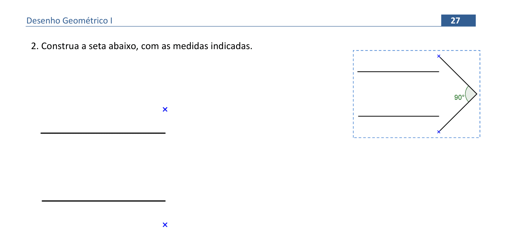
  
  
<a href="#parte3" class="topo">voltar ao topo</a>

  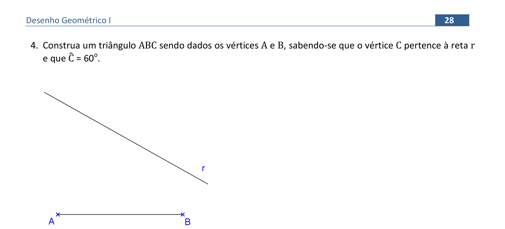
  
<a href="#parte3" class="topo">voltar ao topo</a>

  
  
<a href="#parte3" class="topo">voltar ao topo</a>

  
Operações com segmentos: pág. 30-48

  
  
<a href="#parte4" class="topo">voltar ao topo</a>

  
  
<a href="#parte4" class="topo">voltar ao topo</a>

  
  
<a href="#parte4" class="topo">voltar ao topo</a>

  
  
<a href="#parte4" class="topo">voltar ao topo</a>

  
  
<a href="#parte4" class="topo">voltar ao topo</a>

  
  
<a href="#parte4" class="topo">voltar ao topo</a>

  
  
<a href="#parte4" class="topo">voltar ao topo</a>

  
  
<a href="#parte4" class="topo">voltar ao topo</a>

  
  
<a href="#parte4" class="topo">voltar ao topo</a>

  
  
<a href="#parte4" class="topo">voltar ao topo</a>

  
  
<a href="#parte4" class="topo">voltar ao topo</a>

  
  
<a href="#parte4" class="topo">voltar ao topo</a>

  
  
<a href="#parte4" class="topo">voltar ao topo</a>

  
  
<a href="#parte4" class="topo">voltar ao topo</a>

  
  
<a href="#parte4" class="topo">voltar ao topo</a>

  
  
<a href="#parte4" class="topo">voltar ao topo</a>

  
  
<a href="#parte4" class="topo">voltar ao topo</a>

  
  
<a href="#parte4" class="topo">voltar ao topo</a>

  
  
<a href="#parte4" class="topo">voltar ao topo</a>

  
Triângulos e quadriláteros: pág. 49-64

  
  
<a href="#parte5" class="topo">voltar ao topo</a>

  
  
<a href="#parte5" class="topo">voltar ao topo</a>

  
  
<a href="#parte5" class="topo">voltar ao topo</a>

  
  
<a href="#parte5" class="topo">voltar ao topo</a>

  
  
<a href="#parte5" class="topo">voltar ao topo</a>

  
  
<a href="#parte5" class="topo">voltar ao topo</a>

  
  
<a href="#parte5" class="topo">voltar ao topo</a>

  
  
<a href="#parte5" class="topo">voltar ao topo</a>

  
  
<a href="#parte5" class="topo">voltar ao topo</a>

  
  
<a href="#parte5" class="topo">voltar ao topo</a>

  
  
<a href="#parte5" class="topo">voltar ao topo</a>

  
  
<a href="#parte5" class="topo">voltar ao topo</a>

  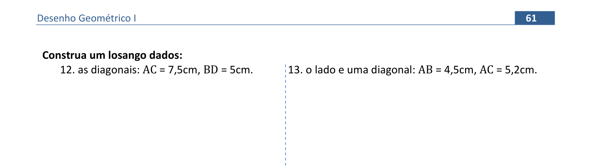
  
<a href="#parte5" class="topo">voltar ao topo</a>

  
  
<a href="#parte5" class="topo">voltar ao topo</a>

  
  
<a href="#parte5" class="topo">voltar ao topo</a>

  
  
<a href="#parte5" class="topo">voltar ao topo</a>

  
Tangência e concordância: pág. 65-78

  
  
<a href="#parte6" class="topo">voltar ao topo</a>

  
  
<a href="#parte6" class="topo">voltar ao topo</a>

  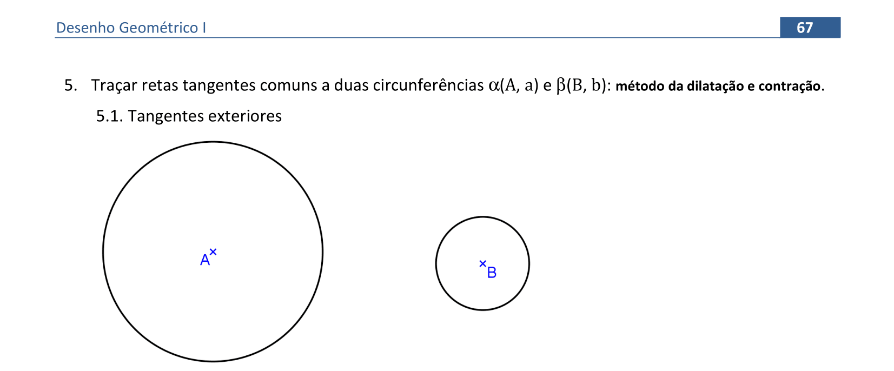
  
<a href="#parte6" class="topo">voltar ao topo</a>

  
  
<a href="#parte6" class="topo">voltar ao topo</a>

  
  
<a href="#parte6" class="topo">voltar ao topo</a>

  
  
<a href="#parte6" class="topo">voltar ao topo</a>

  
  
<a href="#parte6" class="topo">voltar ao topo</a>

  
  
<a href="#parte6" class="topo">voltar ao topo</a>

  
  
<a href="#parte6" class="topo">voltar ao topo</a>

  
  
<a href="#parte6" class="topo">voltar ao topo</a>

  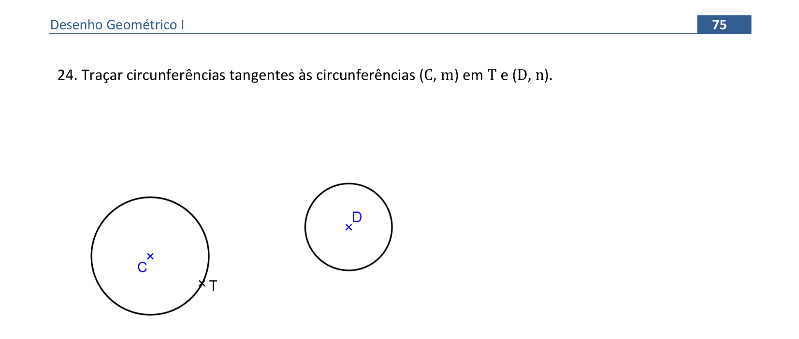
  
<a href="#parte6" class="topo">voltar ao topo</a>

  
  
<a href="#parte6" class="topo">voltar ao topo</a>

  
  
<a href="#parte6" class="topo">voltar ao topo</a>

  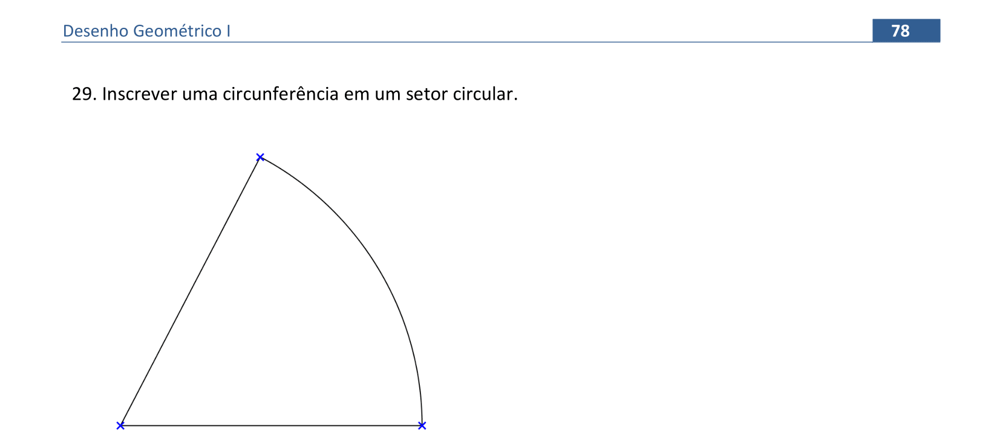
  
<a href="#parte6" class="topo">voltar ao topo</a>

  
Polígonos regulares: pág. 79-89

  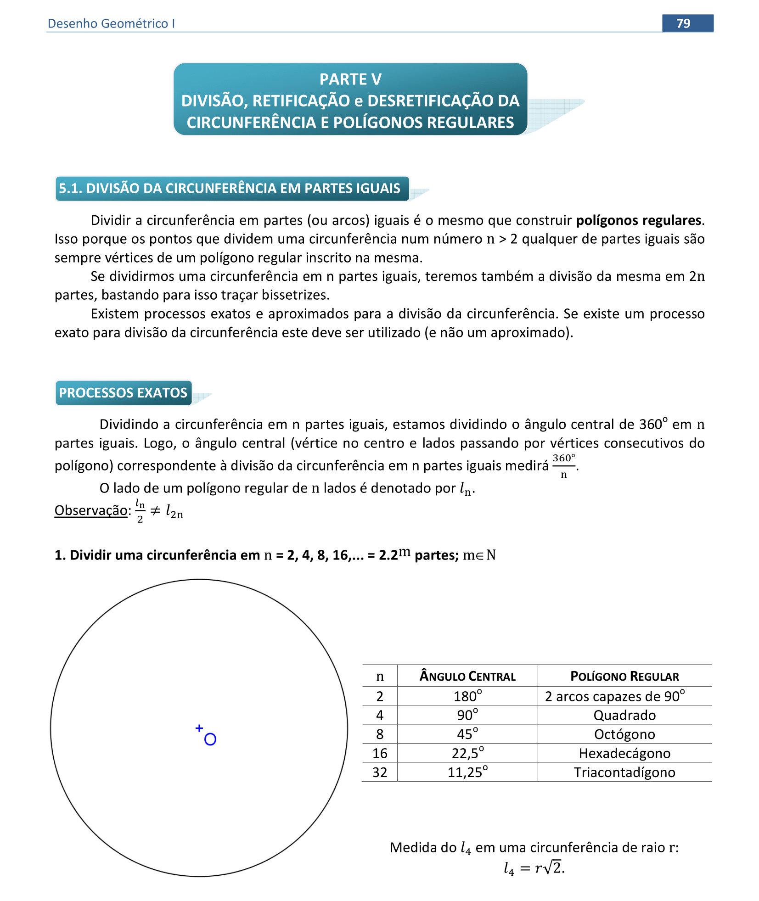
  
<a href="#parte7" class="topo">voltar ao topo</a>

  
  
<a href="#parte7" class="topo">voltar ao topo</a>

  
  
<a href="#parte7" class="topo">voltar ao topo</a>

  
  
<a href="#parte7" class="topo">voltar ao topo</a>

  
  
<a href="#parte7" class="topo">voltar ao topo</a>

  
  
<a href="#parte7" class="topo">voltar ao topo</a>

  
  
<a href="#parte7" class="topo">voltar ao topo</a>

  
  
<a href="#parte7" class="topo">voltar ao topo</a>

  
  
<a href="#parte7" class="topo">voltar ao topo</a>

  
  
<a href="#parte7" class="topo">voltar ao topo</a>

  
  
<a href="#parte7" class="topo">voltar ao topo</a>

  
Retificação de circunferência: pág. 89-93

  
  
<a href="#parte8" class="topo">voltar ao topo</a>

  
  
<a href="#parte8" class="topo">voltar ao topo</a>

  
  
<a href="#parte8" class="topo">voltar ao topo</a>

  
  
<a href="#parte8" class="topo">voltar ao topo</a>

  
  
<a href="#parte8" class="topo">voltar ao topo</a>

  
Equivalência de áreas: pág. 94-103

  
  
<a href="#parte9" class="topo">voltar ao topo</a>

  
  
<a href="#parte9" class="topo">voltar ao topo</a>

  
  
<a href="#parte9" class="topo">voltar ao topo</a>

  
  
<a href="#parte9" class="topo">voltar ao topo</a>

  
  
<a href="#parte9" class="topo">voltar ao topo</a>

  
  
<a href="#parte9" class="topo">voltar ao topo</a>

  
  
<a href="#parte9" class="topo">voltar ao topo</a>

  
  
<a href="#parte9" class="topo">voltar ao topo</a>

  
  
<a href="#parte9" class="topo">voltar ao topo</a>

  
  
<a href="#parte9" class="topo">voltar ao topo</a>

<h4>página desenvolvida por:</h4> 

Paulo Henrique Siqueira
  

<b>contato:</b> paulohscwb@gmail.com 

<h4>O desenvolvimento deste material de construções geométricas faz parte do Grupo de Estudos em Expressão Gráfica (GEEGRAF) da Universidade Federal do Paraná (UFPR)</h4>  

 Desenho Geométrico de <a xmlns:cc="http://creativecommons.org/ns#" href="https://paulohscwb.github.io/desenho-geometrico/" property="cc:attributionName" rel="cc:attributionURL">Paulo Henrique Siqueira</a> está licenciado com uma Licença <a rel="license" href="http://creativecommons.org/licenses/by-nc/4.0/">Creative Commons - Atribuição-NãoComercial 4.0 Internacional</a>.

<h4>Como citar este trabalho:</h4> 

Siqueira, P.H., "Desenho Geométrico". Disponível em: <https://paulohscwb.github.io/desenho-geometrico/>, Setembro de 2020.

<h4>Referências:</h4>
<ol>
	<li></li>
	<li></li>
	<li></li>
<ol>
