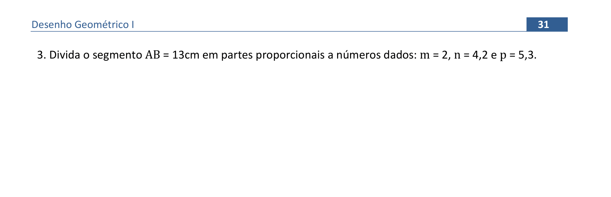
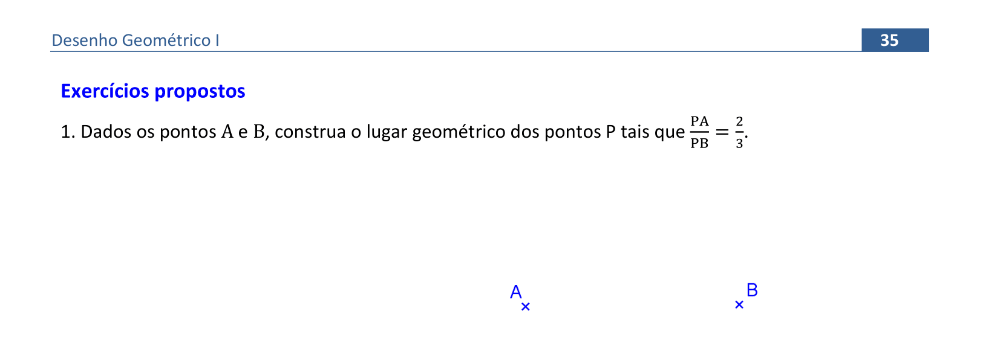
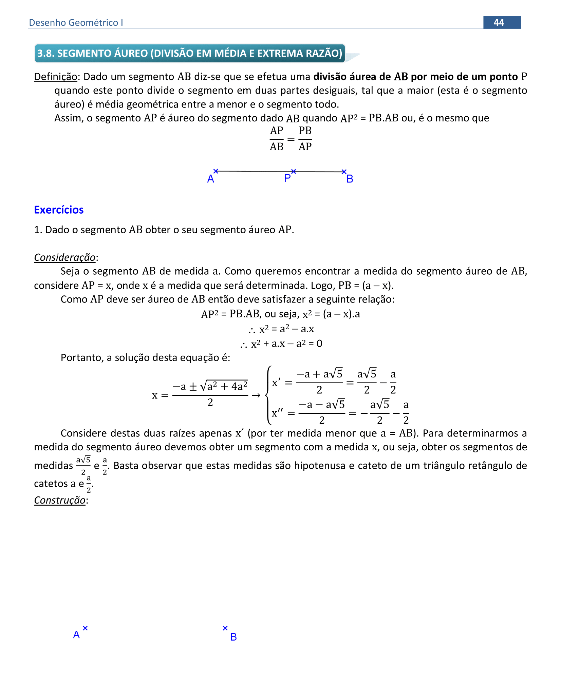
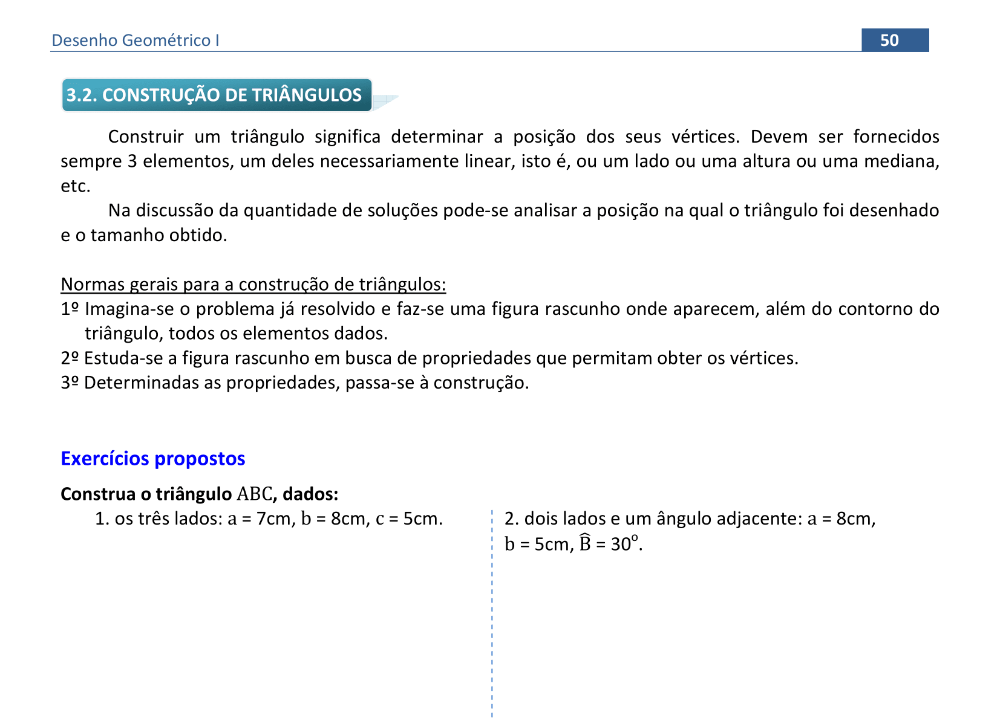
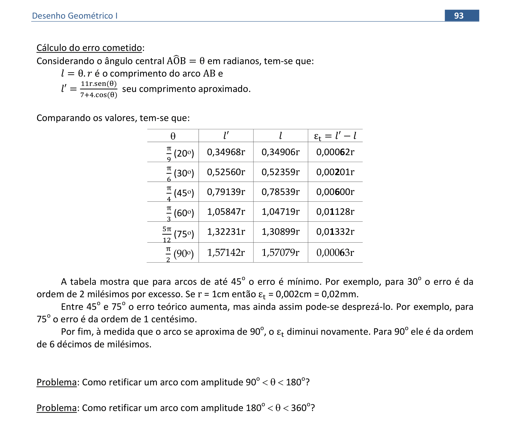

<head>
<link rel="stylesheet" href="imagens/style.css">
</head>

<h2 id="inicio">Construções Geométricas</h2>

Este site contém os procedimentos para construções geométricas usadas na disciplina de Desenho Geométrico

A apostila está disponível no link: <a href="http://www.exatas.ufpr.br/portal/degraf_paulo/wp-content/uploads/sites/4/2014/09/apos_dg.pdf" target="_blank">apostila de Desenho Geométrico</a>

  
Circunferência e Mediatriz: pág. 1-11

   
   
<a href="#parte1" class="topo">voltar ao topo</a>

   
   

&#x1f4cf; &#x1f4d0; Construção

	
Utilizaremos o compasso para construir a primeira circunferência. Lembre-se sempre de deixá-lo com o grafite apontado para desenhar com maior precisão.

	  <ul class="slider">
		  <li>
			   <input type="radio" id="001" name="sl" checked>
			   <label for="001"></label>
			   
			   <figcaption>Considerado um ponto <b>O</b> e a medida <b>r</b>, vamos construir a circunferência de centro em <b>O</b> e raio <b>r</b>.</figcaption>
		   </li>
		   <li>
			   <input type="radio" id="002" name="sl">
			   <label for="002"></label>
			   
			   <figcaption>Usando o compasso, colocamos a ponta seca em uma extremidade e o grafite na outra extremidade de <b>r</b>. Desta forma, "pegamos" a medida <b>r</b> e...</figcaption>
		   </li>
		   <li>
			   <input type="radio" id="003" name="sl">
			   <label for="003"></label>
			   
			   <figcaption>... com a ponta seca em <b>O</b>, construímos a circunferência com raio <b>r</b>.</figcaption>
		   </li>
		   <li>
			   <input type="radio" id="004" name="sl">
			   <label for="004"></label>
			   
			   <figcaption>Qualquer ponto <b>P</b> pertencente à <b>Circunf(O,r)</b> tem a distância fixa <b>r</b> até o ponto fixo <b>O</b>.</figcaption>
		   </li>
		</ul>
		
  

  
  

&#x1f4cf; &#x1f4d0; Resolução

	
Utilizaremos o conceito de lugar geométrico para fazer esta construção. Usaremos o compasso como instrumento auxiliar.

	  <ul class="slider">
		  <li>
			   <input type="radio" id="005" name="sl" checked>
			   <label for="005"></label>
			   
			   <figcaption>Como a distância de <b>P</b> até <b>X</b> é igual a <b>d</b>, vamos construir a circunferência de centro em <b>P</b> e raio <b>d</b>. Logo, podemos usar o compasso com a ponta seca em uma extremidade de <b>d</b> e o grafite na outra extremidade para "pegarmos" a medida <b>d</b>.</figcaption>
		   </li>
		   <li>
			   <input type="radio" id="006" name="sl">
			   <label for="006"></label>
			   
			   <figcaption>Com a ponta seca em <b>P</b>, construímos a <b>Circunf(P,d)</b>, que é o lugar geométrico de todos os pontos com distância <b>d</b> até o ponto <b>P</b>.</figcaption>
		   </li>
		   <li>
			   <input type="radio" id="007" name="sl">
			   <label for="007"></label>
			   
			   <figcaption>Como o ponto <b>X</b> está na reta <b>t</b>, teremos duas soluções para este problema, encontradas na interseção da <b>Circunf(P,d)</b> com a reta <b>t</b>.</figcaption>
		   </li>
		</ul>
		
  

  
<a href="#parte1" class="topo">voltar ao topo</a>

  
  

&#x1f4cf; &#x1f4d0; Resolução

	
Utilizaremos o conceito de lugar geométrico para resolver este problema. Usaremos o compasso como instrumento auxiliar.

	  <ul class="slider">
		  <li>
			   <input type="radio" id="008" name="sl" checked>
			   <label for="008"></label>
			   
			   <figcaption>Como a distância de <b>X</b> até <b>A</b> é igual a <b>m</b>, vamos construir a circunferência de centro em <b>A</b> e raio <b>m</b>. Logo, podemos usar o compasso com a ponta seca em uma extremidade de <b>m</b> e o grafite na outra extremidade para "pegarmos" a medida <b>m</b>.</figcaption>
		   </li>
		   <li>
			   <input type="radio" id="009" name="sl">
			   <label for="009"></label>
			   
			   <figcaption>Com a ponta seca em <b>A</b>, construímos a <b>Circunf(A,m)</b>, que é o lugar geométrico de todos os pontos com distância <b>m</b> até o ponto <b>A</b>.</figcaption>
		   </li>
		   <li>
			   <input type="radio" id="010" name="sl">
			   <label for="010"></label>
			   
			   <figcaption>Usando o mesmo raciocínio, "pegamos" a distância <b>n</b> com o compasso...</figcaption>
		   </li>
		   <li>
			   <input type="radio" id="011" name="sl">
			   <label for="011"></label>
			   
			   <figcaption>... e construímos a <b>Circunf(B,n)</b>, que é o lugar geométrico dos pontos com distância <b>n</b> até o ponto <b>B</b>.</figcaption>
		   </li>
		   <li>
			   <input type="radio" id="012" name="sl">
			   <label for="012"></label>
			   
			   <figcaption>Temos duas soluções, encontradas nas interseções das circunferências construídas.</figcaption>
		   </li>
		</ul>
		
  

  
  

&#x1f4cf; &#x1f4d0; Resolução

	
Utilizaremos o conceito de lugar geométrico para fazer a construção deste triângulo. Usaremos a régua e o compasso como instrumentos auxiliares.

	  <ul class="slider">
		  <li>
			   <input type="radio" id="013" name="sl" checked>
			   <label for="013"></label>
			   
			   <figcaption>Vamos imaginar o triângulo <b>ABC</b> construído.</figcaption>
		   </li>
		   <li>
			   <input type="radio" id="014" name="sl">
			   <label for="014"></label>
			   
			   <figcaption>Por convenção, vamos nomear os lados opostos aos vértices com as mesmas letras, porém, minúsculas. Por exemplo, o lado <b>BC</b>, oposto ao vértice <b>A</b>, terá o nome <b>a</b>.</figcaption>
		   </li>
		   <li>
			   <input type="radio" id="015" name="sl">
			   <label for="015"></label>
			   
			   <figcaption>Vamos começar construindo uma reta qualquer <b>r</b>, e escolhendo um ponto <b>B</b> sobre esta reta.</figcaption>
		   </li>
		   <li>
			   <input type="radio" id="016" name="sl">
			   <label for="016"></label>
			   
			   <figcaption>Usando o compasso, vamos "pegar" a medida de um dos lados com extreminade <b>B</b>: neste caso, o lado <b>c</b>.</figcaption>
		   </li>
		   <li>
			   <input type="radio" id="017" name="sl">
			   <label for="017"></label>
			   
			   <figcaption>Com centro em <b>B</b>, desenhamos um pequeno arco que serve apenas para transferir a medida <b>c</b> para a reta <b>r</b>. Logo, encontramos o vértice <b>A</b> do triângulo.</figcaption>
		   </li>
		   <li>
			   <input type="radio" id="018" name="sl">
			   <label for="018"></label>
			   
			   <figcaption>Agora podemos "pegar" as outra medidas dos lados com o compasso. Primeiro, vamos "pegar" o lado <b>a</b>...</figcaption>
		   </li>
		   <li>
			   <input type="radio" id="019" name="sl">
			   <label for="019"></label>
			   
			   <figcaption>... e construir a <b>Circunf(B,a)</b>, pois a medida <b>a</b> está no lado oposto do vértice <b>A</b>.</figcaption>
		   </li>
		   <li>
			   <input type="radio" id="020" name="sl">
			   <label for="020"></label>
			   
			   <figcaption>Por último, "pegamos" com o compasso a medida do lado que falta: <b>b</b>.</figcaption>
		   </li>
		   <li>
			   <input type="radio" id="021" name="sl">
			   <label for="021"></label>
			   
			   <figcaption>Assim, podemos construir a <b>Circunf(A,b)</b>.</figcaption>
		   </li>
		   <li>
			   <input type="radio" id="022" name="sl">
			   <label for="022"></label>
			   
			   <figcaption>Nas interseções das circunferências construídas, podemos escolher o vértice <b>C</b> e "passar a limpo" o triângulo <b>ABC</b> unindo as extremidades <b>A</b> com <b>C</b> e <b>B</b> com <b>C</b>. O triângulo <b>ABC'</b> pode ser desenhado com linhas tracejadas.</figcaption>
		   </li>
		</ul>
		
  

  
  
<a href="#parte1" class="topo">voltar ao topo</a>

  
  

&#x1f4cf; &#x1f4d0; Resolução

	
Utilizaremos o conceito de lugar geométrico para fazer esta construção. O compasso será usado como instrumento auxiliar.

	  <ul class="slider">
		  <li>
			   <input type="radio" id="023" name="sl" checked>
			   <label for="023"></label>
			   
			   <figcaption>Como a circunferência procurada passar pelos pontos <b>A</b> e <b>B</b>, as distâncias entre o centro <b>O</b> e os pontos <b>A</b> e <b>B</b> medem o raio <b>r</b>. Logo, podemos "pegar" a medida <b>r</b> com o compasso...</figcaption>
		   </li>
		   <li>
			   <input type="radio" id="024" name="sl">
			   <label for="024"></label>
			   
			   <figcaption>... e construir a <b>Circunf(A,r)</b>, que é o primeiro lugar geométrico do centro <b>O</b>.</figcaption>
		   </li>
		   <li>
			   <input type="radio" id="026" name="sl">
			   <label for="026"></label>
			   
			   <figcaption>Com o mesmo raio, construímos a <b>Circunf(B,r)</b>, que é o segundo lugar geométrico de <b>O</b>. Teremos duas soluções: <b>O</b> e <b>O'</b>.</figcaption>
		   </li>
		   <li>
			   <input type="radio" id="027" name="sl">
			   <label for="027"></label>
			   
			   <figcaption>Com a ponta seca em <b>O</b>, construímos a <b>Circunf(O,r)</b>, que passa por <b>A</b> e <b>B</b>.</figcaption>
		   </li>
		   <li>
			   <input type="radio" id="028" name="sl">
			   <label for="028"></label>
			   
			   <figcaption>E com a ponta seca em <b>O'</b>, desenhamos a <b>Circunf(O',r)</b>, que passa por <b>A</b> e <b>B</b>.</figcaption>
		   </li>
		   <li>
			   <input type="radio" id="029" name="sl">
			   <label for="029"></label>
			   
			   <figcaption>Escolhemos uma solução para ficar com linha contínua e a outra com linhas tracejadas.</figcaption>
		   </li>
		</ul>
		
  

  
  

&#x1f4cf; &#x1f4d0; Solução

	
Usando o conceito do lugar geométrico circunferência, você consegue resolver este exercício proposto.

	
	<figcaption>Encontramos duas soluções na resolução deste problema.</figcaption>
  

  
  

&#x1f4cf; &#x1f4d0; Solução

	
Use o conceito do lugar geométrico circunferência para resolver este exercício.

	
	<figcaption>Encontramos duas soluções na resolução deste problema: os triângulos <b>ABC</b> e <b>A'BC</b>.</figcaption>
  

  
<a href="#parte1" class="topo">voltar ao topo</a>

  
  

&#x1f4cf; &#x1f4d0; Solução

	
Usando o conceito do lugar geométrico circunferência, você consegue resolver este exercício.

	
	<figcaption>Como as laterais do triângulo isósceles medem <b>d</b>, usamos uma circunferência para encontrar os vértices <b>B</b> e <b>C</b>.</figcaption>
  

  
  

&#x1f4cf; &#x1f4d0; Solução

	
Use o conceito do lugar geométrico circunferência para resolver este exercício.

	
	<figcaption>Lembrando que o lado <b>b</b> é o lado <b>AC</b> do triângulo, usamos a circunferência com centro em <b>C</b> e raio <b>b</b>.</figcaption>
  

  
  

&#x1f4cf; &#x1f4d0; Solução

	
Usando o conceito do lugar geométrico circunferência, você consegue resolver este exercício.

	
	<figcaption>Como a circunferência passa por <b>P</b>, construímos a circunferência de centro em <b>P</b> e raio <b>r</b> para encontrar o centro da solução.</figcaption>
  

  
<a href="#parte1" class="topo">voltar ao topo</a>

  
  

&#x1f4cf; &#x1f4d0; Resolução

	
Utilizaremos o conceito de lugar geométrico para fazer esta construção. Usaremos a régua e o compasso como instrumentos auxiliares.

	  <ul class="slider">
		  <li>
			   <input type="radio" id="030" name="sl" checked>
			   <label for="030"></label>
			   
			   <figcaption>Lembrando da propriedade: se duas circunferências são tangentes em um ponto <b>T</b>, elas admitem a reta tangente <b>t</b> comum; como a reta tangente forma 90&deg; com o raio em <b>T</b>, os raios <b>OT</b> e <b>AT</b> formam 180&deg;, ou seja, <b>O</b>, <b>T</b> e <b>A</b> serão colineares.</figcaption>
		   </li>
		   <li>
			   <input type="radio" id="031" name="sl">
			   <label for="031"></label>
			   
			   <figcaption>Usando a régua ou um dos esquadros, podemos prolongar o segmento <b>OT</b> e usar o compasso para "pegar" a medida <b>r</b>.</figcaption>
		   </li>
		   <li>
			   <input type="radio" id="032" name="sl">
			   <label for="032"></label>
			   
			   <figcaption>Com o centro em <b>T</b>, construímos um arco para marcar o centro <b>A</b> na reta <b>OT</b>.</figcaption>
		   </li>
		   <li>
			   <input type="radio" id="033" name="sl">
			   <label for="033"></label>
			   
			   <figcaption>Teremos uma solução interna à circunferência <b>&lambda;</b>; logo, podemos marcar também o ponto <b>A'</b> sobre o raio <b>OT</b>.</figcaption>
		   </li>
		   <li>
			   <input type="radio" id="034" name="sl">
			   <label for="034"></label>
			   
			   <figcaption>Com centro em <b>A</b>, construímos a <b>Circunf(A,r)</b>, que é a primeira solução.</figcaption>
		   </li>
		   <li>
			   <input type="radio" id="035" name="sl">
			   <label for="035"></label>
			   
			   <figcaption>E com centro em <b>A'</b>, construímos a <b>Circunf(A',r)</b>, que é a segunda solução.</figcaption>
		   </li>
		   <li>
			   <input type="radio" id="036" name="sl">
			   <label for="036"></label>
			   
			   <figcaption>Estas são as duas soluções do problema proposto.</figcaption>
		   </li>
		</ul>
		
  

  
  

&#x1f4cf; &#x1f4d0; Construção

	
Neste segundo lugar geométrico, usamos a régua e o compasso como instrumentos auxiliares para sua construção.

	  <ul class="slider">
		  <li>
			   <input type="radio" id="037" name="sl" checked>
			   <label for="037"></label>
			   
			   <figcaption>Para encontrar a mediatriz de <b>AB</b>, construímos os arcos de circunferências de centros <b>A</b> e <b>B</b>, com a mesma medida dos raios. Esta medida precisa ser maior do que a metade de <b>AB</b>. As interseções destes arcos definem a reta <b>XX'</b> que é a mediatriz de <b>AB</b>. Usamos a notação <b>medAB</b>.</figcaption>
		   </li>
		   <li>
			   <input type="radio" id="038" name="sl">
			   <label for="038"></label>
			   
			   <figcaption>Como os raios são iguais à uma medida <b>d</b>, temos a formação do <b>&#9651;AXB</b> isósceles de base <b>d</b>.</figcaption>
		   </li>
		   <li>
			   <input type="radio" id="039" name="sl">
			   <label for="039"></label>
			   
			   <figcaption>Obtemos assim o ponto médio <b>M</b> de <b>AB</b>, e os <b>&#9651;AMX</b> e <b>&#9651;BMX</b> congruentes.</figcaption>
		   </li>
		   <li>
			   <input type="radio" id="040" name="sl">
			   <label for="040"></label>
			   
			   <figcaption>Logo, temos que <b>&angsph;AMX</b> = 90&deg;. Portanto, a mediatriz passa pelo ponto médio e forma 90&deg; com este segmento.</figcaption>
		   </li>
		</ul>
		
  

  
<a href="#parte1" class="topo">voltar ao topo</a>

  
  

&#x1f4cf; &#x1f4d0; Resolução

	
Utilizaremos a régua e o compasso como instrumentos auxiliares para sua construção da mediatriz.

	  <ul class="slider">
		  <li>
			   <input type="radio" id="041" name="sl" checked>
			   <label for="041"></label>
			   
			   <figcaption>Vamos construir um arco de circunferência com centro em <b>A</b> e a medida do raio maior do que a metade de <b>AB</b>.</figcaption>
		   </li>
		   <li>
			   <input type="radio" id="042" name="sl">
			   <label for="042"></label>
			   
			   <figcaption>Com a mesma medida do raio do arco anterior, construímos o arco com centro em <b>B</b>.</figcaption>
		   </li>
		   <li>
			   <input type="radio" id="043" name="sl">
			   <label for="043"></label>
			   
			   <figcaption>Usando a régua ou um dos esquadros, construímos a reta que passa pelos pontos de interseção dos arcos construídos <b>P</b> e <b>P'</b>. Esta é a mediatriz de AB, denotada por <b>medAB</b></figcaption>
		   </li>
		   <li>
			   <input type="radio" id="044" name="sl">
			   <label for="044"></label>
			   
			   <figcaption>Quando o segmento <b>AB</b> estiver próximo da margem da folha, podemos construir um dos arcos, com centro em <b>A</b> e raio maior do que a metade de <b>AB</b>.</figcaption>
		   </li>
		   <li>
			   <input type="radio" id="045" name="sl">
			   <label for="045"></label>
			   
			   <figcaption>Com a mesma medida do raio usado em <b>A</b>, construímos o arco com centro em <b>B</b>. O ponto de interseção <b>Q</b> pertence à mediatriz procurada. Porém, precisamos de mais um ponto para determinar a mediatriz.</figcaption>
		   </li>
		   <li>
			   <input type="radio" id="046" name="sl">
			   <label for="046"></label>
			   
			   <figcaption>Logo, podemos construir dois outros arcos, usando uma outra medida.</figcaption>
		   </li>
		   <li>
			   <input type="radio" id="047" name="sl">
			   <label for="047"></label>
			   
			   <figcaption>Usando a mesma medida, construímos o arco com centro em <b>B</b>.</figcaption>
		   </li>
		   <li>
			   <input type="radio" id="048" name="sl">
			   <label for="048"></label>
			   
			   <figcaption>A mediatriz pode ser construída com a régua ou um esquadro, unindo os pontos de interseção do arcos <b>Q</b> e <b>Q'</b>.</figcaption>
		   </li>
		   <li>
			   <input type="radio" id="049" name="sl">
			   <label for="049"></label>
			   
			   <figcaption>A mediatriz de <b>AB</b> está construída com o segmento próximo da margem da folha.</figcaption>
		   </li>
		</ul>
		
  

  
  

&#x1f4cf; &#x1f4d0; Solução

	
Constuindo a mediatriz de <b>AB</b>, determinamos o ponto médio deste segmento.

	
	<figcaption>Utilize os mesmos passos usados na construção anterior.</figcaption>
  

  
  

&#x1f4cf; &#x1f4d0; Resolução

	
Usaremos a régua e o compasso como instrumentos auxiliares nesta construção.

	  <ul class="slider">
		  <li>
			   <input type="radio" id="051" name="sl" checked>
			   <label for="051"></label>
			   
			   <figcaption>Como o triângulo é isósceles de base <b>BC</b>, o vértice <b>A</b> é equidistante dos vértices <b>B</b> e <b>C</b>: logo, <b>A</b> pertence à mediatriz de <b>BC</b>. Com uma medida maior do que a metade de <b>BC</b>, construímos um arco com centro em <b>C</b>...</figcaption>
		   </li>
		   <li>
			   <input type="radio" id="052" name="sl">
			   <label for="052"></label>
			   
			   <figcaption>... e outro com mesmo raio e centro em <b>B</b>. As interseções definem os pontos <b>P</b> e <b>P'</b>.</figcaption>
		   </li>
		   <li>
			   <input type="radio" id="053" name="sl">
			   <label for="053"></label>
			   
			   <figcaption>Usando a régua ou um dos esquadros, construa a mediatriz de <b>BC</b> unindo <b>P</b> e <b>P'</b>.</figcaption>
		   </li>
		   <li>
			   <input type="radio" id="054" name="sl">
			   <label for="054"></label>
			   
			   <figcaption>Como o vértice <b>A</b> pertence à circunferência <b>&lambda;</b>, as interseções de <b>&lambda;</b> com a <b>medBC</b> definem os vértices do triângulo isósceles.</figcaption>
		   </li>
		   <li>
			   <input type="radio" id="055" name="sl">
			   <label for="055"></label>
			   
			   <figcaption>Escolha uma solução para construir o triângulo com linhas contínuas e o outro com linhas tracejadas.</figcaption>
		   </li>
		</ul>
		
  

  
<a href="#parte1" class="topo">voltar ao topo</a>

  
  

&#x1f4cf; &#x1f4d0; Resolução

	
Vamos usar a régua e o compasso como instrumentos auxiliares para resolver este problema.

	  <ul class="slider">
		  <li>
			   <input type="radio" id="056" name="sl" checked>
			   <label for="056"></label>
			   
			   <figcaption>Temos os três pontos pertencentes à circunferência de centro <b>O</b>.</figcaption>
		   </li>
		   <li>
			   <input type="radio" id="057" name="sl">
			   <label for="057"></label>
			   
			   <figcaption>As distâncias entre os pontos dados e o centro é a mesma: o raio <b>r</b> da circunferência. Logo, podemos construir duas mediatrizes para encontrar o centro.</figcaption>
		   </li>
		   <li>
			   <input type="radio" id="058" name="sl">
			   <label for="058"></label>
			   
			   <figcaption>Com o centro em <b>A</b>, construiremos um arco com medida maior do que <b>AC</b> para encontrar a <b>medAC</b>.</figcaption>
		   </li>
		   <li>
			   <input type="radio" id="059" name="sl">
			   <label for="059"></label>
			   
			   <figcaption>Com o centro em <b>C</b>, construimos um arco com mesmo raio do primeiro, encontrando as interseções <b>P</b> e <b>P'</b>.</figcaption>
		   </li>
		   <li>
			   <input type="radio" id="060" name="sl">
			   <label for="060"></label>
			   
			   <figcaption>Usando a régua ou um dos esquadros, construímos a mediatriz de <b>AC</b>, que é o primeiro lugar geométrico do centro <b>O</b>.</figcaption>
		   </li>
		   <li>
			   <input type="radio" id="061" name="sl">
			   <label for="061"></label>
			   
			   <figcaption>Usando a construção similar, construímos a <b>medAB</b>, que é o segundo lugar geométrico de <b>O</b>.</figcaption>
		   </li>
		   <li>
			   <input type="radio" id="062" name="sl">
			   <label for="062"></label>
			   
			   <figcaption>Na interseção das duas mediatrizes, temos o centro da circunferência que passa pelos 3 pontos. Não precisamos construir a mediatriz do terceiro segmento, <b>BC</b>, pois basta a interseção de duas retas para determinar o ponto <b>O</b>. Com centro em <b>O</b>, podemos abrir o compasso até qualquer um dos três pontos...</figcaption>
		   </li>
		   <li>
			   <input type="radio" id="063" name="sl">
			   <label for="063"></label>
			   
			   <figcaption>... e construir a circunferência que passa pelos 3 pontos.</figcaption>
		   </li>
		   <li>
			   <input type="radio" id="064" name="sl">
			   <label for="064"></label>
			   
			   <figcaption>Esta é a única solução deste problema.</figcaption>
		   </li>
		</ul>
		
  

  
  

&#x1f4cf; &#x1f4d0; Resolução

	
Vamos usar a régua, o compasso e os esquadros como instrumentos auxiliares para resolver este problema. Vamos começar usando a régua e o compasso.

	  <ul class="slider">
		  <li>
			   <input type="radio" id="065" name="sl" checked>
			   <label for="065"></label>
			   
			   <figcaption>Vamos usar o fato do que a mediatriz de um segmento é perpendicular ao segmento. Construa então um arco de circunferência de centro <b>P</b> e raio de medida qualquer, determinando o ponto <b>A</b> sobre a reta <b>r</b>, no lado direito.</figcaption>
		   </li>
		   <li>
			   <input type="radio" id="066" name="sl">
			   <label for="066"></label>
			   
			   <figcaption>Com a mesma medida do raio do arco usado para encontrar <b>A</b>, encontre do lado esquerdo do ponto <b>P</b> o ponto <b>B</b>.</figcaption>
		   </li>
		   <li>
			   <input type="radio" id="067" name="sl">
			   <label for="067"></label>
			   
			   <figcaption>É como se <b>P</b> fosse o ponto médio de <b>AB</b>. Então vamos encontrar a <b>medAB</b>: com centro em <b>A</b>, construa um arco com raio de medida maior do que <b>AP</b> e...</figcaption>
		   </li>
		   <li>
			   <input type="radio" id="068" name="sl">
			   <label for="068"></label>
			   
			   <figcaption>... com centro em <b>B</b>, construa um arco com mesmo raio. A interseção destes arcos é o ponto <b>C</b>, que pertence à <b>medAB</b>.</figcaption>
		   </li>
		   <li>
			   <input type="radio" id="069" name="sl">
			   <label for="069"></label>
			   
			   <figcaption>Logo, podemos construir com a régua ou um dos esquadros a reta <b>PC</b>.</figcaption>
		   </li>
		   <li>
			   <input type="radio" id="070" name="sl">
			   <label for="070"></label>
			   
			   <figcaption>Esta reta é perpendicular à reta <b>r</b>, pois é a <b>medAB</b>. Agora determine um ponto <b>P'</b> sobre a reta <b>r</b> para construirmos a perpendicular a esta reta que passa por <b>P'</b> com os esquadros.</figcaption>
		   </li>
		   <li>
			   <input type="radio" id="071" name="sl">
			   <label for="071"></label>
			   
			   <figcaption>Neste exemplo, vamos usar o esquadro de 45 alinhando um cateto com a reta. Coloque na hipotenusa deste esquadro o outro esquadro ou a régua como apoio.</figcaption>
		   </li>
		   <li>
			   <input type="radio" id="072" name="sl">
			   <label for="072"></label>
			   
			   <figcaption>Deixando fixo o esquadro de 60, deslize o esquadro de 45 até chegar em <b>P'</b>. Use o outro cateto do esquadro de 45 para construir a reta perpendicular.</figcaption>
		   </li>
		   <li>
			   <input type="radio" id="073" name="sl">
			   <label for="073"></label>
			   
			   <figcaption>Esta é a solução do problema com o uso de esquadros. Você pode usar o esquadro de 60 alinhado e o outro fixo. O importante é lembrar de apoiar sempre a hipotenusa deste esquadro que irá deslizar com o outro esquadro.</figcaption>
		   </li>
		</ul>
		
  

  
  

&#x1f4cf; &#x1f4d0; Resolução

	
Vamos usar a régua, o compasso e os esquadros como instrumentos auxiliares para resolver este problema. Vamos começar usando a régua e o compasso.

	  <ul class="slider">
		  <li>
			   <input type="radio" id="074" name="sl" checked>
			   <label for="074"></label>
			   
			   <figcaption>Neste item, vamos novamente usar o fato do que a mediatriz de um segmento é perpendicular ao segmento. Construa então um arco de circunferência com raio de medida qualquer, que intercepte a reta <b>r</b> nos pontos <b>A</b> e <b>B</b>.</figcaption>
		   </li>
		   <li>
			   <input type="radio" id="075" name="sl">
			   <label for="075"></label>
			   
			   <figcaption>É como se <b>P</b> fosse um ponto qualquer da <b>medAB</b>. Então vamos encontrar a <b>medAB</b>: com centro em <b>B</b>, construa um arco com raio de medida maior do que a metade de <b>AB</b> e...</figcaption>
		   </li>
		   <li>
			   <input type="radio" id="076" name="sl">
			   <label for="076"></label>
			   
			   <figcaption>... com centro em <b>A</b>, construa um arco com mesmo raio. A interseção destes arcos é o ponto <b>C</b>, que pertence à <b>medAB</b>.</figcaption>
		   </li>
		   <li>
			   <input type="radio" id="077" name="sl">
			   <label for="077"></label>
			   
			   <figcaption>Logo, podemos construir com a régua ou um dos esquadros a reta <b>PC</b>.</figcaption>
		   </li>
		   <li>
			   <input type="radio" id="078" name="sl">
			   <label for="078"></label>
			   
			   <figcaption>Esta reta é perpendicular à reta <b>r</b>, pois é a <b>medAB</b>. Agora determine um ponto <b>P'</b> não pertencente à reta <b>r</b> para construirmos a perpendicular a esta reta que passa por <b>P'</b> com os esquadros.</figcaption>
		   </li>
		   <li>
			   <input type="radio" id="079" name="sl">
			   <label for="079"></label>
			   
			   <figcaption>Neste exemplo, vamos usar o esquadro de 60 alinhando o cateto maior com a reta. Coloque na hipotenusa deste esquadro o outro esquadro ou a régua como apoio.</figcaption>
		   </li>
		   <li>
			   <input type="radio" id="080" name="sl">
			   <label for="080"></label>
			   
			   <figcaption>Deixando fixo o esquadro de 45, deslize o esquadro de 60 até chegar em <b>P'</b>. Use o outro cateto do esquadro de 60 para construir a reta perpendicular.</figcaption>
		   </li>
		   <li>
			   <input type="radio" id="081" name="sl">
			   <label for="081"></label>
			   
			   <figcaption>Esta é a solução do problema com o uso de esquadros. Você pode usar o esquadro de 45 alinhado e o outro fixo. O importante é lembrar de apoiar sempre a hipotenusa deste esquadro que irá deslizar com o outro esquadro.</figcaption>
		   </li>
		</ul>
		
  

  
<a href="#parte1" class="topo">voltar ao topo</a>

  
  

&#x1f4cf; &#x1f4d0; Solução

	
Constuindo a mediatriz de <b>AB</b>, determinamos o ponto médio <b>M</b>deste segmento.

	
	<figcaption>Usando as mediatrizes das metades do segmento <b>AB</b>, dividimos este segmento em 4 partes iguais.</figcaption>
  

  
  

&#x1f4cf; &#x1f4d0; Solução

	
Como <b>P</b> é esquidistante de <b>B</b> e de <b>C</b>, pertence à <b>medBC</b>.

	
	<figcaption></figcaption>
  

  
  

&#x1f4cf; &#x1f4d0; Solução

	
Como <b>X</b> é esquidistante de <b>A</b> e de <b>C</b>, pertence à <b>medAC</b>.

	
	<figcaption>Como a distância de <b>X</b> até <b>B</b> é igual a <b>r</b>, pertence à <b>Circunf(B,r)</b>.</figcaption>
  

  
<a href="#parte1" class="topo">voltar ao topo</a>

  
  

&#x1f4cf; &#x1f4d0; Solução

	
Como <b>X</b> é esquidistante de <b>A</b> e de <b>B</b>, pertence à <b>medAB</b>.

	
	<figcaption>Como <b>X</b> é esquidistante de <b>C</b> e de <b>D</b>, pertence à <b>medCD</b>.</figcaption>
  

  
  

&#x1f4cf; &#x1f4d0; Solução

	
Neste caso, o centro será o ponto médio do diâmetro <b>AB</b>.

	
	<figcaption></figcaption>
  

  
  

&#x1f4cf; &#x1f4d0; Solução

	
Como a circunferência procurada passa por <b>P</b> e <b>Q</b>, seu centro pertence à <b>medPQ</b>.

	
	<figcaption>Depois de achar o centro <b>O</b>, o raio será <b>OP = OQ</b>.</figcaption>
  

  
<a href="#parte1" class="topo">voltar ao topo</a>

  
  

&#x1f4cf; &#x1f4d0; Resolução

	
Vamos usar a régua e o compasso como instrumentos auxiliares para resolver este problema.

	  <ul class="slider">
		  <li>
			   <input type="radio" id="082" name="sl" checked>
			   <label for="082"></label>
			   
			   <figcaption>Podemos definir dois pontos sobre a circunferência. Se construirmos a mediatriz deste segmento, o centro estará contido nesta reta. Logo, defina o arco com centro em <b>A</b> e um raio com medida maior do que a metade de <b>AB</b>.</figcaption>
		   </li>
		   <li>
			   <input type="radio" id="083" name="sl">
			   <label for="083"></label>
			   
			   <figcaption>Com centro em <b>B</b>, construa o arco com mesma medida do raio usado em <b>A</b>. As interseções definem a  <b>medAB</b>, que contém o centro da circunferência.</figcaption>
		   </li>
		   <li>
			   <input type="radio" id="084" name="sl">
			   <label for="084"></label>
			   
			   <figcaption>Podemos escolher outro ponto da circunferência: <b>C</b>.</figcaption>
		   </li>
		   <li>
			   <input type="radio" id="085" name="sl">
			   <label for="085"></label>
			   
			   <figcaption>Construindo a mediatriz de <b>medBC</b>, temos que a interseção da <b>medAB</b> com a <b>medBC</b> será o ponto equidistante de <b>A</b>, <b>B</b> e <b>C</b>. Logo, este ponto é o centro da circunferência.</figcaption>
		   </li>
		</ul>
		
  

  
  

&#x1f4cf; &#x1f4d0; Resolução

	
Vamos usar os esquadros e o compasso como instrumentos auxiliares para resolver este problema. Como a reta <b>t</b> é tangente à circunferência de centro <b>O</b>, o raio <b>OT</b> será perpendicular a <b>t</b>.

	  <ul class="slider">
		  <li>
			   <input type="radio" id="086" name="sl" checked>
			   <label for="086"></label>
			   
			   <figcaption>Podemos construir a reta perpendicular a <b>t</b> que passa por <b>O</b> com régua e compasso ou com os esquadros. Neste exemplo, vamos usar os esquadros: alinhe um cateto do esquadro de 45 com a reta <b>t</b>, e a hipotenusa deste esquadro fica apoiada com a régua ou com outro esquadro.</figcaption>
		   </li>
		   <li>
			   <input type="radio" id="087" name="sl">
			   <label for="087"></label>
			   
			   <figcaption>Deixando fixo o esquadro de 60, deslize o esquadro de 45 até chegar em <b>O</b>. Construa a reta perpendicular usando o cateto do esquadro de 45.</figcaption>
		   </li>
		   <li>
			   <input type="radio" id="088" name="sl">
			   <label for="088"></label>
			   
			   <figcaption>O raio da circunferência procurada será <b>OT</b>. Com centro em <b>O</b> e raio <b>OT</b>, construímos a solução deste problema.</figcaption>
		   </li>
		   <li>
			   <input type="radio" id="089" name="sl">
			   <label for="089"></label>
			   
			   <figcaption>Se você preferir, pode fazer a construção da reta perpendicular a <b>t</b> que passa por <b>O</b> usando régua e compasso.</figcaption>
		   </li>
		</ul>
		
  

  
  

&#x1f4cf; &#x1f4d0; Solução

	
Problema similar ao anterior. Você pode construir a reta <b>t</b> perpendicular ao segmento <b>OT</b> usando régua e compasso, ou o par de esquadros.

	
	<figcaption></figcaption>
  

  
<a href="#parte1" class="topo">voltar ao topo</a>

  
Retas paralelas e bissetriz: pág. 12-20

  
  
<a href="#parte2" class="topo">voltar ao topo</a>

  
  
<a href="#parte2" class="topo">voltar ao topo</a>

  
  
<a href="#parte2" class="topo">voltar ao topo</a>

  
  
<a href="#parte2" class="topo">voltar ao topo</a>

  
  
<a href="#parte2" class="topo">voltar ao topo</a>

  
  
<a href="#parte2" class="topo">voltar ao topo</a>

  
  
<a href="#parte2" class="topo">voltar ao topo</a>

  
  
<a href="#parte2" class="topo">voltar ao topo</a>

  
  
<a href="#parte2" class="topo">voltar ao topo</a>

  
Arco capaz: pág. 21-29

  
  
<a href="#parte3" class="topo">voltar ao topo</a>

  
  
<a href="#parte3" class="topo">voltar ao topo</a>

  
  
<a href="#parte3" class="topo">voltar ao topo</a>

  
  
<a href="#parte3" class="topo">voltar ao topo</a>

  
  
<a href="#parte3" class="topo">voltar ao topo</a>

  
  
<a href="#parte3" class="topo">voltar ao topo</a>

  
  
<a href="#parte3" class="topo">voltar ao topo</a>

  
  
<a href="#parte3" class="topo">voltar ao topo</a>

  
  
<a href="#parte3" class="topo">voltar ao topo</a>

  
Operações com segmentos: pág. 30-48

  
  
<a href="#parte4" class="topo">voltar ao topo</a>

  
  
<a href="#parte4" class="topo">voltar ao topo</a>

  
  
<a href="#parte4" class="topo">voltar ao topo</a>

  
  
<a href="#parte4" class="topo">voltar ao topo</a>

  
  
<a href="#parte4" class="topo">voltar ao topo</a>

  
  
<a href="#parte4" class="topo">voltar ao topo</a>

  
  
<a href="#parte4" class="topo">voltar ao topo</a>

  
  
<a href="#parte4" class="topo">voltar ao topo</a>

  
  
<a href="#parte4" class="topo">voltar ao topo</a>

  
  
<a href="#parte4" class="topo">voltar ao topo</a>

  
  
<a href="#parte4" class="topo">voltar ao topo</a>

  
  
<a href="#parte4" class="topo">voltar ao topo</a>

  
  
<a href="#parte4" class="topo">voltar ao topo</a>

  
  
<a href="#parte4" class="topo">voltar ao topo</a>

  
  
<a href="#parte4" class="topo">voltar ao topo</a>

  
  
<a href="#parte4" class="topo">voltar ao topo</a>

  
  
<a href="#parte4" class="topo">voltar ao topo</a>

  
  
<a href="#parte4" class="topo">voltar ao topo</a>

  
  
<a href="#parte4" class="topo">voltar ao topo</a>

  
Triângulos e quadriláteros: pág. 49-64

  
  
<a href="#parte5" class="topo">voltar ao topo</a>

  
  
<a href="#parte5" class="topo">voltar ao topo</a>

  
  
<a href="#parte5" class="topo">voltar ao topo</a>

  
  
<a href="#parte5" class="topo">voltar ao topo</a>

  
  
<a href="#parte5" class="topo">voltar ao topo</a>

  
  
<a href="#parte5" class="topo">voltar ao topo</a>

  
  
<a href="#parte5" class="topo">voltar ao topo</a>

  
  
<a href="#parte5" class="topo">voltar ao topo</a>

  
  
<a href="#parte5" class="topo">voltar ao topo</a>

  
  
<a href="#parte5" class="topo">voltar ao topo</a>

  
  
<a href="#parte5" class="topo">voltar ao topo</a>

  
  
<a href="#parte5" class="topo">voltar ao topo</a>

  
  
<a href="#parte5" class="topo">voltar ao topo</a>

  
  
<a href="#parte5" class="topo">voltar ao topo</a>

  
  
<a href="#parte5" class="topo">voltar ao topo</a>

  
  
<a href="#parte5" class="topo">voltar ao topo</a>

  
Tangência e concordância: pág. 65-78

  
  
<a href="#parte6" class="topo">voltar ao topo</a>

  
  
<a href="#parte6" class="topo">voltar ao topo</a>

  
  
<a href="#parte6" class="topo">voltar ao topo</a>

  
  
<a href="#parte6" class="topo">voltar ao topo</a>

  
  
<a href="#parte6" class="topo">voltar ao topo</a>

  
  
<a href="#parte6" class="topo">voltar ao topo</a>

  
  
<a href="#parte6" class="topo">voltar ao topo</a>

  
  
<a href="#parte6" class="topo">voltar ao topo</a>

  
  
<a href="#parte6" class="topo">voltar ao topo</a>

  
  
<a href="#parte6" class="topo">voltar ao topo</a>

  
  
<a href="#parte6" class="topo">voltar ao topo</a>

  
  
<a href="#parte6" class="topo">voltar ao topo</a>

  
  
<a href="#parte6" class="topo">voltar ao topo</a>

  
  
<a href="#parte6" class="topo">voltar ao topo</a>

  
Polígonos regulares: pág. 79-89

  
  
<a href="#parte7" class="topo">voltar ao topo</a>

  
  
<a href="#parte7" class="topo">voltar ao topo</a>

  
  
<a href="#parte7" class="topo">voltar ao topo</a>

  
  
<a href="#parte7" class="topo">voltar ao topo</a>

  
  
<a href="#parte7" class="topo">voltar ao topo</a>

  
  
<a href="#parte7" class="topo">voltar ao topo</a>

  
  
<a href="#parte7" class="topo">voltar ao topo</a>

  
  
<a href="#parte7" class="topo">voltar ao topo</a>

  
  
<a href="#parte7" class="topo">voltar ao topo</a>

  
  
<a href="#parte7" class="topo">voltar ao topo</a>

  
  
<a href="#parte7" class="topo">voltar ao topo</a>

  
Retificação de circunferência: pág. 89-93

  
  
<a href="#parte8" class="topo">voltar ao topo</a>

  
  
<a href="#parte8" class="topo">voltar ao topo</a>

  
  
<a href="#parte8" class="topo">voltar ao topo</a>

  
  
<a href="#parte8" class="topo">voltar ao topo</a>

  
  
<a href="#parte8" class="topo">voltar ao topo</a>

  
Equivalência de áreas: pág. 94-103

  
  
<a href="#parte9" class="topo">voltar ao topo</a>

  
  
<a href="#parte9" class="topo">voltar ao topo</a>

  
  
<a href="#parte9" class="topo">voltar ao topo</a>

  
  
<a href="#parte9" class="topo">voltar ao topo</a>

  
  
<a href="#parte9" class="topo">voltar ao topo</a>

  
  
<a href="#parte9" class="topo">voltar ao topo</a>

  
  
<a href="#parte9" class="topo">voltar ao topo</a>

  
  
<a href="#parte9" class="topo">voltar ao topo</a>

  
  
<a href="#parte9" class="topo">voltar ao topo</a>

  
  
<a href="#parte9" class="topo">voltar ao topo</a>

<h4>página desenvolvida por:</h4> 

Paulo Henrique Siqueira
  

<b>contato:</b> paulohscwb@gmail.com 

<h4>O desenvolvimento deste material de construções geométricas faz parte do Grupo de Estudos em Expressão Gráfica (GEEGRAF) da Universidade Federal do Paraná (UFPR)</h4>  

 Desenho Geométrico de <a xmlns:cc="http://creativecommons.org/ns#" href="https://paulohscwb.github.io/desenho-geometrico/" property="cc:attributionName" rel="cc:attributionURL">Paulo Henrique Siqueira</a> está licenciado com uma Licença <a rel="license" href="http://creativecommons.org/licenses/by-nc/4.0/">Creative Commons - Atribuição-NãoComercial 4.0 Internacional</a>.

<h4>Como citar este trabalho:</h4> 

Siqueira, P.H., "Desenho Geométrico". Disponível em: <https://paulohscwb.github.io/desenho-geometrico/>, Setembro de 2020.

<h4>Referências:</h4>
<ol>
	<li></li>
	<li></li>
	<li></li>
<ol>