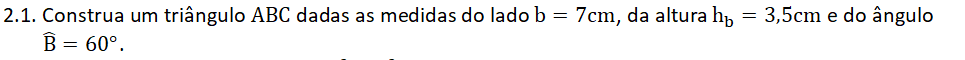
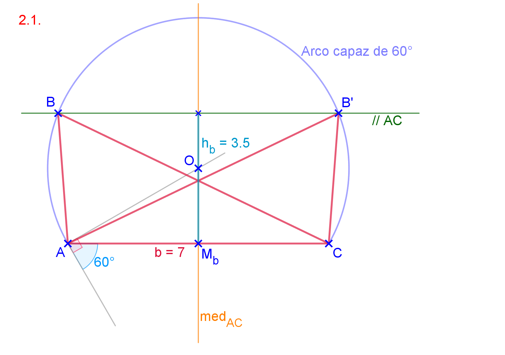
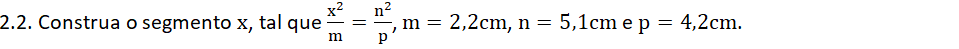
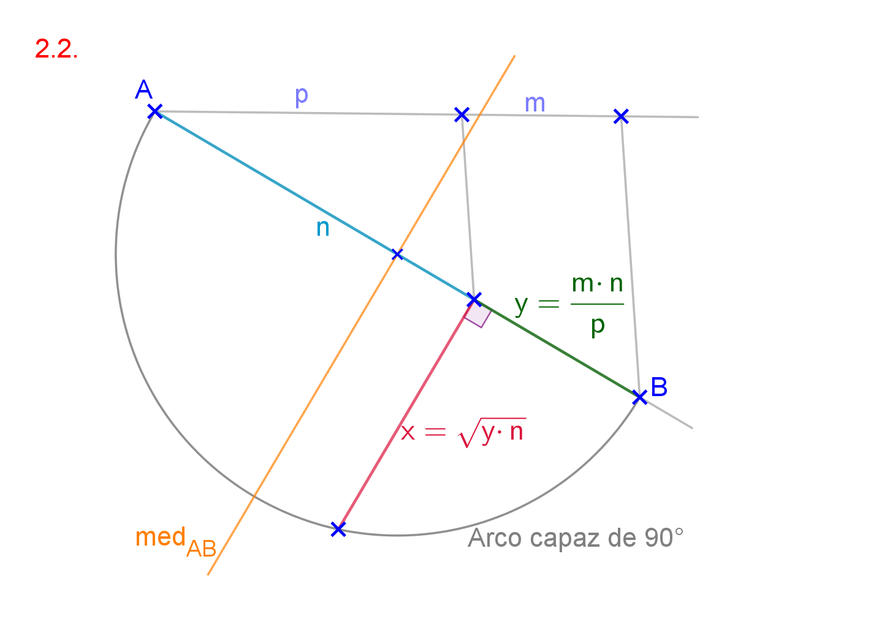
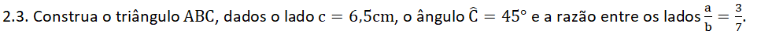
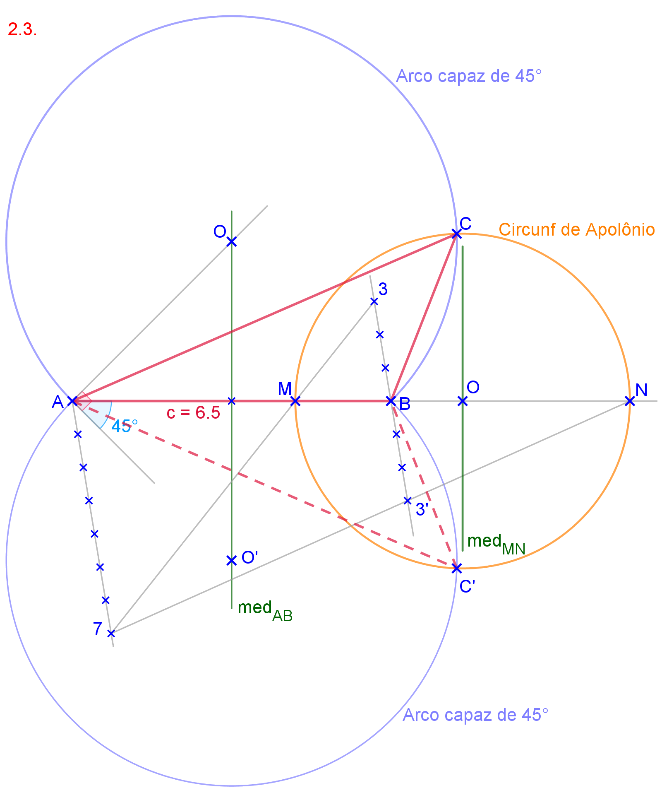

<link rel="stylesheet" href="../../imagens/style.css">

<h2 id="inicio">Respostas das Atividades do Módulo 2</h2> 
  

Item 2.1

  
  

&#x1f4cf; &#x1f4d0; Solução

  
Podemos usar os lugares geométricos retas paralelas e arco capaz nesta atividade. Como temos as medidas do lado <b>b = AC</b> e da altura relativa a este lado <b>hb</b>, podemos construir a reta paralela a <b>AC</b> com a distância <b>hb</b>.

    
	<figcaption>Os vértices <b>B</b> e <b>B'</b> pertencem às interseções entre o arco capaz de 60&deg; em <b>AC</b> e a reta paralela ao lado <b>AC</b>.</figcaption>
  

  

Item 2.2

  
  

&#x1f4cf; &#x1f4d0; Solução

  
Podemos reescrever a expressão como $\mathsf{ x = \sqrt{\frac{m \cdot n}{p} \cdot n} = \sqrt{y \cdot n}}$, onde $\mathsf{ y = \frac{m \cdot n}{p}}$. Para encontrar o segmento <b>y</b>, construímos a quarta proporcional entre os segmentos <b>m</b>, <b>n</b> e <b>p</b>.

    
	<figcaption>Para encontrar o segmento <b>x</b>, construímos a média geométrica entre os segmentos <b>y</b> e <b>n</b>.</figcaption>
  

  

Item 2.3

  
  

&#x1f4cf; &#x1f4d0; Solução

  
Podemos usar os lugares geométricos arco capaz e circunferência de Apolônio nesta atividade.

	
	<figcaption>Os vértices <b>C</b> e <b>C'</b> estão nas interseções do arco capaz de 45&deg; em <b>AB</b> com a circunferência de Apolônio de razão $\mathsf{ \frac{3}{7} = \frac{BC}{AC}}$.</figcaption>
  

  

   

