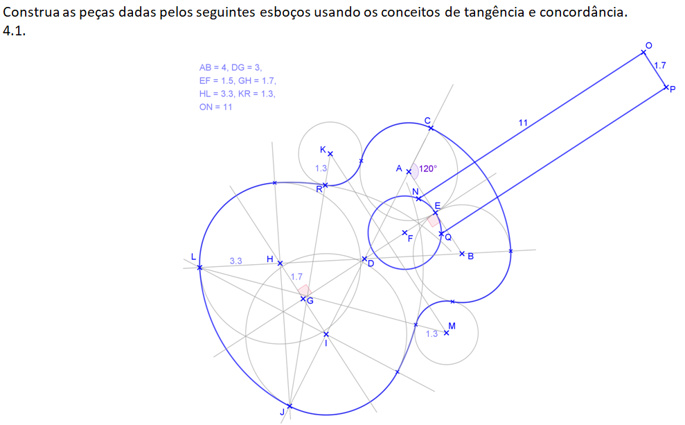
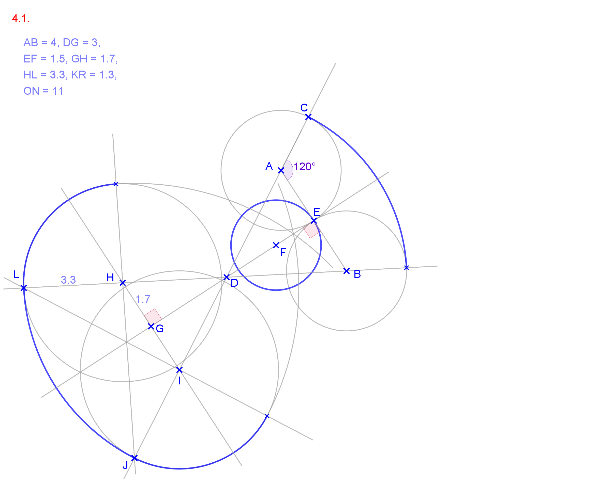
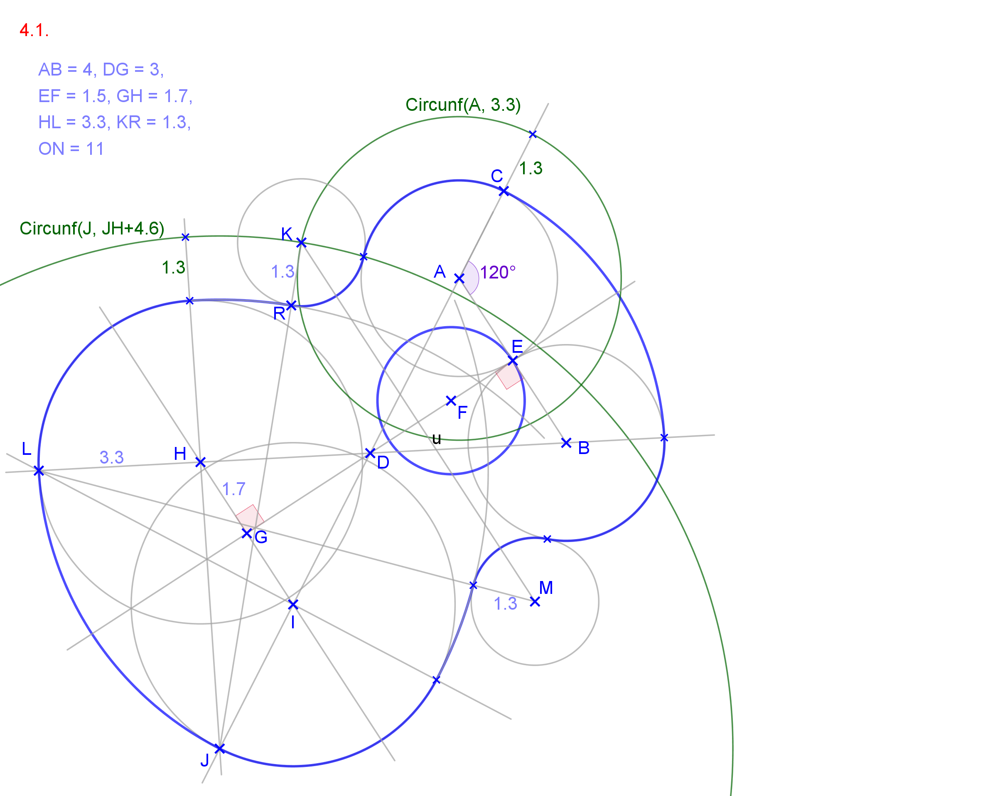
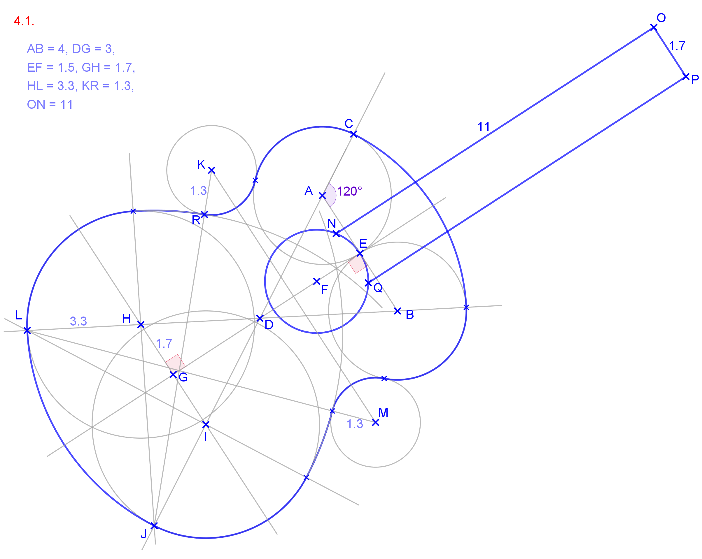
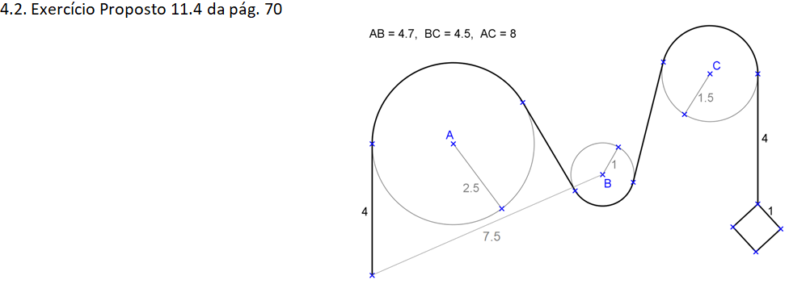
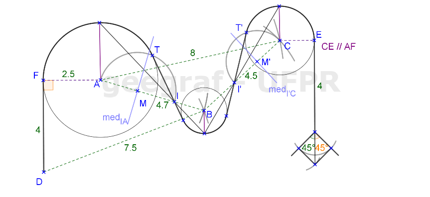
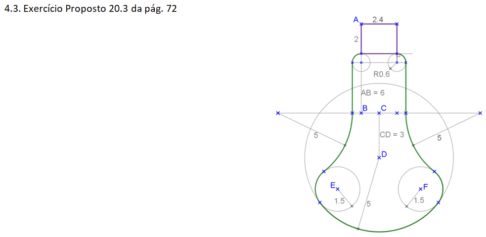
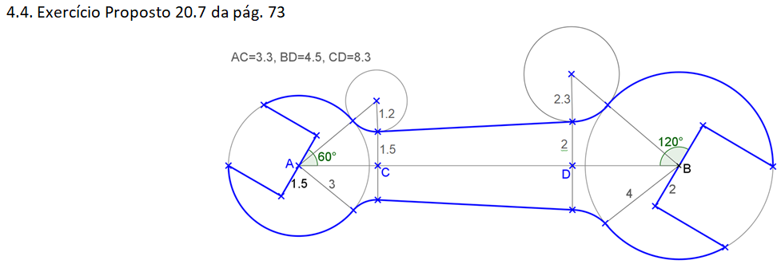

<link rel="stylesheet" href="../../imagens/style.css">

<h2 id="inicio">Respostas das Atividades do Módulo 4</h2> 
  

Item 4.1

  
  

&#x1f4cf; &#x1f4d0; Resolução

  
Começando do segmento <b>AB</b>, com a <b>medAB</b> usada como eixo de simetria, podemos determinar os arcos e ângulos indicados até os pontos <b>J</b> e <b>L</b>.

  <ul class="slider">
      <li>
           <input type="radio" id="042" name="sl">
           <label for="042"></label>
           
           <figcaption>Usamos as propriedades de alinhamento de centros e pontos de tangência de cada arco ou circunferência indicados.</figcaption>
       </li>
       <li>
           <input type="radio" id="041" name="sl">
           <label for="041"></label>
           
           <figcaption>Para encontrar o ponto <b>K</b>, basta construir as circunferências de centros <b>A</b> e <b>J</b> com raios iguais a <b>3.3</b> e <b>JH+4.6</b>. Usando a mesma ideia, encontramos o ponto <b>M</b>.</figcaption>
       </li>
	   <li>
           <input type="radio" id="040" name="sl">
           <label for="040"></label>
           
           <figcaption>Para finalizar, construímos os segmentos paralelos à <b>medAB</b> do braço do violão.</figcaption>
       </li>
    </ul>
    
  

  

Item 4.2

  
  

&#x1f4cf; &#x1f4d0; Solução

  
Começamos pelo segmento <b>DF</b>. Temos a aplicação do Exercício 5.2 nas retas tangentes às circunferências.

	
	<figcaption>Temos também a construção do quadrado na finalização do desenho. Esta construção pode ser feita dois segmentos que formam 45&deg; com o segmento de 4cm.</figcaption>
  

  

Item 4.3

  
  

&#x1f4cf; &#x1f4d0; Solução

  
Começamos pelos segmentos <b>AB</b>, <b>BC</b> e <b>CD</b>. Temos a aplicação do Exercício 1 nas circunferências de raios iguais a 0,6cm e nas circunferências de centros <b>G</b> e <b>H</b>.

	
	<figcaption>Temos a aplicação do exercício 19 para encontrar os centros <b>E</b> e <b>F</b>.</figcaption>
  

  

Item 4.4

  
  

&#x1f4cf; &#x1f4d0; Solução

  
Começamos pelo segmento <b>AB</b>. Temos a aplicação do Exercício 1 nas circunferências tangentes de raios 1.2cm e 2.3cm.

	
	<figcaption></figcaption>
  

  

   

