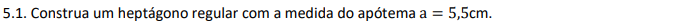
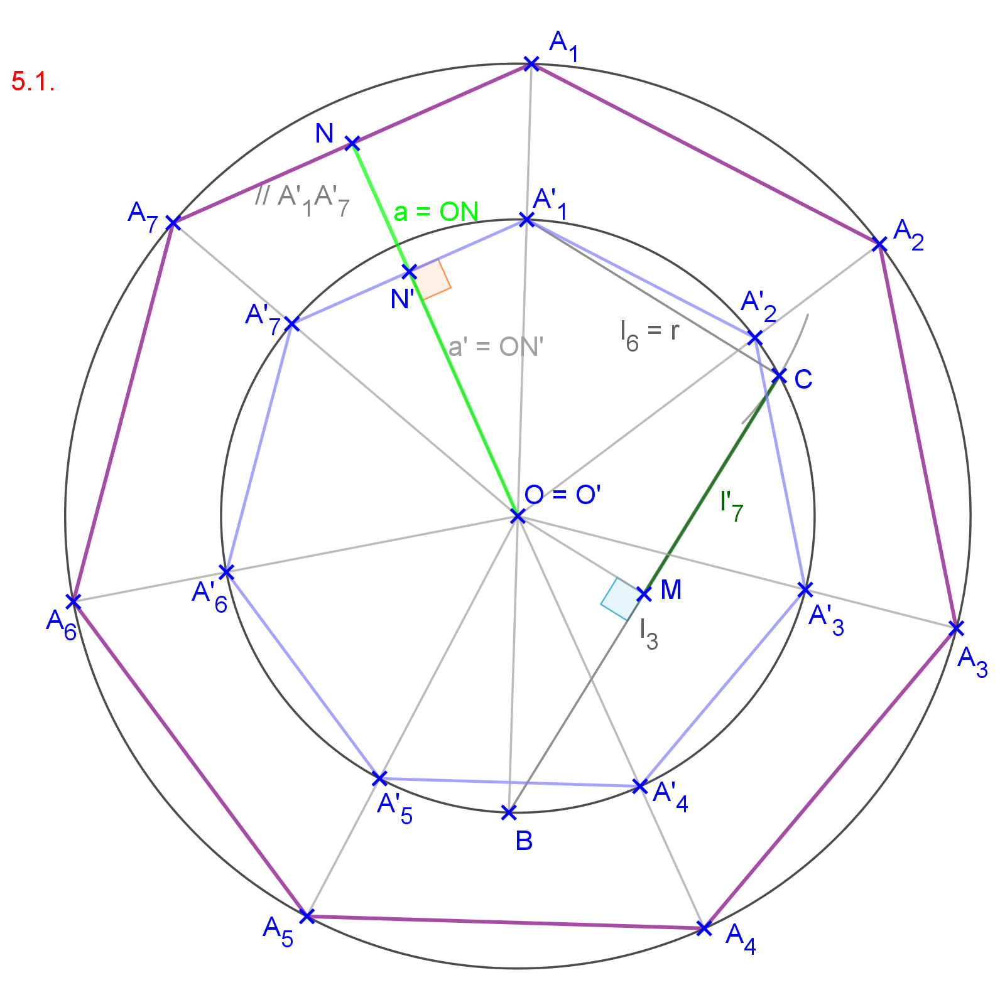
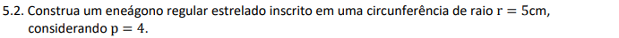
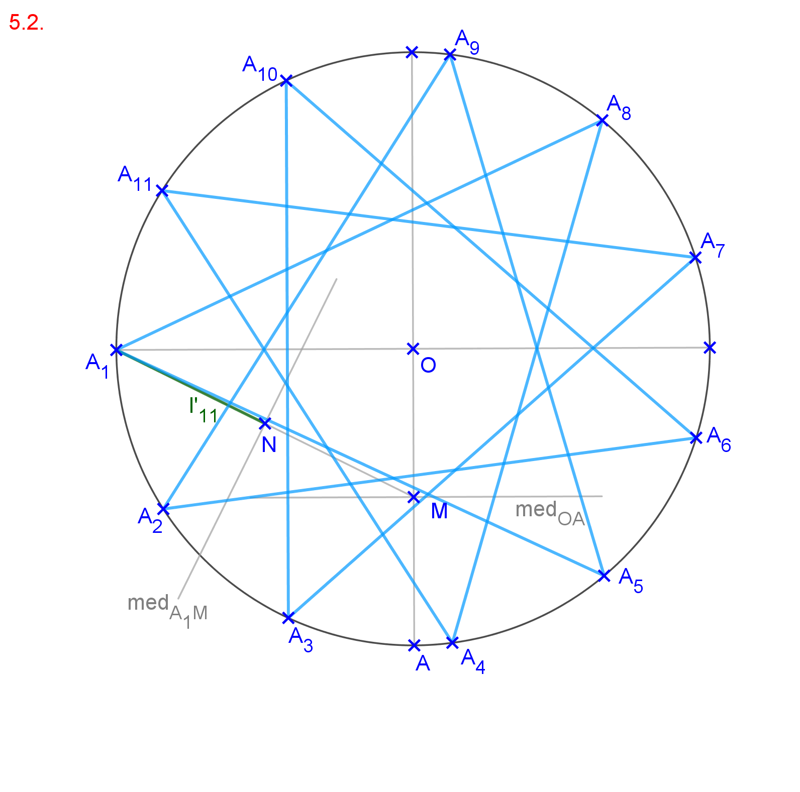
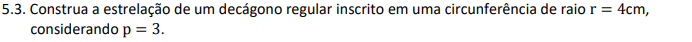
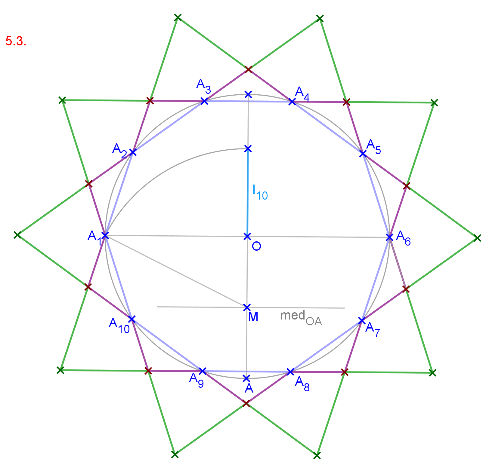

<link rel="stylesheet" href="../../imagens/style.css">

<h2 id="inicio">Respostas das Atividades do Módulo 5</h2> 
  

Item 5.1

  
  

&#x1f4cf; &#x1f4d0; Solução

  
Começamos com uma circunferência de raio qualquer <b>BO'</b> e determinamos a medida de <b>l'7 = l3/2</b>. O apótema pode ser construído perpendicularmente a qualquer lado do heptágono.

    
	<figcaption>Considerando <b>O'N' &perp; A'1A'7</b>, usamos Homotetia para encontrar <b>ON = a</b>. Os lados <b>A'1A'7</b> e <b>A1A7</b> são paralelos, e usamos a semelhança dos triângulos <b>O'A'1A'7</b> e <b>O'A'1A'7</b> para determinar o raio da circunferência circunscrita do heptágono com apótema 5,5cm.</figcaption>
  

  

Item 5.2

  
  

&#x1f4cf; &#x1f4d0; Solução

  
Começamos com a determinação do lado <b>l'11</b> que tem a metade da medida <b>A1M</b>.

    
	<figcaption>O polígono estrelado é construído com os lados 'pulando' de 4 em 4 vértices: unimos <b>A1</b> com <b>A5</b>, depois <b>A5</b> com <b>A9</b> e assim sucessivamente, até voltarmos ao vértice <b>A1</b>.</figcaption>
  

  

Item 5.3

  
  

&#x1f4cf; &#x1f4d0; Solução

  
Começamos com a determinação do lado <b>l'10</b> que tem a medida igual ao segmento áureo do raio da circunferência.

	
	<figcaption>A estrelação com <b>p = 1</b> é o decágono regular. Prolongando os lados do decágono, temos a estrelação com <b>p = 2</b>. Depois, prolongamos a estrelação de <b>p = 2</b> para encontrar a estrelação com <b>p = 3</b>.</figcaption>
  

  

   

