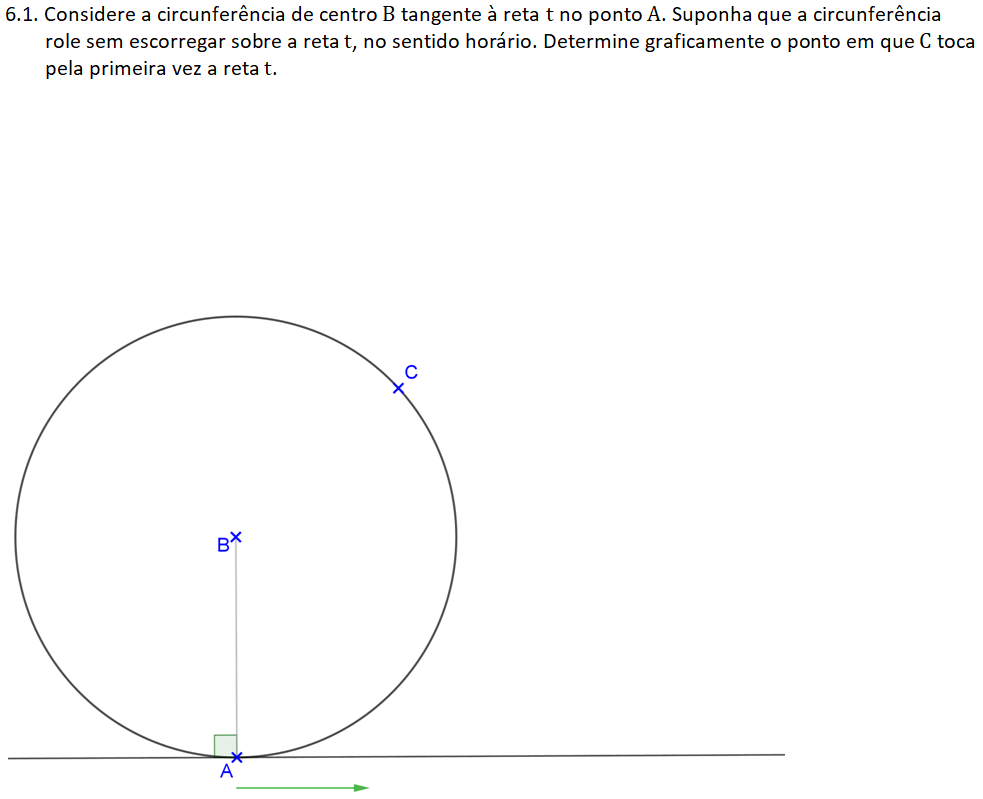
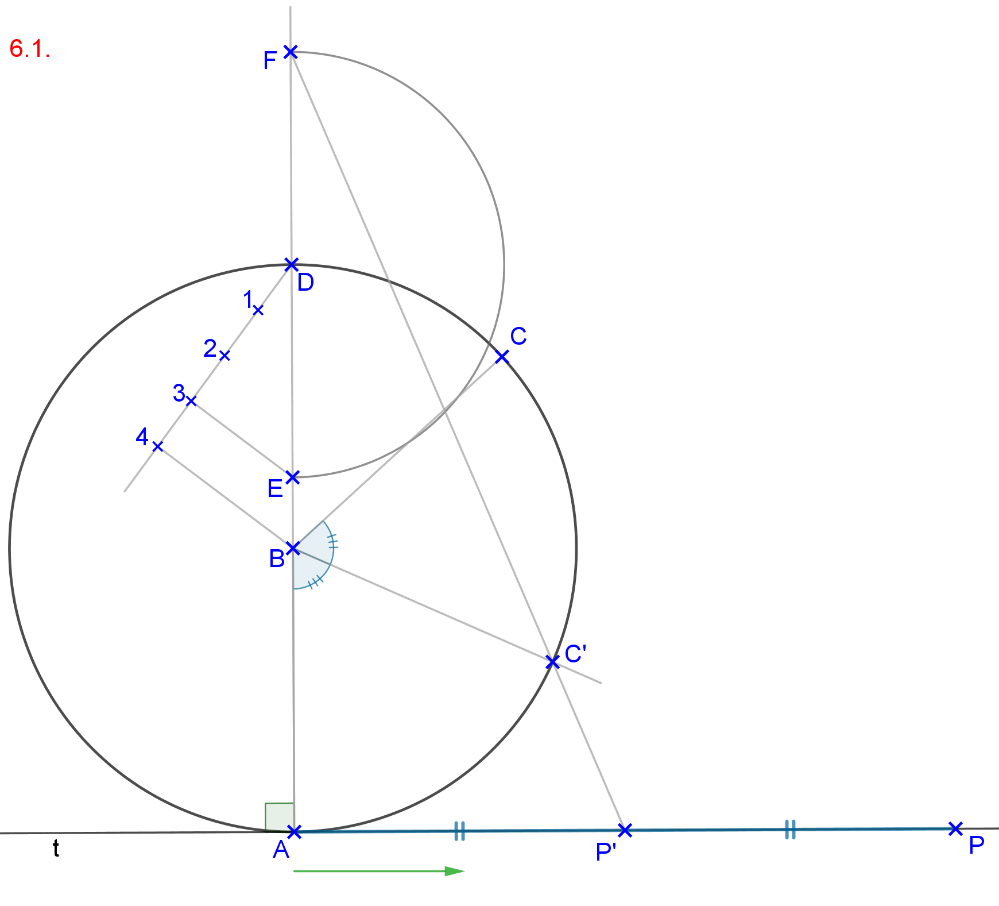
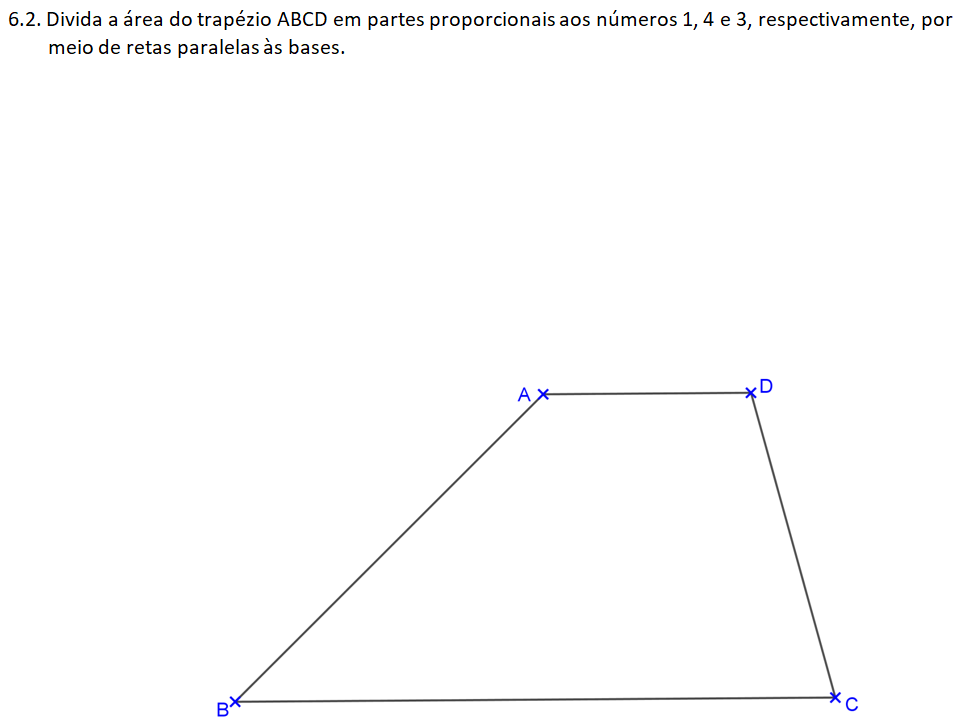
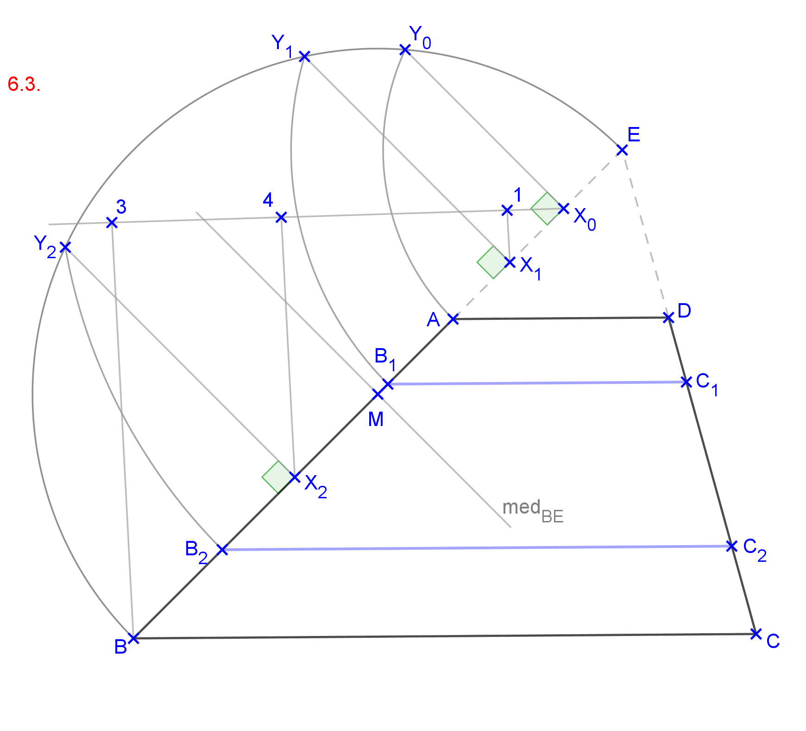
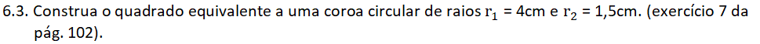
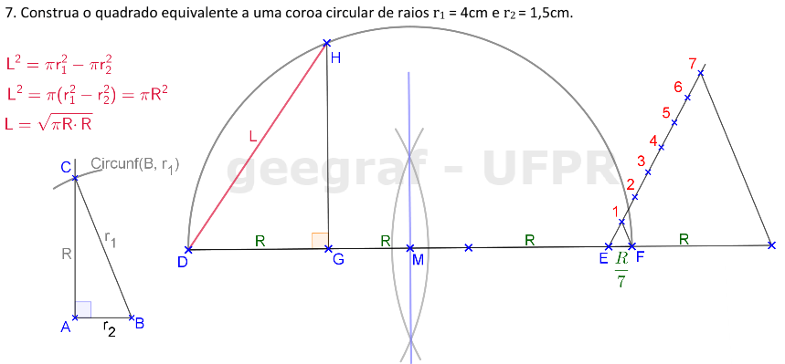

<link rel="stylesheet" href="../../imagens/style.css">

<h2 id="inicio">Respostas das Atividades do Módulo 6</h2> 
  

Item 6.1

  
  

&#x1f4cf; &#x1f4d0; Solução

  
Basta retificar a metade do arco <b>AC</b> usando o processo de Arquimedes.

    
	<figcaption>A medida <b>AP'</b> corresponde à metade do arco retificado <b>AP'</b>. Fazendo <b>PP' = AP'</b>, temos o ponto <b>P</b> correspondente à posição de <b>C</b> quando a circunferência rolar no sentido horário sobre a reta <b>t</b>.</figcaption>
  

  

Item 6.2

  
  

&#x1f4cf; &#x1f4d0; Solução

  
Começamos com a determinação de <b>AY0 = AE</b> sobre o arco capaz de 90&ordm; do lado <b>BE</b>. Construindo o segmento <b>X0Y0 &perp; AE</b>, determinamos o segmento <b>BX0</b> correspondente ao lado <b>AB</b> do trapézio.

    
	<figcaption>Dividindo o lado <b>BX0</b> em partes proporcionais aos números 1, 4 e 3, temos os pontos <b>X1</b> e <b>X2</b> para construirmos as médidas geométricas de <b>EX1</b> e <b>EX2</b> com o lado <b>BE</b>. Traçando os arcos de centro <b>E</b> e raios <b>EY1</b> e <b>EY2</b>, encontramos sobre o lado <b>BE</b> os pontos de divisão <b>B1</b> e <b>B2</b>.</figcaption>
  

  

Item 6.3

  
  

&#x1f4cf; &#x1f4d0; Solução

  
O raio <b>R</b> de um círculo equivalente à área da coroa circular é encontrado usando o teorema de Pitágoras: <b>R</b> é um cateto do triângulo retângulo com hipotenusa <b>r1</b> e o outro cateto com medida <b>r2</b>.

	
	<figcaption>A média geométrica entre <b>&pi;R</b> e <b>R</b> será o lado do quadrado equivalente à área da coroa circular. Neste exercício, eu optei por usar o método de Arquimedes para retificar a circunferência de raio <b>R</b>.</figcaption>
  

</figcaption>
  

  

   

