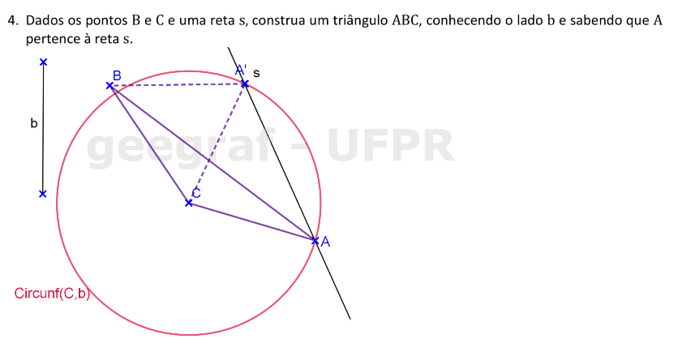
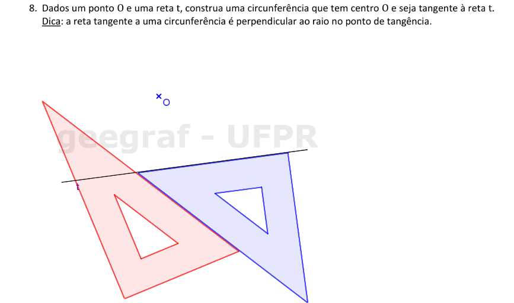
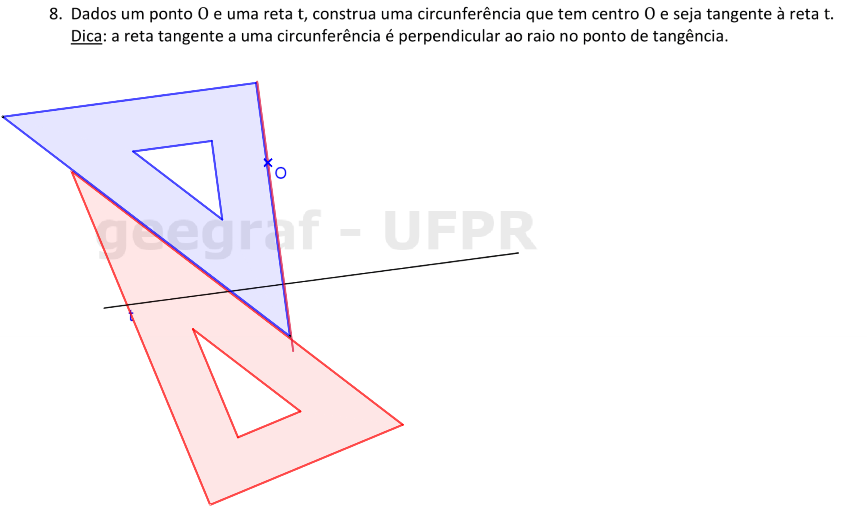
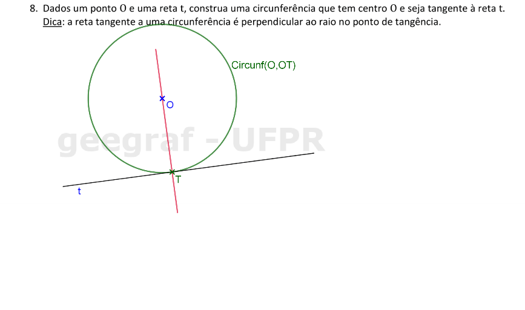
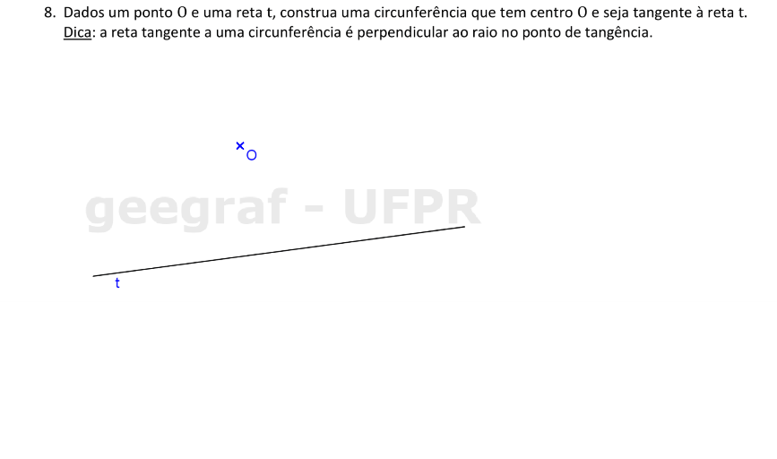
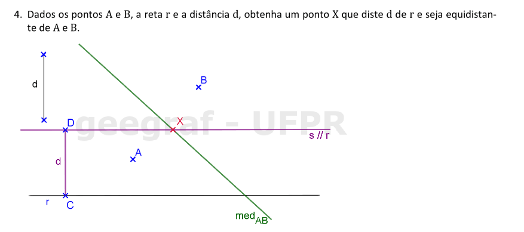
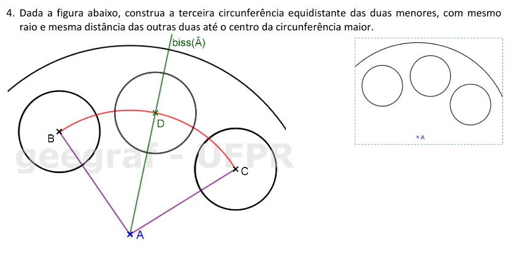
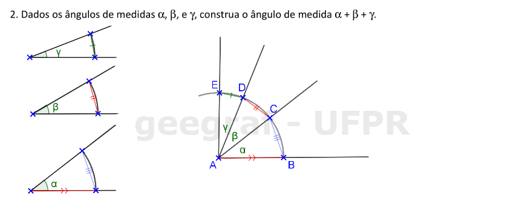

<link rel="stylesheet" href="../../imagens/style.css">

<h2 id="inicio">Respostas do Módulo 1</h2>
<h3>Circunferência, Mediatriz, Retas Paralelas e Bissetriz</h3> 
  

Atividade 1.1: exercício 4 da pág. 5

  
  

&#x1f4cf; &#x1f4d0; Solução

	
Use o conceito do lugar geométrico circunferência para resolver este exercício.

	
	<figcaption>Lembrando que o lado <b>b</b> é o lado <b>AC</b> do triângulo, usamos a circunferência com centro em <b>C</b> e raio <b>b</b>.</figcaption>
  

  

Atividade 1.2: exercício 8 da pág. 11

  
  

&#x1f4cf; &#x1f4d0; Resolução

	
Vamos usar os esquadros e o compasso como instrumentos auxiliares para resolver este problema. Como a reta <b>t</b> é tangente à circunferência de centro <b>O</b>, o raio <b>OT</b> será perpendicular a <b>t</b>.

	  <ul class="slider">
		  <li>
			   <input type="radio" id="086" name="sl">
			   <label for="086"></label>
			   
			   <figcaption>Podemos construir a reta perpendicular a <b>t</b> que passa por <b>O</b> com régua e compasso ou com os esquadros. Neste exemplo, vamos usar os esquadros: alinhe um cateto do esquadro de 45 com a reta <b>t</b>, e a hipotenusa deste esquadro fica apoiada com a régua ou com outro esquadro.</figcaption>
		   </li>
		   <li>
			   <input type="radio" id="087" name="sl">
			   <label for="087"></label>
			   
			   <figcaption>Deixando fixo o esquadro de 60, deslize o esquadro de 45 até chegar em <b>O</b>. Construa a reta perpendicular usando o cateto do esquadro de 45.</figcaption>
		   </li>
		   <li>
			   <input type="radio" id="088" name="sl">
			   <label for="088"></label>
			   
			   <figcaption>O raio da circunferência procurada será <b>OT</b>. Com centro em <b>O</b> e raio <b>OT</b>, construímos a solução deste problema.</figcaption>
		   </li>
		   <li>
			   <input type="radio" id="089" name="sl">
			   <label for="089"></label>
			   
			   <figcaption>Se você preferir, pode fazer a construção da reta perpendicular a <b>t</b> que passa por <b>O</b> usando régua e compasso.</figcaption>
		   </li>
		</ul>
		
  

  

Atividade 1.3: exercício 4 da pág. 15

  
  

&#x1f4cf; &#x1f4d0; Solução

	
Você pode fazer as construções com régua e compasso ou com esquadros e o compasso.

	
	<figcaption>Para construir a reta paralela <b>s</b>, lembre-se de construir o segmento <b>CD &perp; r</b> para marcar o segmento com medida <b>d</b>.</figcaption>
  

  

Atividade 1.4: exercício 4 da pág. 18

  
  

&#x1f4cf; &#x1f4d0; Solução

	
Neste exercício, você pode usar a régua e o compasso como instrumentos auxiliares.

	
	<figcaption>Você pode construir a bissetriz do <b>&angsph;BAC</b> ou a mediatriz de <b>BC</b>.</figcaption>
  

  

Atividade 1.5: exercício 2 da pág. 20

  
  

&#x1f4cf; &#x1f4d0; Solução

	
Neste exercício, você pode usar a régua e o compasso como instrumentos auxiliares.

	
	<figcaption>Basta lembrar da construção que fizemos para transportar ângulos. Lembre-se que os arcos com centros nos vértices devem ter raios com mesma medida.</figcaption>
  

