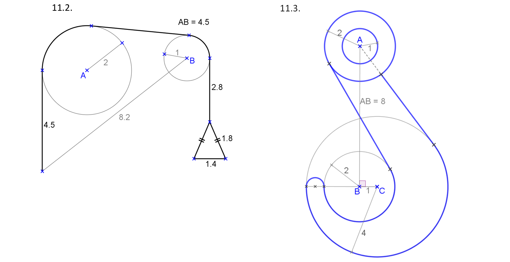
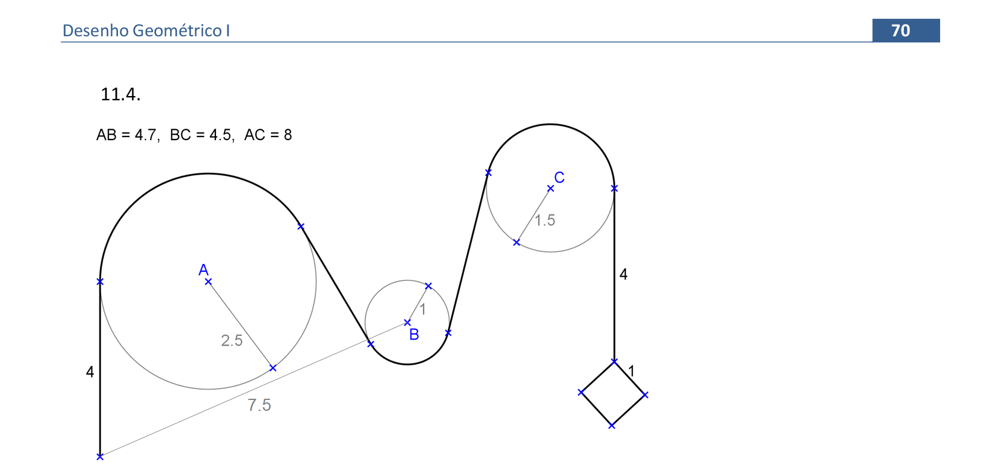
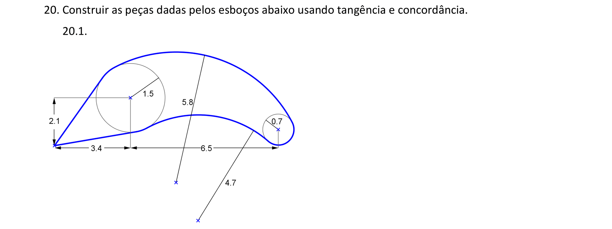
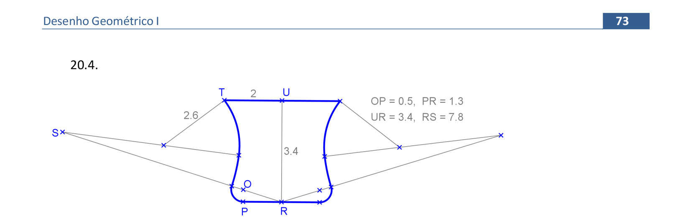
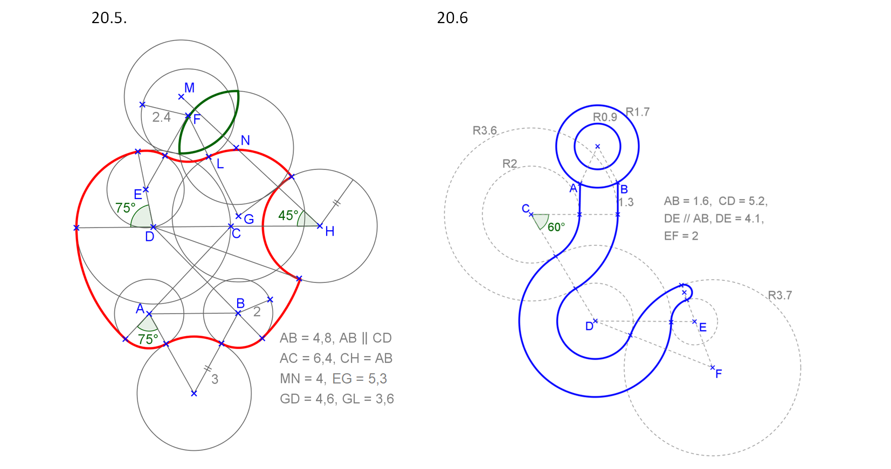
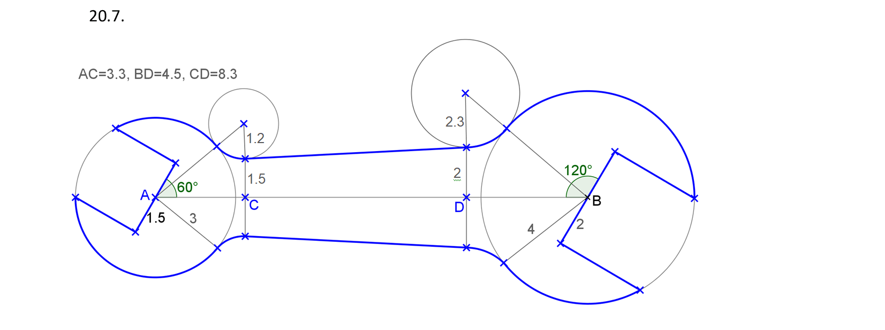

<link rel="stylesheet" href="../../imagens/style.css">

<h2 id="inicio">Respostas do Módulo 4</h2>
<h3>Tangência e Concordância</h3> 
  

Atividade 4.1: exercício 11.1 da pág. 69

  
  

&#x1f4cf; &#x1f4d0; Solução

	
Começamos pelo segmento de 3,4cm. Temos a aplicação do Exercício 4 na reta tangente à circunferência.

	
	<figcaption>Temos também a construção do trapézio isósceles na finalização do desenho. Esta construção pode ser feita com retas paralelas ao segmento de 4,8cm.</figcaption>
  

  

Atividade 4.2: exercício 11.2 da pág. 69

  
  

&#x1f4cf; &#x1f4d0; Solução

	
Começamos pelo segmento de 4,5cm. Temos a aplicação do Exercício 5.1 na reta tangente às duas circunferências.

	
	<figcaption>Temos também a construção do triângulo isósceles na finalização do desenho. Esta construção pode ser feita com retas paralelas ao segmento de 2,8cm.</figcaption>
  

  

Atividade 4.3: exercício 11.3 da pág. 70

  
    

&#x1f4cf; &#x1f4d0; Solução

	
Começamos pelo segmento <b>DF</b>. Temos a aplicação do Exercício 5.2 nas retas tangentes às circunferências.

	
	<figcaption>Temos também a construção do quadrado na finalização do desenho. Esta construção pode ser feita dois segmentos que formam 45&deg; com o segmento de 4cm.</figcaption>
  

  

Atividade 4.4: exercício 20.1 da pág. 72

  
  

&#x1f4cf; &#x1f4d0; Solução

	
Começamos pelo segmento <b>CA</b>. Temos a aplicação do Exercício 4 nas retas tangentes à circunferência de centro <b>A</b>.

	
	<figcaption>Temos a aplicação do exercício 19 para encontrar os centros das circunferências tangentes às circunferências de centros <b>A</b> e <b>B</b>.</figcaption>
  

  

Atividade 4.5: exercício 20.2 da pág. 72

  
  

&#x1f4cf; &#x1f4d0; Solução

	
Começamos pelo segmento de 2cm com extremidade <b>A</b>. Temos a aplicação do Exercício 4 nas retas tangentes às circunferências de centros <b>P</b> e <b>O</b>.

	
	<figcaption>Temos a aplicação do exercício 19 para encontrar os centros das circunferências tangentes às circunferências de centros <b>B</b> e <b>C</b>.</figcaption>
  

  

Atividade 4.6: exercício 20.3 da pág. 73

  
  

&#x1f4cf; &#x1f4d0; Solução

	
Começamos pelo segmento de 2cm com extremidade <b>T</b>. Temos a aplicação do Exercício 1 nas circunferências tangentes ao segmento <b>PR</b>.

	
	<figcaption>Temos a aplicação do exercício 19 para encontrar os centros <b>S</b> e <b>S'</b>.</figcaption>
  

  

Atividade 4.7: exercício 20.5 da pág. 73

  
  

&#x1f4cf; &#x1f4d0; Solução

	
Começamos pelo segmento <b>AB</b>. Temos a aplicação do Exercício 1 nas circunferências tangentes aos segmentos com extremidades <b>A</b> e <b>B</b>.

	
	<figcaption>Temos a aplicação do exercício 19 para encontrar os centros <b>E</b> e <b>F</b>.</figcaption>
  

  

Atividade 4.8: exercício 20.6 da pág. 72

  
  

&#x1f4cf; &#x1f4d0; Solução

	
Começamos pelo segmento <b>AB</b>. Temos a aplicação do Exercício 1 nas circunferências tangentes de raios 1.2cm e 2.3cm.

	
	<figcaption></figcaption>
  

  

