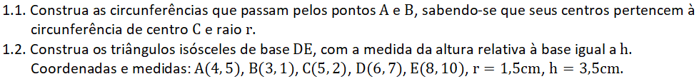
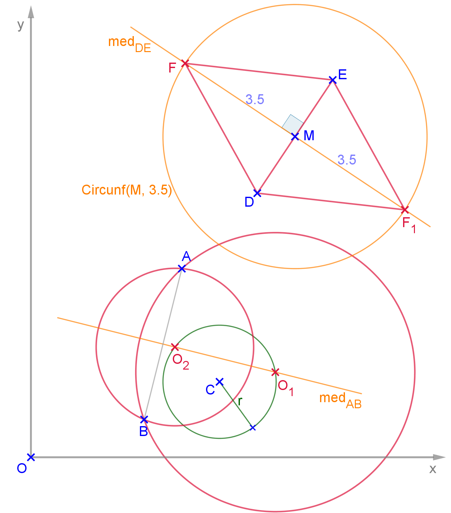
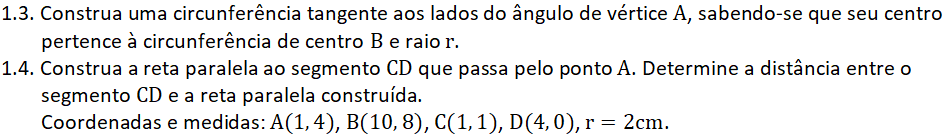
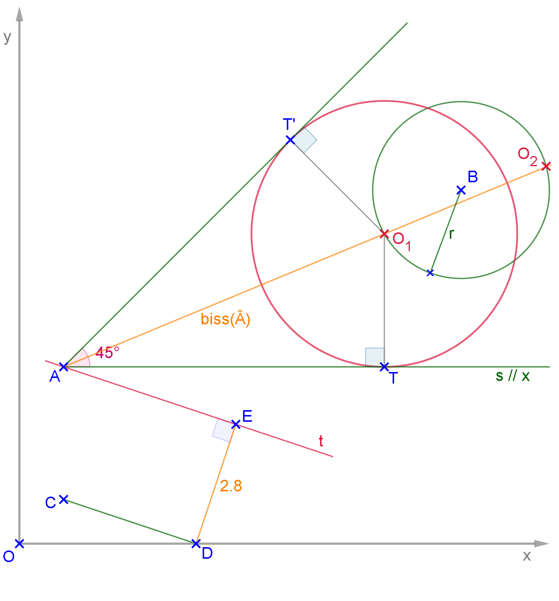

<link rel="stylesheet" href="../../imagens/style.css">

<h2 id="inicio">Respostas das Atividades do Módulo 1</h2> 
  

Itens 1.1 e 1.2

  
  

&#x1f4cf; &#x1f4d0; Solução

  
Podemos usar os lugares geométricos circunferência e mediatriz nesta atividade. Os centros <b>O1</b> e <b>O2</b> estão nas interseções da mediatriz de <b>AB</b> com a <b>Circunf(C, r)</b>.

    
	<figcaption>Os vértices <b>F</b> e <b>F1</b> pertencem às interseções entre a <b>Circunf(M, 3.5)</b> e a mediatriz de <b>DE</b>.</figcaption>
  

  

Itens 1.3 e 1.4

  
  

&#x1f4cf; &#x1f4d0; Solução

  
Podemos usar os lugares geométricos bissetriz e retas paralelas nesta atividade. Os centros <b>O1</b> e <b>O2</b> estão nas interseções da bissetriz do ângulo <b>Â</b> com a <b>Circunf(B, r)</b>. Para encontrar o raio de uma destas soluções, basta construir um segmento perpendicular a um lado do ângulo que passa pelo centro da circunferência.

	
	<figcaption>Depois de encontrar a reta <b>t // CD</b>, basta encontrar a reta perpendicular comum a <b>t</b> e <b>CD</b>. A distância aproximada entre o segmento e a reta paralela mede 2,8cm.</figcaption>
  

  

   

