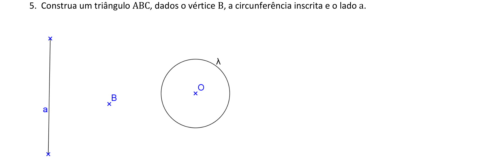
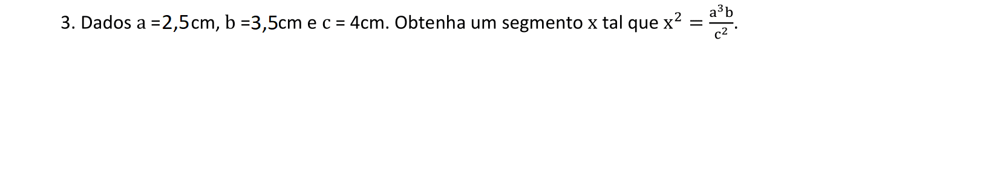

<link rel="stylesheet" href="../../imagens/style.css">

<h2 id="inicio">Exercícios Propostos do Módulo 2</h2>
<h3>Arco Capaz e Operações com segmentos</h3> 
  

Exercício Proposto 2.1: 5 da pág. 28

  
  

&#x1f4cf; &#x1f4d0; Solução

	
Como os lados do triângulo são tangentes à circunferência inscrita, temos que construir os arcos capazes de <b>90&deg;</b>.

	
	<figcaption>Depois de encontrar a reta <b>BC</b>, o lado <b>AC</b> será tangente à circunferência inscrita, ou seja, construímos outro arco capaz de <b>90&deg;</b> para determinar a posição de <b>AC</b>.</figcaption>
  

  

Exercício Proposto 2.2: 7 da pág. 29

  
  

&#x1f4cf; &#x1f4d0; Solução

	
Como o ponto <b>X</b> é equidistante de <b>P</b> e <b>Q</b>, pertence à <b>medPQ</b>.

	
	<figcaption>A construção envolve o arco capaz de <b>30&deg;</b> em <b>AB</b>.</figcaption>
  

  

  

Exercício Proposto 2.3: 1 da pág. 31

  
    

&#x1f4cf; &#x1f4d0; Solução

	
Neste exercício proposto, temos a aplicação do Teorema de Tales para encontrar os lados do triângulo.

	
	<figcaption>Temos 2 soluções possíveis.</figcaption>
  

  

Exercício Proposto 2.4: 3 da pág. 35

  
  

&#x1f4cf; &#x1f4d0; Solução

	
Neste exercício proposto, utilizamos a Circunferência de Apolônio com a razão $\mathsf{ 1 \over 3 }$.

	
	<figcaption></figcaption>
  

  

Exercício Proposto 2.5: 3 da pág. 41

  
  

&#x1f4cf; &#x1f4d0; Solução

	
Neste exercício proposto, temos a aplicação do conceito de média geométrica além de terceira e quarta proporcionais.

	
	<figcaption>Primeiro encontramos os segmentos <b>y</b> e <b>z</b> por meio de quarta e terceira proporcionais. O segmento <b>x</b> será a média geométrica entre <b>y</b> e <b>z</b>.</figcaption>
  

