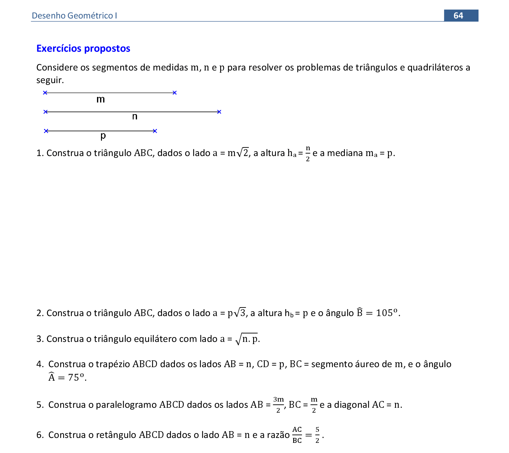

<link rel="stylesheet" href="../../imagens/style.css">

<h2 id="inicio">Exercícios Propostos do Módulo 3</h2>
<h3>Triângulos e Quadriláteros</h3> 
  

Exercício Proposto 3: pág. 64

  
  

&#x1f4cf; &#x1f4d0; Solução do Ex. 1

	
Usando Pitágoras, construímos o lado <b>BC</b>.

	
	<figcaption>Usando a mediatriz, encontramos a altura <b>ha</b>.</figcaption>
  

  

&#x1f4cf; &#x1f4d0; Solução do Ex. 2

	
Usando Pitágoras, construímos o lado <b>BC</b>.

	
	<figcaption>Com o arco capaz de 90&deg;, encontramos o pé da altura <b>Hb</b>.</figcaption>
  

  

&#x1f4cf; &#x1f4d0; Solução do Ex. 3

	
Usamos a média geométrica para encontrar o lado do triângulo.

	
	<figcaption>Com raio <b>AB</b>, construimos as circunferências de centros <b>A</b> e <b>B</b> para encontrar o vértice <b>C</b>.</figcaption>
  

  

&#x1f4cf; &#x1f4d0; Solução do Ex. 4

	
Construímos o segmento <b>BC</b>, áureo de <b>m</b>.

	
	<figcaption>Construimos a base menor <b>CD</b> por dentro da base maior para encontrar o vértice <b>C</b>.</figcaption>
  

  

&#x1f4cf; &#x1f4d0; Solução do Ex. 5

	
Construímos o segmento <b>AB</b>, usando o teorema de Tales.

	
	<figcaption>Para encontrar o vértice <b>D</b> construímos os segmentos <b>CD // AB</b> e <b>AD // BC</b>.</figcaption>
  

  

&#x1f4cf; &#x1f4d0; Solução do Ex. 6

	
Construímos o segmento <b>BC</b>, perpendicular a <b>AB</b>.

	
	<figcaption>A posição do vértice <b>B</b> é determinada com o uso da circunferência de Apolônio na razão da diagonal <b>AC</b> pelo lado <b>BC</b> construída a partir do lado <b>AB</b>.</figcaption>
  

  

  

