<link rel="stylesheet" href="../../imagens/style.css">

<h2 id="inicio">Exercícios Propostos do Módulo 5</h2>
<h3>Polígonos Regulares</h3> 
  

Exercício Proposto 5.1: 1-item c, da pág. 82

  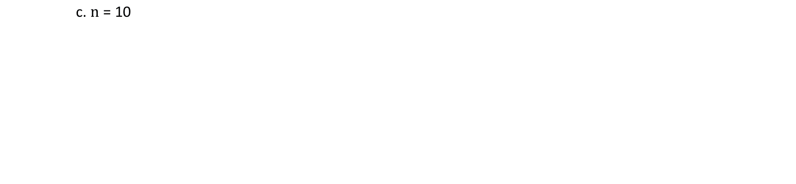
  

&#x1f4cf; &#x1f4d0; Resolução

	
Utilizaremos a régua, os esquadros e o compasso como instrumentos auxiliares neste exercício. Vamos usar o método de homotetia.

	  <ul class="slider">
		  <li>
			   <input type="radio" id="1038" name="sl">
			   <label for="1038"></label>
			   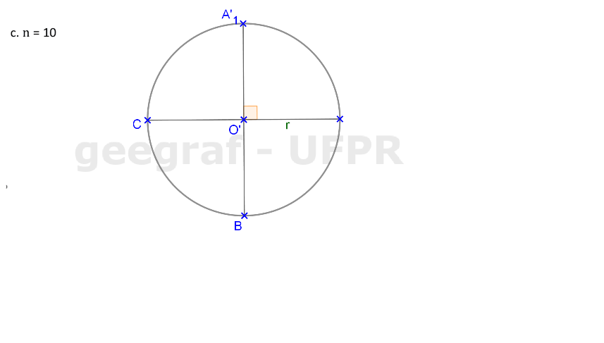
			   <figcaption>Como 36&deg; não é um dos ângulos notáveis, vamos construir um decágono qualquer e depois aplicar o método de homotetia, para aumentar este decágono ou reduzí-lo. Construa uma circunferência de raio qualquer, e determine dois diâmetros perpendiculares.</figcaption>
		   </li>
		   <li>
			   <input type="radio" id="1039" name="sl">
			   <label for="1039"></label>
			   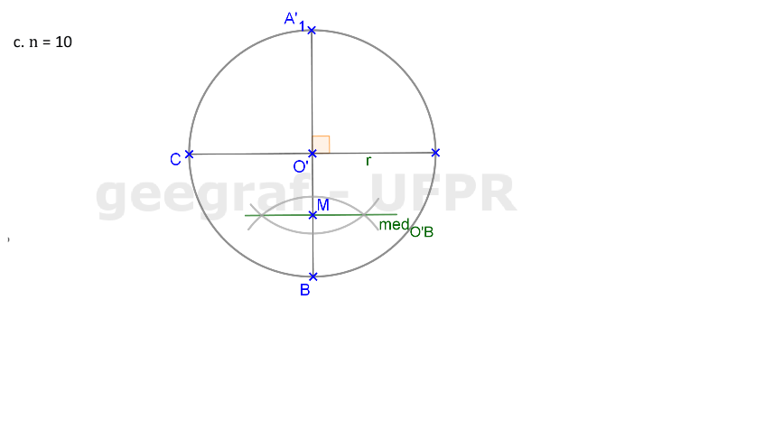
			   <figcaption>Construa a mediatriz do raio <b>O'B</b>.</figcaption>
		   </li>
		   <li>
			   <input type="radio" id="1040" name="sl">
			   <label for="1040"></label>
			   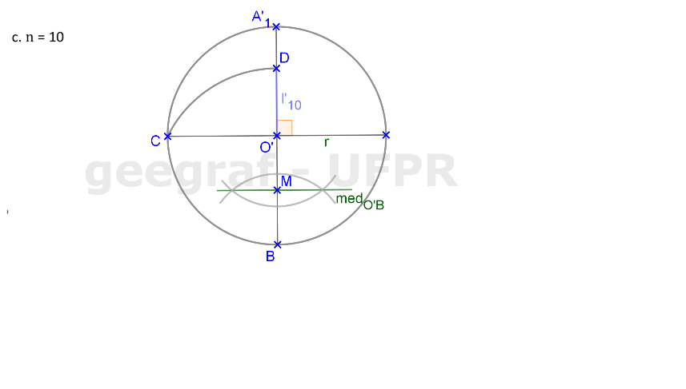
			   <figcaption>Com centro em <b>M</b>, construa o arco com raio de medida <b>MC</b>. A interseção deste raio com <b>O'A'1</b> é o ponto <b>D</b>. Logo, temos o lado <b>l'10</b>.</figcaption>
		   </li>
		   <li>
			   <input type="radio" id="1041" name="sl">
			   <label for="1041"></label>
			   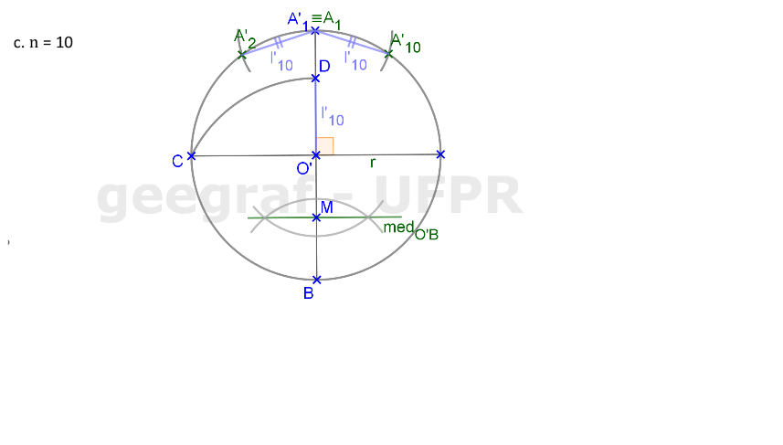
			   <figcaption>Vamos considerar <b>A'1 &equiv; A1</b>. Construa os arcos com raio de medida <b>l'10</b> com centro em <b>A1</b>, encontrando os vértices <b>A'2</b> e <b>A'10</b>.</figcaption>
		   </li>
		   <li>
			   <input type="radio" id="1042" name="sl">
			   <label for="1042"></label>
			   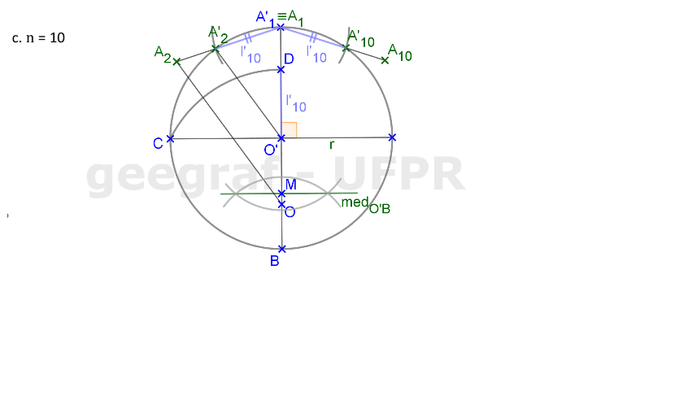
			   <figcaption>Agora podemos determinar os lados <b>A1A2 = A1A10 = 3cm</b>. O centro da nova circunferência circunscrita pode ser encontrado usando homotetia: basta construir <b>OA2 // O'A'2</b>.</figcaption>
		   </li>
		   <li>
			   <input type="radio" id="1043" name="sl">
			   <label for="1043"></label>
			   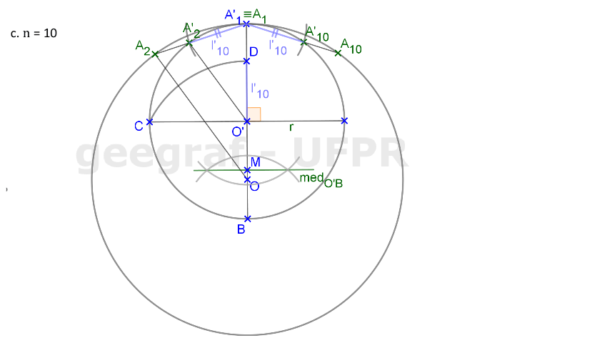
			   <figcaption>Construa a nova circunferência circunscrita.</figcaption>
		   </li>
		   <li>
			   <input type="radio" id="1044" name="sl">
			   <label for="1044"></label>
			   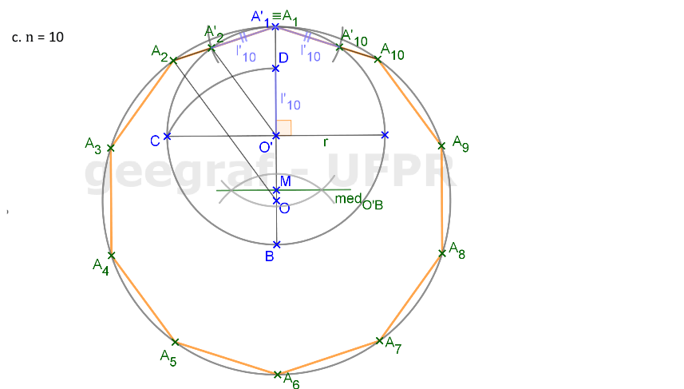
			   <figcaption>Para finalizar, basta construir os arcos consecutivos com raios de medida <b>l10</b>, a partir de <b>A2</b> e de <b>A10</b> para encontrar os outros 7 vértices do decágono.</figcaption>
		   </li>
		</ul>
		
  

  

Exercício Proposto 5.2: 1-item c, da pág. 86

  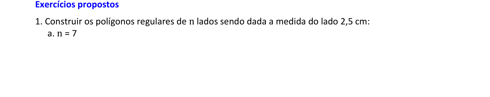
  
  

&#x1f4cf; &#x1f4d0; Solução

	
Começando com a circunferência de raio qualquer (por exemplo, <b>r = 3,5cm</b>), podemos construir o undecágono inscrito nesta circunferência.

	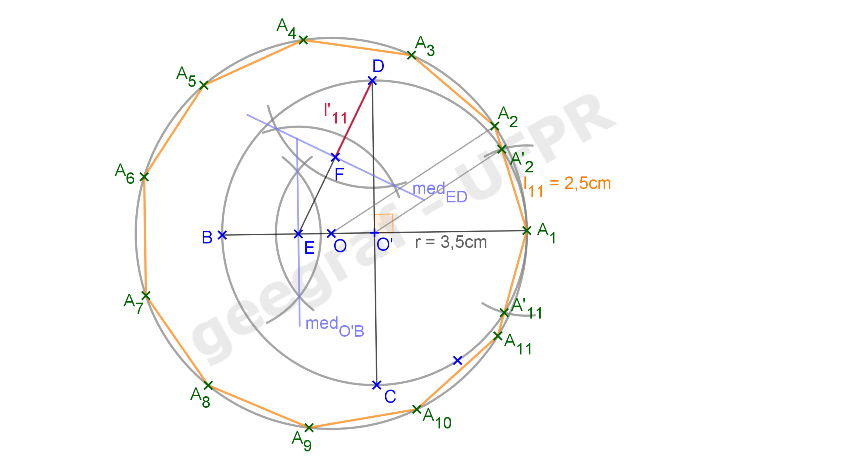
	<figcaption>Depois, basta ampliar ou reduzir o raio desta circunferência para construir o undecágono de lado com medida de 2,5cm usando Homotetia.</figcaption>
  

  

Exercício Proposto 5.3: 4 da pág. 86

  
    

&#x1f4cf; &#x1f4d0; Solução

	
Começando com a circunferência de raio qualquer (por exemplo, <b>r = 5,5cm</b>), podemos construir o eneágono inscrito nesta circunferência.

	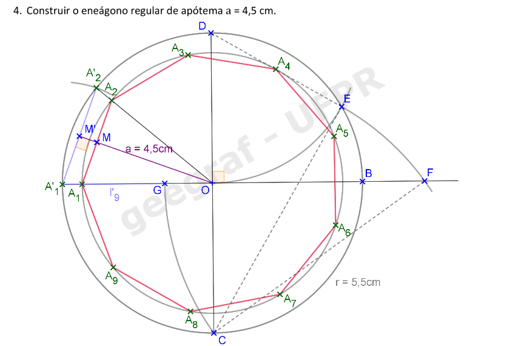
	<figcaption>Depois, basta ampliar ou reduzir o raio desta circunferência para construir o eneágono com apótema com medida de 4,5cm usando Homotetia.</figcaption>
  

  

Exercício Proposto 5.4: 2-item b, da pág. 89

  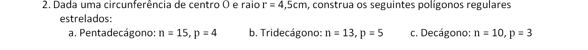
  

&#x1f4cf; &#x1f4d0; Solução

	
Construímos o lado do tridecágono regular, e os vértices na circunferência de raio 4,5cm.

	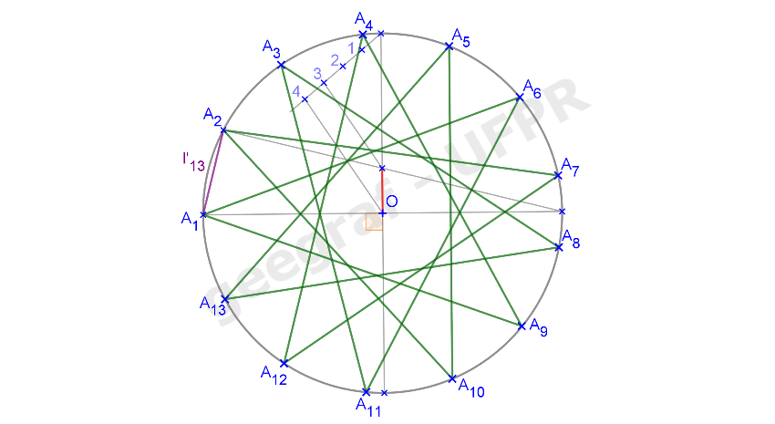
	<figcaption>Depois, basta unir os pontos, sempre no mesmo sentido, pulando de 5 em 5.</figcaption>
  

  

Exercício Proposto 5.5: 4 da pág. 89

  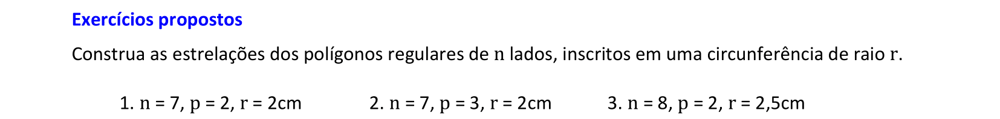
  
  

&#x1f4cf; &#x1f4d0; Solução

	
Construímos o octógono regular inscrito na circunferência de raio 2,5cm e a estrelação com <b>p = 2</b>.

	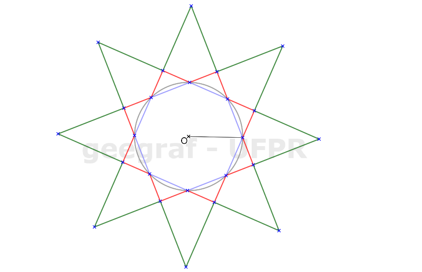
	<figcaption>Depois, basta prolongar os lados da primeira estrelação do octógono para definir a estrelação com <b>p = 3</b>.</figcaption>
  

  

