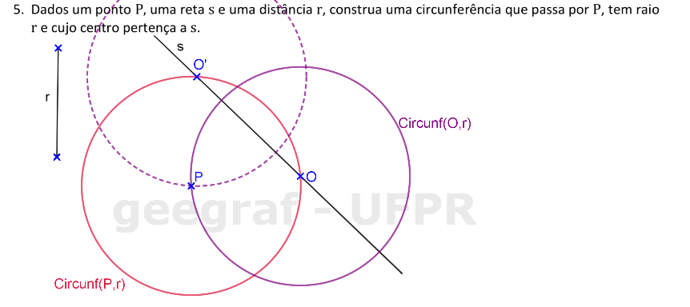
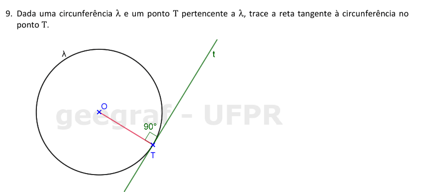
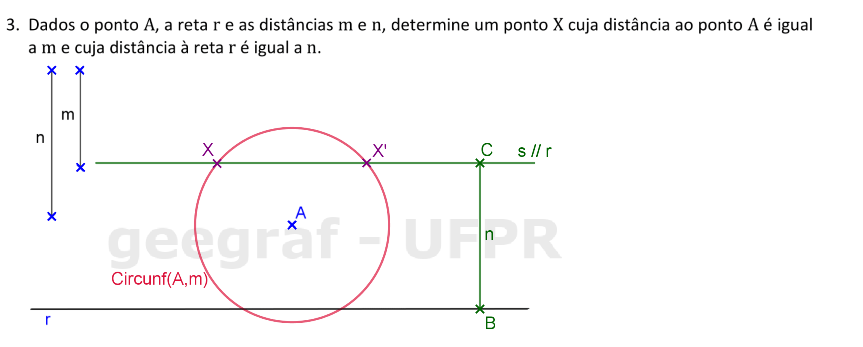
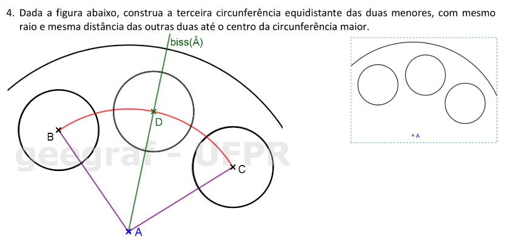
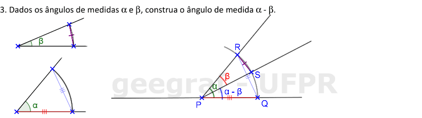

<link rel="stylesheet" href="../../imagens/style.css">

<h2 id="inicio">Respostas do Módulo 1. Circunferência, Mediatriz, Retas Paralelas e Bissetriz</h2> 
  

Atividade 1: exercício 5 da pág. 5

  
  

&#x1f4cf; &#x1f4d0; Solução

	
Usando o conceito do lugar geométrico circunferência, você consegue resolver este exercício.

	
	<figcaption>Como a circunferência passa por <b>P</b>, construímos a circunferência de centro em <b>P</b> e raio <b>r</b> para encontrar o centro da solução.</figcaption>
  

  

Atividade 2: exercício 9 da pág. 11

  
  

&#x1f4cf; &#x1f4d0; Solução

	
Problema similar ao anterior. Você pode construir a reta <b>t</b> perpendicular ao segmento <b>OT</b> usando régua e compasso, ou o par de esquadros.

	
	<figcaption></figcaption>
  

  

Atividade 3: exercício 3 da pág. 14

  
  

&#x1f4cf; &#x1f4d0; Solução

	
Você pode fazer as construções com régua e compasso ou com esquadros e o compasso.

	
	<figcaption>Para construir a reta paralela <b>s</b>, lembre-se de construir o segmento <b>BC &perp; r</b> para marcar o segmento <b>n</b>.</figcaption>
  

  

Atividade 4: exercício 4 da pág. 18

  
  

&#x1f4cf; &#x1f4d0; Solução

	
Neste exercício, você pode usar a régua e o compasso como instrumentos auxiliares.

	
	<figcaption>Você pode construir a bissetriz do <b>&angsph;BAC</b> ou a mediatriz de <b>BC</b>.</figcaption>
  

  

Atividade 5: exercício 3 da pág. 20

  
  

&#x1f4cf; &#x1f4d0; Solução

	
Neste exercício, você pode usar a régua e o compasso como instrumentos auxiliares.

	
	<figcaption>Lembre-se da construção que fizemos para transportar ângulos.</figcaption>
  

