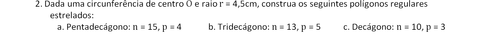
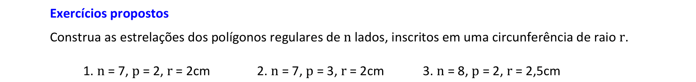

<link rel="stylesheet" href="../../imagens/style.css">

<h2 id="inicio">Respostas do Módulo 5</h2>
<h3>Polígonos Regulares</h3> 
  

Atividade 5.1: exercício 2 da pág. 82

  
  

&#x1f4cf; &#x1f4d0; Resolução de heptadecágono

	
Utilizaremos a régua, os esquadros e o compasso como instrumentos auxiliares neste exercício. Vamos usar homotetia.

	  <ul class="slider">
		   <li>
			   <input type="radio" id="1020" name="sl">
			   <label for="1020"></label>
			   
			   <figcaption>Começamos com a construção de uma circunferência de raio qualquer. Vamos construir um pentágono regular inscrito nesta circunferência. Construa dois diâmetros perpendiculares.</figcaption>
		   </li>
		   <li>
			   <input type="radio" id="1021" name="sl">
			   <label for="1021"></label>
			   
			   <figcaption>Construa a mediatriz do raio <b>O'B</b>.</figcaption>
		   </li>
		   <li>
			   <input type="radio" id="1022" name="sl">
			   <label for="1022"></label>
			   
			   <figcaption>Com centro em <b>M</b> e rao <b>MC</b>, construa o arco que intercecta <b>A'O'</b> em <b>D</b>.</figcaption>
		   </li>
		   <li>
			   <input type="radio" id="1023" name="sl">
			   <label for="1023"></label>
			   
			   <figcaption>Considerando o primeiro vértice <b>A1</b>, construa os arcos com raio <b>l5</b> para encontrar os vértices <b>A'2</b> e <b>A'5</b>.</figcaption>
		   </li>
		   <li>
			   <input type="radio" id="1024" name="sl">
			   <label for="1024"></label>
			   
			   <figcaption>Agora podemos construir o lado <b>l5 = 4,5cm</b> a partir de <b>A1</b>. Logo, encontramos os vértices <b>A2</b> e <b>A5</b>.</figcaption>
		   </li>
		   <li>
			   <input type="radio" id="1025" name="sl">
			   <label for="1025"></label>
			   
			   <figcaption>Para encontrar o centro da nova circunferência circunscrita, vamos construir a reta <b>OA2 // O'A'2</b>.</figcaption>
		   </li>
		   <li>
			   <input type="radio" id="1025" name="sl">
			   <label for="1025"></label>
			   
			   <figcaption>Construa a nova circunferência circunscrita.</figcaption>
		   </li>
		   <li>
			   <input type="radio" id="1026" name="sl">
			   <label for="1026"></label>
			   
			   <figcaption>Construa o pentágono com lado <b>l5 = 4,5cm</b>.</figcaption>
		   </li>
		</ul>
		
  

  

Atividade 5.2: exercício 1, item d, da pág. 86

  
  
  

&#x1f4cf; &#x1f4d0; Solução

	
Começamos com uma circunferência de raio qualquer, por exemplo r = 3,5cm, e construímos o tridecágono inscrito nesta circunferência.

	
	<figcaption>Depois, basta usar homotetia para ampliar ou reduzir o raio da nova circunferência circunscrita, que terá o tridecágono com lado de 2,3cm.</figcaption>
  

  

Atividade 5.3: exercício 5 da pág. 87

  
    

&#x1f4cf; &#x1f4d0; Solução

	
Começando com a circunferência de raio qualquer (por exemplo, <b>r = 5cm</b>), podemos construir o undecágono inscrito nesta circunferência.

	
	<figcaption>Depois, basta ampliar ou reduzir o raio desta circunferência para construir o undecágono com apótema com medida de 4cm usando Homotetia.</figcaption>
  

  

Atividade 5.4: exercício 2, item c, da pág. 89

  
  

&#x1f4cf; &#x1f4d0; Solução

	
Construímos o decágono regular na circunferência de raio 4,5cm.

	
	<figcaption>Depois, basta "pular" de 3 em 3 vértices, iniciando de qualquer vértice do decágono regular.</figcaption>
  

  

Atividade 5.5: exercício 4 da pág. 89

  
  
  

&#x1f4cf; &#x1f4d0; Solução

	
Construímos o octógono regular inscrito na circunferência de raio 2,5cm e a estrelação com <b>p = 2</b>.

	
	<figcaption>Depois, basta prolongar os lados da primeira estrelação do octógono para definir a estrelação com <b>p = 3</b>.</figcaption>
  

  

