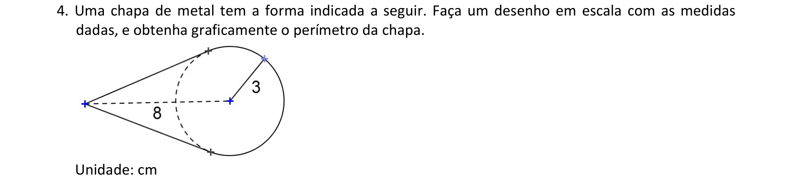

<link rel="stylesheet" href="../../imagens/style.css">

<h2 id="inicio">Respostas do Módulo 6</h2>
<h3>Retificação de circunferência / Equivalência de áreas</h3> 
  

Atividade 6.1: exercício 4 da pág. 94

  
  

&#x1f4cf; &#x1f4d0; Solução

	
Começamos construindo as retas tangentes à circunferência de raio 3cm, que passam pelo ponto <b>P</b>, tal que <b>PO = 8cm</b>.

	
	<figcaption>Depois, basta retificar a metade de um dos arcos <b>AOT</b> ou <b>AOT'</b> usando o processo de Arquimedes. O segmento <b>FA</b> corresponde a $\mathsf{ \frac{1}{4} }$ do comprimento total do arco <b>TOT'</b>.</figcaption>
  

  

Atividade 6.2: exercício 5 da pág. 95

  
  

&#x1f4cf; &#x1f4d0; Solução

	
Começamos retificando o arco de amplitude <b>&beta;</b> da circunferência menor, encontramos <b>AF</b>.

	
	<figcaption>Depois, podemos desretificar este arco de medida <b>AF</b> na circunferência maior, encontrando o ponto <b>B'</b> e a amplitude <b>&beta;'</b>.</figcaption>
  

  

Atividade 6.3: exercício 7 da pág. 99

  
    

&#x1f4cf; &#x1f4d0; Solução

	
Neste exercício, o lado <b>AB</b> tem a medida ampliada, e a altura é reduzida com o mesmo raciocínio usado nos exercícios anteriores.

	
	<figcaption>Como o <b>&angsph;C = 90&deg;</b>, construímos o arco capaz de 90&deg; em <b>AB</b>.</figcaption>
  

  

Atividade 6.4: exercício 1 da pág. 102

  
  

&#x1f4cf; &#x1f4d0; Resolução

	
Utilizaremos a régua, os esquadros e o compasso como instrumentos auxiliares neste exercício.

	  <ul class="slider">
		  <li>
			   <input type="radio" id="1199" name="sl">
			   <label for="1199"></label>
			   
			   <figcaption>Escolhemos um vértice para ficar fixo (por exemplo, <b>A</b>) e um lado como reta suporte fixa (neste caso, escolhi a reta <b>DE</b>). Construa as diagonais do polígono a partir do vértice <b>A</b>.</figcaption>
		   </li>
		  <li>
			   <input type="radio" id="1200" name="sl">
			   <label for="1200"></label>
			   
			   <figcaption>Vamos começar com a área <b>1</b>: vamos construir um triângulo equivalente, tal que o vértice <b>F</b> fique na reta suporte <b>DE</b>.</figcaption>
		   </li>
		   <li>
			   <input type="radio" id="1201" name="sl">
			   <label for="1201"></label>
			   
			   <figcaption>Construa a reta paralela a <b>AE</b> que passa pelo vértice <b>F</b>, encontrando <b>F' &isin; DE</b>. Descartamos os vértices <b>E</b> e <b>F</b>.</figcaption>
		   </li>
		   <li>
			   <input type="radio" id="1202" name="sl">
			   <label for="1202"></label>
			   
			   <figcaption>A área <b>3</b> fica sem alterações.</figcaption>
		   </li>
		   <li>
			   <input type="radio" id="1203" name="sl">
			   <label for="1203"></label>
			   
			   <figcaption>As áreas <b>4</b> e <b>5</b> serão combinadas. Note que a área <b>5</b> precisa ser descartada.</figcaption>
		   </li>
		   <li>
			   <input type="radio" id="1204" name="sl">
			   <label for="1204"></label>
			   
			   <figcaption>Construa a reta paralela a <b>AC</b> que passa por <b>B</b>. Descartamos os vértices <b>B</b> e <b>C</b>.</figcaption>
		   </li>
		   <li>
			   <input type="radio" id="1205" name="sl">
			   <label for="1205"></label>
			   
			   <figcaption>Finalmente, construa a reta paralela a <b>AD</b> que passa por <b>B'</b>, para "transportar" a área <b>4-6</b>. O vértice <b>B'' &isin; DE</b> é considerado e os vértices <b>B'</b> e <b>D</b> são descartados. A solução final fica como o <b>&#9651;AB''F'</b>.</figcaption>
		   </li>
		</ul>
		
  

  

Atividade 6.5: exercício 9 da pág. 102

  
  

&#x1f4cf; &#x1f4d0; Solução

	
O lado <b>l1</b> do retângulo pode ser encontrado com a construção de quarta proporcional dos segmentos <b>&pi;r</b>, <b>l2 = 7cm</b> e <b>r</b>.

	
	<figcaption>O segmento <b>&pi;r</b> pode ser encontrado com qualquer método de retificação de circunferências. Eu optei pelo método de Kochanski. Construa o retângulo de lados <b>l1</b> e <b>l2</b>.</figcaption>
  

  

Atividade 6.6: exercício 4 da pág. 104

  
  

&#x1f4cf; &#x1f4d0; Solução

	
Neste caso, devemos dividir o lado <b>AC</b> em partes proporcionais aos números dados.

	
	<figcaption>Construa as médias geométricas com as divisões proporcionais e os lados paralelos a <b>AB</b>.</figcaption>
  

  

